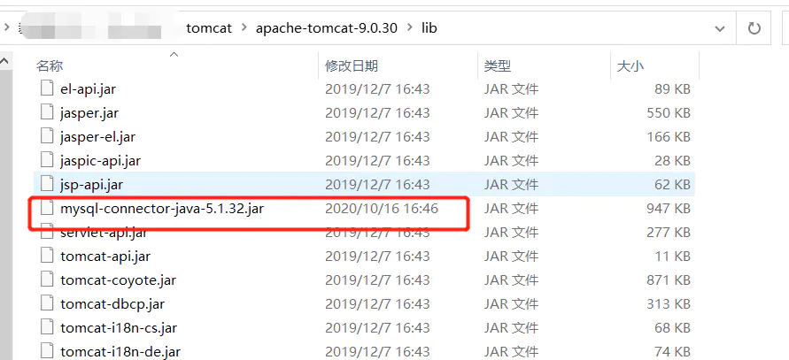
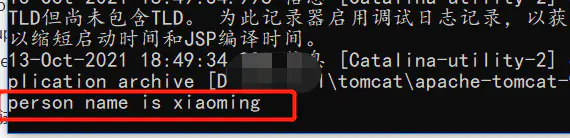

[Java基础知识之JNDI - 简书](https://www.jianshu.com/p/1c4c4b5d7acf)
## Java基础知识之JNDI

[](https://www.jianshu.com/u/646f454e5c0d)

> 说起来，可能很多人对于JNDI这个名词感到十分陌生，实际上JNDI是一种广泛存在于各种J2EE容器的技术，而且也是J2EE的技术规范之一。但由于我们日常工作中其实很少会直接在代码层面使用到JNDI规范（当然了，JNDI配置肯定是少不了的），所以可能有时候会觉得有些陌生。本篇文章将对JNDI的概念及其作用进行介绍，同时通过一个小案例来介绍我们如何在真实开发中使用JNDI规范，希望对各位读者有所帮助。

#### 一、什么是JNDI

**JNDI的全称是Java Naming and Directory Interface**，即Java命名和目录接口，作用是为JAVA应用程序提供命名和目录访问服务的API。  
咋一看这个解释似乎让人看不懂这个JNDI规范的作用。我个人感觉，**将JNDI规范看成是一个让配置参数和代码解耦的一种规范和思想会更好理解一些。**比如说常见的在DAO层通过原始的JDBC来连接数据库，我们可以选择在代码中直接写入数据库的连接参数，但一旦数据源发生变更，我们就势必要改动代码后重新编译才能连接新的数据源。而**如果我们将数据库连接参数改成外部配置的方式，那么也就实现了配置和代码之间的解耦**。JNDI规范本质上就是上述的这种操作。

看完上面的介绍，相信大家对JNDI的作用已经有了一个初步的认知。但是对于其具体的应用场景和工作流程还不是特别清楚。下面我们先来对JNDI的两个单词的概念进行解释：`Name`和`Directory`

#### 二、概念解析

##### Name

`Name`很好理解，就是命名。将Java对象以某个名称的形式绑定（binding）到一个容器环境（Context）中，以后调用容器环境（Context）的查找（lookup）方法又可以查找出某个名称所绑定的Java对象。**简单来说，就是把一个Java对象和一个特定的名称关联在一起，方便容器后续使用。**

##### Directory

**JNDI中的目录（Directory）是指将一个对象的所有属性信息保存到一个容器环境中。**JNDI的目录（Directory）原理与JNDI的命名（Naming）原理非常相似，**主要的区别在于目录容器环境中保存的是对象的属性信息**，而不是对象本身。举个例子，Name的作用是在容器环境中绑定一个Person对象，而Directory的作用是在容器环境中保存这个Person对象的属性，比如说`age=10`，`name=小明`等等。实际上，二者往往是结合在一起使用的

#### 三、JDNI的实际应用

##### 下面我们来通过一个小案例来演示一下JNDI在实际项目中的应用

正如JNDI的名称一样，JNDI只是JDK定义的一个接口，具体的实现其实是由各个容器的厂商（或者称之为开发团队）去实现的。这里的话我们选择用Tomcat作为我们演示的容器环境，下面来看一下具体的使用吧。

###### 1\. 新建一个Web项目，在`META-INF`目录下新建context.xml文件

```xml
<?xml version="1.0" encoding="UTF-8"?>
<Context>
    <Resource name="jndi/person"
            auth="Container"
            type="javax.sql.DataSource"
            username="root"
            password="root"
            driverClassName="com.mysql.jdbc.Driver"
            url="jdbc:mysql://localhost:3306/test"
            maxTotal="8"
            maxIdle="4"/>
</Context>
```

在`Context.xml`文件中我们可以定义数据库驱动，url、账号密码等关键信息，其中`name`这个字段的内容为自定义，后面的时候我们会使用到

###### 2\. 在具体的程序中使用配置的数据源

这里需要注意，使用`InitialContext`对象获取数据源的时候，`java:comp/env/`后面需要跟上步骤一中配置的数据源名称。

```java
Connection conn=null; 
PreparedStatement ps = null;
ResultSet rs = null;
try { 
  Context ctx=new InitialContext(); 
  Object datasourceRef=ctx.lookup("java:comp/env/jndi/person"); //引用数据源 
  DataSource ds=(Datasource)datasourceRef; 
  conn=ds.getConnection(); 
  String sql = "select * from person where id = ?";
        ps = conn.prepareStatement(sql);
        ps.setString(1, "1");
        rs = ps.executeQuery();
        while(rs.next()){
            System.out.println("person name is "+rs.getString("name"));
        }
  c.close(); 
} catch(Exception e) { 
  e.printStackTrace(); 
} finally { 
  if(conn!=null) { 
    try { 
      conn.close(); 
    } catch(SQLException e) { } 
  } 
}
```

###### 3\. 将mysql驱动放到tomcat的lib目录中（重要）



需要注意，由于我们的数据源不再直接由自己提供，而是转为由Tomcat容器提供，所以我们要给tomcat提供连接池的驱动，否则会报错。

###### 4\. 启动tomcat进行测试



PS：这里关于Tomcat集成JNDI的用法，其实在启动tomcat后，访问`http://localhost:8080/docs/jndi-resources-howto.html`可以看到更加详细的使用介绍

#### 说在最后

至此，本篇文章对于JDNI的介绍就到此结束了。简单来说，JNDI就是J2EE提出的一种能够降低耦合性的一种技术规范，并定义了接口。JNDI接口由各个容器开发团队去实现，有了JDNI之后，我们可以将一些与业务无关的配置转移到外部，更好的方便项目的维护。（从另一个角度理解的话，可以把JNDI看成是间接寻址，在编写代码的时候定义了某个对象的名称，等到实际使用的时候根据这个对象名称再去读取配置）  
本篇文章使用的演示用例代码放在了我的码云上，地址为：**[https://gitee.com/moutory/jndi-demo](https://links.jianshu.com/go?to=https%3A%2F%2Fgitee.com%2Fmoutory%2Fjndi-demo)**

**参考文章：  
1、[JNDI的原理和应用](https://links.jianshu.com/go?to=https%3A%2F%2Fwww.cnblogs.com%2Fdion-90%2Farticles%2F9029581.html)**
