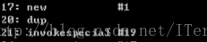

# 1. [一文搞懂java对象创建过程](https://zhuanlan.zhihu.com/p/240458901#:~:text=%E6%9C%80%E5%B8%B8%E7%94%A8%E7%9A%84%E6%96%B9%E5%BC%8F%E6%98%AFn,%E6%96%B9%E6%B3%95%E6%9D%A5%E6%96%B0%E5%BB%BA%E5%AF%B9%E8%B1%A1%E3%80%82)

创建对象有以下几个要点：
1. 类加载机制检查：JVM首先检查一个new指令的参数是否能在常量池中定位到一个符号引用，并且检查该符号引用代表的类是否已被加载、解析和初始化过
2. 分配内存：把一块儿确定大小的内存从Java堆中划分出来
3. 初始化零值：对象的实例字段不需要赋初始值也可以直接使用其默认零值，就是这里起得作用
4. 设置对象头：存储对象自身的运行时数据，类型指针
5. 执行<init>：为对象的字段赋值
- [浅析java中的TLAB](https://www.jianshu.com/p/8be816cbb5ed)
- [Java的指针碰撞简介](https://blog.csdn.net/qq_40634846/article/details/106300702)
- [TLAB、指针碰撞和空闲列表](https://blog.csdn.net/z69183787/article/details/108559153#:~:text=%E5%AF%BC%E8%AF%BB%EF%BC%9AOracle%E4%B8%AD%E6%9C%89%20%E7%A9%BA%E9%97%B2%E5%88%97%E8%A1%A8%20%E7%9A%84%E6%A6%82%E5%BF%B5.%20%E7%A9%BA%E9%97%B2%E5%88%97%E8%A1%A8%20%E4%B8%AD%E5%AD%98%E5%82%A8%E7%9A%84%E6%98%AF%E5%8F%AF%E4%BE%9B%E6%8F%92%E5%85%A5%E6%96%B0%E8%A1%8C%E7%9A%84%E5%9D%97%E4%BF%A1%E6%81%AF%E6%89%80%E4%BB%A5%E6%96%B0%E7%9A%84%E8%A1%8C%E6%95%B0%E6%8D%AE%E5%8F%AA%E4%BC%9A%E6%8F%92%E5%85%A5%E5%88%B0%E9%82%A3%E4%BA%9B%E5%AD%98%E5%9C%A8%E4%BA%8E%20%E7%A9%BA%E9%97%B2%E5%88%97%E8%A1%A8%20%E4%B8%AD%E7%9A%84%E5%9D%97.%20%E7%A9%BA%E9%97%B2%E5%88%97%E8%A1%A8,%E5%BD%93%E4%B8%80%E4%B8%AA%E5%9D%97%E7%AC%AC%E4%B8%80%E6%AC%A1%E5%BC%80%E8%BE%9F%E7%9A%84%E6%97%B6%E5%80%99%2C%E5%BD%93%E7%84%B6%E6%98%AF%E5%9C%A8%20%E7%A9%BA%E9%97%B2%E5%88%97%E8%A1%A8%20%E4%B8%AD%E7%9A%84.%E9%9A%8F%E7%9D%80%E4%B8%8D%E6%96%AD%E5%9C%B0%E6%8F%92%E5%85%A5%E8%A1%8C%E6%95%B0%E6%8D%AE%2C%E5%BD%93%E4%BD%BF%E7%94%A8%E7%8E%87%E8%BE%BE%E5%88%B0%E6%88%96%E8%80%85%E8%B6%85%E8%BF%87%201-PCTFREE%25%E7%9A%84%E6%97%B6%E5%80%99%2C%E8%AF%A5%E5%9D%97%E4%BB%8E%20%E7%A9%BA%E9%97%B2%E5%88%97%E8%A1%A8%20%E4%B8%AD%E7%A7%BB%E5%87%BA.%E6%89%80%E4%BB%A5%E8%BF%99%E6%97%B6%E5%80%99%E6%96%B0%E7%9A%84%E8%A1%8C%E6%95%B0%E6%8D%AE%E4%B8%8D%E5%8F%AF.%20java%E5%AF%B9%E8%B1%A1%E5%88%9B%E5%BB%BA%E3%80%81%E5%AF%B9%E8%B1%A1%E5%86%85%E5%AD%98%E5%B8%83%E5%B1%80%E3%80%81%E5%AF%B9%E8%B1%A1%E7%9A%84%E8%AE%BF%E9%97%AE%E5%AE%9A%E4%BD%8D%E3%80%81%E5%8F%A5%E6%9F%84%E6%B1%A0%E3%80%81%E7%9B%B4%E6%8E%A5%20%E6%8C%87%E9%92%88.)

# 3. [聊聊序列化（二）使用sun.misc.Unsafe绕过new机制来创建Java对象](https://zhuanlan.zhihu.com/p/240458901#:~:text=%E6%9C%80%E5%B8%B8%E7%94%A8%E7%9A%84%E6%96%B9%E5%BC%8F%E6%98%AFn,%E6%96%B9%E6%B3%95%E6%9D%A5%E6%96%B0%E5%BB%BA%E5%AF%B9%E8%B1%A1%E3%80%82)
一个new操作，编译成指令后是3条

- 第一条指令(new)的意思是根据类型分配一块内存区域
- 第二条指令(dup)是把第一条指令返回的内存地址压入操作数栈顶
- 第三条指令(invokespecial)是调用类的构造函数

new机制有个问题就是:**当类只提供有参的构造函数时，必须使用这个有参的构造函数。**

那么问题来了，当反序列化的时候，不可能使用显示地new操作，因为肯定地根据传过来的类型动态地调用。利用newInstance肯定没戏了，因为不能确定这个类是否提供了无参构造函数。只能第三种，利用反射机制，使用Constructor对象来创建对象。

但是Consturctor对象有个约束，就是需要提供参数的类型列表，然后使用Constructor.newInstance方法需要传递相应个数的参数。

在反序列化这个场景下，可以这么做：先根据反射获得Constructor的参数类型列表，然后根据每种类型，构造一个对应的默认值的列表，然后调用Constructor.newInstance()方法。这样可以创建出一个具有默认值的对象。

但是问题又来了，万一这个类的构造函数做了一些特别的操作，比如判断传入的参数的值，如果参数值不符合规范就抛异常，那么创建对象就失败了

所以 **有些序列化协议要求被序列化对象必须提供无参的构造函数**，这样反序列化的时候可以调用无参的构造函数。

`Unsafe.allocateInstance()`方法值做了第一步和第二步，即分配内存空间，返回内存地址，**没有做第三步调用构造函数**。所以Unsafe.allocateInstance()方法创建的对象都是只有初始值，没有默认值也没有构造函数设置的值，因为它完全没有使用new机制，直接操作内存创建了对象。下
