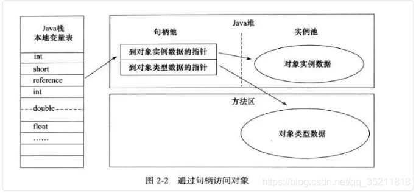
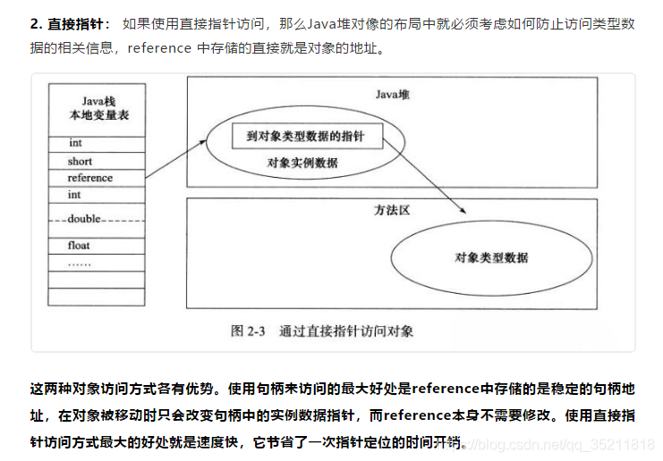

[对象访问方式](https://blog.csdn.net/qq_35211818/article/details/104185404)
.3 对象的访问定位（重点）
建立对象就是为了使用对象，我们的Java程序通过栈上的 reference 数据来操作堆上的具体对象。对象的访问方式有虚拟机实现而定，目前主流的访问方式有①使用句柄和②直接指针两种：

1. 句柄： 如果使用句柄的话，那么Java堆中将会划分出一块内存来作为句柄池，reference 中存储的就是对象的句柄地址，而句柄中包含了对象实例数据与类型数据各自的具体地址信息；

2. 直接指针
