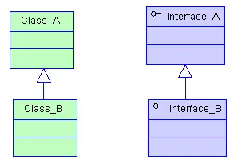
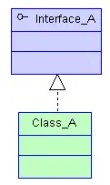
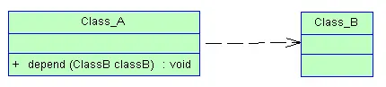
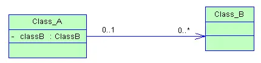
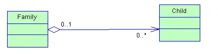
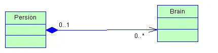
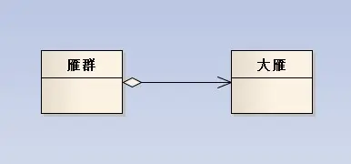
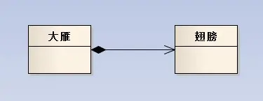

[继承、实现、依赖、关联、聚合、组合的联系与区别 - 简书](https://www.jianshu.com/p/fe949c2f081a)

## 继承、实现、依赖、关联、聚合、组合的联系与区别

0.3362018.07.13 21:18:54字数 1,777阅读 7,024

### 继承

指的是一个类（称为子类、子接口）继承另外的一个类（称为父类、父接口）的功能，并可以增加它自己的新功能的能力，继承是类与类或者接口与接口之间最常见的关系；

继承

### 实现

指的是一个class类实现interface接口（可以是多个）的功能；实现是类与接口之间最常见的关系；在Java中此类关系通过关键字implements明确标识，在设计时一般没有争议性；

实现

### 依赖

可以简单的理解，就是一个类A使用到了另一个类B，而这种使用关系是具有偶然性的、、临时性的、非常弱的，但是B类的变化会影响到A；比如某人要过河，需要借用一条船，此时人与船之间的关系就是依赖；**表现在代码层面，为类B作为参数被类A在某个method方法中使用；**

依赖.png

### 关联

他体现的是两个类、或者类与接口之间语义级别的一种强依赖关系，比如我和我的朋友；这种关系比依赖更强、不存在依赖关系的偶然性、关系也不是临时性的，一般是长期性的，而且双方的关系一般是平等的、关联可以是单向、双向的；**表现在代码层面，为被关联类B以类属性的形式出现在关联类A中，也可能是关联类A引用了一个类型为被关联类B的全局变量；**

关联

### 聚合

聚合是关联关系的一种特例，他体现的是整体与部分、拥有的关系，即has-a的关系，此时整体与部分之间是可分离的，他们可以具有各自的生命周期，部分可以属于多个整体对象，也可以为多个整体对象共享；比如计算机与CPU、公司与员工的关系等；表现在代码层面，和关联关系是一致的，只能从语义级别来区分；

聚合

### 组合 (a拥有b，a没了b也就没了，实心)

组合也是关联关系的一种特例，他体现的是一种contains-a的关系，这种关系比聚合更强，也称为强聚合；他同样体现整体与部分间的关系，但此时整体与部分是不可分的，整体的生命周期结束也就意味着部分的生命周期结束；比如你和你的大脑；表现在代码层面，和关联关系是一致的，只能从语义级别来区分；

组合.png

对于继承、实现这两种关系没多少疑问，他们体现的是一种类与类、或者类与接口间的纵向关系；其他的四者关系则体现的是类与类、或者类与接口间的引用、横向关系，是比较难区分的，有很多事物间的关系要想准备定位是很难的，前面也提到，这几种关系都是语义级别的，所以从代码层面并不能完全区分各种关系；

但总的来说，后几种关系所表现的强弱程度依次为：_组合>聚合>关联>依赖_；

___

### 聚合关系图：

### 组合关系图：

聚合关系的类里含有另一个类作为参数。  
雁群类（GooseGroup）的构造函数中要用到大雁（Goose）作为参数把值传进来 大雁类（Goose）可以脱离雁群类而独立存在 。  
组合关系的类里含有另一个类的实例化 。  
大雁类（Goose）在实例化之前 一定要先实例化翅膀类（Wings） 两个类紧密耦合在一起 它们有相同的生命周期 翅膀类（Wings）不可以脱离大雁类（Goose）而独立存在 。  
信息的封装性不同 。  
在聚合关系中，客户端可以同时了解雁群类和大雁类，因为他们都是独立的 。  
而在组合关系中，客户端只认识大雁类，根本就不知道翅膀类的存在，因为翅膀类被严密的封装在大雁类中。

___

### 聚合与组合

（1）聚合与组合都是一种结合关系，只是额外具有整体-部分的意涵。

（2）部件的生命周期不同

聚合关系中，整件不会拥有部件的生命周期，所以整件删除时，部件不会被删除。再者，多个整件可以共享同一个部件。  
组合关系中，整件拥有部件的生命周期，所以整件删除时，部件一定会跟着删除。而且，多个整件不可以同时间共享同一个部件。

（3）聚合关系是“has-a”关系，组合关系是“contains-a”关系。

### 关联和聚合

（1）表现在代码层面，和关联关系是一致的，只能从语义级别来区分。

（2）关联和聚合的区别主要在语义上，关联的两个对象之间一般是平等的，例如你是我的朋友，聚合则一般不是平等的。

（3）关联是一种结构化的关系，指一种对象和另一种对象有联系。

（4）关联和聚合是视问题域而定的，例如在关心汽车的领域里，轮胎是一定要组合在汽车类中的，因为它离开了汽车就没有意义了。但是在卖轮胎的店铺业务里，就算轮胎离开了汽车，它也是有意义的，这就可以用聚合了。

### 关联和依赖

（1）关联关系中，体现的是两个类、或者类与接口之间语义级别的一种强依赖关系，比如我和我的朋友；这种关系比依赖更强、不存在依赖关系的偶然性、关系也不是临时性的，一般是长期性的，而且双方的关系一般是平等的。

（2）依赖关系中，可以简单的理解，就是一个类A使用到了另一个类B，而这种使用关系是具有偶然性的、临时性的、非常弱的，但是B类的变化会影响到A。

### 综合比较

这几种关系都是语义级别的，所以从代码层面并不能完全区分各种关系；但总的来说，后几种关系所表现的强弱程度依次为：

> 组合>聚合>关联>依赖；

更多精彩内容，就在简书APP

"小礼物走一走，来简书关注我"

还没有人赞赏，支持一下

[Cooci\_和谐学习\_不急不躁](https://www.jianshu.com/u/5981a4f71db5 "Cooci_和谐学习_不急不躁")和谐学习，不急不躁 我就是我，颜色不一样的烟火！ 我是Cooci，我为自己带盐<b...

总资产650共写了27.4W字获得1,719个赞共2,896个粉丝

-   我被篮球砸伤了脚踝，被送到医院后，竟然遇到我老公全家，陪另一个女人产检。 平时对我的冷言冷语的小姑子吴彤彤挽着小三...
    
    [茶点故事](https://www.jianshu.com/u/0f438ff0a55f)阅读 20628评论 0赞 9
    
-   我是他体贴入微，乖巧懂事的金丝雀。 上位后，当着满座宾朋，我播放了他曾经囚禁、霸凌我，还逼疯了我妈妈视频。 1 我...
    
    [茶点故事](https://www.jianshu.com/u/0f438ff0a55f)阅读 6656评论 0赞 3
    
-   一、 面基当天，我把谈了三个月的网恋对象拉黑了。 事情是这样的。 那天我刚上完早课，叼了个冰棒走在回家的路上，就听...
    
-   被退婚后，我嫁给了当朝新帝。 本只想在后宫低调度日，却不料新帝是个恋爱脑。 放着家世优越的皇后和貌美如花的贵妃不要...
    
    [茶点故事](https://www.jianshu.com/u/0f438ff0a55f)阅读 2786评论 0赞 30
    
-   央央一时 我的男朋友，是个满脑子只有研究的物理系教授。 末世爆发，他变成了丧尸，别的丧尸，一个劲的咬人，而他，一个...
    
-   正文 我爸妈意外去世后，我才知道，我表妹才是他们的亲女儿。 我只是从福利院抱来，替她挡灾的。 我表妹凌楚，接管了他...
    
    [茶点故事](https://www.jianshu.com/u/0f438ff0a55f)阅读 1139评论 0赞 1
    
-   正文 我心血来潮检查老公的手机，却意外看到他的聊天记录，“你还爱我对吗？”“昨晚的事你就忘了吧。”虽然只有短短两句...
    
    [茶点故事](https://www.jianshu.com/u/0f438ff0a55f)阅读 2868评论 0赞 1
    
-   正文 出嫁四月，我的夫君带回他的心头好白月光。将她抬为平妻，从此与我平起平坐。 我强忍心痛转移注意力，最后偶然发现...
    
    [茶点故事](https://www.jianshu.com/u/0f438ff0a55f)阅读 583评论 0赞 0
    
-   正文 被顾辰扔到床上的时候，我才参加完一个活动，保姆车刚刚离开，顾辰就敲响了我的房门。 我叫林星，是一个比较出名的...
    
    [茶点故事](https://www.jianshu.com/u/0f438ff0a55f)阅读 693评论 0赞 3
    
-   我吃了整整三年的避子药，因为怀过皇嗣的妃嫔都死了，无一例外。三年前帝后大婚，洞房花烛的第二天早上我就毅然决然饮下了...
    
-   我跟我前夫在商场里面给小孩买衣服，他现在的老婆不停地给他打电话。 前夫没办法，只能撒谎说自己在公司开会。 对方听清...
    
    [茶点故事](https://www.jianshu.com/u/0f438ff0a55f)阅读 6044评论 0赞 1
    
-   好不容易攻略到头，逮住机会和反派同归于尽。 系统告诉我让我攻略没让我死？ 重开一局，攻略对象变成了上一世跟我一起炸...
    
    [茶点故事](https://www.jianshu.com/u/0f438ff0a55f)阅读 1473评论 0赞 1
    
-   人人都说尚书府的草包嫡子修了几辈子的福气，才能尚了最受宠的昭宁公主。 只可惜公主虽容貌倾城，却性情淡漠，不敬公婆，...
    
    [茶点故事](https://www.jianshu.com/u/0f438ff0a55f)阅读 1677评论 1赞 5
    
-   正文 那天我在老公的包里发现了两个避孕套，他说是社区工作人员宣传防范艾滋病派发的。 我当然不信，那包装明显是便利店...
    
    [茶点故事](https://www.jianshu.com/u/0f438ff0a55f)阅读 5470评论 0赞 12
    
-   正文 太子周落回不近女色，只钟情于太子少傅江景，而甄爽身为将门虎女也深深迷恋江景。无奈皇命难为，一道圣旨成功地把甄...
    
    [茶点故事](https://www.jianshu.com/u/0f438ff0a55f)阅读 1785评论 0赞 0
    
-   作者：猫打滚儿 文案： 八岁那年，我被我爸当成诬陷村长的诱饵，我最崇拜的叔叔是他的同谋，那夜之后，这三个男人都失踪...
    
-   皇帝的白月光自尽了，我却瞧着他一点也不伤心。 那日我去见贵妃最后一面，却惊觉她同我长得十分相似。 回宫后我的头就开...
    
    [茶点故事](https://www.jianshu.com/u/0f438ff0a55f)阅读 1494评论 0赞 1
    
-   谁能想到有朝一日，逼宫这种事会发生在我身边。 被逼走的是我亲妈，始作俑者是我亲小姨。 为了争得我的抚养权，母亲放弃...
    
    [茶点故事](https://www.jianshu.com/u/0f438ff0a55f)阅读 1718评论 0赞 2
    
-   正文 我的男朋友，被我相处了五年的好闺蜜抢走了。 把他让给我吧，我求你了。」 随后她把高领毛衣往下一扯，漏出很明显...
    
    [茶点故事](https://www.jianshu.com/u/0f438ff0a55f)阅读 5950评论 0赞 16
    
-   我朋友是做直播的，人长得好看，公司也肯花力气捧。 轻轻松松半年，就在平台上攒了100多万粉丝。 而就在昨天开播的时...
    
    [茶点故事](https://www.jianshu.com/u/0f438ff0a55f)阅读 9077评论 1赞 16
    

### 被以下专题收入，发现更多相似内容

### 推荐阅读[更多精彩内容](https://www.jianshu.com/)

-   原文：UML中几种类间关系：继承、实现、依赖、关联、聚合、组合的联系与区别 继承 指的是一个类（称为子类、子接口）...
    
-   版权声明：本文为博主原创文章，未经博主允许不得转载。 分别介绍这几种关系： 继承、实现、依赖、关联、聚合、组合的联...
    
-   有人学了继承，认为他是面向对象特点之一，就在所有能用到继承的地方使用继承，而不考虑究竟该不该使用，无疑，这是错误的...
    
-   说点废话：大学学习UML的时候一点都不用心，感觉不如学个JSP能直接写个网站出来，就把该学UML的时间用在了学做网...
    
-   1\. 继承 继承是指一个类（称为子类、子接口）继承令一个类（称为父类、付接口）的功能 子类具有可以增加它自己的新功...
