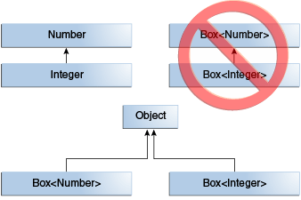
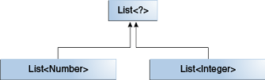
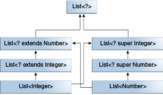

# 1. [Generics, Inheritance, and Subtypes 泛型、继承和子类型](https://docs.oracle.com/javase/tutorial/java/generics/inheritance.html)
### 1.1 它接受哪种类型的参数？
```java
Public void boxTest (Box < Number > n){/* ... */}
```
通过查看它的签名，您可以看到它接受一个类型为 Box < Number > 的参数。但是不允许传入 `Box < Integer >` 或 `Box < Double >` ，**因为 Box < Integer > 和 Box < Double > 不是 Box < Number > 的子类型**。


<div style="text-align: center;">图1. Box< Integer > 不是 Box< Number > 的子类型</div>

> 给定两个具体的类型 A 和 B (例如，Number 和 Integer) ，
> MyClass < A > 与 MyClass < B > 没有关系，不管 A 和 B 是否相关。
> MyClass < A > 和 MyClass < B > 的公共父级是 Object

但是，可以使用通配符在泛型类或接口之间创建关系。

虽然 Integer 是 Number 的子类型，但是 `List<Integer>` 不是 `List<Number>` 的子类型，并且实际上，这两种类型不相关。 List<Number> 和 List<Integer> 的公共父对象是 `List<?>` 。


<div style="text-align: center;">图2. 公共父级为 List<?> 。</div>

### 1.2 在类型参数相关时如何在两个泛型类之间创建类似子类型的关系
为了在这些类之间创建一个关系，以便代码可以通过 `List <Integer>` 的元素访问 Number 的方法，请使用一个上限通配符：
下图显示了几个同时使用上界通配符和下界通配符声明的 List 类之间的关系。


<div style="text-align: center">几个泛型 List 类声明的层次结构。</div>

于是我们可以这样使用：
```java
public class Main {
    static class Box<T>{
    }
    public static void main(String[] args){
      //
        Main m = new Main();
        Box<Number> b=new Box<>();
        m.boxTest(b);
        Box<Integer> c=new Box<>();
//        m.boxTest(c); // compile-time error
        Box<Integer> d=new Box<>();
        m.boxTestWildcard(d);

    }
    public void boxTest(Box<Number> n){

    }
    public void boxTestWildcard(Box<? extends Number> n){

    }
    
}
```
