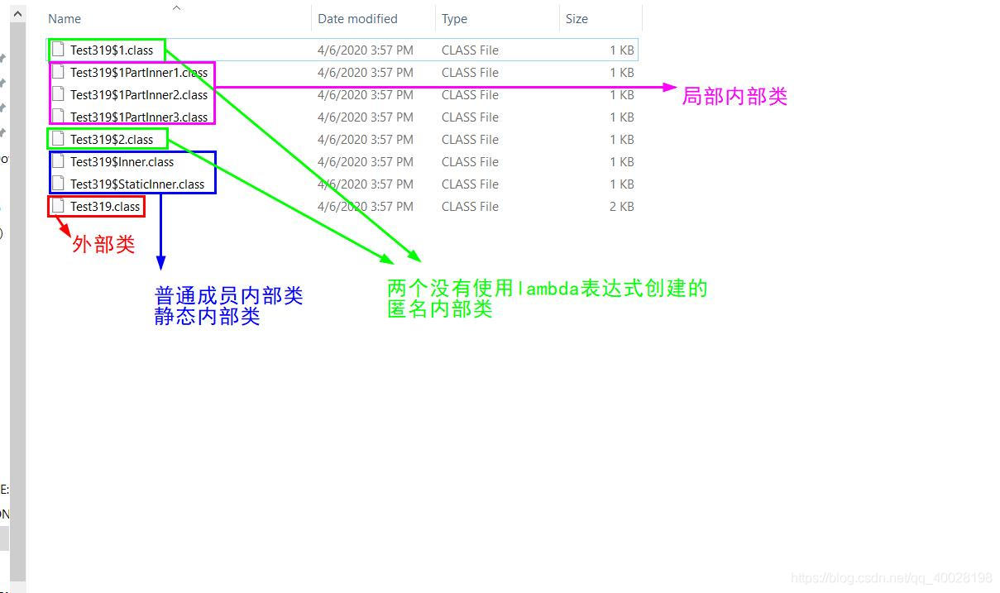

[包含内部类的.java文件编译后生成几个.class文件
](https://blog.csdn.net/qq_40028198/article/details/105345822
)

# 编译后生成的文件目录

# 小总结
首先，包括外部类在内一共有9个类，而目录中只有8个class文件，可以看出一套规律：全部内部类编译后都会生成字节码文件，但是匿名内部类有个特点
1. 成员内部类：外部类名后加一个dollar接内部类名
2. 静态内部类：和成员内部类一样（毕竟都是外部类的成员，静态非静态而已）
3. 局部内部类：在dollar后比成员内部类多了个数字
4. 匿名内部类：dollar后只有一个数字，如果使用lambda表达式创建匿名内部类将不生成class文件，否则会生成。

其次，局部内部类和不使用lambda表达式创建的匿名内部类，他们的class文件名都包含数字，数字究竟是什么含义？（在没有查资料的情况下，首先猜测，数字顺序就是内部类声明的顺序）先用两个匿名内部类来进行测试，后面再说局部内部类的问题。

# 关于文件名中数字的测试（匿名内部类）
数字顺序是内部类的声明顺序，同时作为区分匿名内部类的依据。（实验的结果）

# 关于局部内部类
定义内部类个数最多的方法，它里面的内部类生成的class文件，名称里的数字就是最小的。（实验的结果）