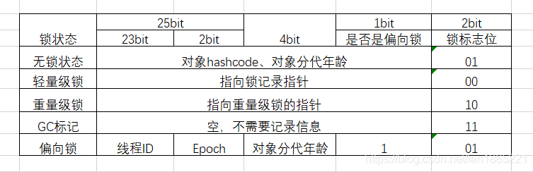
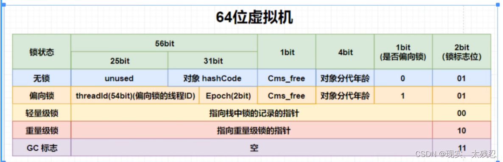

# 32\64对象头区别



琐记录会关联一个锁对象

- 当一把锁第一次被一个线程持有的时候是偏向锁（特殊情况是hashcode）；
- 这个线程再次去拿锁仍然是偏向锁；
- 别的线程交替执行，膨胀微轻量级锁；
- 产生资源竞争，重量级锁。
- 过程不可逆。

- 无锁状态，有 hash 不可偏向。(对象头默认没有hash，第一次调用hashcode方法的时候，对象头就会有hash了)。加锁直接成为 thin lock
- 无锁状态，没有hash可偏向
- 偏向锁调用hashcode直接升级为重量级锁

# 对象头大小

|                                                              | 32         | 64                                 | 64（压缩） | **哪些信息会被压缩？** -XX:+UseCompressedOops<br />对象的全局静态变量（即类属性） <br />对象头信息：64位平台下，原生对象头大小为16字节，压缩后为12字节 <br />对象的引/用类型：64位平台下，引用类型本身大小为8字节，压缩后为4字节<br />对象数组类型：64位平台下，数组类型本身大小为24字节，压缩后16字节 |
| ------------------------------------------------------------ | ---------- | ---------------------------------- | ---------- | ------------------------------------------------------------ |
| 对象头                                                       | 4+4=8      | 8+8=16                             | 8+4=12     |                                                              |
| 对象引用                                                     | 8(压缩后4) | 8                                  | 4          |                                                              |
|                                                              |            |                                    |            |                                                              |
| 数组长度<br />(只有[数组对象](https://so.csdn.net/so/search?q=数组对象&spm=1001.2101.3001.7020)才有) | 4          | 4                                  | 4          |                                                              |
| padding                                                      |            | Padding(内存对齐)，按照8的倍数对齐 |            |                                                              |


## User user = new User();

```
FF  SZ               TYPE DESCRIPTION               VALUE
  0   8                    (object header: mark)     0x0000017979a0710a (fat lock: 0x0000017979a0710a)
  8   4                    (object header: class)    0xf800c14a
 12   4                int User.id                   0
 16   4   java.lang.String User.username             null
 20   4   java.lang.String User.sex                  null
 24   4     java.util.Date User.birthday             null
 28   4   java.lang.String User.address              null
Instance size: 32 bytes
Space losses: 0 bytes internal + 0 bytes external = 0 bytes total
```


## User[] user = new User[10];

```
OFF  SZ                          TYPE DESCRIPTION               VALUE
  0   8                               (object header: mark)     0x000001deddb3e06a (fat lock: 0x000001deddb3e06a)
  8   4                               (object header: class)    0xf800c193
 12   4                               (array length)            10
 12   4                               (alignment/padding gap)   
 16  40   com.java.sjq.base.JNDI.User User;.<elements>          N/A
Instance size: 56 bytes
Space losses: 4 bytes internal + 0 bytes external = 4 bytes total
```


[HotSpot Glossary of Terms --- HotSpot术语表](https://openjdk.org/groups/hotspot/docs/HotSpotGlossary.html)