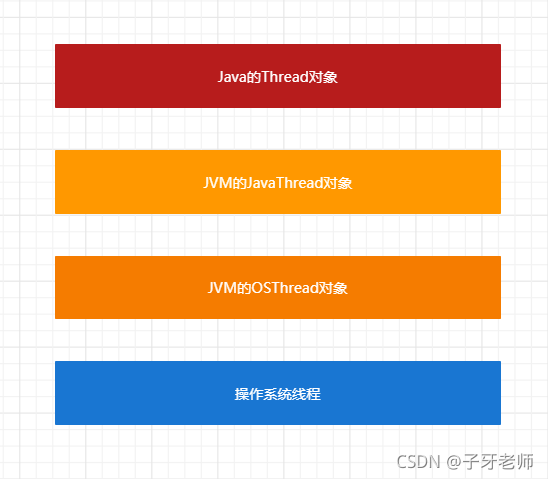
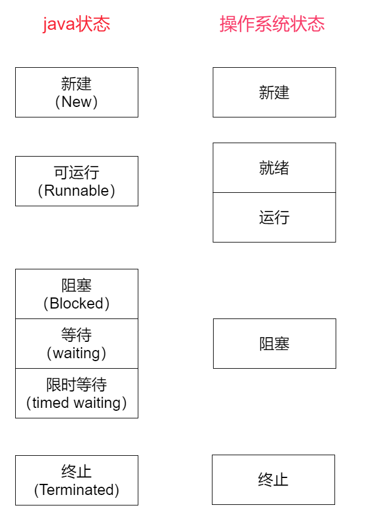
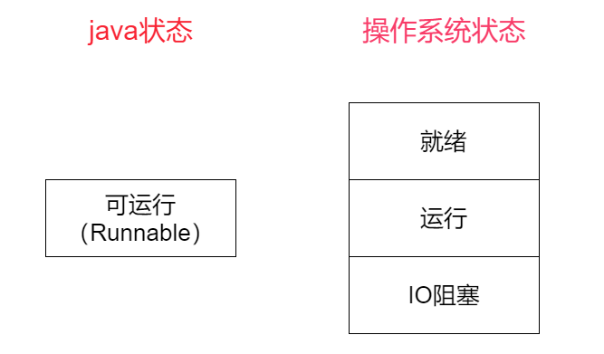
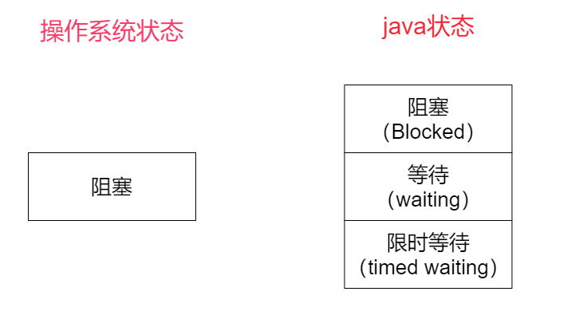

[(119条消息) Java线程VS操作系统线程\_pk操作系统\_子牙老师的博客-CSDN博客](https://blog.csdn.net/b98982016/article/details/121283573)

[java线程和操作系统线程的异同（大图对比）](https://www.shuzhiduo.com/A/gGdXeG7Wz4/)
## 对比

可以发现：

1.java中细分了阻塞，将阻塞给分成了三个不同类型的阻塞。

2.java没有区分就绪状态和运行状态。java将这两种状态合并成runnable状态。

3.还有一个容易被忽略的点：java中的IO阻塞，在java中的线程状态实际上是runnable。

jvm没有做实际的线程调度，而是交给操作系统来完成。java只是对操作系统中的线程模型做了一个包装。

## 就绪状态：

对于运行和就绪状态的合并：

一种解释是：在实际使用中，运行和就绪状态的切换是很快的，在对于线程监控上我们几乎不能察觉到两者的区别，于是合并成了一个。

但该说法无法解释将为什么将IO阻塞也囊括进runnable状态。

对于等待资源的状态：

jvm认为，等待资源的线程处于就绪状态，等待cpu和等待IO都被认为是就绪状态。

而在操作系统中，只有等待cpu运行权的才属于就绪状态。

## 阻塞状态：
