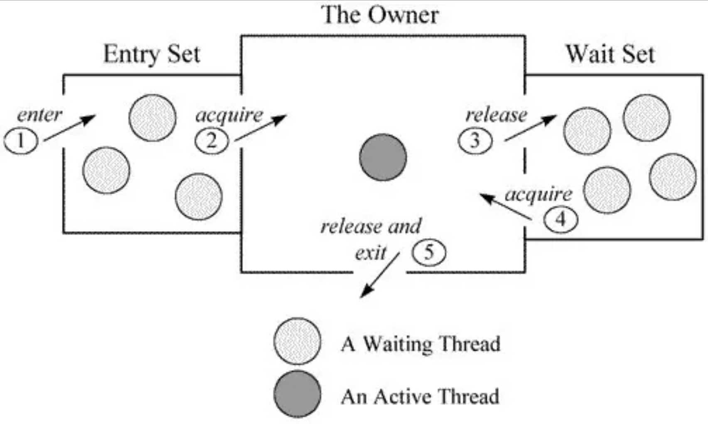

[java的Object里wait()实现原理讲解\_java\_脚本之家](https://www.jb51.net/article/224103.htm)

## Object中的wait()实现原理

在进行wait()之前，就代表着需要争夺Synchorized，而Synchronized代码块通过javap生成的字节码中包含monitorenter和monitorexit两个指令。

当在进加锁的时候会执行monitorenter指令，执行该指令可以获取对象的monitor。同时在执行Lock.wait()的时候也必须持有monitor对象。

在多核环境下，多个线程有可能同时执行monitorenter指令，并获取lock对象关联的monitor，但只有一个线程可以和monitor建立关联，这个线程执行到wait方法时，wait方法会将当前线程放入wait set，使其进行等待直到被唤醒，并放弃lock对象上的所有同步声明，意味着该线程释放了锁，其他线程可以重新执行加锁操作，notify方法会选择wait set中任意一个线程进行唤醒，notifyAll方法会唤醒monitor的wait set中所有线程。执行完notify方法并不会立马唤醒等待线程。那么wait具体是怎么实现的呢？

首先在HotSpot虚拟机中，monitor采用ObjectMonitor实现，每个线程都具有两个队列，分别为free和used，用来存放ObjectMonitor。如果当前free列表为空，线程将向全局global list请求分配ObjectMonitor。

ObjectMonitor对象中有两个队列，都用来保存ObjectWaiter对象，分别是\_WaitSet 和 \_EntrySet。\_owner用来指向获得ObjectMonitor对象的线程

ObjectWaiter对象是双向链表结构，保存了\_thread（当前线程）以及当前的状态TState等数据， 每个等待锁的线程都会被封装成ObjectWaiter对象。

-   `_WaitSet`：处于wait状态的线程，会被加入到wait set；
-   `_EntrySett`：处于等待锁block状态的线程，会被加入到entry set；

### wait方法实现

lock.wait()方法最终通过ObjectMonitor的 wait(jlong millis, bool interruptable, TRAPS)实现

1、将当前线程封装成ObjectWaiter对象node

2、通过ObjectMonitor::AddWaiter方法将node添加到\_WaitSet列表中

3、通过ObjectMonitor::exit方法释放当前的ObjectMonitor对象，这样其它竞争线程就可以获取该ObjectMonitor对象

4、最终底层的park方法会挂起线程

ObjectSynchorizer::wait方法通过Object对象找到ObjectMonitor对象来调用方法 ObjectMonitor::wait()，通过调用ObjectMonitor::AddWaiter()可以把新建的ObjectWaiter对象，放入到\_WaitSet队列的末尾，然后在ObjectMonitor::exit释放锁，接着通过执行thread\_ParkEvent->park来挂起线程，也就是进行wait。

## Object对象中的wait,notify,notifyAll的理解

wait，notify，notifyAll 是定义在Object类的实例方法，用于控制线程状态，在线程协作时，大家都会用到notify()或者notifyAll()方法，其中wait与notify是java同步机制中重要的组成部分，需要结合与synchronized关键字才能使用，在调用一个Object的wait与notify/notifyAll的时候，必须保证调用代码对该Object是同步的，也就是说必须在作用等同于synchronized(object){......}的内部才能够去调用obj的wait与notify/notifyAll三个方法，否则就会报错：java.lang.IllegalMonitorStateException:current thread not owner(意思是因为没有同步，所以线程对对象锁的状态是不确定的，不能调用这些方法)。

wait的目的就在于暴露出对象锁，所以需要保证在lock的同步代码中调用lock.wait()方法，让其他线程可以通过对象的notify叫醒等待在该对象的等该池里的线程。同样notify也会释放对象锁，在调用之前必须获得对象的锁，不然也会报异常。所以，在线程自动释放其占有的对象锁后，不会去申请对象锁，只有当线程被唤醒的时候或者达到最大的睡眠时间，它才再次争取对象锁的权利

**主要方法：**

### (1).wait()

等待对象的同步锁,需要获得该对象的同步锁才可以调用这个方法,否则编译可以通过，但运行时会收到一个异常：IllegalMonitorStateException。调用任意对象的 wait() 方法导致该线程阻塞，该线程不可继续执行，并且该对象上的锁被释放。

### (2).notify()

唤醒在等待该对象同步锁的线程(只唤醒一个,如果有多个在等待),注意的是在调用此方法的时候，并不能确切的唤醒某一个等待状态的线程，而是由JVM确定唤醒哪个线程，而且不是按优先级。调用任意对象的notify()方法则导致因调用该对象的 wait()方法而阻塞的线程中随机选择的一个解除阻塞（但要等到获得锁后才真正可执行）。

### (3).notifyAll()

唤醒所有等待的线程,注意唤醒的是notify之前wait的线程,对于notify之后的wait线程是没有效果的。

通过一个实例来看一下实际的效果，开启两个线和，一个线程 打印1到52的数字，一个打印A到Z的字母，要求，打印两个数，打印一个字母，这样交替顺序打印，代码如下：

<table><tbody><tr><td>
1

2

3

4

5

6

7

8

9

10

11

12

13

14

15

16

17

18

19

20

21

22

23

24

25

26

27

28

29

30

31

32

33

34

35

36

37

38

39

40

41

42

43

44

45

46

47

48

49

50

51

52

53

54

55

56

57

58

59

60
</td><td>

<code>/**</code>

<code>&nbsp;</code><code>* create by spy on 2018/6/4</code>

<code>&nbsp;</code><code>*/</code>

<code>public</code> <code>class</code> <code>ShuZiZiMuThread {</code>

<code>&nbsp;&nbsp;&nbsp;&nbsp;</code><code>public</code> <code>static</code> <code>void</code> <code>main(String[] args) {</code>

<code>&nbsp;&nbsp;&nbsp;&nbsp;&nbsp;&nbsp;&nbsp;&nbsp;</code><code>Object object = </code><code>new</code> <code>Object();</code>

<code>&nbsp;&nbsp;&nbsp;&nbsp;&nbsp;&nbsp;&nbsp;&nbsp;</code><code>shuzi shuzi = </code><code>new</code> <code>shuzi(object);</code>

<code>&nbsp;&nbsp;&nbsp;&nbsp;&nbsp;&nbsp;&nbsp;&nbsp;</code><code>zimu zimu = </code><code>new</code> <code>zimu(object);</code>

<code>&nbsp;&nbsp;&nbsp;&nbsp;&nbsp;&nbsp;&nbsp;&nbsp;</code><code>Thread t = </code><code>new</code> <code>Thread(shuzi);</code>

<code>&nbsp;&nbsp;&nbsp;&nbsp;&nbsp;&nbsp;&nbsp;&nbsp;</code><code>t.setName(</code><code>"shuzi"</code><code>);</code>

<code>&nbsp;&nbsp;&nbsp;&nbsp;&nbsp;&nbsp;&nbsp;&nbsp;</code><code>Thread t1 = </code><code>new</code> <code>Thread(zimu);</code>

<code>&nbsp;&nbsp;&nbsp;&nbsp;&nbsp;&nbsp;&nbsp;&nbsp;</code><code>t1.setName(</code><code>"zimu"</code><code>);</code>

<code>&nbsp;&nbsp;&nbsp;&nbsp;&nbsp;&nbsp;&nbsp;&nbsp;</code><code>t.start();</code>

<code>&nbsp;&nbsp;&nbsp;&nbsp;&nbsp;&nbsp;&nbsp;&nbsp;</code><code>t1.start();</code>

<code>&nbsp;&nbsp;&nbsp;&nbsp;</code><code>}</code>

<code>}</code>

<code>class</code> <code>shuzi </code><code>implements</code> <code>Runnable{</code>

<code>&nbsp;&nbsp;&nbsp;&nbsp;</code><code>private</code> <code>Object object;</code>

<code>&nbsp;&nbsp;&nbsp;&nbsp;</code><code>public</code> <code>shuzi(Object object) {</code>

<code>&nbsp;&nbsp;&nbsp;&nbsp;&nbsp;&nbsp;&nbsp;&nbsp;</code><code>this</code><code>.object = object;</code>

<code>&nbsp;&nbsp;&nbsp;&nbsp;</code><code>}</code>

<code>&nbsp;&nbsp;&nbsp;&nbsp;</code><code>public</code> <code>void</code> <code>run() {</code>

<code>&nbsp;&nbsp;&nbsp;&nbsp;&nbsp;&nbsp;&nbsp;&nbsp;</code><code>synchronized</code> <code>(object) {</code>

<code>&nbsp;&nbsp;&nbsp;&nbsp;&nbsp;&nbsp;&nbsp;&nbsp;&nbsp;&nbsp;&nbsp;&nbsp;</code><code>for</code><code>(</code><code>int</code> <code>i=</code><code>1</code><code>;i&lt;</code><code>53</code><code>;i++){</code>

<code>&nbsp;&nbsp;&nbsp;&nbsp;&nbsp;&nbsp;&nbsp;&nbsp;&nbsp;&nbsp;&nbsp;&nbsp;&nbsp;&nbsp;&nbsp;&nbsp;</code><code>System.out.print(i+</code><code>","</code><code>);</code>

<code>&nbsp;&nbsp;&nbsp;&nbsp;&nbsp;&nbsp;&nbsp;&nbsp;&nbsp;&nbsp;&nbsp;&nbsp;&nbsp;&nbsp;&nbsp;&nbsp;</code><code>if</code><code>(i%</code><code>2</code><code>==</code><code>0</code><code>){</code>

<code>&nbsp;&nbsp;&nbsp;&nbsp;&nbsp;&nbsp;&nbsp;&nbsp;&nbsp;&nbsp;&nbsp;&nbsp;&nbsp;&nbsp;&nbsp;&nbsp;&nbsp;&nbsp;&nbsp;&nbsp;</code><code>object.notifyAll();</code>

<code>&nbsp;&nbsp;&nbsp;&nbsp;&nbsp;&nbsp;&nbsp;&nbsp;&nbsp;&nbsp;&nbsp;&nbsp;&nbsp;&nbsp;&nbsp;&nbsp;&nbsp;&nbsp;&nbsp;&nbsp;</code><code>try</code> <code>{</code>

<code>&nbsp;&nbsp;&nbsp;&nbsp;&nbsp;&nbsp;&nbsp;&nbsp;&nbsp;&nbsp;&nbsp;&nbsp;&nbsp;&nbsp;&nbsp;&nbsp;&nbsp;&nbsp;&nbsp;&nbsp;&nbsp;&nbsp;&nbsp;&nbsp;</code><code>object.wait();</code>

<code>&nbsp;&nbsp;&nbsp;&nbsp;&nbsp;&nbsp;&nbsp;&nbsp;&nbsp;&nbsp;&nbsp;&nbsp;&nbsp;&nbsp;&nbsp;&nbsp;&nbsp;&nbsp;&nbsp;&nbsp;&nbsp;&nbsp;&nbsp;&nbsp;</code><code>System.out.println(</code><code>"数字打印类打全打印当前对象拥有对象锁的线程"</code><code>+Thread.currentThread().getName());</code>

<code>&nbsp;&nbsp;&nbsp;&nbsp;&nbsp;&nbsp;&nbsp;&nbsp;&nbsp;&nbsp;&nbsp;&nbsp;&nbsp;&nbsp;&nbsp;&nbsp;&nbsp;&nbsp;&nbsp;&nbsp;</code><code>} </code><code>catch</code> <code>(InterruptedException e) {</code>

<code>&nbsp;&nbsp;&nbsp;&nbsp;&nbsp;&nbsp;&nbsp;&nbsp;&nbsp;&nbsp;&nbsp;&nbsp;&nbsp;&nbsp;&nbsp;&nbsp;&nbsp;&nbsp;&nbsp;&nbsp;&nbsp;&nbsp;&nbsp;&nbsp;</code><code>e.printStackTrace();</code>

<code>&nbsp;&nbsp;&nbsp;&nbsp;&nbsp;&nbsp;&nbsp;&nbsp;&nbsp;&nbsp;&nbsp;&nbsp;&nbsp;&nbsp;&nbsp;&nbsp;&nbsp;&nbsp;&nbsp;&nbsp;</code><code>}</code>

<code>&nbsp;&nbsp;&nbsp;&nbsp;&nbsp;&nbsp;&nbsp;&nbsp;&nbsp;&nbsp;&nbsp;&nbsp;&nbsp;&nbsp;&nbsp;&nbsp;</code><code>}</code>

<code>&nbsp;&nbsp;&nbsp;&nbsp;&nbsp;&nbsp;&nbsp;&nbsp;&nbsp;&nbsp;&nbsp;&nbsp;</code><code>}</code>

<code>&nbsp;&nbsp;&nbsp;&nbsp;&nbsp;&nbsp;&nbsp;&nbsp;</code><code>}</code>

<code>&nbsp;&nbsp;&nbsp;&nbsp;</code><code>}</code>

<code>}</code>

<code>class</code> <code>zimu </code><code>implements</code> <code>Runnable{</code>

<code>&nbsp;&nbsp;&nbsp;&nbsp;</code><code>private</code> <code>Object object;</code>

<code>&nbsp;&nbsp;&nbsp;&nbsp;</code><code>public</code> <code>zimu(Object object) {</code>

<code>&nbsp;&nbsp;&nbsp;&nbsp;&nbsp;&nbsp;&nbsp;&nbsp;</code><code>this</code><code>.object = object;</code>

<code>&nbsp;&nbsp;&nbsp;&nbsp;</code><code>}</code>

<code>&nbsp;&nbsp;&nbsp;&nbsp;</code><code>public</code> <code>void</code> <code>run() {</code>

<code>&nbsp;&nbsp;&nbsp;&nbsp;&nbsp;&nbsp;&nbsp;&nbsp;</code><code>synchronized</code> <code>(object) {</code>

<code>&nbsp;&nbsp;&nbsp;&nbsp;&nbsp;&nbsp;&nbsp;&nbsp;&nbsp;&nbsp;&nbsp;&nbsp;</code><code>for</code><code>(</code><code>int</code> <code>j=</code><code>65</code><code>;j&lt;</code><code>91</code><code>;j++){</code>

<code>&nbsp;&nbsp;&nbsp;&nbsp;&nbsp;&nbsp;&nbsp;&nbsp;&nbsp;&nbsp;&nbsp;&nbsp;&nbsp;&nbsp;&nbsp;&nbsp;</code><code>char</code> <code>c = (</code><code>char</code><code>)j;</code>

<code>&nbsp;&nbsp;&nbsp;&nbsp;&nbsp;&nbsp;&nbsp;&nbsp;&nbsp;&nbsp;&nbsp;&nbsp;&nbsp;&nbsp;&nbsp;&nbsp;</code><code>System.out.print(c);</code>

<code>&nbsp;&nbsp;&nbsp;&nbsp;&nbsp;&nbsp;&nbsp;&nbsp;&nbsp;&nbsp;&nbsp;&nbsp;&nbsp;&nbsp;&nbsp;&nbsp;</code><code>object.notifyAll();</code>

<code>&nbsp;&nbsp;&nbsp;&nbsp;&nbsp;&nbsp;&nbsp;&nbsp;&nbsp;&nbsp;&nbsp;&nbsp;&nbsp;&nbsp;&nbsp;&nbsp;</code><code>try</code> <code>{</code>

<code>&nbsp;&nbsp;&nbsp;&nbsp;&nbsp;&nbsp;&nbsp;&nbsp;&nbsp;&nbsp;&nbsp;&nbsp;&nbsp;&nbsp;&nbsp;&nbsp;&nbsp;&nbsp;&nbsp;&nbsp;</code><code>object.wait();</code>

<code>&nbsp;&nbsp;&nbsp;&nbsp;&nbsp;&nbsp;&nbsp;&nbsp;&nbsp;&nbsp;&nbsp;&nbsp;&nbsp;&nbsp;&nbsp;&nbsp;&nbsp;&nbsp;&nbsp;&nbsp;</code><code>System.out.println(</code><code>"字母打印类打全打印当前对象拥有对象锁的线程"</code><code>+Thread.currentThread().getName());</code>

<code>&nbsp;&nbsp;&nbsp;&nbsp;&nbsp;&nbsp;&nbsp;&nbsp;&nbsp;&nbsp;&nbsp;&nbsp;&nbsp;&nbsp;&nbsp;&nbsp;</code><code>} </code><code>catch</code> <code>(InterruptedException e) {</code>

<code>&nbsp;&nbsp;&nbsp;&nbsp;&nbsp;&nbsp;&nbsp;&nbsp;&nbsp;&nbsp;&nbsp;&nbsp;&nbsp;&nbsp;&nbsp;&nbsp;&nbsp;&nbsp;&nbsp;&nbsp;</code><code>e.printStackTrace();</code>

<code>&nbsp;&nbsp;&nbsp;&nbsp;&nbsp;&nbsp;&nbsp;&nbsp;&nbsp;&nbsp;&nbsp;&nbsp;&nbsp;&nbsp;&nbsp;&nbsp;</code><code>}</code>

<code>&nbsp;&nbsp;&nbsp;&nbsp;&nbsp;&nbsp;&nbsp;&nbsp;&nbsp;&nbsp;&nbsp;&nbsp;</code><code>}</code>

<code>&nbsp;&nbsp;&nbsp;&nbsp;&nbsp;&nbsp;&nbsp;&nbsp;</code><code>}</code>

<code>&nbsp;&nbsp;&nbsp;&nbsp;</code><code>}</code>

<code>}</code>

</td></tr></tbody></table>

实际运行的结果 ：

> 1,2,A数字打印类打印当前对象拥有对象锁的线程shuzi  
> 3,4,字母打印类打印当前对象拥有对象锁的线程zimu  
> B数字打印类打印当前对象拥有对象锁的线程shuzi  
> 5,6,字母打印类打印当前对象拥有对象锁的线程zimu  
> C数字打印类打印当前对象拥有对象锁的线程shuzi  
> 7,8,字母打印类打印当前对象拥有对象锁的线程zimu  
> D数字打印类打印当前对象拥有对象锁的线程shuzi  
> 9,10,字母打印类打印当前对象拥有对象锁的线程zimu  
> E数字打印类打印当前对象拥有对象锁的线程shuzi  
> 11,12,字母打印类打印当前对象拥有对象锁的线程zimu  
> F数字打印类打印当前对象拥有对象锁的线程shuzi  
> 13,14,字母打印类打印当前对象拥有对象锁的线程zimu  
> G数字打印类打印当前对象拥有对象锁的线程shuzi  
> 15,16,字母打印类打印当前对象拥有对象锁的线程zimu  
> H数字打印类打印当前对象拥有对象锁的线程shuzi  
> 17,18,字母打印类打印当前对象拥有对象锁的线程zimu  
> I数字打印类打印当前对象拥有对象锁的线程shuzi  
> 19,20,字母打印类打印当前对象拥有对象锁的线程zimu  
> J数字打印类打印当前对象拥有对象锁的线程shuzi  
> 21,22,字母打印类打印当前对象拥有对象锁的线程zimu  
> K数字打印类打印当前对象拥有对象锁的线程shuzi  
> 23,24,字母打印类打印当前对象拥有对象锁的线程zimu  
> L数字打印类打印当前对象拥有对象锁的线程shuzi  
> 25,26,字母打印类打印当前对象拥有对象锁的线程zimu  
> M数字打印类打印当前对象拥有对象锁的线程shuzi  
> 27,28,字母打印类打印当前对象拥有对象锁的线程zimu  
> N数字打印类打印当前对象拥有对象锁的线程shuzi  
> 29,30,字母打印类打印当前对象拥有对象锁的线程zimu  
> O数字打印类打印当前对象拥有对象锁的线程shuzi  
> 31,32,字母打印类打印当前对象拥有对象锁的线程zimu  
> P数字打印类打印当前对象拥有对象锁的线程shuzi  
> 33,34,字母打印类打印当前对象拥有对象锁的线程zimu  
> Q数字打印类打印当前对象拥有对象锁的线程shuzi  
> 35,36,字母打印类打印当前对象拥有对象锁的线程zimu  
> R数字打印类打印当前对象拥有对象锁的线程shuzi  
> 37,38,字母打印类打印当前对象拥有对象锁的线程zimu  
> S数字打印类打印当前对象拥有对象锁的线程shuzi  
> 39,40,字母打印类打印当前对象拥有对象锁的线程zimu  
> T数字打印类打印当前对象拥有对象锁的线程shuzi  
> 41,42,字母打印类打印当前对象拥有对象锁的线程zimu  
> U数字打印类打印当前对象拥有对象锁的线程shuzi  
> 43,44,字母打印类打印当前对象拥有对象锁的线程zimu  
> V数字打印类打印当前对象拥有对象锁的线程shuzi  
> 45,46,字母打印类打印当前对象拥有对象锁的线程zimu  
> W数字打印类打印当前对象拥有对象锁的线程shuzi  
> 47,48,字母打印类打印当前对象拥有对象锁的线程zimu  
> X数字打印类打印当前对象拥有对象锁的线程shuzi  
> 49,50,字母打印类打印当前对象拥有对象锁的线程zimu  
> Y数字打印类打印当前对象拥有对象锁的线程shuzi  
> 51,52,字母打印类打印当前对象拥有对象锁的线程zimu  
> Z数字打印类打印当前对象拥有对象锁的线程shuzi

**结果分析：**

通过结果可以看出：

在字母打一打印类里 调用完

<table><tbody><tr><td>
1

2

3

4
</td><td>

<code>object.notifyAll();</code>

<code>object.wait();</code>

<code>object.notifyAll();</code>

<code>object.wait();</code>

</td></tr></tbody></table>

以上为个人经验，希望能给大家一个参考，也希望大家多多支持脚本之家。

**您可能感兴趣的文章:**

-   [java中Object类4种方法详细介绍](https://www.jb51.net/article/234329.htm "java中Object类4种方法详细介绍")
-   [Java中Object类常用的12个方法(小结)](https://www.jb51.net/article/232849.htm "Java中Object类常用的12个方法(小结)")
-   [java Object的hashCode方法的计算逻辑分析](https://www.jb51.net/article/232573.htm "java Object的hashCode方法的计算逻辑分析")
-   [Java中的Object.getClass()方法解析](https://www.jb51.net/article/232565.htm "Java中的Object.getClass()方法解析")
-   [java objectUtils 使用可能会出现的问题](https://www.jb51.net/article/239114.htm "java objectUtils 使用可能会出现的问题")

