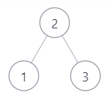

JZ33 二叉搜索树的后序遍历序列

> [二叉搜索树的后序遍历序列\_牛客题霸\_牛客网](https://www.nowcoder.com/practice/a861533d45854474ac791d90e447bafd?tpId=13&tqId=11176&tPage=1&rp=1&ru=/ta/coding-interviews&qru=/ta/coding-interviews/question-ranking&from=cyc_github)

> ## 描述
>
> 输入一个整数数组，判断该数组是不是某二叉搜索树的后序遍历的结果。如果是则返回 true ,否则返回 false 。假设输入的数组的任意两个数字都互不相同。
>
>   
>
> 数据范围： 节点数量 0≤n≤10000 \\le n \\le 10000≤n≤1000 ，节点上的值满足 1≤val≤1051 \\le val \\le 10^{5}1≤val≤105 ，保证节点上的值各不相同  
> 要求：空间复杂度 O(n)O(n)O(n) ，时间时间复杂度 O(n2)O(n^2)O(n2)  
>
> 提示：
>
> 1.二叉搜索树是指父亲节点大于左子树中的全部节点，但是小于右子树中的全部节点的树。
>
> 2.该题我们约定空树不是二叉搜索树
>
> 3.后序遍历是指按照 “左子树-右子树-根节点” 的顺序遍历
>
> 4.参考下面的二叉搜索树，示例 1
>
>   
>
> ## 示例1
>
> 输入：
>
> ```
> [1,3,2]
> ```
>
> 复制
>
> 返回值：
>
> ```
> true
> ```
>
> 复制
>
> 说明：
>
> ```
> 是上图的后序遍历 ，返回true         
> ```
>
> ## 示例2
>
> 输入：
>
> ```
> [3,1,2]
> ```
>
> 复制
>
> 返回值：
>
> ```
> false
> ```
>
> 复制
>
> 说明：
>
> ```
> 不属于上图的后序遍历，从另外的二叉搜索树也不能后序遍历出该序列 ，因为最后的2一定是根节点，前面一定是孩子节点，可能是左孩子，右孩子，根节点，也可能是全左孩子，根节点，也可能是全右孩子，根节点，但是[3,1,2]的组合都不能满足这些情况，故返回false    
> ```
>
> ## 示例3
>
> 输入：
>
> ```
> [5,7,6,9,11,10,8]
> ```
>
> 复制
>
> 返回值：
>
> ```
> true
> ```

# 一、题目描述

JZ23 二叉搜索树的后序遍历序列  
**题目大意：**输入一个序列, 判断它是不是某二叉搜索树的后序遍历结果  
**注意审题：**假设输入序列的任意两个数字都互不相同且空树不是二叉搜索树

# 二、算法1（分治）

## 解题思路

1.  二叉树的后序遍历顺序是：左子树 -> 右子树 -> 根节点
2.  因此序列的最后一个数代表了根节点
3.  因此我们可以将一个序列划分为3段, 左子树+右子树+根, 例如\[4, 8, 6, 12, 16, 14, 10\]可以根据根节点的值将其划分为左子树\[4, 8, 6\], 右子树\[12, 16, 14\], 根\[10\], 由于我们是先确定的右子树区间, 因此当左子树区间中出现大于根节点的值时, 序列不合法, 我们再采用分治的思想, 对于每段序列代表的子树, 检查它的左子树和右子树, 当且仅当左右子树都合法时返回true  
    

## 代码实现（C++11

```java
public class Solution {
    public boolean VerifySquenceOfBST(int [] sequence) {
        if (sequence.length == 0) {
            return false;
        }
         if (sequence.length == 1) {
            return true;
        }

        return judge(sequence, 0, sequence.length - 1);
    }
    public  boolean judge(int[] subSequence, int l, int r) {
        if(l>=r){
            return true;

        }

        int root = subSequence[r];
        int idx=r-1; 
        while(idx>=0 && subSequence[idx]>root){
            idx--;
        }
        for(int i=idx; i>=0;i--) {
            if(subSequence[i]>root){
                return false;
            }
        }
        return judge(subSequence, l, idx) && judge(subSequence, idx+1, r-1);
    }
}
```

