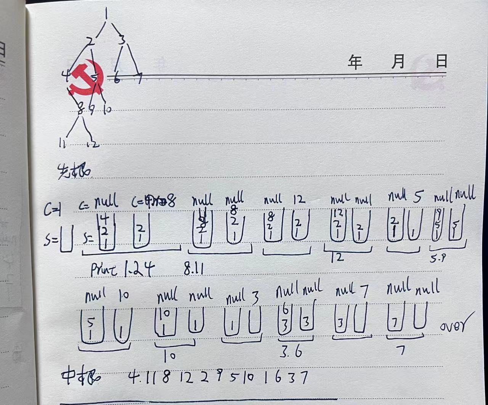

## 递归

## 迭代

### 前



```java

    //    1.先根遍历_1
    public void preOrderStack(TreeNode root, List<Integer> nodeList){
        Stack<TreeNode> nodeStack = new Stack<TreeNode>();
        TreeNode currentNode=root;
        while(!nodeStack.isEmpty()||currentNode!=null){
            while(currentNode!=null){
                nodeList.add(currentNode.val);//System.out.println(currentNode.val);
                nodeStack.push(currentNode);
                currentNode=currentNode.left;
            }
            if(!nodeStack.isEmpty()){
                currentNode = nodeStack.pop();
                currentNode = currentNode.right;
            }
        }
    }
```


```java
package com.java.sjq.dataStructure.tree;

import java.lang.reflect.Method;
import java.util.*;


public class PreOrder {


//    二 非递归遍历(栈实现)

    //    1.先根遍历_1
    public void preOrderStack(TreeNode root, List<Integer> nodeList){
        Stack<TreeNode> nodeStack = new Stack<TreeNode>();
        TreeNode currentNode=root;
        while(!nodeStack.isEmpty()||currentNode!=null){
            while(currentNode!=null){
                nodeList.add(currentNode.val);//System.out.println(currentNode.val);
                nodeStack.push(currentNode);
                currentNode=currentNode.left;
            }
            if(!nodeStack.isEmpty()){
                currentNode = nodeStack.pop();
                currentNode = currentNode.right;
            }
        }
    }


    //    2.中根遍历_1
    public void inOrderStackOne(TreeNode root, List<Integer> nodeList){
        Stack<TreeNode> nodeStack = new Stack<TreeNode>();
        nodeStack.push(root);
        TreeNode peekNode,popNode;
        while(!nodeStack.isEmpty()){// 第一个while循环
            peekNode = nodeStack.peek();
            while(peekNode!=null){// 第二个while循环
                nodeStack.push(peekNode.left);
                peekNode=nodeStack.peek();
            }
            nodeStack.pop();
            if(!nodeStack.isEmpty()){
                // 这个if判断主要是因为,当最后一个节点pop出战之后,还会把最后一个节点的右孩子入站,但是值为null,
                //导致会进入第一个while循环,不会进入第二个while循环,详细解释如下:
                /*当popNode为最后一个遍历到的节点的时候,
                nodeStack.push(popNode.right);使栈还存在一个null,栈不为空,
                可以进入第一个while循环,
                但是此时由于栈里面的元素只剩下null,所以peekNode=nodeStack.peek()=null
                不会进入的二个while循环
                当执行到nodeStack.pop()之后,此时栈为空,这个时候就应该停止算法了.如果不加if条件,则会进入if体内,再次调用nodeStack.pop()出错
                */
                popNode = nodeStack.pop();
                nodeList.add(popNode.val);
                nodeStack.push(popNode.right);
            }
        }
    }

    //    2.中根遍历_2
    public void inOrderStackTwo(TreeNode root, List<Integer> nodeList){
        Stack<TreeNode> nodeStack = new Stack<TreeNode>();
        TreeNode currentNode=root;
        while(!nodeStack.isEmpty()||currentNode!=null){
            while(currentNode!=null){
                nodeStack.push(currentNode);
                currentNode=currentNode.left;
            }
            if(!nodeStack.isEmpty()){
                currentNode = nodeStack.pop();
                nodeList.add(currentNode.val);//System.out.println(currentNode);
                currentNode = currentNode.right;
            }
        }
    }
    //     3.后根遍历
    public void afterOrderStack(TreeNode root, List<Integer> nodeList){
        Stack<TreeNode> nodeStack = new Stack<TreeNode>();
        TreeNode currentNode=root,peekNode,popNode,rightNode;
        while(!nodeStack.isEmpty()|| currentNode!=null ){// 第一个while循环
            while(currentNode!=null){// 第二个while循环
                nodeStack.push(currentNode);
                currentNode = currentNode.left;
            }
            boolean flag=true;// 右孩子没有访问过的标志
            rightNode=null;
            while(!nodeStack.isEmpty()&&flag) {
                peekNode = nodeStack.peek();
                if (peekNode.right==rightNode) {
                    popNode = nodeStack.pop();
                    nodeList.add(popNode.val);//System.out.println(popNode.val);
                    if(nodeStack.isEmpty()){
                        return;
                    }else{
                        rightNode=popNode;
                    }
                }else{
                    currentNode = peekNode.right;
                    flag=false;
                }
            }
        }
    }
    public TreeNode[] initTree(){
        TreeNode[] tree=new TreeNode[11];
        for(int i=0;i<tree.length;i++){
            tree[i]=new TreeNode(i+1);
        }
        tree[0].left=tree[1];
        tree[0].right=tree[2];
        tree[1].left=tree[3];
        tree[1].right=tree[4];
        tree[2].left=tree[5];
        tree[2].right=tree[6];

//        tree[4].left=tree[7];
//        tree[3].right=tree[8];
//
//        tree[8].left=tree[9];
//        tree[8].right=tree[10];

        tree[4].left=tree[7];
        tree[4].right=tree[8];

        tree[8].left=tree[9];
        tree[8].right=tree[10];
        return tree;

    }

    //    一\递归遍历
//    1.先根遍历
    public void preOrderRecursion(TreeNode root, List<Integer> nodeList){
        if (root!=null){
            nodeList.add(root.val);
            preOrderRecursion(root.left, nodeList);
            preOrderRecursion(root.right,nodeList);
        }

    }
    //    2.中根遍历
    public void inOrderRecursion(TreeNode root, List<Integer> nodeList){
        if (root!=null){
            inOrderRecursion(root.left, nodeList);
            nodeList.add(root.val);
            inOrderRecursion(root.right,nodeList);
        }

    }
    //    3.后根遍历
    public void afterOrderRecursion(TreeNode root, List<Integer> nodeList){
        if (root!=null){
            afterOrderRecursion(root.left, nodeList);
            afterOrderRecursion(root.right,nodeList);
            nodeList.add(root.val);
        }

    }
    public static void main(String[] args){

        PreOrder answer = new PreOrder();
        TreeNode[] tree = answer.initTree();
        List<Integer> nodeList = new ArrayList<Integer>();

        System.out.println("递归算法:");
        System.out.print("\t先根遍历\t");
        answer.preOrderRecursion(tree[0], nodeList);
        nodeList.forEach(System.out::print);
//
        System.out.print("\n\t中根遍历\t");
        nodeList.clear();
        answer.inOrderRecursion(tree[0], nodeList);
        nodeList.forEach(System.out::print);
//
        System.out.print("\n\t后根遍历\t");
        nodeList.clear();
        answer.afterOrderRecursion(tree[0], nodeList);
        nodeList.forEach(System.out::print);
//
        System.out.print("\n非递归算法:");//
        System.out.print("\n\t先根遍历\t");
        nodeList.clear();
        answer.preOrderStack(tree[0], nodeList);
        nodeList.forEach(System.out::print);

        System.out.print("\n\t中根遍历1\t");
        nodeList.clear();
        answer.inOrderStackOne(tree[0], nodeList);
        nodeList.forEach(System.out::print);

        System.out.print("\n\t中根遍历2\t");
        nodeList.clear();
        answer.inOrderStackTwo(tree[0], nodeList);
        nodeList.forEach(System.out::print);

        System.out.print("\n\t后根遍历\t");
        nodeList.clear();
        answer.afterOrderStack(tree[0], nodeList);
        nodeList.forEach(System.out::print);

    }

}

```

​                                                                                                            
