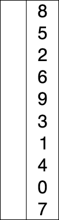

[java 排序 - 懒惰的星期六 - 博客园](https://www.cnblogs.com/sunupo/p/13235142.html)

## 1.归并排序　　

> [C 排序算法 | 菜鸟教程](https://www.runoob.com/cprogramming/c-sort-algorithm.html)

把数据分为两段，从两段中逐个选最小的元素移入新数据段的末尾。

可从上到下或从下到上进行。

过程演示：


### 一、迭代法

1. 待排序数据为data 
2. 每轮排序的结果保存为result（辅助空间）
3. 每轮排序的结果result需要重新复制给data
4. 最后排序结束的时候，data与result一模一样，都是排序好的结果

```java

public static void main(String[] args) {
        // TODO Auto-generated method stub
        ArrayList<Integer> data = new ArrayList<>();
        Random random = new Random(42);
        for (int i = 0; i < 10; i++) {
            data.add((int)(random.nextInt(100)));
        }
        Iterator<Integer> iterator = data.iterator();
        while(iterator.hasNext()){
            System.out.println(iterator.next());
        }
        System.out.println();
        ArrayList<Integer> result = new ArrayList<>();
        result.addAll(data);
        // 排序关键部分
        for (int seg = 1; seg < data.size(); seg=2*seg) {
            for (int start = 0; start < data.size(); start=start+2*seg) {
                int start1,end1,start2,end2;
                int mid = Math.min(start+seg,data.size());
                int end = Math.min(start+2*seg,data.size());
                start1 = start; end1=mid; start2=mid; end2 = end;
                int k=start,idx;
                while(start1<end1 && start2<end2){
//                    idx = data.get(start1)<data.get(start2)?start1++:start2++;
//                    result.set(k++,data.get(idx));
                    if (data.get(start1)<data.get(start2))
                        result.set(k++,data.get(start1++));
                    else
                        result.set(k++,data.get(start2++));
                }
                while(start1<end1){
                    result.set(k++,data.get(start1++));
                }
                while(start2<end2){
                    result.set(k++,data.get(start2++));
                }
            }
            data.clear();
            data.addAll(result);
        }
        for (Iterator<Integer> iterator2 = result.iterator(); iterator2.hasNext();) {
            Integer integer = (Integer) iterator2.next();
            System.out.println(integer);            
        }
    }
```


 


### 二、递归法


```java

public static void main(String[] args) {
        int[] data=new int[10];
        Random random = new Random(42);
        for (int i = 0; i < data.length; i++) {
            data[i]=((int)(random.nextInt(100)));
        }
        int[] auxiliary_arr = new int[data.length];
        merge_sort_recursive(data, auxiliary_arr, 0, data.length-1);
        for (int i = 0; i < auxiliary_arr.length; i++) {
            System.out.println(data[i]+"\t"+auxiliary_arr[i]);
        }
        
        
        
    }
    public static void merge_sort_recursive(int[] data, int[] auxiliary_arr, int startIdx, int endIdx){
//        System.out.println(startIdx+"\t\t"+endIdx);
        if(startIdx>=endIdx)
            return;
        int len = endIdx-startIdx;   
        int start1 = startIdx;
        int end1 = (len>>1) +start1;
        int start2=end1+1;
        int end2 = endIdx;
        merge_sort_recursive(data, auxiliary_arr, start1, end1);
        merge_sort_recursive(data, auxiliary_arr, start2, end2);
        int k = startIdx;
        while(start1<=end1 && start2<=end2){
            auxiliary_arr[k++] = data[start1]<data[start2]?data[start1++]:data[start2++];
        }
        while(start1<=end1)
            auxiliary_arr[k++]=data[start1++];
        while(start2<=end2)
            auxiliary_arr[k++]=data[start2++];
//        todo 把auxiliary数组startIdx到endIdx部分的数据复制给data
        for (int i = startIdx; i <= endIdx; i++) {
            data[i] = auxiliary_arr[i];
        }

        
    }
```


##  2. 冒泡排序

冒泡排序（英语：Bubble Sort）是一种简单的排序算法。它重复地走访过要排序的数列，一次比较两个元素，如果他们的顺序（如从大到小、首字母从A到Z）错误就把他们交换过来。


```
    public static void main(String[] args) {
        int[] data=new int[10];
        Random random = new Random(42);
        for (int i = 0; i < data.length; i++) {
            data[i]=((int)(random.nextInt(100)));
        }
        bubble_sort(data);
        for (int i = 0; i < data.length; i++) {
            System.out.println(data[i]);
        }    
    }
    public static void bubble_sort(int[] data){
        for (int i = 0; i < data.length - 1; i++) {
            for (int j = 0; j < data.length -1 -i; j++) {
                int temp;
                if (data[j]>data[j+1]){
                    temp = data[j];
                    data[j]=data[j+1];
                    data[j+1]=temp;
                }
            }
            
        }
    }
```


##  3.选择排序

 a.每一次把最小值放在后面


```
public static void main(String[] args) {
        int[] data=new int[10];
        Random random = new Random(42);
        for (int i = 0; i < data.length; i++) {
            data[i]=((int)(random.nextInt(100)));
        }

        for (int i = 0; i < data.length; i++) {
            System.out.print(data[i]+"\t");
        }
        System.out.println("\n开始排序");
        select_sort(data);
        System.out.println("\n排序结果");

        for (int i = 0; i < data.length; i++) {
            System.out.print(data[i]+"\t");
        }    
    }
    
    public static void select_sort(int[] data){
        // 每一轮把最小值放在后面
        int min;
        for (int i = 0; i < data.length-1 ; i++) {
            int idx=0;
            min=data[idx];

            for (int j = 1; j < data.length-i; j++) {
                if (data[j]<min){
                    idx=j;
                    min=data[idx];
                }
            }
            int temp;
            temp = data[idx];
            data[idx] = data[data.length-1-i];
            data[data.length-1-i] = temp;
            for (int d = 0; d < data.length; d++) {
                System.out.print(data[d]+"\t");
            }
            System.out.println();
        }
    }
```


```
b.每次把最小值放在前面过程演示如下：
```




```
public static void select_sort(int[] data){
// 每次把最小值放在前面
        int min;
        for (int i = 0; i < data.length-1 ; i++) {
            int idx=i; // idx = i
            min=data[idx];
            for (int j = i+1; j < data.length; j++) {
                if (data[j]<min){
                    idx=j;
                    min=data[idx];
                }
            }
            int temp;
            temp = data[idx];
            data[idx] = data[i];
            data[i] = temp;
            for (int d = 0; d < data.length; d++) {
                System.out.print(data[d]+"\t");
            }
            System.out.println();
        }
    }
```


## 4.插入排序

### a.简单插入排序


```java
// 通过ArrayList实现public static void main(String[] args) {
        
        Random random = new Random(42);
        
        ArrayList<Integer> data = new ArrayList<>();
        for (int i = 0; i < 10; i++) {
            data1.add(((int)(random.nextInt(100))););
        }
        for (int i = 0; i < data.size(); i++) {
            System.out.print(data1.get(i)+"\t");
        }
        System.out.println("\n开始排序");
        ArrayList<Integer> result = insert_sort(data1);
        System.out.println("\n排序结果");

        for (int i = 0; i < result.size(); i++) {
            System.out.print(result.get(i)+"\t");
        }
    }
public static ArrayList<Integer> insert_sort(ArrayList<Integer> data){
        ArrayList<Integer> result = new ArrayList<>();
        result.add(data.get(0));
        for (int i = 1; i < data.size(); i++) {
//            todo data[i]与result中的元素作比较，得到插入的位置，可以用二分查找
            int insertIdx=result.size();
            方式一：二分查找
            int low=0,high=result.size()-1;
            while(low<=high){
                int mid=(low+high)/2;
//                todo 怎样找到空位，
                if (data.get(i)<result.get(mid)){
                    high=mid-1;
                    insertIdx=mid;

                }else{
                    low=mid+1;

                }
            }
//            方式二：逆序依次查找
//            for (int j = result.size()-1 ; j>=0; j--) {
//                if(data.get(i)
//                        <result.get(j)){
//                    insertIdx=j;
//                }
//            }
            result.add(insertIdx, data.get(i));            
        }
        return result;

    }
```


```java
// 通过数组实现，多了移动数组元素的操作
public static void main(String[] args) {
        
        int[] data=new int[30];
        Random random = new Random(42);
        for (int i = 0; i < data.length; i++) {
            data[i]=((int)(random.nextInt(100)));
        }
        for (int i = 0; i < data.length; i++) {
            System.out.print(data[i]+"\t");
        }
        System.out.println();
        insert_sort_2(data);
        for (int i = 0; i < data.length; i++) {
            System.out.print(data[i]+"\t");
        }
    }

```

```java

public static void insert_sort_2(int[] data){
        int temp;//记录当前需要插入的元素的值，因为需要把此元素之前所有大于此元素的值，进行后移。
        int j;
//        for (int i = 1; i < data.length;i++ ) {
//            temp= data[i];
//            for (j=i-1; j >=0;j-- ) {  // j=i-1，j>=0,data[j+1]=data[j],data[j+1]=temp; 或者 j=i，j>0,data[j]=data[j-1],data[j]=temp; 
//                if(data[j]>temp){  //把这个条件放在循环时候判定，就不用continue break这么麻烦
//                    data[j+1] = data[j];
//                    continue;
//                }
//                break;
//            }
//            data[j+1] = temp;
//        }
        for (int i = 1; i < data.length;i++ ) {
            temp= data[i];
            for (j=i-1; j >=0&&data[j]>temp;j-- ) {
                data[j+1] = data[j];
            }
            data[j+1] = temp;
        }
    }
```


## 5. 希尔排序

希尔排序，也称递减增量排序算法，是插入排序的一种更高效的改进版本。希尔排序是非稳定排序算法。

希尔排序是基于插入排序的以下两点性质而提出改进方法的：

- 插入排序在对几乎已经排好序的数据操作时，效率高，即可以达到线性排序的效率
- 但插入排序一般来说是低效的，因为插入排序每次只能将数据移动一位

过程演示：

希尔排序，也称递减增量排序算法，是插入排序的一种更高效的改进版本。希尔排序是非稳定排序算法。

希尔排序是基于插入排序的以下两点性质而提出改进方法的：

- 插入排序在对几乎已经排好序的数据操作时，效率高，即可以达到线性排序的效率
- 但插入排序一般来说是低效的，因为插入排序每次只能将数据移动一位

过程演示：


```java
void shell_sort(int arr[], int len) {
    int gap, i, j;
    int temp;
    for (gap = len >> 1; gap > 0; gap = gap >> 1)
        for (i = gap; i < len; i++) {
            temp = arr[i];
            for (j = i - gap; j >= 0 && arr[j] > temp; j -= gap)
                arr[j + gap] = arr[j];
            arr[j + gap] = temp;
        }
}
```


## [小结](http://www.cyc2018.xyz/%E7%AE%97%E6%B3%95/%E5%9F%BA%E7%A1%80/%E7%AE%97%E6%B3%95%20-%20%E6%8E%92%E5%BA%8F.html#_5-%E5%A0%86%E6%8E%92%E5%BA%8F#小结)

### 1. 排序算法的比较

| 算法             | 稳定性 | 时间复杂度                   | 空间复杂度 | 备注                     |
| ---------------- | ------ | ---------------------------- | ---------- | ------------------------ |
| 选择排序         | ×      | N<sup>2</sup>                | 1          |                          |
| 冒泡排序         | √      | N<sup>2</sup>                | 1          |                          |
| 插入排序         | √      | N ~ N<sup>2</sup>            | 1          | 时间复杂度和初始顺序有关 |
| 希尔排序         | ×      | N 的若干倍乘于递增序列的长度 | 1          | 改进版插入排序           |
| 快速排序         | ×      | NlogN                        | logN       |                          |
| 三向切分快速排序 | ×      | N ~ NlogN                    | logN       | 适用于有大量重复主键     |
| 归并排序         | √      | NlogN                        | N          |                          |
| 堆排序           | ×      | NlogN                        | 1          | 无法利用局部性原理       |

快速排序是最快的通用排序算法，它的内循环的指令很少，而且它还能利用缓存，因为它总是顺序地访问数据。它的运行时间近似为 ~cNlogN，这里的 c 比其它线性对数级别的排序算法都要小。

使用三向切分快速排序，实际应用中可能出现的某些分布的输入能够达到线性级别，而其它排序算法仍然需要线性对数时间。

### 2. Java 的排序算法实现

Java 主要排序方法为 java.util.Arrays.sort()，对于**原始数据类型**使用**三向切分**的快速排序，对于**引用类型**使用**归并排序**。