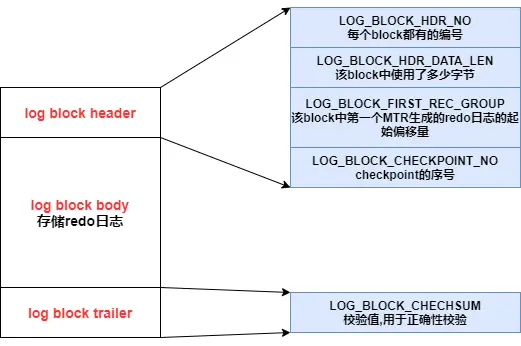
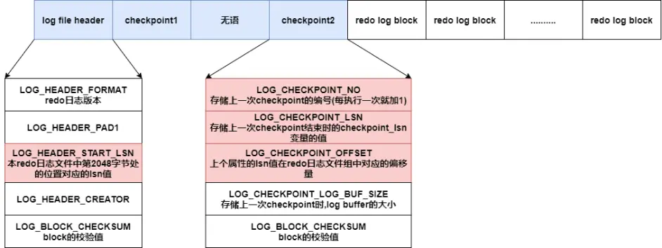

[(126条消息) 关于Mysql中redo log和LSN的理解\_redo log lsn\_我骑一只小毛驴的博客-CSDN博客](https://blog.csdn.net/xuwukui/article/details/108530477)

# 写在前面

- LSN 
  - 是一个8字节整形数字，存储在log_sys对象中的全局变量。
  - LSN存在于:**数据页**、**redo log record** 和 **redo log file**.

- 数据页：
  - buffer pool 内存数据页。
  - disk 磁盘数据页。重启服务的时候，用来比较 disk 磁盘数据页 lsn 与 checkpoint 的位置关系。
- redo log record：就是redo log file 中一条一条的 record。
- redo log file：存放了 redo log record。
- write position：当前 log file 中最后一条 redo log record 对应的 LSN，也即是当前 log file 中最大的 LSN。redo log record在log file中的位置也是根据SLN计算出来的，SLN大于log file文件大小后则取模计算，也就是覆盖老数据）；
- checkpoint：存放于 redo log file 头部的 LSN，代表该 LSN 之前的脏页已经全部落盘。
- 每个数据页的版本号。
  - **在每个页的头部**，有一个FIL\_PAGE\_LSN，记录的该页的 LSN。表示该页最后刷新时 LSN 的大小。
  - 其可以用来标记数据页的“版本号”。因此页中的LSN用来判断页是否需要进行恢复操作。

- redo log block：存储redo日志的页叫做redo log block 。[MySQL—redo log详解 - 哔哩哔哩](https://www.bilibili.com/read/cv15836549/)

  - 

- redo log buffer：redo log buffer是一块连续的内存空间，被划分为若干个redo log block 。

- redo日志文件格式 

  - 每个redo日志文件的前4个block用来存储管理信息，其余部门存储一个个的redo log block

    log file header：存储描述该redo日志文件的一些整体属性

    checkpoing1和checkpoint2：每次进行checkpoint时，会将checkpoint的一些相关属性记录在其中一个

     

    


SLN是一个8字节整形数字，存储在log_sys对象中的全局变量，可以简单理解SLN就是从开始到现在已经产生了多少字节的redo log。SLN会存在于三个地方：**数据页**、**redo log record** 和 **redo log file**，redo recovery就是依赖存在于这三个地方的SLN进行。

redo log采用逻辑环形结构来复用空间，这种环形结构一般需要两个指针：

- write position：表示当前数据写入的位置；
- checkpoint：编号小于checkpoint的空间可以被覆盖（这里编号特指SLN）；

这里两个指针是redo log的逻辑指针，分别对应到上面提到的两个存储位置：

- write position 就是当前 log file 中最后一条 redo log record 对应的LSN，也即是当前log file中最大的SLN（redo log record在log file中的位置也是根据SLN计算出来的，SLN大于log file文件大小后则取模计算，也就是覆盖老数据）；

- checkpoint就是存放于log file头部的SLN，代表该SLN之前的脏页已经全部落盘，自然就不再需要在这之前的redo log record了，新的checkpoint会覆盖老的；


由于log file是环形结构，如果checkpoint原地不动的话，随着redo log record的不断插入，write position总会追上checkpoint，如果追上了那就没办法再写redo log了，因为checkpoint之后的redo log不能保证其对应的脏页已经被刷到磁盘，如果日志被复写了则存在数据丢失的可能。解决办法也很简单，催着checkpoint也往前走，形成一种checkpoint追赶write position的局面，checkpoint与write position之间的间隔越小，证明还未刷入磁盘的脏页越少，服务重启之后recovery所需的时间就越少，反之则越大。那么如何更新checkpoint呢？有Sharp Checkpoint和Fuzzy Checkpoint两大类，Sharp Checkpoint发生在关闭数据库时，将所有脏页刷回磁盘。Sharp Checkpoint会相对比较耗时，不适合在运行时使用，所以运行时依赖Fuzzy Checkpoint进行部分脏页的刷新。部分脏页刷新有以下几种：

- Master Thread Checkpoint
- FLUSH\_LRU\_LIST Checkpoint：用于保证buffer pool的可用空间，新版迁移到独立后台线程page cleaner thread；
- Async/Sync Flush Checkpoint：用于保证redo log的可用空间，触发low water时采用async模式，触发high water采用sync模式，新版迁移到独立后台线程page cleaner thread；
- Dirty Page too much Checkpoint

使用show engine innodb status \\G可以查看当前数据库各部分维护的SLN值，以下是DB示例值：

```
---
LOG
---
Log sequence number 10438038988312
Log flushed up to   10438038988305
Pages flushed up to 10437891341412
Last checkpoint at  10437891341412
0 pending log flushes, 0 pending chkp writes
756880106 log i/o's done, 280.00 log i/o's/second
```

Log sequence number（LSN1） ：表示在log\_sys中sln字段的最新值，也就是下一个redo log record的sln值；  
Log flushed up to （LSN2） ：表示最新刷到磁盘的redo log record对应的sln，也即是上述的write position；  
Pages flushed up to （LSN3）：表示小于此sln的脏页已经刷到磁盘，此值一般对应Flush List中最老（sln值最小）的脏页的sln；  
Last checkpoint at （LSN4） ：表示记录在log file中的checkpoint，recovery的时候以这个值为准，sln小于这个值的可以认为已经安全刷到磁盘不需要修复；

上述四个SLN满足如下关系：LSN1 >= LSN2 >= LSN3 >= LSN4

       我在本地测试过几次，每次LSN3都等于LSN4，说明我测试的DB脏页刷盘和更新checkpoint是同步的。但是在网上存在很多示例显示LSN3 > LSN4，而且既然Mysql弄两个值出来肯定不是为了记录同一个值，那么就说明存在部分情况刷完脏页是没有更新checkpoint的，那么是否会存在由于这些情况导致checkpoint一直得不到更新，进而引发redo log可用空间耗尽的情况？答案是不会的，log buffer可用空间可以通过Async/Sync Flush Checkpoint来保证，他会针对LSN1 - LSN4 和 LSN1 - LSN3两个值分别设置高低水位，触达水位后会执行对应的操作（低水位触发异步操作，高水位触发同步操作），最终目的都是为了更新checkpoint值保证write position不要追上来：

<table><tbody><tr><td>概念</td><td>计算</td><td>含义</td></tr><tr><td>Ckp&nbsp;age</td><td>LSN1-&nbsp;LSN4</td><td>还没有做Checkpoint的日志范围，若Ckp&nbsp;age超过日志空间，说明被覆盖的日志（LSN1－LSN4－Log&nbsp;cap）对应日志和数据“可能”还没有刷到磁盘上</td></tr><tr><td>Buf&nbsp;age</td><td>LSN1-&nbsp;LSN3</td><td>还没有将脏页刷盘的日志的范围，若Buf&nbsp;age超过日志空间，说明被覆盖的日志（LSN1－LSN3－Log&nbsp;cap）对应数据“肯定”还没有刷到磁盘上</td></tr><tr><td>Buf&nbsp;async</td><td>日志空间大小&nbsp;*&nbsp;7/8</td><td>强制将Buf&nbsp;age-Buf&nbsp;async的脏页刷盘，此时事务还可以继续执行，所以为async，对事务的执行速度没有直接影响（有间接影响，例如CPU和磁盘更忙了，事务的执行速度可能受到影响）</td></tr><tr><td>Buf&nbsp;sync</td><td>日志空间大小&nbsp;*&nbsp;15/16</td><td>强制将2*(Buf&nbsp;age-Buf&nbsp;async)的脏页刷盘，此时事务停止执行，所以为sync，由于有大量的脏页刷盘，因此阻塞的时间比Ckp&nbsp;sync要长。</td></tr><tr><td>Ckp&nbsp;async</td><td>日志空间大小&nbsp;*&nbsp;31/32</td><td>强制写Checkpoint，此时事务还可以继续执行，所以为async，对事务的执行速度没有影响（间接影响也不大，因为写Checkpoint的操作比较简单）</td></tr><tr><td>Ckp&nbsp;sync</td><td>日志空间大小&nbsp;*&nbsp;64/64</td><td>强制写Checkpoint，此时事务停止执行，所以为sync，但由于写Checkpoint的操作比较简单，即使阻塞，时间也很短</td></tr></tbody></table>

当事务执行速度大于脏页刷盘速度时，Ckp age和Buf age会逐步增长，当达到async点的时候，强制进行脏页刷盘或者写Checkpoint，如果这样做还是赶不上事务执行的速度，则为了避免数据丢失，到达sync点的时候，会阻塞其它所有的事务，专门进行脏页刷盘或者写Checkpoint。

因此从理论上来说,只要事务执行速度大于脏页刷盘速度，最终都会触发日志保护机制，进而将事务阻塞，导致MySQL操作挂起。

由于写Checkpoint本身的操作相比写脏页要简单，耗费时间也要少得多，且Ckp sync点在Buf sync点之后，因此绝大部分的阻塞都是阻塞在了Buf sync点，这也是当事务阻塞的时候，IO很高的原因，因为这个时候在不断的刷脏页数据到磁盘。

以上是个人总结网上的资料做的学习记录，如有错误请及时指正，以免误导他人，感谢！