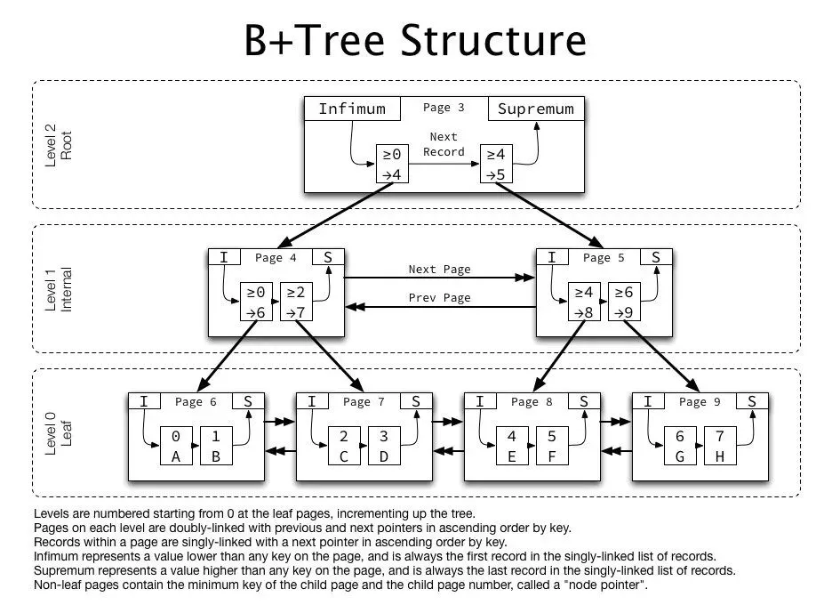
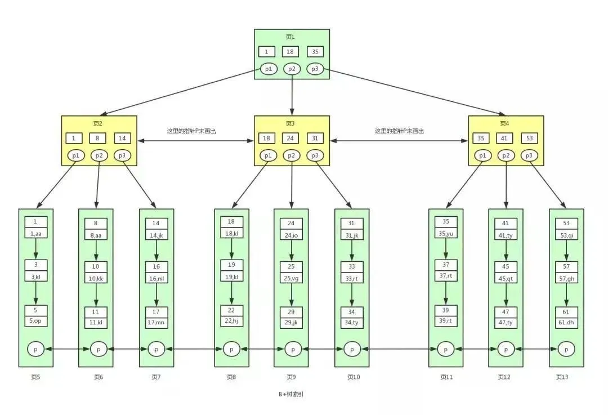

B+ 树中各个页之间是通过双向链表连接的，叶子节点中的数据是通过单向链表连接的

[(130条消息) MySQL数据页,索引页\_数据页和索引页\_qq\_32355291的博客-CSDN博客](https://blog.csdn.net/qq_32355291/article/details/118877264)

首先磁盘文件里存放了一个个的数据页，数据页在磁盘文件中是一段数据，这段数据有两个指针，一个指向上一个数据页的行起始位置，一个指向下一个数据页的行起始位置，是一个[双向链表](https://so.csdn.net/so/search?q=%E5%8F%8C%E5%90%91%E9%93%BE%E8%A1%A8&spm=1001.2101.3001.7020)的数据结构，这是数据页；为什么称为数据页？因为页里面还有内容，这个里面的东西就是数据行，数据行也是有结构的，数据页里面的每个行组成了单向链表，即每个行都有指针指向了下一个行的位置，这是数据行； 然后是页目录，页目录的由来，目录肯定是用来定位的，根据目录查询具体内容，这个页目录需要你建表指定了主键，这时MySQL会为你维护这个页目录，即每添加一行数据，相应的在页目录里也会体现出来，然后页目录也是有数据结构的，页目录里有槽位的概念，就是添加一行数据时，相应的在槽位里也会保存一个主键id，值得注意的是每个槽位里是一组主键id，这就是页目录； 当查询数据时数据时如果就一个数据页，并且建立主键了，那直接通过二分查找页目录的，在页目录里的槽位里找到id，根据id就能找到完整的那行数据，当没有建立主键那就麻烦了，只能遍历这个数据页的每个行才能找到对应的数据，所以建立主键很重要。这是一个数据页，当是多个数据页呢，查询数据该怎么查呢？比如1000个数据页，总不能像一个数据页时到页目录的槽位里找主键id吧？1000个数据页就有1000个页目录的，所以这是不行的，由此引出一个主键目录的概念，也就是索引目录的概念，这个是干嘛的？是为了解决数据页数据行太多的问题，这个索引目录里的数据结构是什么样的呢？ 这个目录用来管理数据页的，对每个数据页进行编号，所以索引目录里存放了一个个的数据页的页号，当然只有页号也是不行的，因为只有页号也无法定位我们要查询的那行数据，所以还得有主键id，当然不可能放行完整数据，这样太占空间，直接放id就可以了，当查询数据时知道了id，就可以拿着id及数据页号定位在那个槽位然后在槽位里走一遍页目录查询方式，找到完整数据了，所以索引目录的数据结构就是数据页号+主键id，但是存放数据页里很多行数据所有的主键id也不好，就存每个页的最小主键id，根据最小主键和上一个数据页的最小主键就能定位查询的数据在那个数据页号了。

随着数据越来越多，一个索引目录显然不够用了，那怎么办呢？只能同样的方式在建立索引目录，那当索引目录也达到了1000个，这么多索引目录怎么管理？我们可以借鉴上面的思路，将索引目录组成索引页，当然数据还是在无限增加，索引页也太多了，达到了1000个索引页，当要查询数据时，遍历1000个索引页，查看每个索引页里的数据页有没有这个主键id，这显然是接受不了的，因为太慢。 那怎么办？肯定需要有个概念能管理这么多的索引页，MySQL是这样做的，在索引页的基础上再抽取一层索引页，我们为了方便先叫上层索引页，这个上层索引页如何管理这么多索引页呢？实际上他是将一个个的索引页再次抽象提取了，比如1000个索引页，那0-500索引页合并成一个上层索引页，这个上层索引页叫01，501-1000索引页合并成一个上层索引页，叫上层索引页索引页02，当然上层索引页如果只存索引页页号也是不行的，因为这没法定位数据，所以上层索引页除了存放索引页的页号还要存放索引页里最小的主键id，这样就能定位数据了，当查询数据时，比如找id=11这个， 先从上层索引页开始查，查这个数据在哪个上层索引页，比如在上层索引页01里，那就在上层索引页01里继续查在哪个索引页，找到在那个索引页就能找到哪个数据页，找到数据页，根据页目录查找具体完整行数据，这样就能查到了，上面的查询逻辑都是基于二分查找，如果上层索引页的数量太多怎么办？借鉴上面的方式在抽取上上层索引页管理，通常这个层面在MySQL里不会超出4层。 再次想下数据页和索引页还有上层索引页什么关系？他们之间其实是组成了B+树，这个**B+树的叶子节点是数据页号+最小主键id，中间节点是索引页号+最小主键id**，根节点是上层索引页，也可能是上上层索引页，取决于B+树的深度，上层索引页是没有这个概念的，只是为了方面描述。

