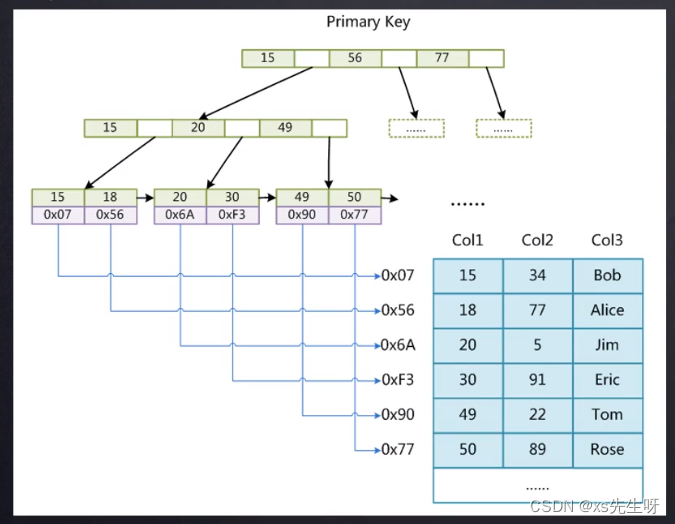

[(130条消息) mysql范围查询流程\_xs先生呀的博客-CSDN博客](https://blog.csdn.net/wys0912/article/details/127113007)

## 情况

范围查询走索引和不走索引两种情况  
下面分析的是走索引的情况，不走索引的情况在最后描述

## 索引结构

## [查找算法](https://so.csdn.net/so/search?q=%E6%9F%A5%E6%89%BE%E7%AE%97%E6%B3%95&spm=1001.2101.3001.7020)

[二分查找](https://so.csdn.net/so/search?q=%E4%BA%8C%E5%88%86%E6%9F%A5%E6%89%BE&spm=1001.2101.3001.7020)

## 查找流程

非叶子数据节点中通过二分查找快速定位到下一层的节点的page 来最终找到找到对应的叶子节点数据页  
在叶子节点数据页中可以通过页目录进行二分查找快速定位到第一条满足条件的数据，然后通过链表指针找到第一条不满足条件的数据为止

如上索引图需要找到 id >= 20 and < 49的数据  
1、加载根数据页到内存  
2、在内存中做二分，找到对应的子页  
3、在子页做二分，找到对应的子页  
4、现在到了叶子节点页，在页中做二分，找到第一条满足的数据，这里是 id = 20  
5、一直通过叶子节点的链表指针，找到第一条不满足的为止，这里是 id = 49  
6、结束查找，返回数据

## 不走索引的范围查找

结论 ：扫描索引树 或者 扫描全表

问题：扫描哪棵索引树，主键索引？还是其他索引？

如果某个非主键索引可以做到[索引覆盖](https://so.csdn.net/so/search?q=%E7%B4%A2%E5%BC%95%E8%A6%86%E7%9B%96&spm=1001.2101.3001.7020)，就走哪个索引树，如果不能满足索引覆盖，那么扫描主键索引树 或者 扫描全表  
比如有联合索引 name\_age idx(name, age) 这种联合索引，但是查询条件是 age > 20 and age < 40 就会选择扫面 name\_age 这个索引树而不会去扫描主键索引树，因为这个索引对应的数据小，只有name age，如果走主键索引，就会多加载很多不必要的数据到内存，这也是mysql 的优化，

小提示：`索引覆盖`的优化点很多，在很多情况下，索引覆盖会强制使我们的一些 sql 走一些索引，哪怕这个索引不是最优的。