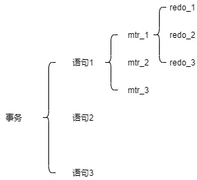
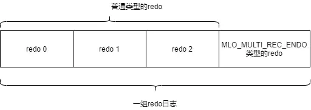
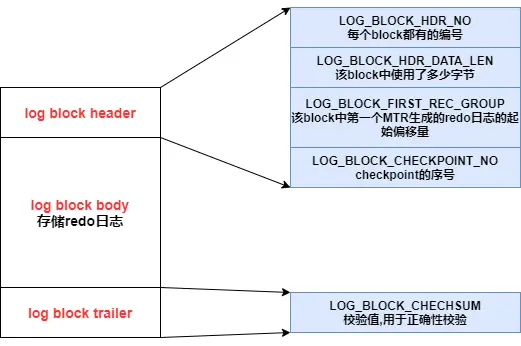
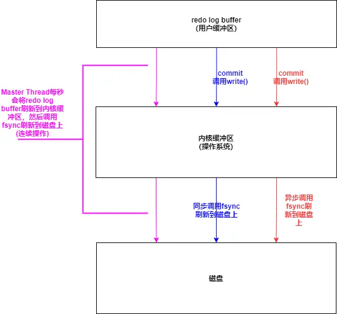
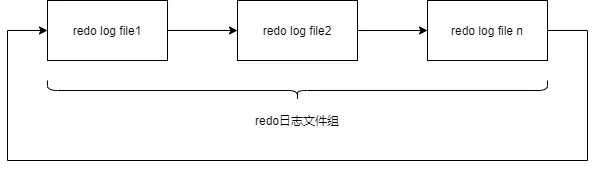
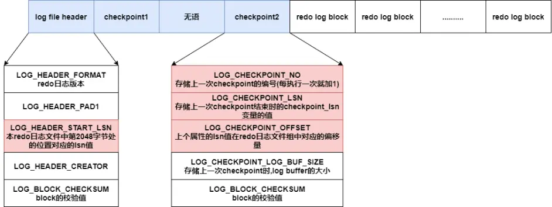
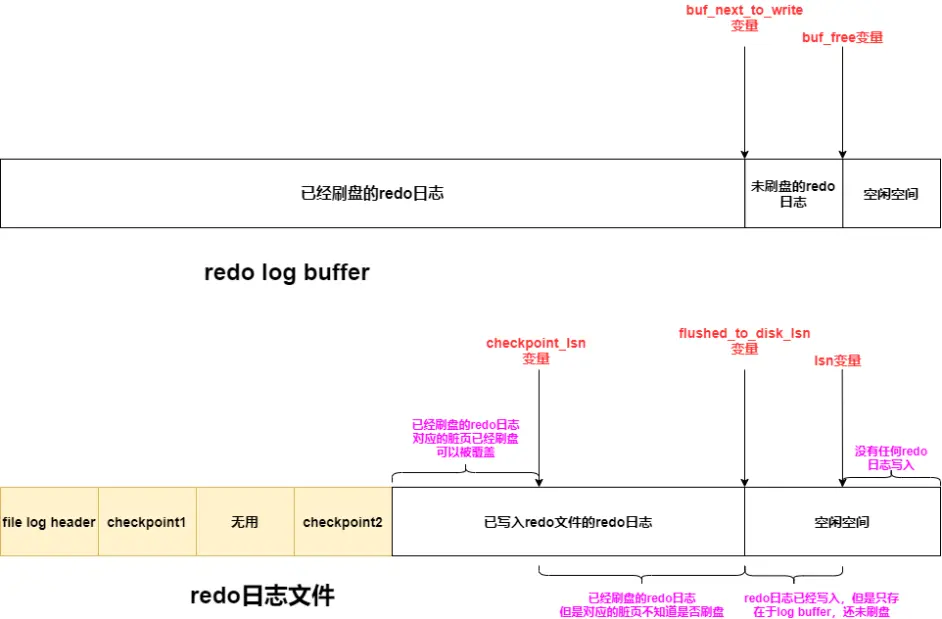
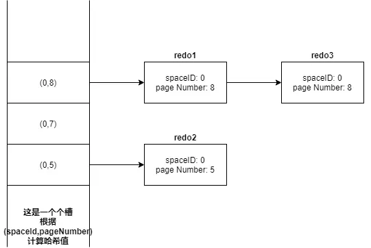

[MySQL—redo log详解 - 哔哩哔哩](https://www.bilibili.com/read/cv15836549/)

掘金主页: https://juejin.cn/user/2766784438474925   

知乎主页: https://www.zhihu.com/people/huang-xiang-qi-45

同步更新，后续会发布更多MySQL，Redis，并发，JVM，分布式等面试热点知识，不想错过的友友们点拨关注!  

转载请标明出处！

# 1\. redo日志是干嘛的

## 1.1 为什么要有redo日志

事务在运行过程中，都是在内存的Buffer Pool修改页面，事务提交后，这些被修改后的脏页并不会立刻刷盘（立刻刷盘开销太大，一方面是一个页面可能就修改了一点点，将整个页面刷盘不值当，另一方面是一个事务会涉及不同的页面，如果将这些页面都刷盘会产生很多的随机IO）

但如果不采取其他措施，那么在事务提交后MySQL发生故障，导致内存中数据丢失，那么这个已提交事务作出的更改也会丢失，

所以这里就需要引入redo日志，对**任意页面**进行修改的操作都会生成redo日志，在事务提交时，只要保证生成的redo日志成功落盘即可，这样，即使MySQL发生故障导致内存中的数据丢失，也可以根据已落盘的redo日志恢复数据

## 1.2 使用redo日志的好处

1.  **redo日志记录的是每个页更改的物理情况**，占用的空间小
    
2.  一个事务生成的redo日志是按顺序写入磁盘的，是顺序IO
    

# 2\. redo日志格式

## 2.1 redo日志通用格式

一条日志的格式

## 2.2 redo日志类型

-   **简单的redo日志**——记录哪个表空间中的哪个页面从哪个位置开始的多少个节点要修改为什么
    
-   **MLOG\_1BYTE**：在页面的某个偏移量处写入1字节的redo日志
    
-   **MLOG\_2BYTE**：在页面的某个偏移量处写入2字节的redo日志
    
-   **MLOG\_4BYTE**：在页面的某个偏移量处写入4字节的redo日志
    
-   **MLOG\_8BYTE**：在页面的某个偏移量处写入8字节的redo日志
    
    上面这4个类型的redo日志结构相同，只是具体数据的字节数不同
    

-   **MLOG\_WRITE\_STRING**：在页面的某个偏移量处写入一个字节序列的redo日志
    

一个insert语句会修改非常多的页面（系统数据页面，用户数据页面），对这些页面的修改都会产生redo日志，同时将一条记录insert到一个页面时，需要修改的地方非常多，上述简单的redo日志不能满足需要，所以引入复杂的redo日志

-   **复杂的redo日志**——记录了对哪个表空间 的哪个页面进行修改，存储了对该页面进行修改操作的一些必备要素，重启时，MySQL会根据redo日志的类型，将redo日志中的必备要素作为参数，调用日志类型对应的函数，恢复数据
    
-   **MLOG\_REC\_INSERT**：插入一条使用非紧凑格式的记录(REDUNDANT)的redo日志
    
-   **MLOG\_COMP\_REC\_INSERT**：插入一条使用紧凑格式的记录的redo日志
    
-   **MLOG\_COMP\_PAGE\_CREATE**：创建一个存储紧凑格式记录的页面的redo日志
    
-   **MLOG\_COMP\_LIST\_START\_DELETE**：从某条给定记录开始删除页面中一系列使用紧凑格式的记录时的redo日志
    
-   **MLOG\_COMP\_LIST\_END\_DELETE**：与 **MLOG\_COMP\_LIST\_START\_DELETE**相呼应
    
-   **特殊的redo日志**
    
-   **MLO\_MULTI\_REC\_END**：每组redo日志中的最后一条redo日志
    

# 3\. Mini-Transaction

-   **将对底层页面进行一次原子访问的过程称为一个Mini-Transaction**
    
    例如，一个insert操作中，会修改系统数据页，会向每个索引中插入一条记录，修改数据页算一个MTR，向聚簇索引对应B+树的页面中插入一条记录算一个MTR，向二级索引对应的B+树中插入一条记录算一个MTR
    
-   一个Mini-Transaction中产生的redo日志都属于**同一组**，称作一个**redo日志记录组**
    
-   一个事务包含多条语句，每条语句包含多个MTR，每个MTR生成多条redo日志
    

-   一个MTR结束时，会将该MTR产生的redo日志记录组写入redo log buffer，并且会把MTR执行过程中修改的页面加入到Buffer Pool的flush链表
    
-   一个MTR是原子的，MTR产生的**redo日志记录组**也是原子的，redo通过redo日志恢复时，一个redo日志记录组的redo日志要么全部恢复，要么都不恢复
    
-   一个redo日志记录组中的redo地址
    
-   如果为1，那么该redo日志所在的组只有一条redo日志，直接利用该redo日志进行恢复
    
-   如果为0，那么该redo日志所在的组有多条redo日志，只有解析到 **MLOG\_MULTI\_REC\_END类型的redo日志**时，才认为解析了一组完整的redo日志，才会进行恢复，苟泽会放弃前面解析到的redo日志（保证一个redo日志记录组的redo日志要么全部恢复，要么都不恢复）
    
-   如果该组只有一条redo日志，那么该redo日志的type字段中第一个bit为1，表示该redo日志所在的组只有1条redo日志
    
-   如果该组中有多条redo日志，那么该组中的redo日志的type字段的第一个bit为0，表示redo日志所在的组有多条redo日志，并且这种情况下，该组的最后一条redo日志后会加上一条 **MLOG\_MULTI\_REC\_END类型的redo日志**
    

-   系统在崩溃重启时，对于一条redo日志，会检查其type字段的第一个bit
    

# 4\. redo

## 4.1 redo log block

存储redo日志的页叫做redo log block，结构如下

## 4.2 redo log buffer

-   redo log buffer是一块连续的内存空间，被划分为若干个redo log block
    
-   redo日志写入redo log buffer是按照顺序写入了，有个 **buf\_free全局变量**来标识下一次写入的位置
    
-   向redo log buffer中写入redo日志不是一条一条写入的，而是一组一组写入了
    
    一个MTR会产生一个redo日志记录组，一条redo日志生成后不会立刻写入redo log buffer，而是等到MTR结束后，将MTR生成的redo日志记录组一起写入redo log buffer——所以在redo log buffer中，一个MTR产生的redo日志是连续存储的
    

## 4.3 redo日志刷盘时机

1.  如果redo log buffer使用了50%，就会将redo log buffer中的redo日志刷盘
    
2.  Master Thread，每秒一次将redo log buffer中的redo日志刷盘
    
3.  MySQl关闭时，会将redo log buffer中的redo日志刷盘
    
4.  事务提交时，根据 **innodb\_flush\_log\_at\_trx\_commit系统变量的值**，有不同的操作
    

-   **0**：事务commit时，不做任何操作（摆烂了，让Master Thread去一秒一刷）——**丧失持久性**，最好的性能
    
-   **1**：事务commit时，进行同步操作——将redo log buffer刷新到 **文件系统缓存**，并且会同步调用 \*\*fsync()\*\*将文件系统缓存刷新到磁盘上——**保持持久性**，最差的性能
    
-   **2**：事务commit时，进行异步操作——将redo log buffer刷新到 **文件系统缓存**，**不会调用fsync()**，由OS\*\*异步调用 fsync()\*\*将文件系统缓存刷新到磁盘上——如果MySQL挂了，但是OS没挂是可以保证持久性的，但是如果OS挂了，就丧失了持久性
    

## 4.4 redo日志文件

### 4.4.1 循环写入

-   **redo日志文件组**有几个核心参数
    
-   **innodb\_log\_file\_size**：每个redo日志文件的大小
    
-   **innodb\_log\_files\_in\_group**：一个redo日志文件组的redo日志文件数目
    
-   redo日志文件组采用的是**循环写入机制**
    

### 4.4.2 redo日志文件格式

**每个redo日志文件**的前4个block用来存储管理信息，其余部门存储一个个的redo log block

-   **log file header**：存储描述该redo日志文件的一些整体属性
    
-   **checkpoing1和checkpoint2**：每次进行checkpoint时，会将checkpoint的一些相关属性记录在其中一个
    

## 4.5 全局变量

### 4.5.1 buf\_free

**全局变量buf\_free**用于标识下一次往redo log buffer中写入redo日志时的位置——buf\_free后的空间是空闲空间

### 4.5.2 lsn

-   **全局变量lsn**：记录当前已经向redo log buffer写入的redo日志量，通过lsn变量的值，可以计算出当前已经向redo log buffer中写入了多少Byte的redo日志（lsn统计的时候，包含了redo log block的header和trailer）
    
-   假设我们现在向redo log buffer中写入2个redo log block的redo日志，那么lsn变量的值需要增加512X2
    
-   我们将一个MTR产生的redo日志记录组写入redo log buffer时，该MTR产生的redo日志有一个唯一的lsn值与其对应，lsn值越小，表示redo日志产生的时间越早，
    
    除此之外MTR会记录下**MTR开始时的lsn变量的值**和 **MTR结束时的lsn变量的值**
    

### 4.5.3 buf\_next\_to\_write

**全局变量buf\_next\_to\_write**用来标记redo log buffer中哪些redo日志已经刷新到磁盘上了——buf\_next\_to\_write前的redo日志都已经刷新来磁盘上了

### 4.5.4 flushed\_to\_disk\_lsn

-   **全局变量flushed\_to\_disk\_lsn**——记录当前已经刷盘的redo日志量（初始值与lsn变量相同）
    
-   用来表示已经有多少Byte的redo日志刷盘
    
-   如果将2个redo log block从redo log buffer刷盘，那么flushed\_to\_disk\_write变量的值增加512X2
    
-   如果flushed\_to\_disk\_lsn变量的值==lsn变量的值，那么表示redo日志全都已落盘
    

## 4.6 lsn值

### 4.6.1 lsn值与redo日志文件组偏移量的关系

每个lsn值都可以计算出其在redo日志文件组中的偏移量

### 4.6.2 flush链表中的lsn值

-   当第一粗修改某个页面时，会将这个页面的控制块加入到flush链表头部，之后再修改就不会再次插入了
    
-   flush链表中的脏页是按照页面的第一次修改时间进行排序的
    
-   MTR结束时，如果MTR执行过程中修改的页不在flush链表中
    
    如果MTR执行过程中修改的页已经在flush链表中
    
-   修改缓冲页控制块中的 **newest\_modification属性**
    
-   **oldest\_modification**：缓冲页第一次被修改时，会将修改该缓冲页的MTR开始时对应的lsn值写入该属性
    
-   **newest\_modification**：每修改一次页面，都会将修改该页面的MTR结束时对应的lsn值写入该属性（表示该缓冲页最近一次被修改后对应的lsn值）
    
-   将缓冲页对应的控制块加入到flush链表中
    
-   **修改缓冲页控制块中的两个属性**
    

### 4.6.3 页中的lsn值

InnoDB中有许多种类型的页，每个页都有**File Header**

File Header中有个属性 **FIL\_PAGE\_LSN**——该页面最后被修改时的lsn值

## 4.7 checkpoint

-   判断redo日志占用的磁盘空间是否可以被覆盖的依据——redo日志对应的脏页已经刷盘——redo日志无用了，可以被重用
    

### 4.7.1 全局变量checkpoint\_lsn

-   **全局变量checkpoint\_lsn**：磁盘上的redo日志组中可以被覆盖的redo日志总量
    
    lsn值小于checkpoint\_lsn变量的值的redo日志，都是可以被覆盖其，这些redo日志对应的脏页都已刷盘
    
-   将脏页刷新到磁盘上 和 执行checkpoint 是在两个不同的线程上执行的，并不是每次刷新脏页都要执行一次checkpoint
    

### 4.7.2 checkpoint执行步骤

1.  计算当前系统中可以被覆盖的redo日志对应的最大的lsn值——系统中最早被修改的脏页（flush链表的尾节点）的oldest\_modification值，将这个值赋给 **checkpoint\_lsn变量**
    
2.  将**此次checkpoint操作的编号(checkpoint\_no)**，**checkpoint\_lsn变量的值**，**checkpoint\_lsn变量的值在redo日志文件组中的偏移量** 写入redo日志文件的 **checkpoint1/checkpoint2**
    

### 4.7.3 checkpoint触发时机

1.  数据库关闭时，会将所有脏页落盘，同时会触发checkpoint
    
2.  Master Thread定时checkpoint
    
3.  如果redo日志文件组可用空间不足，会触发一次checkpoint
    
4.  脏页过多，超过 **innodb\_max\_dirty\_pages\_pct**，那么会强制刷新脏页，并触发checkpoint
    

## 4.8 各个变量的关系

## 4.9 通过redo日志恢复数据

1.  在redo日志文件的checkpoint1和checkpoint2中选择checkpoint\_no较大的那个，从中取出上一次checkpoint时的信息(checkpoint\_lsn值以及其对应的偏移量checkpoint\_offset)
    
2.  在redo日志文件组中，从偏移量checkpoint\_offset开始，扫描redo日志组中的redo日志，直到某个redo log block的 LOG\_BLOCK\_HDR\_DATA\_LEN不为512，说明这是需要扫描的最后一个redo log block，扫描结束
    
3.  构建哈希表，对于扫描到的一条redo日志，获取其spaceID和page\_num，将spaceID和page\_num都相同的redo日志放在哈希表中的同一个槽中，发生冲突的redo日志，按照产生的先后顺序用链表连接起来
    

1.  遍历哈希表，对同一个页面进行修改的redo日志都处于哈希表中的一个槽中，可以一次性将一个页面修复好
    
2.  **跳过已经刷盘的数据页**
    
    对于一个页面，会检查其File Header中的**FIL\_PAGE\_LSN属性值**，该属性值表示该页面最后一次被修改时的lsn值
    
    如果 **FIL\_PAGE\_LSN属性值**< checkpoint\_lsn值，那么该页面已经刷盘，不需要重做
    
    如果 一个redo日志的lsn值<**FILE\_PAGE\_LSN属性值**，那么该redo日志就不需要重做

# 总结：

- redo日志文件包括 `log file header`，`checkpoint`。
- `redo log buffer` 包括多个 `redo log block`
- `redo log block` 的 `redo log body` 包括多条日志记录
- 一个 MTR 是原子的，MTR产生的 **redo 日志记录组 **也是原子的

- redolog 日志文件  
- redo log block
- MTR 的 redo 日志组

- 一条日志通用格式

其它： [MySQL之redo日志\_后端知识库](https://backend.devrank.cn/traffic-information/7084270723891709965)