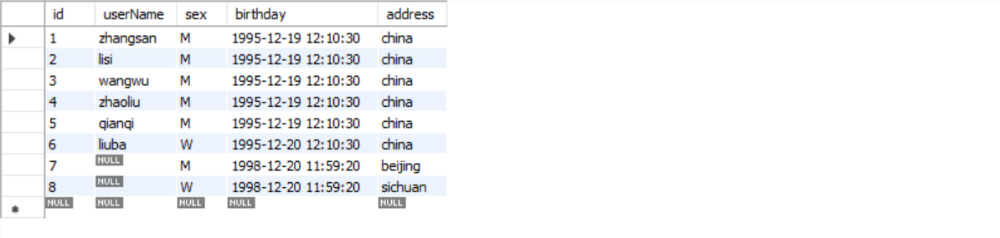
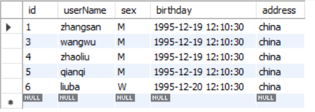
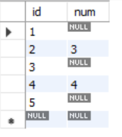
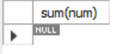
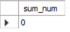

1. count(1)与count(*)得到的结果一致，包含null值。
2. count(字段)不计算null值
3. count(null)结果恒为0

如果某列存在 NULL 值时，就是用 count(*) 进行数据统计。


> [(122条消息) mysql 对于count null处理\_MySQL为Null会导致5个问题，个个致命！\_weixin\_39966740的博客-CSDN博客](https://blog.csdn.net/weixin_39966740/article/details/113385751?spm=1001.2101.3001.6661.1&utm_medium=distribute.pc_relevant_t0.none-task-blog-2%7Edefault%7ECTRLIST%7ERate-1-113385751-blog-48393513.pc_relevant_multi_platform_whitelistv3&depth_1-utm_source=distribute.pc_relevant_t0.none-task-blog-2%7Edefault%7ECTRLIST%7ERate-1-113385751-blog-48393513.pc_relevant_multi_platform_whitelistv3&utm_relevant_index=1)
1. count 数据丢失

阿里巴巴《Java开发手册》强制规定：不要使用 count(列名) 或 count(常量) 来替代 count( )，count( ) 是 SQL92 定义的标准统计行数的语法，跟数据库无关，跟 NULL 和非 NULL 无关。

说明：count(*) 会统计值为 NULL 的行，而 count(列名) 不会统计此列为 NULL 值的行。（count(1) 行不为 null 会统计，count(字段) 字段为 null 不会统计）

2. distinct 数据丢失 

```mysql
select * from user; -- 可以看到数据有 8 行。
```


```mysql
select distinct userName, sex from user; -- 八行
```

但是使用 distinct然后count，只有6行。即使 username 为 null 的时候 sex 不为 null。
```mysql
select count(distinct userName, sex) from user; -- 6 行
```
> todo 可能还是因为count 统计的原因。可以代码中用游标测试一下，能不能取到username为空的行。
3. select 数据丢失

如果某列存在 NULL 值时，如果执行非等于查询(<>/!=)会导致为 NULL 值的结果丢失。
```mysql
select * from user where username<>'lisi';
```


要解决以上的问题，只需要在查询结果中拼加上为 NULL 值的结果即可，
```mysql
select * from user where username<>'lisi' or isnull(username);
```


4. sum 统计

```mysql
CREATE TABLE `orderitem` (
id INT PRIMARY KEY auto_increment,
num int
) ENGINE= 'innodb';
insert into  orderitem values();
insert into  orderitem values(2,3);
insert into  orderitem values();
insert into  orderitem values(4,4);
insert into  orderitem values(5,null);
select * from orderitem; 
```

```mysql
select sum(num) from orderitem where id >4;
-- 结果为 null，在代码中可能引发空指针
```


```mysql
-- 网上的而一些解决办法
select ifnull(sum(num),0) as sum_num from orderitem where id >4;

select coalesce(sum(num),0) as sum_num from orderitem where id >4;

select 
case when isnull(sum(num)) then 0 
else sum(num) 
end 
as sum_num from orderitem where id >4;
-- 备注：这三种方法的结果稍微有点不一样，方法1和方法2的结果精确度可以在第二个参数中定义。
-- case when函数相当于一个判断语句，返回的结果可以定义成0，也可以定义成其他字母甚至汉字。
```

> 参考：[Mysql中的sum函数为null时的解决办法 - 爱码网](https://www.likecs.com/show-307834123.html)

5. min(), max() 等函数会忽略空值。

6. 增加了查询难度

当某列值中有 NULL 值时，在进行 NULL 值或者非 NULL 值的查询难度就增加了。

所谓的查询难度增加指的是当进行 NULL 值查询时，必须使用 NULL 值匹配的查询方法，比如 IS NULL 或者 IS NOT NULL 又或者是 IFNULL(cloumn) 这样的表达式进行查询，而传统的 =、!=、<>... 等这些表达式就不能使用了，这就增加了查询的难度，尤其是对小白程序员来说，接下来我们来演示一下这些问题。

错误用法：
```mysql
 select* fromperson wherename<> null;
 select* fromperson wherename != null;
```

正确用法
```mysql
 select* fromperson where name is not null;
 select* fromperson where !isnull(name);
```

然后我们用 explain 来分析查询计划，看当 name 中有 NULL 值时是否会影响索引的选择。

