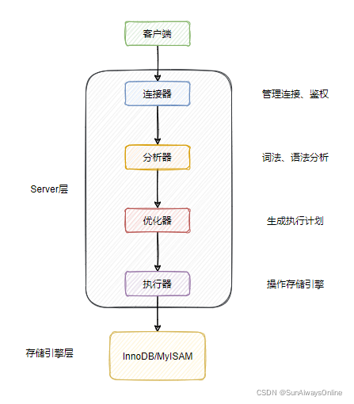

[(125条消息) 简单谈谈MySQL的两阶段提交\_SunAlwaysOnline的博客-CSDN博客](https://blog.csdn.net/qq_33591903/article/details/122030252)

## 一、简单回顾三种日志

在讲解两阶段提交之前，需要对MySQL中的三种日志即binlog、redo log与undo log有一定的了解。

在这三种日志中，很多同学会把binlog与redo log混淆，下面使用一张表格来简单对比下两者的区别。

当然，如果对binlog与redo log有更深的兴趣，可以参考我的另外一篇文章[数据库日志——binlog、redo log、undo log扫盲](https://blog.csdn.net/qq_33591903/article/details/120517405 "数据库日志——binlog、redo log、undo log扫盲")

这边只要记住两者的归属于适用场景即可，binlog适用于维护集群内数据的一致性，而redo log用于崩溃恢复。

undo log相对于前面两种日志更好理解些，就是为了回滚事务用的。

MVCC原理其实就是undo log版本链与ReadView的结合，想要弄清楚如何在快照读的情况下实现事务之间的隔离性，可以移步我的这篇文章[通俗易懂的MySQL事务及MVCC原理，我先收藏了！](https://blog.csdn.net/qq_33591903/article/details/120927753 "通俗易懂的MySQL事务及MVCC原理，我先收藏了！")

___

## 二、一条语句的执行过程

先从整体的角度来观测某件事物，可以避免一上来就陷入局部的泥潭当中。

MySQL分为Server层与存储引擎层，Server层包括连接器、分析器、优化器于执行器等。

而存储引擎层被设计为支持可插拔式，可以支持InnoDB、MyISAM等存储引擎。

一般来说，一条语句，不论是查询还更新，都会走以下的流程。

这部分不是本文的重点，就简单说下各个组件的作用，大家有个印象就行。

**连接器**

用于和客户端建立连接，管理连接。检查连接中的用户名密码是否正确吗，以及是否对表有操作权限。

**分析器**

只要是进行词法、语法分析，区分sql关键词与非关键词，生成一颗语法树。如果生成语法树失败，则证明你的sql有语法错误。

之后对语法树进行一些剪枝操作，去除一些无用的条件等。

**优化器**

生成sql的执行计划，你可以使用explain来查看执行计划。

会基于某些规则来选择走的索引项，在取样的时候可能会存在误差，可是使用force index来强制走某条索引。

**执行器**

依据执行计划，调用存储引擎的接口，来实现对数据的读写操作。

我们会在下一小节中，简单讲述执行器和存储引擎在两阶段提交中的交互流程。

___

## 三、两阶段提交

先看执行器与InnoDB引擎是如何更新一条指定的数据的：

可以看到，InnoDB在写redo log时，并不是一次性写完的，而有两个阶段，Prepare与Commit阶段，这就是"两阶段提交"的含义。

### **为什么要写redo log，不写redo log的话，根本就不会出现“两阶段提交”的麻烦事啊？**

先说结论：在于崩溃恢复。

MySQL为了提升性能，引入了BufferPool缓冲池。查询数据时，先从BufferPool中查询，查询不到则从磁盘加载在BufferPool。

每次对数据的更新，也不总是实时刷新到磁盘，而是先同步到BufferPool中，涉及到的数据页就会变成脏页。

同时会启动后台线程，异步地将脏页刷新到磁盘中，来完成BufferPool与磁盘的数据同步。

如果在某个时间，MySQL突然崩溃，则内存中的BufferPool就会丢失，剩余未同步的数据就会直接消失。

虽然在更新BufferPool后，也写入了binlog中，但binlog并不具备crash-safe的能力。

因为崩溃可能发生在写binlog后，刷脏前。在主从同步的情况下，从节点会拿到多出来的一条binlog。

所以server层的binlog是不支持崩溃恢复的，只是支持误删数据恢复。InnoDB考虑到这一点，自己实现了redo log。

### **为什么要写两次redo log，写一次不行吗？**

先不谈到底写几次redo log合适，如果只写一次redo log会有什么样的问题呢？

redo log与binlog都写一次的话，也就是存在以下两种情况：

**先写binlog，再写redo log**

当前事务提交后，写入binlog成功，之后主节点崩溃。在主节点重启后，由于没有写入redo log，因此不会恢复该条数据。

而从节点依据binlog在本地回放后，会相对于主节点多出来一条数据，从而产生主从不一致。

**先写redo log，再写binlog**

当前事务提交后，写入redo log成功，之后主节点崩溃。在主节点重启后，主节点利用redo log进行恢复，就会相对于从节点多出来一条数据，造成主从数据不一致。

因此，只写一次redo log与binlog，无法保证这两种日志在事务提交后的一致性。

也就是无法保证主节点崩溃恢复与从节点本地回放数据的一致性。

### **在两阶段提交的情况下，是怎么实现崩溃恢复的呢？**

首先比较重要的一点是，在写入redo log时，会顺便记录XID，即当前事务id。在写入binlog时，也会写入XID。

如果在写入redo log之前崩溃，那么此时redo log与binlog中都没有，是一致的情况，崩溃也无所谓。

如果在写入redo log prepare阶段后立马崩溃，之后会在崩恢复时，由于redo log没有被标记为commit。于是拿着redo log中的XID去binlog中查找，此时肯定是找不到的，那么执行回滚操作。

如果在写入binlog后立马崩溃，在恢复时，由redo log中的XID可以找到对应的binlog，这个时候直接提交即可。

==总的来说，在崩溃恢复后，只要redo log不是处于commit阶段，那么就拿着redo log中的XID去binlog中寻找，找得到就提交，否则就回滚。==

在这样的机制下，两阶段提交能在崩溃恢复时，能够对提交中断的事务进行补偿，来确保redo log与binlog的数据一致性。
