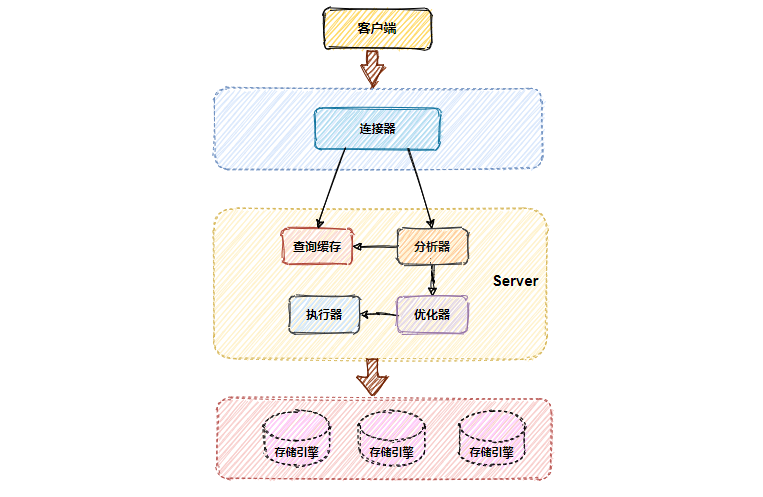
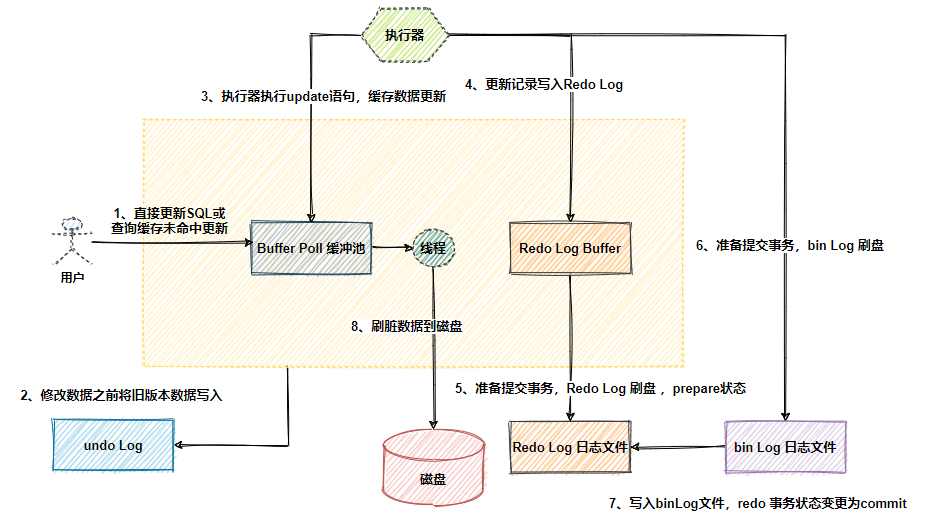

[美团一面：聊聊MySQL的七种日志](https://mp.weixin.qq.com/s/IWdqFq9ZtWug-M5pWxPCUQ)


最近，一位小伙伴面试了 美团，遇到了一个 MySQL 日志的面试题：

**聊聊，MySQL七种日志 。**

可惜，这个小伙只能说出其中的4中，其他的3种没有答上来，

**所以， 导致他一面挂了，非常可惜**

以上题目以答案，收入最新的 4000页的 《尼恩Java面试宝典》PDF，供后面的小伙伴参考

## MySQL的七种日志 面试题的出现形式：

-   聊聊，MySQL的七种日志
    
-   聊聊，MySQL的日志有哪些，具体的功能和作用如何
    

## 七种日志 参考答案

-   **错误日志（error log）**
    

error log主要记录MySQL在启动、关闭或者运行过程中的错误信息，在MySQL的配置文件my.cnf中，

可以通过log-error=/var/log/mysqld.log 执行mysql错误日志的位置。

-   **慢查询日志（slow query log）**
    
-   MySQL的慢查询日志是MySQL提供的一种日志记录，它用来记录在MySQL中响应时间超过阀值的语句，具体指运行时间超过long\_query\_time值的SQL，则会被记录到慢查询日志中。
    
-   具体指运行时间超过long\_query\_time值的SQL，则会被记录到慢查询日志中。long\_query\_time的默认值为10，意思是运行10秒以上的语句。
    
-   由他来查看哪些SQL超出了我们的最大忍耐时间值，比如一条sql执行超过5秒钟，我们就算慢SQL，希望能收集超过5秒的sql，结合之前explain进行全面分析
    
-   在生产环境中，如果要手工分析日志，查找、分析SQL，显然是个体力活，MySQL提供了日志分析工具mysqldumpslow。
    
-   **一般查询日志（general log）**
    

general log 记录了客户端连接信息以及执行的SQL语句信息，包括客户端何时连接了服务器、客户端发送的所有`SQL`以及其他事件，比如 `MySQL` 服务启动和关闭等等。

-   **重写日志（redo log）**
    
    **redo log** 属于MySQL存储引擎**InnoDB**的事务日志。
    
-   **回滚日志（undo log）**
    
    **undo log**属于逻辑日志，如其名主要起到回滚的作用，它是保证事务原子性的关键。
    
-   **二进制日志（bin log）**
    
    **bin log**是一种数据库Server层（和什么引擎无关），以二进制形式存储在磁盘中的逻辑日志。
    

## 七种日志的详细分析

进入正题前，可以先简单介绍一下，MySQL的逻辑架构，



MySQL的逻辑架构大致可以分为三层：

-   第一层：处理客户端连接、授权认证，安全校验等。
    
-   第二层：服务器`server`层，负责对SQL解释、分析、优化、执行操作引擎等。
    
-   第三层：存储引擎，负责MySQL中数据的存储和提取。
    

我们要知道MySQL的服务器层是不管理事务的，事务是由存储引擎实现的，

而MySQL中支持事务的存储引擎又属`InnoDB`使用的最为广泛，

所以后续文中提到的存储引擎都以`InnoDB`为主。

而且，可以再简单介绍一下，MySQL数据更新流程，作为铺垫，具体如下图：



### 1、redo log（重做日志）

**redo log** 属于MySQL存储引擎**InnoDB**的事务日志。

MySQL如何减少磁盘IO呢？

如果每次读写数据都需做磁盘IO操作，如果并发场景下性能就会很差。MySQL提供了一个优化手段，引入缓存**Buffer Pool**。

**Buffer Pool**缓存中包含了磁盘中**部分**数据页（**page**）的映射，以此来缓解数据库的磁盘压力。

有了**Buffer Pool**缓存后，读取数据先缓存再磁盘，首先从缓存中读取，如果缓存中没有，则从磁盘读取后放入缓存；

写入数据也是先缓存再磁盘，先向缓存写入，此时缓存中的数据页数据变更，这个数据页称为**脏页**，**MYSQL**会按照设定的更新策略，将脏Page页定期刷到磁盘中，这个过程称为**刷脏页**。

#### 1.1 redo log如何保证数据不丢失 ，实现高可靠，实现事务持久性 ？

如果刷脏页还未完成，可MySQL由于某些原因宕机重启，此时**Buffer Pool**中修改的数据还没有及时的刷到磁盘中，就会导致数据丢失，无法保证事务的持久性。

为了解决这个问题引入了**redo log**，redo Log如其名侧重于重做！

它记录的是数据库中**每个页**的修改，而不是某一行或某几行修改成怎样，可以用来恢复提交后的物理数据页，且只能恢复到最后一次提交的位置。

**redo log**用到了**WAL**（Write-Ahead Logging）技术，这个技术的核心就在于修改记录前，一定要先写日志，并保证日志先落盘，才能算事务提交完成。

有了**redo log**再修改数据时，InnoDB引擎会把更新记录先写在redo log中，再修改**Buffer Pool**中的数据，

当提交事务时，调用**fsync**把redo log刷入磁盘。

至于缓存中更新的数据文件何时刷入磁盘，则由后台线程异步处理。

**注意**：此时redo log的事务状态是**prepare**，还未真正提交成功，要等**bin log**日志写入磁盘完成才会变更为**commit**，事务才算真正提交完成。

这样一来即使刷脏页之前MySQL意外宕机也没关系，只要在重启时解析redo log中的更改记录进行重放，重新刷盘即可。

#### 1.2 redo log 大小固定

redo log采用固定大小，循环写入的格式，当redo log写满之后，重新从头开始如此循环写，形成一个环状。

那为什么要如此设计呢？

因为redo log记录的是数据页上的修改，如果**Buffer Pool**中数据页已经刷磁盘后，那这些记录就失效了，新日志会将这些失效的记录进行覆盖擦除。


上图中的**write pos**表示redo log当前记录的日志序列号**LSN**(log sequence number)，写入还未刷盘，循环往后递增；

**check point**表示redo log中的修改记录已刷入磁盘后的LSN，循环往后递增，这个LSN之前的数据已经全落盘。

**write pos**到**check point**之间的部分是redo log空余的部分（绿色），用来记录新的日志；

**check point**到**write pos**之间是redo log已经记录的数据页修改数据，此时数据页还未刷回磁盘的部分。

当**write pos**追上**check point**时，会先推动**check point**向前移动，空出位置（刷盘）再记录新的日志。

> **注意**：redo log日志满了，在擦除之前，需要确保这些要被擦除记录对应在内存中的数据页都已经刷到磁盘中了。擦除旧记录腾出新空间这段期间，是不能再接收新的更新请求的，此刻MySQL的性能会下降。所以在并发量大的情况下，合理调整redo log的文件大小非常重要。

#### 1.3 crash-safe

因为redo log的存在使得**Innodb**引擎具有了**crash-safe**的能力，即MySQL宕机重启，系统会自动去检查redo log，将修改还未写入磁盘的数据从redo log恢复到MySQL中。

MySQL启动时，不管上次是正常关闭还是异常关闭，总是会进行恢复操作。

会先检查数据页中的**LSN**，如果这个 LSN 小于 redo log 中的LSN，即**write pos**位置，说明在**redo log**上记录着数据页上尚未完成的操作，接着就会从最近的一个**check point**出发，开始同步数据。

简单理解，比如：redo log的**LSN**是500，数据页的`LSN`是300，表明重启前有部分数据未完全刷入到磁盘中，那么系统则将redo log中**LSN**序号300到500的记录进行重放刷盘。

' fill='%23FFFFFF'%3E%3Crect x='249' y='126' width='1' height='1'%3E%3C/rect%3E%3C/g%3E%3C/g%3E%3C/svg%3E)

### 2\. undo log（回滚日志）

**undo log**也是属于MySQL存储引擎InnoDB的事务日志。**undo log**属于逻辑日志，如其名主要起到回滚的作用，它是保证事务原子性的关键。

undo log 是innodb引擎的一种日志，在事务的修改记录之前，会把该记录的原值（before image）先保存起来再做修改，原来的值就是 undo log，以便修改过程中出错能够 恢复原值或者其他的事务 读取。

**undo log** 作用：

1、用于数据的回滚。比如数据执行时候发生错误，操作系统的错误，断点等，程序员手动rollback等操作场景都会用到数据的回滚。

2、实现MVCC。即在InnoDB存储引擎中MVCC的实现是通过undo来完成。当用户读取一行记录时，若该记录已经被其他事务占用，当前事务可以通过undo读取之前的行版本信息，以此实现非锁定读取。

**undo log** 日志记录细节：

每当我们要对一条记录做改动时(这里的改动可以指INSERT、DELETE、UPDATE)，都需要"留一手"把回滚时所需的东西记下来。比如:

1、插入一条记录时，至少要把这条记录的主键值记下来，之后回滚的时候只需要把这个主键值对应的记录删掉就好了。(对于每个INSERT， InnoDB存储引擎会完成一个DELETE)

2、删除了一条记录，至少要把这条记录中的内容都记下来，这样之后回滚时再把由这些内容组成的记录插入到表中就好了。(对于每个DELETE,InnoDB存储引擎会执行一个INSERT)

3、修改了一条记录，至少要把修改这条记录前的旧值都记录下来，这样之后回滚时再把这条记录更新为旧值就好了。(对于每个UPDATE，InnoDB存储引擎会执行一个相反的UPDATE，将修改前的行放回去)

那可能有人会问：同一个事物内的一条记录被多次修改，那是不是每次都要把数据修改前的状态都写入**undo log**呢？

答案是不会的！

**undo log**只负责记录事务开始前要修改数据的原始版本，当我们再次对这行数据进行修改，所产生的修改记录会写入到**redo log**，**undo log**负责完成回滚，**redo log**负责完成前滚。

**回滚和前滚的区别**

#### 2.1 回滚

未提交的事务，即事务未执行`commit`。

但该事务内修改的脏页中，可能有一部分脏块已经刷盘。

如果此时数据库实例宕机重启，就需要用回滚来将先前那部分已经刷盘的脏块从磁盘上撤销。

#### 2.2 前滚

未完全提交的事务，即事务已经执行**commit**，但该事务内修改的脏页中只有一部分数据被刷盘，另外一部分还在**buffer pool**缓存上，

如果此时数据库实例宕机重启，就需要用前滚来完成未完全提交的事务。

将先前那部分由于宕机在内存上的未来得及刷盘数据，从**redo log**中恢复出来并刷入磁盘。

> 数据库实例恢复时，先做前滚，后做回滚。

**undo log、redo log、bin log**三种日志都是在刷脏页之前就已经刷到磁盘了的，

三种日志，相互协作最大限度保证了用户提交的数据不丢失。

### 3\. bin log（归档日志）

**bin log**是一种数据库Server层（和什么引擎无关），以二进制形式存储在磁盘中的逻辑日志。

**bin log**记录了数据库所有`DDL`和`DML`操作（不包含 `SELECT` 和 `SHOW`等命令，因为这类操作对数据本身并没有修改）。

**1、MySQL的二进制日志binlog可以说是MySQL最重要的日志，它记录了所有的DDL和DML语句（除了数据查询语句select）,以事件形式记录，还包含语句所执行的消耗的时间，MySQL的二进制日志是事务安全型的。**

a、DDL：Data Definition Language 数据库定义语言 

主要的命令有create、alter、drop等，ddl主要是用在定义或改变表(table)的结构,数据类型，表之间的连接和约束等初始工作上，他们大多在建表时候使用。

b、DML：Data Manipulation Language 数据操纵语言

主要命令是slect,update,insert,delete,就像它的名字一样，这4条命令是用来对数据库里的数据进行操作的语言

**2、mysqlbinlog常见的选项有一下几个：**

a、--start-datetime：从二进制日志中读取指定等于时间戳或者晚于本地计算机的时间

b、--stop-datetime：从二进制日志中读取指定小于时间戳或者等于本地计算机的时间 取值和上述一样

c、--start-position：从二进制日志中读取指定position 事件位置作为开始。

d、--stop-position：从二进制日志中读取指定position 事件位置作为事件截至

**3、一般来说开启binlog日志大概会有1%的性能损耗。**

**4、binlog日志有两个最重要的使用场景。**

a、mysql主从复制：mysql replication在master端开启binlog,master把它的二进制日志传递给slaves来达到master-slave数据一致的目的。

b、数据恢复：通过mysqlbinlog工具来恢复数据。

**binlog日志包括两类文件：**

1)、二进制日志索引文件(文件名后缀为.index)用于记录所有的二进制文件。

2)、二进制日志文件(文件名后缀为.00000\*)记录数据库所有的DDL和DML(除了数据查询语句select)语句事件。

可以通过以下命令查看二进制日志是否开启：

```
mysql> SHOW VARIABLES LIKE 'log_bin';+---------------+-------+| Variable_name | Value |+---------------+-------+| log_bin       | OFF   |+---------------+-------+
```

**bin log**也被叫做**归档日志**，因为它不会像**redo log**那样循环写擦除之前的记录，而是会一直记录日志。

一个**bin log**日志文件默认最大容量`1G`（也可以通过**max\_binlog\_size**参数修改），单个日志超过最大值，则会新创建一个文件继续写。

```
mysql> show binary logs;+-----------------+-----------+| Log_name        | File_size |+-----------------+-----------+| mysq-bin.000001 |      8687 || mysq-bin.000002 |      1445 || mysq-bin.000003 |      3966 || mysq-bin.000004 |       177 || mysq-bin.000005 |      6405 || mysq-bin.000006 |       177 || mysq-bin.000007 |       154 || mysq-bin.000008 |       154 |
```

**bin log**日志的内容格式其实就是执行SQL命令的反向逻辑，这点和**undo log**有点类似。一般来说开启**bin log**都会给日志文件设置过期时间（**expire\_logs\_days**参数，默认永久保存），要不然日志的体量会非常庞大。

```
mysql> show variables like 'expire_logs_days';+------------------+-------+| Variable_name    | Value |+------------------+-------+| expire_logs_days | 0     |+------------------+-------+1 row in set mysql> SET GLOBAL expire_logs_days=30;Query OK, 0 rows affected
```

**bin log**主要应用于MySQL主从模式（**master-slave**）中，主从节点间的数据同步；以及基于时间点的数据还原。

#### 3.1 主从同步

通过下图MySQL的主从复制过程，来了解下**bin log**在主从模式下的应用。

' fill='%23FFFFFF'%3E%3Crect x='249' y='126' width='1' height='1'%3E%3C/rect%3E%3C/g%3E%3C/g%3E%3C/svg%3E)

-   用户在主库**master**执行`DDL`和`DML`操作，修改记录顺序写入**bin log**;
    
-   从库**slave**的I/O线程连接上Master，并请求读取指定位置**position**的日志内容;
    
-   **Master**收到从库**slave**请求后，将指定位置**position**之后的日志内容，和主库bin log文件的名称以及在日志中的位置推送给从库;
    
-   slave的I/O线程接收到数据后，将接收到的日志内容依次写入到**relay log**文件最末端，并将读取到的主库bin log文件名和位置**position**记录到**master-info**文件中，以便在下一次读取用;
    
-   slave的SQL线程检测到**relay log**中内容更新后，读取日志并解析成可执行的SQL语句，这样就实现了主从库的数据一致;
    

#### 3.2 基于时间点还原

我们看到**bin log**也可以做数据的恢复，而**redo log**也可以，那它们有什么区别？

-   层次不同：redo log 是InnoDB存储引擎实现的，bin log 是MySQL的服务器层实现的，但MySQL数据库中的任何存储引擎对于数据库的更改都会产生bin log。
    
-   作用不同：redo log 用于碰撞恢复（**crash recovery**），保证MySQL宕机也不会影响持久性；bin log 用于时间点恢复（**point-in-time recovery**），保证服务器可以基于时间点恢复数据和主从复制。
    
-   内容不同：redo log 是物理日志，内容基于磁盘的页**Page**；bin log的内容是二进制，可以根据**binlog\_format**参数自行设置。
    
-   写入方式不同：redo log 采用循环写的方式记录；binlog 通过追加的方式记录，当文件大小大于给定值后，后续的日志会记录到新的文件上。
    
-   刷盘时机不同：bin log在事务提交时写入；redo log 在事务开始时即开始写入。
    

bin log 与 redo log 功能并不冲突而是起到相辅相成的作用，需要二者同时记录，才能保证当数据库发生宕机重启时，数据不会丢失。

### 4\. relay log（中继日志）

**relay log**日志文件具有与**bin log**日志文件相同的格式，从上边MySQL主从复制的流程可以看出，

**relay log**起到一个中转的作用，**slave**先从主库**master**读取二进制日志数据，写入从库本地，后续再异步由**SQL线程**读取解析**relay log**为对应的SQL命令执行。

### 5\. slow query log

慢查询日志（**slow query log**）在 SQL 优化过程中会经常使用到。通过慢查询日志，我们可以查找出哪些查询语句的执行效率低，耗时严重。

MySQL 的慢查询日志，用来记录在 MySQL 中响应时间超过阀值的语句，具体指运行时间超过 long\_query\_time 值的 SQL，则会被记录到慢查询日志中。long\_query\_time 的默认值为 10，意思是运行 10 秒以上 (不含 10 秒) 的语句，认为是超出了我们的最大忍耐时间值。

它的主要作用是，帮助我们发现那些执行时间特别长的 SQL 查询，并且有针对性地进行优化，从而提高系统的整体效率。当我们的数据库服务器发生阻塞、运行变慢的时候，检查一下慢查询日志，找到那些慢查询，对解决问题很有帮助。比如一条 sq | 执行超过 5 秒钟，我们就算慢 SQL，希望能收集超过 5 秒的 sql，结合 explain 进行全面分析。

默认情况下，MySQL 数据库没有开启慢查询日志，需要我们手动来设置这个参数。如果不是调优需要的话，一般不建议启动该参数，因为开启慢查询日志会或多或少带来一定的性能影响

出于性能方面的考虑，一般只有在排查慢SQL、调试参数时才会开启，默认情况下，慢查询日志功能是关闭的。可以通过以下命令查看是否开启慢查询日志：  

```
mysql> SHOW VARIABLES LIKE 'slow_query%';+---------------------+--------------------------------------------------------+| Variable_name       | Value                                                  |+---------------------+--------------------------------------------------------+| slow_query_log      | OFF                                                    || slow_query_log_file | /usr/local/mysql/data/iZ2zebfzaequ90bdlz820sZ-slow.log |+---------------------+--------------------------------------------------------+
```

通过如下命令开启慢查询日志后，我发现 **iZ2zebfzaequ90bdlz820sZ-slow.log** 日志文件里并没有内容啊，可能因为我执行的 SQL 都比较简单没有超过指定时间。

```
mysql>  SET GLOBAL slow_query_log=ON;Query OK, 0 rows affected
```

上边提到超过 **指定时间** 的查询语句才算是慢查询，那么这个时间阈值又是多少嘞？我们通过 **long\_query\_time** 参数来查看一下，发现默认是 10 秒。

```
mysql>  SET GLOBAL slow_query_log=ON;Query OK, 0 rows affected
```

这里我们将 **long\_query\_time** 参数改小为 0.001秒再次执行查询SQL，看看慢查询日志里是否有变化。

```
mysql> SET GLOBAL long_query_time=0.001;Query OK, 0 rows affected
```

果然再执行 SQL 的时，执行时间大于 0.001秒，发现慢查询日志开始记录了。

' fill='%23FFFFFF'%3E%3Crect x='249' y='126' width='1' height='1'%3E%3C/rect%3E%3C/g%3E%3C/g%3E%3C/svg%3E)

### 6\. general query log

一般查询日志（general query log）：

MySQL服务器会按照它接收到语句的先后顺序写入日志文件。

由于一般查询日志记录的内容过于详细，开启后 Log 文件的体量会非常庞大，

所以出于对性能的考虑，默认情况下，该日志功能是关闭的，

通常会在排查故障需获得详细日志的时候才会临时开启。

我们可以通过以下命令查看一般查询日志是否开启，命令如下：

```
mysql> show variables like 'general_log';+---------------+-------+| Variable_name | Value |+---------------+-------+| general_log   | OFF   |+---------------+-------+
```

下边开启一般查询日志并查看日志存放的位置。

```
mysql> SET GLOBAL general_log=on;Query OK, 0 rows affectedmysql> show variables like 'general_log_file';+------------------+---------------------------------------------------+| Variable_name    | Value                                             |+------------------+---------------------------------------------------+| general_log_file | /usr/local/mysql/data/iZ2zebfzaequ90bdlz820sZ.log |+------------------+---------------------------------------------------+
```

执行一条查询 SQL 看看日志内容的变化。

```
mysql> select * from t_config;+---------------------+------------+---------------------+---------------------+| id                  | remark     | create_time         | last_modify_time    |+---------------------+------------+---------------------+---------------------+| 1325741604307734530 | 我是广播表 | 2020-11-09 18:06:44 | 2020-11-09 18:06:44 |+---------------------+------------+---------------------+---------------------+
```

我们看到日志内容详细的记录了所有执行的命令、SQL、SQL的解析过程、数据库设置等等。

' fill='%23FFFFFF'%3E%3Crect x='249' y='126' width='1' height='1'%3E%3C/rect%3E%3C/g%3E%3C/g%3E%3C/svg%3E)

### 7\. error log

错误日志（**error log**）:

错误日志（Error Log）是 MySQL 中最常用的一种日志，主要记录 MySQL 服务器启动和停止过程中的信息、服务器在运行过程中发生的故障和异常情况等。

默认情况下，该日志功能是开启的，通过如下命令查找错误日志文件的存放路径。

```
mysql> SHOW VARIABLES LIKE 'log_error';+---------------+----------------------------------------------------------------+| Variable_name | Value                                                          |+---------------+----------------------------------------------------------------+| log_error     | /usr/local/mysql/data/LAPTOP-UHQ6V8KP.err |+---------------+----------------------------------------------------------------+
```

作为初学者，要学会利用错误日志来定位问题。

一般情况下，错误日志存储在 MySQL 数据库的数据文件夹下，通常名称为 hostname.err。

其中，hostname 表示 MySQL 服务器的主机名。

在 MySQL 配置文件中，错误日志所记录的信息可以通过 log-error 和 log-warnings 来定义，其中，log-err 定义是否启用错误日志功能和错误日志的存储位置，log-warnings 定义是否将警告信息也记录到错误日志中。

将 log\_error 选项加入到 MySQL 配置文件的 \[mysqld\] 组中，形式如下：

\[mysqld\]

log-error=dir/{filename}

其中，dir 参数指定错误日志的存储路径；filename 参数指定错误日志的文件名；省略参数时文件名默认为主机名，存放在 Data 目录中。

重启 MySQL 服务后，参数开始生效，可以在指定路径下看到 filename.err 的文件，如果没有指定 filename，那么错误日志将直接默认为 hostname.err。

注意：错误日志中记录的并非全是错误信息，例如 MySQL 如何启动 InnoDB 的表空间文件、如何初始化自己的存储引擎等，这些也记录在错误日志文件中。

**注意**：

错误日志中记录的可并非全是错误信息，

像 MySQL 如何启动 `InnoDB` 的表空间文件、如何初始化自己的存储引擎，初始化 `buffer pool` 等等，这些也记录在错误日志文件中。

' fill='%23FFFFFF'%3E%3Crect x='249' y='126' width='1' height='1'%3E%3C/rect%3E%3C/g%3E%3C/g%3E%3C/svg%3E)

End

此真题面试题，收录于《尼恩Java面试宝典》V30版

' fill='%23FFFFFF'%3E%3Crect x='249' y='126' width='1' height='1'%3E%3C/rect%3E%3C/g%3E%3C/g%3E%3C/svg%3E)

硬核面试题推荐            

-   [**阿里面试题：volatile 夺命 连环炮 ！答垮了就挂，非常重要！**](http://mp.weixin.qq.com/s?__biz=MzkxNzIyMTM1NQ==&mid=2247487598&idx=1&sn=1055d964f7711753169a6291c0781fc1&chksm=c142aaeaf63523fcd157149fa6c6afb5dd27bd71d403d8d6d00ab9731ff3831fb6f328a299e2&scene=21#wechat_redirect)  
    
-   大厂面试题[：Mysql 普通索引、唯一索引，底层区别竟然 这么大 ！！](http://mp.weixin.qq.com/s?__biz=MzkxNzIyMTM1NQ==&mid=2247487420&idx=1&sn=3b8a36365443989ad52797fb3f256250&chksm=c142b538f6353c2e594ddb391cc17bdba02ba48b76529daa1f8ad7729502fa0b4dc37cb78b27&scene=21#wechat_redirect)
    
-   [架构必备：10WQPS超高并发架构的10大思想](http://mp.weixin.qq.com/s?__biz=MzkxNzIyMTM1NQ==&mid=2247486628&idx=1&sn=357b84473f56a599712dcd73db41e42a&chksm=c142b620f6353f363579b495110ef1e3984408d41fe848af9f035107c08928dd9fb865cd6051&scene=21#wechat_redirect)
    
-   [**如何写简历：2023春招，让简历 人见人爱 的8大绝招 | 附100模板**](http://mp.weixin.qq.com/s?__biz=MzkxNzIyMTM1NQ==&mid=2247486482&idx=1&sn=c8509e44488590dcb0f4e5edd4308971&chksm=c142b696f6353f8026d20c8b6a609966c493377b6285e05749b16cd1c5f7c3f65209ccc3749e&scene=21#wechat_redirect)  
    
-   [**场景题：假设10W人突访，系统能不crash 吗？**](http://mp.weixin.qq.com/s?__biz=MzkxNzIyMTM1NQ==&mid=2247486423&idx=1&sn=fcab28ef08140f0ac5cdab03fb479582&chksm=c142b153f6353845112d7de1e060f44ac0ccb63abfbaddf1a3c3ce7fcc52f9574b4577888c2b&scene=21#wechat_redirect)  
    
-   [每天100w次登陆请求, 8G 内存该如何设置JVM参数？来看看年薪100W的架构师，是怎么配置的](http://mp.weixin.qq.com/s?__biz=MzkxNzIyMTM1NQ==&mid=2247486317&idx=1&sn=bb44e3c19cc77dd9fa117671fa5a2230&chksm=c142b1e9f63538ff54c6782f9a08ca67e7b06234e4cf7ed9c25c06ededdb190a892697e22fb8&scene=21#wechat_redirect)  
    

硬核文章推荐            

-   [**顶级、一流的Java 轮子 项目，在这 ！！**](http://mp.weixin.qq.com/s?__biz=MzkxNzIyMTM1NQ==&mid=2247487615&idx=1&sn=7b7976f36dc5817678ca322e28501e58&chksm=c142aafbf63523edabc2693be63c472eaa7af87f95000e1c03f81cd222b6fa2770bd4b9870be&scene=21#wechat_redirect)  
    
-   [一直写不好技术方案，原来是缺一份好模板！大厂的顶级模板，原来在这](http://mp.weixin.qq.com/s?__biz=MzkxNzIyMTM1NQ==&mid=2247487607&idx=1&sn=931ae314ea6bb6035ee8e6cfa9475e94&chksm=c142aaf3f63523e57b245ba1145e87d3cad095df9d9273d72dcbfc1781c9ed7b7ef3e4f205e8&scene=21#wechat_redirect)
    
-   [100w人在线的 弹幕 系统，是怎么架构的？](http://mp.weixin.qq.com/s?__biz=MzkxNzIyMTM1NQ==&mid=2247487578&idx=1&sn=1691379db2928ba49153f52f6fab950c&chksm=c142aadef63523c8b304d8e93687d85ce163043c8b4ef0c7c67ed9e473ec4df10f9871a0e197&scene=21#wechat_redirect)
    
-   [峰值21WQps、亿级DAU，小游戏《羊了个羊》是怎么架构的？](http://mp.weixin.qq.com/s?__biz=MzkxNzIyMTM1NQ==&mid=2247487443&idx=1&sn=604f42dc056410ad03ee59878afe1ade&chksm=c142b557f6353c41107f7a62d1e8e73a483769a8f39cb780bec1fa778a624ad2fc7de44dc6ee&scene=21#wechat_redirect)
    
-   [**2个大厂 100亿级 超大流量 红包 架构方案**](http://mp.weixin.qq.com/s?__biz=MzkxNzIyMTM1NQ==&mid=2247486998&idx=1&sn=24df4a3223bb8e71dc26e84827bbbe00&chksm=c142b492f6353d8449d1f354574f534cde70a308b25453e7922137df7d2fab3c2f2dda77eef7&scene=21#wechat_redirect)
    
-   [一文秒懂：多级时间轮，最顶尖的Java调度算法](http://mp.weixin.qq.com/s?__biz=MzkxNzIyMTM1NQ==&mid=2247485259&idx=1&sn=68763802596d99698d3956386b2d263e&chksm=c142bdcff63534d97f08725e20e217238266bebe0e11e73f9db848acd337cc6e3bdd0ab8b549&scene=21#wechat_redirect)  
    
-   [一文搞懂：缓存之王 Caffeine 架构、源码、原理（5W长文）](http://mp.weixin.qq.com/s?__biz=MzkxNzIyMTM1NQ==&mid=2247485218&idx=1&sn=125af2a5f356e97dd1bb939616ce9016&chksm=c142bda6f63534b0540412fef91513a33e7a0f1ecde60572618a970a2c9ae1b6ebae51416e24&scene=21#wechat_redirect)
    

硬核电子书            

[**👍**](http://mp.weixin.qq.com/s?__biz=MzkxNzIyMTM1NQ==&mid=2247484558&idx=4&sn=ace256db11ca343c860527c30492b0ad&chksm=c142be0af635371cd87a94318246353cfa1fe3a38910e186e42796c351d17d00024b10776095&scene=21#wechat_redirect)《[尼恩Java面试宝典](http://mp.weixin.qq.com/s?__biz=MzkxNzIyMTM1NQ==&mid=2247484558&idx=3&sn=3c498b0f8e3897e899acf154ad1ac8ee&chksm=c142be0af635371c06b830243517aae063e23814195df1cc75ab2123c5b3ab9cb1217cbd80e3&scene=21#wechat_redirect)》（极致经典，不断升级）**全网下载超过300万次**

[**👍**](http://mp.weixin.qq.com/s?__biz=MzkxNzIyMTM1NQ==&mid=2247484558&idx=4&sn=ace256db11ca343c860527c30492b0ad&chksm=c142be0af635371cd87a94318246353cfa1fe3a38910e186e42796c351d17d00024b10776095&scene=21#wechat_redirect)尼恩Java高并发三部曲：**全网下载超过200万次**

-   [**👍**](http://mp.weixin.qq.com/s?__biz=MzkxNzIyMTM1NQ==&mid=2247484558&idx=4&sn=ace256db11ca343c860527c30492b0ad&chksm=c142be0af635371cd87a94318246353cfa1fe3a38910e186e42796c351d17d00024b10776095&scene=21#wechat_redirect)《[Java高并发核心编程-卷1（加强版）](http://mp.weixin.qq.com/s?__biz=MzkxNzIyMTM1NQ==&mid=2247484558&idx=2&sn=9bc00924281da1785fe3f472e59eb035&chksm=c142be0af635371c77541a6634875fde3a7e6f512501e0a9de2e73b67e9d447d6b5e73b713f4&scene=21#wechat_redirect)》，不断升级
    
-   [**👍**](http://mp.weixin.qq.com/s?__biz=MzkxNzIyMTM1NQ==&mid=2247484558&idx=4&sn=ace256db11ca343c860527c30492b0ad&chksm=c142be0af635371cd87a94318246353cfa1fe3a38910e186e42796c351d17d00024b10776095&scene=21#wechat_redirect)《[Java高并发核心编程-卷2（加强版）](http://mp.weixin.qq.com/s?__biz=MzkxNzIyMTM1NQ==&mid=2247484558&idx=2&sn=9bc00924281da1785fe3f472e59eb035&chksm=c142be0af635371c77541a6634875fde3a7e6f512501e0a9de2e73b67e9d447d6b5e73b713f4&scene=21#wechat_redirect)》，不断升级
    
-   **👍**《[Java高并发核心编程-卷3（加强版）](http://mp.weixin.qq.com/s?__biz=MzkxNzIyMTM1NQ==&mid=2247484558&idx=2&sn=9bc00924281da1785fe3f472e59eb035&chksm=c142be0af635371c77541a6634875fde3a7e6f512501e0a9de2e73b67e9d447d6b5e73b713f4&scene=21#wechat_redirect)》，不断升级
    

[**👍**《顶级3高架构行业案例 + 尼恩架构笔记 》N 篇+](http://mp.weixin.qq.com/s?__biz=MzkxNzIyMTM1NQ==&mid=2247484558&idx=4&sn=ace256db11ca343c860527c30492b0ad&chksm=c142be0af635371cd87a94318246353cfa1fe3a38910e186e42796c351d17d00024b10776095&scene=21#wechat_redirect)，不断添加

[**👍**](http://mp.weixin.qq.com/s?__biz=MzkxNzIyMTM1NQ==&mid=2247484558&idx=4&sn=ace256db11ca343c860527c30492b0ad&chksm=c142be0af635371cd87a94318246353cfa1fe3a38910e186e42796c351d17d00024b10776095&scene=21#wechat_redirect)100份简历模板

' fill='%23FFFFFF'%3E%3Crect x='249' y='126' width='1' height='1'%3E%3C/rect%3E%3C/g%3E%3C/g%3E%3C/svg%3E)