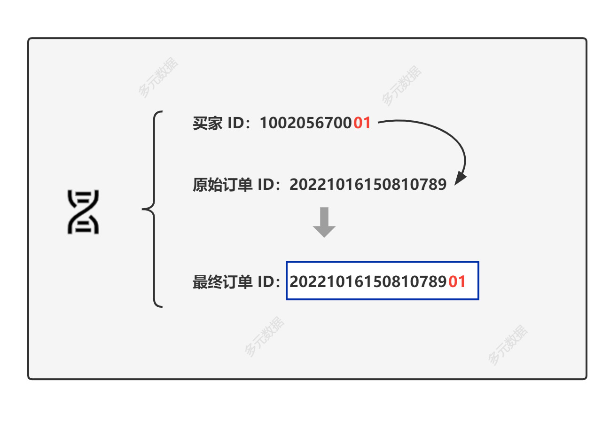
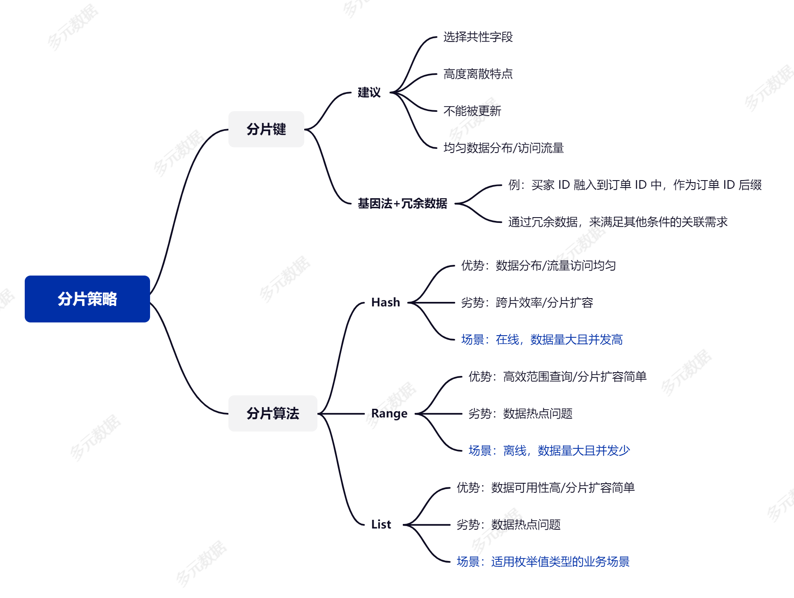

[(125条消息) Sharding | 数据分片策略：分片键和分片算法的选择\_代野的博客-CSDN博客](https://blog.csdn.net/daiyejava/article/details/127409237)

> 摘要：规划[分片](https://so.csdn.net/so/search?q=%E5%88%86%E7%89%87&spm=1001.2101.3001.7020)策略的过程需要考虑较多的问题，本文简单地概括了分片键应具有的特性，以及常见分片算法的特点。

[Sharding](https://so.csdn.net/so/search?q=Sharding&spm=1001.2101.3001.7020) 作为海量存储高并发沙场中的制胜利器，制定合理的 Sharding 策略会为系统提供强有力的性能保障，选择合适的分片键和分片算法，是分片策略规划中的重要工作。**由于业务特点各不相同，分片键和分片算法的选择没有绝对统一的模板。**

本文聚焦于分片键和分片算法话题，因此这里不再展开 Sharding 的概念，对于多数业务场景，[分库分表](https://so.csdn.net/so/search?q=%E5%88%86%E5%BA%93%E5%88%86%E8%A1%A8&spm=1001.2101.3001.7020)的规划方案回顾如下：

-   **数据量大，选分表；**
-   **并发高，选分库；**
-   **海量存储+高并发，分库+分表。**

### **何时去分表？**

当潜意识里有要做分表的想法时，您当前或许遇到了单表过大、数据检索慢以及业务抱怨等问题，需要对系统进行优化。业内关于“单表过千万”、“数百 G”则需要分表的说法，其实不完全准确。以 MySQL 为例，生产中单表数千万记录并不是个例，它没有那么脆弱，合理的架构设计也可有效提升数据检索压力，如优化索引、历史数据归档、引入缓存方案以及启用读写分离策略等。

当数据量激增，以上优化方案均不奏效时，那么是时候请“分表”出场了，单片容量无固定限制，结合测试结果，满足效率和预留空间需求即可。**分表的时机不取决于经验之谈，而是取决于业务效率**。

### **何时去分库？**

分表概念外，还有一个概念是分库，也总是有朋友会纠结，我到底是否需要分库。分库的底层逻辑是，通过多台服务器来承接更多的业务流量，给系统提供更多的连接支持。因此，对于一个并发不高的系统，我们通过分表解决数据量大的问题即可，无需分库。如果业务发展迅猛，现有架构难以支撑更多的用户，则要考虑去做分库。可按照业务模块进行分库，也可以对大表进行跨库拆分。**分库解决的是高并发的需求**。

### **分库+分表**

分库分表即分布式数据库解决方案，它**解决了海量数据高并发业务场景下，单体数据库的计算效率、存储容量及扩展问题**。

Sharding 定位为利器的同时，它也存在一定的使用门槛，需要放弃一些数据库原生支持的能力，取舍由业务情况而定。由于 Sharding 相对复杂的特点，**选择合适的分片键和分片策略，是分布式改造良好开端必不可少的两要素**。

## 如何选择分片键（Sharding Key）

分片键也称为 **Sharding key**，是数据库拆分时的关键字段，我更愿把它理解为\*\*“锚点”\*\*，每一条数据都有自己的一个锚点，在对数据做 Sharding 的过程中，数据锚点的选择至关重要，直接影响我们对数据分而治之的效率。

关于分片键的选择，我们需要**选择具有共性的字段是最基本的要求，也是就尽量能覆盖绝大多数查询场景**。同时分片键也应具有足够庞大的基数以及唯一性，从而使 Shard 可**灵活规划**，具备较好的扩展性。举个反例，如果选取布尔类型的字段为分片键，那么分片最多只能存在两份，这就陷入了非常尴尬的局面，基本失去了 Sharding 的意义。

## 分片键的选择建议

1.  选择具有共性的字段作为分片键，即查询中高频出现的条件字段；
2.  分片字段应具有高度离散的特点，分片键的内容不能被更新；
3.  可均匀各分片的数据存储和读写压力，避免片内出现热点数据；
4.  尽量减少单次查询所涉及的分片数量，降低数据库压力；
5.  最后，不要更换分片键，更换分片键需重分布数据，代价较大。

## 基因法+冗余数据

这里来思考一个在超大规模的电商场景中，使用订单 ID 和买家 ID 查询数据的问题。大规模电商场景每日会产生海量的交易订单，在这个场景中，我们选择使用订单 ID 作为分片键是一个没有异议的选择。那么此时，我们通过 APP 来查询自己的订单时，查询条件变为了分片键之外的买家 ID，默认情况下，查询语句中不带有分片键会导致全路由情况。面对这样的情况，应如何设计一个高效的分片策略？

大厂常常使用的方案是==基因法==，即**将买家 ID 融入到订单 ID 中，作为订单 ID 后缀**。这样，指定买家的所有订单就会与其订单在同一分片内了，如下图所示。

> 最终订单 ID：原始订单 ID+买家 ID % 100 -->20221016150810789**01**

本文的编写时间是 2022 年 10 月中旬，当前淘宝订单编号是 19 位数字，如果现在方便看下您的淘宝的订单，会发现所有订单编号后 6 位是完全一样的，这正是使用基因法分片键的方案。

最后再加一个问题，电商场景除了订单和买家外，还有一个高频条件是卖家 ID，如果想按照卖家 ID 查询数据又该如何处理？

可以考虑做数据冗余的方案，即广播表（或克隆表）技术，在每个片上都存有一份相同的卖家数据，用空间换取效率。对于超大规模的电商场景，使用基因法+冗余数据的方案即可处理绝大部分订单、买家和卖家的请求。对于其他检索条件以及大型卖家的场景，补充参考如下。

1.  对于检索条件不包含订单 ID、买家 ID 和 卖家 ID 的查询，使用 ES 方案解决；
2.  对于大型卖家的数据，可规划单独的库/表，或进一步拆分映射成多个虚拟商家，来避免热点。

## 分片算法

常见分片算法如 Hash、Range 和 List，用户也可以组合使用，或考虑结合业务定制分片算法。分片是为了让请求检索较少的数据和承载更多的流量，因此**访问流量可均分、数据处理可并行、热点数据能规避**，是比较理想的分片。在海量数据库高并发场景中，使用相对较多的分片算法是 Hash。

-   **Hash**
    
    在海量数据库高并发的 OLTP 业务中，选择 Hash 算法相对更合适，它会将数据相对均匀的分布在各分片中，可有效规避热点问题。
    
    虽然 Hash 方案成为多数场景中被青睐的方案，但跨片操作和分片扩缩容是 Hash 需面对的挑战。
    
-   **Range**
    
    按照字段的取值范围对数据进行分片，对于范围条件的数据检索有较高的性能优势，基于 Range 的分片扩容也非常容易。
    
    在分布式架构中，Range 相对 Hash 没有那么通用化，热点问题是最大的劣势，它适合数据体量较大且并发不高的场景，比如离线检索。
    
-   **List**
    
    对于需要枚举值的业务场景中，List 算法是合适的选择，如基于地区或基于币种的业务，数据有明确的存储位置，单片失效不会影响全局业务。显而易见的是无法避免热点问题。
    

三种分片算法特点总结如下表。

|              | 分片算法               | 优势                     | 劣势 | 适用场景 |
| ------------ | ---------------------- | ------------------------ | ---- | -------- |
| 1            | Hash                   | 数据分布均匀             |      |          |
| 流量访问均匀 | 跨片效率低             |                          |      |          |
| 分片扩容难   | 在线，数据量大且并发高 |                          |      |          |
| 2            | Range                  | 高效范围查询             |      |          |
| 分片扩容简单 | 数据热点问题           | 离线，数据量大且并发少   |      |          |
| 3            | List                   | 数据可用性高             |      |          |
| 分片扩容简单 | 数据热点问题           | 适用枚举值类型的业务场景 |      |          |

## 总结

规划分片策略的过程需要考虑较多的问题，本文只是在皮毛层面进行了概括。回到开篇，分片策略的规划**不能脱离业务**，它没有统一的模板。理想的分片策略应尽量满足**访问流量可均分、数据处理可并行、热点数据能规避**。最后，总结一张脑图供参考。

## 参考资料

[\[1\] 李玥. MySQL存储海量数据的最后一招：分库分表. 2020.](https://time.geekbang.org/column/article/217568?utm_source=related_read&utm_medium=article&utm_term=related_read "[1] 李玥. MySQL存储海量数据的最后一招：分库分表. 2020.")

[\[2\] 韩锋. 小白入门，如何选择数据分片字段. 2022.](https://mp.weixin.qq.com/s/WffHugBp8tZtmPxcI6tcBw "[2] 韩锋. 小白入门，如何选择数据分片字段. 2022.")

[\[3\] 程序员囧辉. 日千万级的订单系统分库分表核心内容. 2022.](https://www.bilibili.com/video/BV1rG4y1W7s9/?spm_id_from=0.0.header_right.history_list.click&vd_source=7ad99b8f04cc31bfc1c6509a18c58cde "[3] 程序员囧辉. 日千万级的订单系统分库分表核心内容. 2022.")

[\[4\] 初八,JefferyXin. 干货 | 支持10X增长，携程机票订单库Sharding实践. 2022.](https://mp.weixin.qq.com/s/Bwwf-brPCmtDMBtdsfWmdA "[4] 初八,JefferyXin. 干货 | 支持10X增长，携程机票订单库Sharding实践. 2022.")