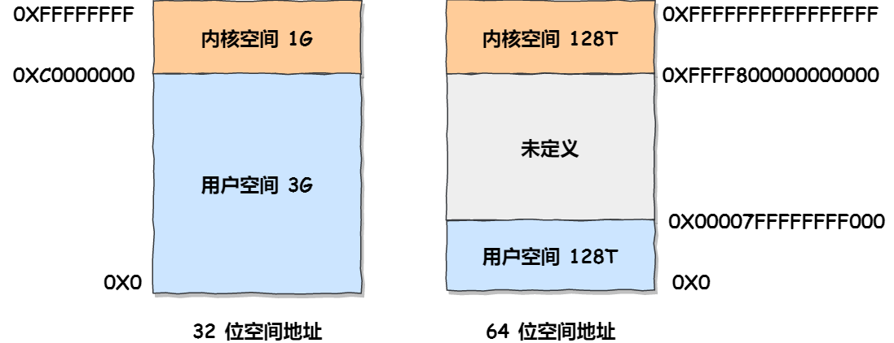

[(126条消息) 32位机器和64位机器指针是4字节和8字节？\_一个32位的机器,该机器的指针是多少位\_编程9898的博客-CSDN博客](https://blog.csdn.net/qq_51956388/article/details/120234760)

> 内存是需要标注地址的，所以支持内存的大小也受到这个标注的地址的范围的限制，所以在32位操作系统下，所能表示的地址最大数也就是2*32。每行是1bit，而一个字节是8bit。
>
> 不要把cpu的处理能力和内存的标注地址给混在一起了。这是两回事。

### 内存单元

内存被划分为了若干个内存单元，一个内存单元的大小是一个字节(8bit)。

为了有效的使用内存，就把**内存**划分成一个个小的**内存单元**，每个**内存单元**的大小是1个字节。**为了能够有效的访问到内存的每个单元，就给内存单元进行了编号，这些编号被称为该==内存单元的地址==。**

### 32 位、64 位

通常指CPU里面的**通用寄存器**的数据宽度是 32/64 个比特位.

在32位的机器上，有32根地址线，地址是32个0或者1组成二进制序列，那地址就得用 4 个字节的空间来存储，所以一个指针变量的大小就应该是4个字节。因此一共有2的32次方个01组合确定不同的内存单元，一共可容纳2的32次方字节容量-->4gb

在64位机器上，有64个地址线，那一个指针变量的大小是8个字节，才能存放一个地址。因此一共有2的64次方个01组合确定不同的内存单元，一共可容纳2的64次方字节容量1、32为机器和64位机器是什么意思？

### 为什么32位系统为什么支持4G内存

首先说明几个概念：

1. 32操作系统的**地址总线**为32，最大可寻址2^32（2的32次方）个地址；
2. 内存中一个**存储单元**为一个字节，即 1byte 或者8bit；
3. 1 Gb =2^10 MB = 2^20 KB = 2^30 byte = 2^33 bit；

32位机器是指处理器一次能处理的最大位数是32位，通常指CPU里面的通用寄存器的数据宽度是32个比特位。而64位机器表示一次能处理的最[大数据](https://so.csdn.net/so/search?q=%E5%A4%A7%E6%95%B0%E6%8D%AE&spm=1001.2101.3001.7020)位数是64位。

32位机器最大寻址[地址空间](https://so.csdn.net/so/search?q=%E5%9C%B0%E5%9D%80%E7%A9%BA%E9%97%B4&spm=1001.2101.3001.7020)是2^32^ 个内存单元（4G），注意1G=2^30^，而每个**内存单元**大小都是一个字节，所以32位机器最大寻址空间是4GB。

而64位机器最大寻址空间是4GB^32，这个数字相当庞大，通常只能寻址到128TB。

为什么32位机器上指针大小是4个字节，64位机器上是8个细节？

很简单，因为32位机器的寻址地址空间是4G，每个地址是32位，恰好是4个字节。即指针大小是4个字节。而64位机器的每个地址是64位是8个字节，因此指针是8个字节。

### 通用寄存器、PC（程序计数器）

PC的宽度和通用寄存器的宽度一样

- 对于32位系统，所有**通用寄存器**的宽度都是32bit，PC宽度32bit，寄存器总个数也是32个。

- 对于64位系统，**通用寄存器**的宽度是64，同时PC宽度也是64位.

### 512Byte、4KB、16KB

- 磁盘上，数据最小存储单元是**扇区**，一个扇区大小 512 字节。
- 文件系统（例如EXT4），最小单元是**块（block）**，一个 block 块大小是 4k。
- InnoDB 存储引擎的最小存储单元是**页（page）**，一个 page 的大小是 16k。