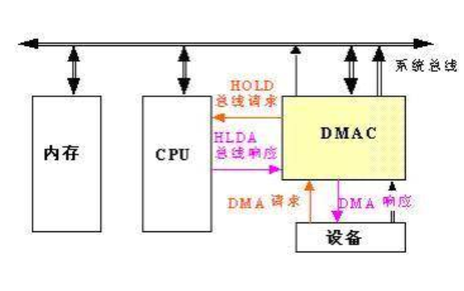

### 直接内存访问（Direct Memory Access，DMA）

直接内存访问是计算机科学中的一种内存访问技术。它允许某些计算机内部的硬件子系统（计算机外设），可以独立地直接读写系统内存，而不需中央处理器（CPU）介入处理 。在同等程度的处理器负担下，DMA是一种快速的数据传送方式。很多硬件的系统会使用DMA，包含硬盘控制器、绘图显卡、网卡和声卡。

### DMA直接内存访问的缓存一致性问题

DMA会导致缓存一致性问题。想像中央处理器带有缓存与外部内存的情况，DMA的运作则是去访问外部内存，当中央处理器访问外部内存某个地址的时候，暂时先将新的值写入缓存中，但并未将外部内存的数据更新，若在缓存中的数据尚未更新到外部内存前发生了DMA，则DMA过程将会读取到未更新的数据。

相同的，如果外部设备写入新的值到外部内存内，则中央处理器若访问缓存时则会访问到尚未更新的数据。
