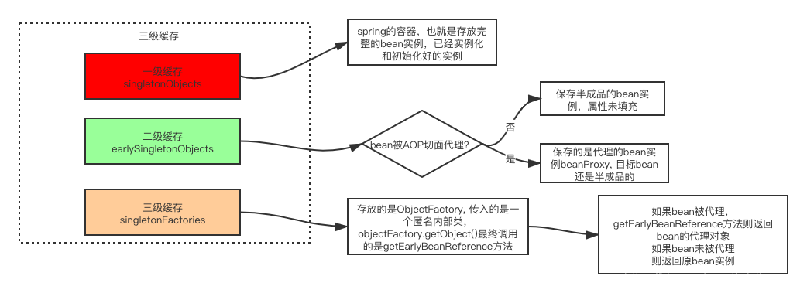
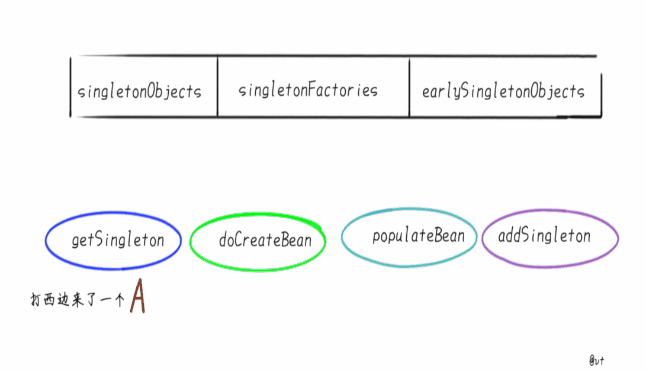
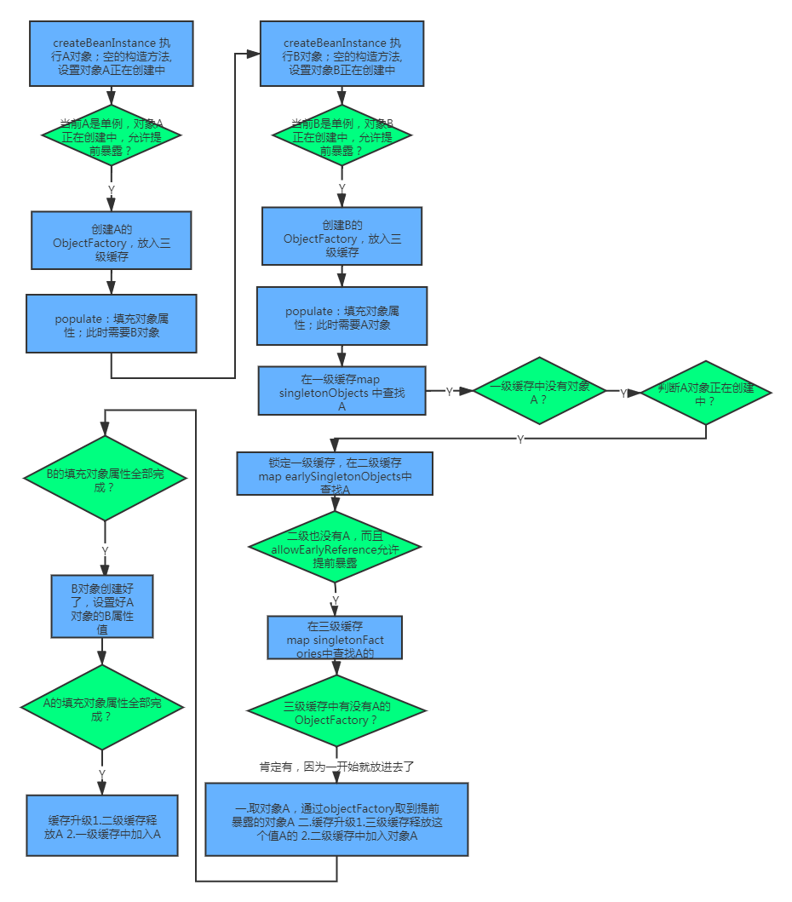
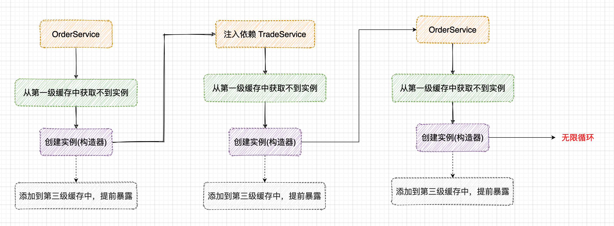
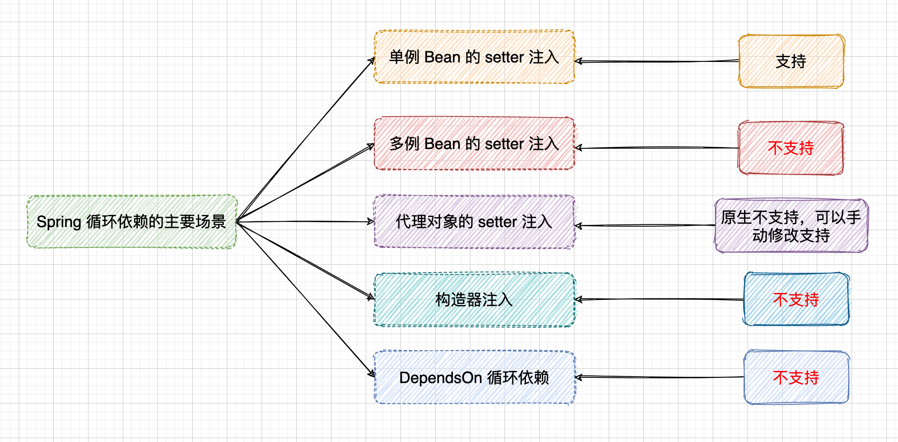

[(130条消息) spring循环依赖及解决方法\_ximeneschen的博客-CSDN博客](https://blog.csdn.net/cristianoxm/article/details/113246104)

## 一、三种[循环依赖](https://so.csdn.net/so/search?q=%E5%BE%AA%E7%8E%AF%E4%BE%9D%E8%B5%96&spm=1001.2101.3001.7020)的情况

-   ①构造器的循环依赖：这种依赖spring是处理不了的，直接抛出BeanCurrentlylnCreationException异常。
-   ②单例模式下的setter循环依赖：通过“三级缓存”处理循环依赖，能处理。
-   ③非单例循环依赖：无法处理。原型(Prototype)的场景是不支持循环依赖的，通常会走到`AbstractBeanFactory类中下面的判断，抛出异常。`

```
if (isPrototypeCurrentlyInCreation(beanName)) 
{  throw new BeanCurrentlyInCreationException(beanName);}
```

原因很好理解，创建新的A时，发现要注入原型字段B，又创建新的B发现要注入原型字段A…这就套娃了, 你猜是先StackOverflow还是OutOfMemory？  
`Spring怕你不好猜，就先抛出了BeanCurrentlyInCreationException`

出现的背景：

## 二、解决方案

首先，`Spring内部维护了三个Map，也就是我们通常说的三级缓存。`  
笔者翻阅Spring文档倒是没有找到三级缓存的概念，可能也是本土为了方便理解的词汇。  
在Spring的DefaultSingletonBeanRegistry类中，你会赫然发现类上方挂着这三个Map：

> -   singletonObjects （一级缓存）它是我们最熟悉的朋友，俗称“单例池”“容器”，缓存创建完成单例Bean的地方。
> -   earlySingletonObjects（二级缓存）映射Bean的早期引用，也就是说在这个Map里的Bean不是完整的，甚至还不能称之为“Bean”，只是一个Instance.
> -   singletonFactories（三级缓存） 映射创建Bean的原始工厂  
>     

后两个Map其实是“垫脚石”级别的，只是创建Bean的时候，用来借助了一下，创建完成就清掉了。那么Spring 是如何通过上面介绍的三级缓存来解决循环依赖的呢？这里只用 A，B 形成的循环依赖来举例：

> 1.  实例化 A，此时 A 还未完成属性填充和初始化方法（@PostConstruct）的执行，A 只是一个半成品。
> 2.  为 A 创建一个 Bean工厂，并放入到 singletonFactories 中。
> 3.  发现 A 需要注入 B 对象，但是一级、二级、三级缓存均为发现对象 B。
> 4.  实例化 B，此时 B 还未完成属性填充和初始化方法（@PostConstruct）的执行，B 只是一个半成品。
> 5.  为 B 创建一个 Bean工厂，并放入到 singletonFactories 中。
> 6.  发现 B 需要注入 A 对象，此时在一级、二级未发现对象  
>     A，但是在三级缓存中发现了对象 A，从三级缓存中得到对象 A，并将对象 A 放入二级缓存中，同时删除三级缓存中的对象 A。（注意，此时的 A  
>     还是一个半成品，并没有完成属性填充和执行初始化方法）
> 7.  将对象 A 注入到对象 B 中。
> 8.  对象 B 完成属性填充，执行初始化方法，并放入到一级缓存中，同时删除二级缓存中的对象 B。（此时对象 B 已经是一个成品）
> 9.  对象 A 得到对象B，将对象 B 注入到对象 A 中。（对象 A 得到的是一个完整的对象 B）
> 10.  对象 A完成属性填充，执行初始化方法，并放入到一级缓存中，同时删除二级缓存中的对象 A。

  
[图片来自](https://juejin.cn/post/6844904122160775176)  
我们从源码的角度来看一下这个过程:  
创建 Bean 的方法在 AbstractAutowireCapableBeanFactory::doCreateBean()

```
protected Object doCreateBean(final String beanName, final RootBeanDefinition mbd, Object[] args) throws BeanCreationException {
    BeanWrapper instanceWrapper = null;

    if (instanceWrapper == null) {
        // ① 实例化对象
        instanceWrapper = this.createBeanInstance(beanName, mbd, args);
    }

    final Object bean = instanceWrapper != null ? instanceWrapper.getWrappedInstance() : null;
    Class<?> beanType = instanceWrapper != null ? instanceWrapper.getWrappedClass() : null;
   
    // ② 判断是否允许提前暴露对象，如果允许，则直接添加一个 ObjectFactory 到三级缓存
boolean earlySingletonExposure = (mbd.isSingleton() && this.allowCircularReferences &&
isSingletonCurrentlyInCreation(beanName));
    if (earlySingletonExposure) {
        // 添加三级缓存的方法详情在下方
        addSingletonFactory(beanName, () -> getEarlyBeanReference(beanName, mbd, bean));
    }

    // ③ 填充属性
    this.populateBean(beanName, mbd, instanceWrapper);
    // ④ 执行初始化方法，并创建代理
    exposedObject = initializeBean(beanName, exposedObject, mbd);
   
    return exposedObject;
}
```

添加三级缓存的方法如下：

```
protected void addSingletonFactory(String beanName, ObjectFactory<?> singletonFactory) {
    Assert.notNull(singletonFactory, "Singleton factory must not be null");
    synchronized (this.singletonObjects) {
        if (!this.singletonObjects.containsKey(beanName)) { // 判断一级缓存中不存在此对象
            this.singletonFactories.put(beanName, singletonFactory); // 添加至三级缓存
            this.earlySingletonObjects.remove(beanName); // 确保二级缓存没有此对象
            this.registeredSingletons.add(beanName);
        }
    }
}

@FunctionalInterface
public interface ObjectFactory<T> {
T getObject() throws BeansException;
}
```

通过这段代码，我们可以知道 Spring 在实例化对象的之后，就会为其创建一个 Bean 工厂，并将此工厂加入到三级缓存中。  
因此，`Spring 一开始提前暴露的并不是实例化的 Bean，而是将 Bean 包装起来的 ObjectFactory。为什么要这么做呢？`  
这实际上涉及到 `AOP，如果创建的 Bean 是有代理的，那么注入的就应该是代理 Bean，而不是原始的 Bean。`但是 Spring 一开始并不知道 Bean 是否会有循环依赖，通常情况下（没有循环依赖的情况下），Spring 都会在完成填充属性，并且执行完初始化方法之后再为其创建代理。但是，`如果出现了循环依赖的话，Spring 就不得不为其提前创建代理对象，否则注入的就是一个原始对象，而不是代理对象`。因此，这里就涉及到应该在哪里提前创建代理对象？  
`Spring 的做法就是在 ObjectFactory 中去提前创建代理对象。它会执行 getObject() 方法来获取到 Bean。`实际上，它真正执行的方法如下：

```
protected Object getEarlyBeanReference(String beanName, RootBeanDefinition mbd, Object bean) {
    Object exposedObject = bean;
    if (!mbd.isSynthetic() && hasInstantiationAwareBeanPostProcessors()) {
        for (BeanPostProcessor bp : getBeanPostProcessors()) {
            if (bp instanceof SmartInstantiationAwareBeanPostProcessor) {
                SmartInstantiationAwareBeanPostProcessor ibp = (SmartInstantiationAwareBeanPostProcessor) bp;
                // 如果需要代理，这里会返回代理对象；否则返回原始对象
                exposedObject = ibp.getEarlyBeanReference(exposedObject, beanName);
            }
        }
    }
    return exposedObject;
}
```

因为提前进行了代理，避免对后面重复创建代理对象，会在 earlyProxyReferences 中记录已被代理的对象。

```
public abstract class AbstractAutoProxyCreator extends ProxyProcessorSupport
implements SmartInstantiationAwareBeanPostProcessor, BeanFactoryAware {
    @Override
    public Object getEarlyBeanReference(Object bean, String beanName) {
        Object cacheKey = getCacheKey(bean.getClass(), beanName);
        // 记录已被代理的对象
        this.earlyProxyReferences.put(cacheKey, bean);
        return wrapIfNecessary(bean, beanName, cacheKey);
    }
}
```

通过上面的解析，我们可以知道 Spring 需要三级缓存的目的是为了在没有循环依赖的情况下，延迟代理对象的创建，使 Bean 的创建符合 Spring 的设计原则。

-   如何获取依赖

我们目前已经知道了 Spring 的三级依赖的作用，但是 Spring 在注入属性的时候是如何去获取依赖的呢？  
他是通过一个`getSingleton()`方法去获取所需要的 Bean 的。

```
protected Object getSingleton(String beanName, boolean allowEarlyReference) {
    // 一级缓存
    Object singletonObject = this.singletonObjects.get(beanName);
    if (singletonObject == null && isSingletonCurrentlyInCreation(beanName)) {
        synchronized (this.singletonObjects) {
            // 二级缓存
            singletonObject = this.earlySingletonObjects.get(beanName);
            if (singletonObject == null && allowEarlyReference) {
                // 三级缓存
                ObjectFactory<?> singletonFactory = this.singletonFactories.get(beanName);
                if (singletonFactory != null) {
                    // Bean 工厂中获取 Bean
                    singletonObject = singletonFactory.getObject();
                    // 放入到二级缓存中
                    this.earlySingletonObjects.put(beanName, singletonObject);
                    this.singletonFactories.remove(beanName);
                }
            }
        }
    }
    return singletonObject;
}
```

当 Spring 为某个 Bean 填充属性的时候，`它首先会寻找需要注入对象的名称，然后依次执行 getSingleton() 方法得到所需注入的对象，而获取对象的过程就是先从一级缓存中获取，一级缓存中没有就从二级缓存中获取，二级缓存中没有就从三级缓存中获取，如果三级缓存中也没有，那么就会去执行 doCreateBean() 方法创建这个 Bean。`

流程图总结：  


## 三、解决循环依赖必须要三级缓存吗

我们现在已经知道，第三级缓存的目的是为了延迟代理对象的创建，因为如果没有依赖循环的话，那么就不需要为其提前创建代理，可以将它延迟到初始化完成之后再创建。

既然目的只是延迟的话，那么我们是不是可以不延迟创建，而是在实例化完成之后，就为其创建代理对象，这样我们就不需要第三级缓存了。因此，我们可以将`addSingletonFactory() 方法进行改造`。

```
protected void addSingletonFactory(String beanName, ObjectFactory<?> singletonFactory) {
    Assert.notNull(singletonFactory, "Singleton factory must not be null");
    synchronized (this.singletonObjects) {
        if (!this.singletonObjects.containsKey(beanName)) { // 判断一级缓存中不存在此对象
            object o = singletonFactory.getObject(); // 直接从工厂中获取 Bean
            this.earlySingletonObjects.put(beanName, o); // 添加至二级缓存中
            this.registeredSingletons.add(beanName);
        }
    }
}
```

这样的话，每次实例化完 Bean 之后就直接去创建代理对象，并添加到二级缓存中。`测试结果是完全正常的，Spring 的初始化时间应该也是不会有太大的影响，因为如果 Bean 本身不需要代理的话，是直接返回原始 Bean 的，并不需要走复杂的创建代理 Bean 的流程。`

-   结论

测试证明，`二级缓存也是可以解决循环依赖的。`为什么 Spring 不选择二级缓存，而要额外多添加一层缓存呢？

如果 Spring 选择二级缓存来解决循环依赖的话，那么就意味着所有 Bean 都需要在实例化完成之后就立马为其创建代理，而`Spring 的设计原则是在 Bean 初始化完成之后才为其创建代理。`所以，Spring 选择了三级缓存。但是因为循环依赖的出现，导致了 Spring 不得不提前去创建代理，因为如果不提前创建代理对象，那么注入的就是原始对象，这样就会产生错误。

## 四、无法解决的循环依赖问题

1.  在主bean中通过构造函数注入所依赖的bean。

如下controller为主bean，service为所依赖的bean：

```
@RestController
public class AccountController {
    private static final Logger LOG = LoggerFactory.getLogger(AccountController.class);

    private AccountService accountService;

    // 构造函数依赖注入
    // 不管是否设置为required为true，都会出现循环依赖问题
    @Autowire
    // @Autowired(required = false)
    public AccountController(AccountService accountService) {
        this.accountService = accountService;
    }
    
}

@Service
public class AccountService {
    private static final Logger LOG = LoggerFactory.getLogger(AccountService.class);
    
    // 属性值依赖注入
    @Autowired
    private AccountController accountController;
   } 
```

启动打印如下：

```
***************************
APPLICATION FAILED TO START
***************************

Description:

The dependencies of some of the beans in the application context form a cycle:

┌─────┐
|  accountController defined in file [/Users/xieyizun/study/personal-projects/easy-web/target/classes/com/yzxie/easy/log/web/controller/AccountController.class]
↑     ↓
|  accountService (field private com.yzxie.easy.log.web.controller.AccountController com.yzxie.easy.log.web.service.AccountService.accountController)
└─────┘
```

如果是`在主bean中通过属性值或者setter方法注入所依赖的bean，而在所依赖的bean使用了构造函数注入主bean对象，这种情况则不会出现循环依赖问题。`

```
@RestController
public class AccountController {
    private static final Logger LOG = LoggerFactory.getLogger(AccountController.class);

    // 属性值注入
    @Autowired
    private AccountService accountService;
    
}

@Service
public class AccountService {
    private AccountController accountController;

    // 构造函数注入
    @Autowired
    public AccountService(AccountController accountController) {
        this.accountController = accountController;
    }
    
}
```

2.  总结

> -   当存在循环依赖时，`主bean对象不能通过构造函数的方式注入所依赖的bean对象，而所依赖的bean对象则不受限制，即可以通过三种注入方式的任意一种注入主bean对象。`
> -   如果主bean对象通过构造函数方式注入所依赖的bean对象，`则无论所依赖的bean对象通过何种方式注入主bean，都无法解决循环依赖问题，程序无法启动。`(其实在主bean加上@Lazy也能解决)

原因主要是主bean对象通过构造函数注入所依赖bean对象时，无法创建该所依赖的bean对象，获取该所依赖bean对象的引用。因为如下代码所示。  
创建主bean对象，调用顺序为：

```
1.调用构造函数，2. 放到三级缓存，3. 属性赋值。其中调用构造函数时会触发所依赖的bean对象的创建。
```

```
    // bean对象实例创建的核心实现方法
    protected Object doCreateBean(final String beanName, final RootBeanDefinition mbd, final @Nullable Object[] args)
    throws BeanCreationException {
    // 省略其他代码
    // 1. 调用构造函数创建该bean对象，若不存在构造函数注入，顺利通过
    instanceWrapper = createBeanInstance(beanName, mbd, args);
    // 2. 在singletonFactories缓存中，放入该bean对象，以便解决循环依赖问题
    addSingletonFactory(beanName, () -> getEarlyBeanReference(beanName, mbd, bean));
    // 3. populateBean方法：bean对象的属性赋值
    populateBean(beanName, mbd, instanceWrapper); 
    // 省略其他代码
    return exposedObject;
    }
```

createBeanInstance是`调用构造函数创建主bean对象，在里面会注入构造函数中所依赖的bean，而此时并没有执行到addSingletonFactory方法来添加主bean对象的创建工厂到三级缓存singletonFactories中。`故在createBeanInstance内部，`注入和创建该主bean对象时，如果在构造函数中存在对其他bean对象的依赖，并且该bean对象也存在对主bean对象的依赖，则会出现循环依赖问题`，原理如下：

> 主bean对象为A，A对象依赖于B对象，B对象也存在对A对象的依赖，创建A对象时，会触发B对象的创建，则B无法通过三级缓存机制获取主bean对象A的引用（`即B如果通过构造函数注入A，则无法创建B对象；如果通过属性注入或者setter方法注入A，则创建B对象后，对B对象进行属性赋值，会卡在populateBean方法也无法返回`）。 故无法创建主bean对象所依赖的B，创建主bean对象A时，createBeanInstance方法无法返回，出现代码死锁，程序报循环依赖错误。

注意：`spring的循环依赖其实是可以关闭的，设置allowCircularReference=false`  
[文章转自](https://juejin.cn/post/6882266649509298189#heading-4)  
[文章转自](https://juejin.cn/post/6844904122160775176)  
[参考文章](https://blog.csdn.net/u010013573/article/details/90573901)


为什么构造器循环依赖不支持？

> [Spring 的循环依赖问题 - mghio - 博客园](https://www.cnblogs.com/mghio/p/15024461.html)






