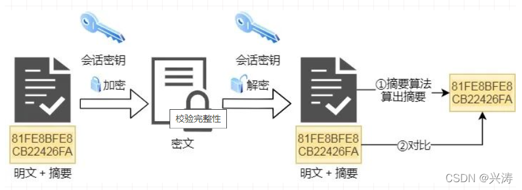
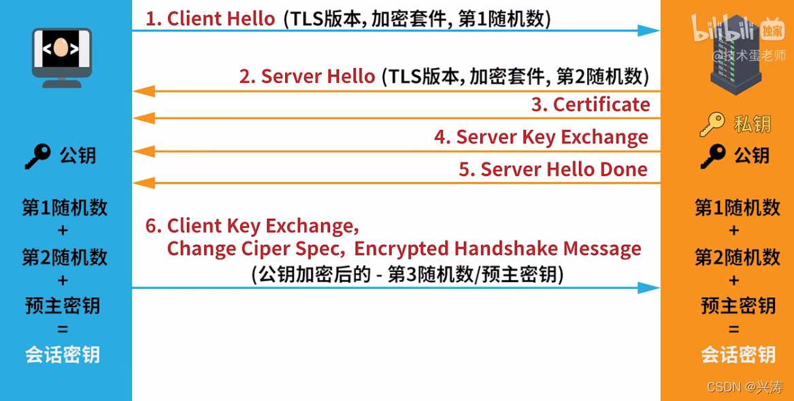

[(124条消息) HTTPS加密过程详解\_兴涛的博客-CSDN博客](https://blog.csdn.net/m0_46672151/article/details/123744429)

### [HTTPS加密过程](https://so.csdn.net/so/search?q=HTTPS%E5%8A%A0%E5%AF%86%E8%BF%87%E7%A8%8B&spm=1001.2101.3001.7020)详解

-   [一、前言](https://blog.csdn.net/m0_46672151/article/details/123744429#_1)
-   [二、HTTPS的混合加密](https://blog.csdn.net/m0_46672151/article/details/123744429#HTTPS_4)
-   -   [1、摘要算法](https://blog.csdn.net/m0_46672151/article/details/123744429#1_16)
    -   [2、混合加密和数字证书](https://blog.csdn.net/m0_46672151/article/details/123744429#2_20)
-   [三、补充](https://blog.csdn.net/m0_46672151/article/details/123744429#_49)
-   [四、参考资料](https://blog.csdn.net/m0_46672151/article/details/123744429#_64)

## 一、前言

http是为了解决http存在的问题而在http基础上加入了SSL/TSL，在HTTP/2中[TCP三次握手](https://so.csdn.net/so/search?q=TCP%E4%B8%89%E6%AC%A1%E6%8F%A1%E6%89%8B&spm=1001.2101.3001.7020)后会进入SSL/TSL握手，当SSL/TSL建立链接后，才会进行报文的传输。（注意这里我说的是http/2，在3中建立链接的次数不同，可在下面补充内容中查看，下面默认是http/2）

## 二、HTTPS的混合加密

我们知道加密方式有三种

-   对称加密
-   非对称加密
-   混合加密

HTTPS采用的就是对称加密和非对称加密的混合加密方法。

-   混合加密解决了信息的机密性，防止数据被窃听
-   摘要算法实现了数据的完成性，防止了数据被篡改
-   数字证书提供了身份验证，防止了被冒充风险

## 1、摘要算法

客户端在向服务器端发送明文的时候，会通过摘要算法计算出明文的摘要，为了通俗来讲，我们将计算出的摘要比喻成身份证。然后客户端将明文和身份证通过密钥进行加密传给服务器端。服务器端会通过密钥解密客户端发来的数据，此时明文已经被解密出来，身份证呢？服务器端也会使用摘要算法计算出传来数据的身份证，然后将计算出的身份证和传过来的身份证进行比较，如果身份证相同，那么就说明数据是完整的。

## 2、混合加密和数字证书

在这里我们将混合加密和数字证书放到一块讲解，可能有人会疑问数字证书是什么？其实数字证书是第三方权威机构给颁发的一种认证证书，在https通信时，会去申请这个数字证书，同时伪造数字证书是一件极其难的事情，所以我们认为证书是可信的，那么其公钥（下面会讲）就是可信的。

https在建立链接时是非对称加密，建立链接后是对称加密，（不懂对称加密和非对称加密的小伙伴可自行查阅哦）具体详细请看下面的一张图：  

-   1、首先呢，客户端先向服务端发送加密通信(https)请求，这次请求中包括：
    -   SSL/TSL版本号
    -   加密套件，也就是客户端支持的加密算法列表
    -   产生一个随机数，我们叫他为第1随机数
    -   有一个Client Hello字符串
-   2、服务器收到请求后，向客户端发出响应：
    -   确认SSL/TSL版本号，如果客户端不支持，那么就关闭通信
    -   确认的加密算法列表
    -   生成一个随机数，我们叫第2随机数
-   3、服务器再向客户端发送数字证书，这里敲重点了。服务器会把自己的公钥注册到CA(第三方证书机构)，然后CA拿自己的私钥对服务器的公钥进行处理并颁发数字证书。
-   4、服务器将公钥发送给客户端(公钥在证书里)
-   5、服务器发送Hello Done，表示发送完毕
-   6、客户端收到服务端一系列响应后，确认数字证书和公钥，没有问题后向服务端发送：
    -   生成一个随机数，我们叫第3随机数或者预主密钥，此预主密钥会通过公钥进行加密
    -   客户端握手结束通知，表示客户端的握手结束
-   7、服务端收到客户端数据后，使用私钥对加密后的预主密钥进行解密，没有其他人知道预主密钥，因为它加密了，除非服务器私钥泄漏。然后服务端通过第一、二、预主密钥计算出会话密钥。客户端也计算出了会话密钥。
-   8、服务端向客户端发送：
    -   加密通信算法改变通知，以后通过会话密钥通信
    -   服务端握手结束

到此为止，SSL/TSL握手结束，在此之后都会通过会话密钥来进行加密和解密，也就是对称加密。

_有小伙伴可能会说，https建立链接的过程太麻烦了吧。这里我想说，世界上没有事事都完美的东西，我们在不断优化的过程中，解决上一个问题可能也会产生新的问题，其实这也是世间万物的发展规律_。

## 三、补充

1、在http/1.1中加入了TCP长连接通信，每当建立起链接后，只要任意端口没有明确提出断开链接，TCP就会保持链接状态，大大减少了频繁建立链接的开销。

2、在http/2中，相对于http/1.1改进了一些内容：  
\- 头部压缩。http/2中会压缩头，如果客户端发送多个请求，头是相似或者相同，那么协议会消除重复的部分，减免了不必要的浪费。  
\- http/1.1中报文是文本格式，在http/2中报文是二进制格式，大大加快了传输效率。  
\- http2中使用了多路复用，解决了队头堵塞问题。什么是队头堵塞？在http/1.1中，队头堵塞指的是在TCP请求时，请求因为某种原因被阻塞，那么后面的请求无法继续进行（因为TCP是可靠链接，顺序执行）。**多路复用是多个http复用一个TCP链接**，那么多路复用后，请求和响应不再是按照顺序一一对应。如果一个请求被堵塞，其他请求可以继续。

3、http/2优化了http/1.1，但是也存在一些问题，就像上面说的，没有完美的事情。http/3对2进行了一些优化

-   2在多路复用时是复用一个TCP链接，那么TCP一旦发送丢包，那么就会阻塞所以复用它的http，这就麻烦了，这里也是因为TCP是可靠传输，顺序要一一对应。所以http/3直接将TCP改为UDP，但是UDP是不可靠传输，所以也加入了基于UDP的QUIC协议，来实现类似TCP的了靠传输。
-   http/3将TCP三次握手和SSL/TSL三次握手直接**合并成了三次握手**，意思是将原来的6次合并成了3次，减少了链接次数。

我们可以看到http/3有很多优点，但是目前普及较慢，我也不清楚为什么，有知道的小伙伴可以评论区讨论讨论

## 四、参考资料

本篇文章的知识是看以下两位大佬讲解的：  
1、[小林coding](https://mp.weixin.qq.com/s/bUy220-ect00N4gnO0697A)  
2、 [技术蛋老师](https://www.bilibili.com/video/BV1KY411x7Jpspm_id_from=333.337.search-card.all.click)  
没看明白的小伙伴也可以查看以上链接。

为了省时间，图也借用了一下，哈哈。  
在此感谢二位为计算机行业做出的贡献！