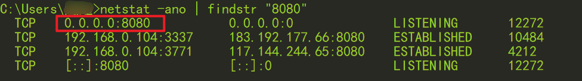
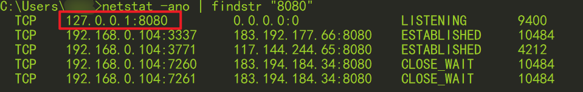
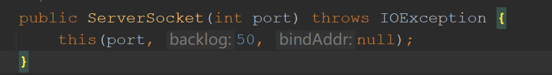

> 前言：会去搜索这个问题并且有缘看到这篇文章的人，我相信你一定是个~爱思考~ 爱钻牛角尖的人。每次遇到问题总想知道到底为什么，有时候会浪费很多时间也没有解决问题。如果这篇文章对你有用，麻烦点赞或评论下。

## 一 问题描述

在使用java代码`ServerSocket serverSocket = new ServerSocket(8080);`创建了服务器端的监听[套接字](https://so.csdn.net/so/search?q=%E5%A5%97%E6%8E%A5%E5%AD%97&spm=1001.2101.3001.7020)后，我使用命令行工具cmd查看了当前的网络状态，如下图所示，套接字监听的IP地址是“0.0.0.0”，这和我预想的“127.0.0.1”不一样啊！  


## 二 问题解决

使用可以指定IP地址的ServerSocket即可，代码如下图所示：

```
InetAddress addr = Inet4Address.getByAddress(new byte[]{127,0,0,1});
ServerSocket serverSocket = new ServerSocket(8080,50, addr);
```

使用命令行工具cmd查看当前的网络状态，如下图所示：  
  
至此，问题已经解决。如果想了解上述代码的更详细的描述和为什么监听的地址是“0.0.0.0”，请继续往下看。

## 三 相关扩展知识

## 1 java SE 8 API

java.net Class ServerSocket

> **public ServerSocket(int port, int backlog, InetAddress bindAddr)** throws IOException
>
> **Parameters:**  
> port - the port number, or 0 to use a port number that is automatically allocated.（**端口号，如果设置0，系统将自动分配可用的端口号**）  
> backlog - requested maximum length of the queue of incoming connections.（**TCP或UDP连接队列的最大长度，即服务器端同时最多可以打开的连接数量**。这里我使用了50，因为查看Java源码，其设置的默认值就是50）  
> bindAddr - the local InetAddress the server will bind to（**服务器将会绑定的本地IP地址**）

java.net Class Inet4Address 从java.net Class InetAddress继承的方法

> **public static InetAddress getByAddress(byte\[\] addr)** throws UnknownHostException
>
> **Parameters:**  
> addr - the raw IP address in network byte order

**注意！** **这里指定的IP地址为点分十进制形式的byte数组，byte类型的取值范围为-128到127，因此不能将IP地址设置为“192.168.0.1”，同时也不能设置IP地址为“126.0.0.1”，从计算机网络系统的角度分析，是可以理解的。上述IP为局域网IP或者公网IP，这些IP可以分配给计算机的网卡（全称网络接口卡，常见的以太网网卡或者WLAN无线网卡），在java程序中属于只读属性**（查看本机IPInet4Address.getLocalHost()；查看回环测试IP Inet4Address.getLoopbackAddress()），**你唯一可操作的IP地址为 本地回环地址(Loopback Address)，即形如 “127.X.X.X”的地址。** 如果指定其他类型的IP地址，则会报错 “java.net.BindException: Cannot assign requested address: JVM\_Bind”。

## 2 为什么监听 0.0.0.0

还是熟悉的配方，我们要从官方文档入手。  

参考【[rfc3330](https://datatracker.ietf.org/doc/html/rfc3330#section-2)】，如果想了解更多相关知识可以查看【[IPv4地址的分配原理](https://blog.csdn.net/gao_zhennan/article/details/118418675)】和【[IP地址0.0.0.0表示什么](https://blog.csdn.net/gao_zhennan/article/details/118419526)】

> **0.0.0.0/8 - Addresses in this block refer to source hosts on “this” network.** Address 0.0.0.0/32 may be used as a source address for this host on this network; other addresses within 0.0.0.0/8 may be used to refer to specified hosts on this network
>
> **0.0.0.0/8表示本网络中的所有主机。**

> 通过子网掩码8，我们可以判断本网络是A类网络。换句话说，0.0.0.0/8表示A类网络中的所有主机。A类网络的前8位中，第一位0，表示是A类网络；剩下的7位，表示网络号。A类网络的后24位表示主机号（主机号不能为全0或全1，已被保留，有特殊含义。）
>
> 127开头的地址是A类地址的保留地址，用作本地软件环回测试（loopback test）本主机的进程之间的通信之用。因此，在本地计算机上监听的0.0.0.0表示的是A类网络中网络号为127的所有主机，其IP地址为127.0.0.1~127.255.255.254。

参考【[特殊的IP地址127.x.x.x的含义](https://blog.csdn.net/vv_017/article/details/79475454)】

> A类地址（1.0.0.0~126.255.255.254）的网络号第一位都是0，127的第一位也是0。127开头的地址可以说是A类的保留地址，用作本地软件环回测试（loopback test）本主机的进程之间的通信之用。若主机发送一个目的地址为环回地址的IP数据报，则本机中的协议软件就处理数据报中的数据，而不会把数据报发送到任何网络。本地主机与虚拟主机通信会使用虚拟网卡，其ip为127.0.0.1（win10系统此地址无法修改），主机名localhost。

其通信过程如下，如果监听的IP地址为0.0.0.0，感觉在IP为127.0.0.1~127.255.255.254主机上监听了某端口，例如“8080”，这样，在客户端访问任意一台主机的8080端口都可以响应，感觉上很多虚拟主机提供服务。我们一般在客户端浏览器中访问Tomcat服务器时，地址栏输入的URL通常为：localhost:8080，其等价于127.0.0.1:8080。其实，你输入 127.0.0.1到127.255.255.254的任意一个IP都可以访问的到，不信可以试试127.255.255.254:8080。

但是，如果监听一个特定的ip地址，如“127.0.0.1”，那么，URL中的主机只能使用localshot或者127.0.0.1，感觉上好像只有一台虚拟主机提供服务。在[Socket](https://so.csdn.net/so/search?q=Socket&spm=1001.2101.3001.7020)编程中，客户端Socket，如果使用其他127开头的IP地址，会报错：**java.net.ConnectException: Connection refused: connect**

  
至此，总结下，监听0.0.0.0，客户端在访问时可以指定127.0.0.1~127.255.255.254之间的任意IP地址。  
监听特定IP地址，客户端访问时只能使用该特定IP地址。

___

然后，查看Java SE 8 API关于ServerSocket类的描述，摘取关键部分：

> Create a server with the specified port, listen backlog, and local IP address to bind to. The _bindAddr_ argument can be used on a multi-homed host for a ServerSocket that will only accept connect requests to one of its addresses. **If _bindA ddr_ is null, it will default accepting connections on any/all local addresses.**  
>
> 创建一个指定了port，backlog，local IP address的Server。 _bindAddr_ 参数可以用在多宿主主机上，ServerSocket将只能接收目的地址为bindAddr的连接请求。如果bindAddr为空，则默认接收任何/所有（目的地址为）本地地址的连接请求。

参考自网络：

> A multi-homed host is one that has more than one network interface and therefore more than one IP address for which it can be addressed.  
> 多宿主主机就是一台具有多个网络接口的主机，因此可以通过多个IP地址来访问这台主机。

  
当我们使用一个端口号的构造函数时，调用了重载的构造函数，此时bindAddr为空，则默认接收任何/所有（目的地址为）本地地址（127开头的地址）的连接请求。