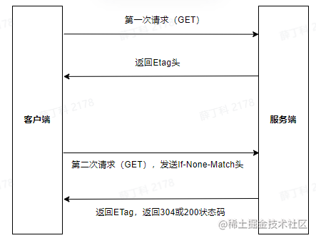

## cookie

```java
private Book testJSON(Book book, HttpServletResponse response){
        Cookie c1 = new Cookie("c1", "v1");
        Cookie c2 = new Cookie("c2", "v2");
        Cookie c3 = new Cookie("c3", "v3");
        Cookie c4 = new Cookie("c3", "v4");
        c1.setMaxAge(10000);
        c1.setMaxAge(20000);
        c4.setMaxAge(20000);
        response.addCookie(c1);
        response.addCookie(c2);
        response.addCookie(c3);
        response.addCookie(c4);
        return book;
    }
```

###  response header: Set-Cookie

```

Connection: keep-alive
Content-Type: application/json;charset=UTF-8
Date: Fri, 10 Mar 2023 05:27:54 GMT
Keep-Alive: timeout=20
Set-Cookie: c1=v1; Max-Age=20000; Expires=Fri, 10 Mar 2023 11:01:14 GMT
Set-Cookie: c2=v2
Set-Cookie: c3=v3
Set-Cookie: c3=v4; Max-Age=20000; Expires=Fri, 10 Mar 2023 11:01:14 GMT
Transfer-Encoding: chunked

```

### request header: Cookie

```

Accept: text/html,application/xhtml+xml,application/xml;q=0.9,image/avif,image/webp,image/apng,*/*;q=0.8,application/signed-exchange;v=b3;q=0.7
Accept-Encoding: gzip, deflate, br
Accept-Language: zh-CN,zh;q=0.9,en-CL;q=0.8,en;q=0.7,ru;q=0.6
Connection: keep-alive
Cookie: JSESSIONID=41EDE0C23CB2229A334E532B5D8A03AB
Host: localhost:8080
sec-ch-ua: "Chromium";v="110", "Not A(Brand";v="24", "Google Chrome";v="110"
sec-ch-ua-mobile: ?0
sec-ch-ua-platform: "Windows"
Sec-Fetch-Dest: document
Sec-Fetch-Mode: navigate
Sec-Fetch-Site: none
Sec-Fetch-User: ?1
Upgrade-Insecure-Requests: 1
User-Agent: Mozilla/5.0 (Windows NT 10.0; Win64; x64) AppleWebKit/537.36 (KHTML, like Gecko) Chrome/110.0.0.0 Safari/537.36
```

### document.cookie

```
'c1=v1; c2=v2; c3=v4'
```

### 刷新一下再看请求头

```
Accept: text/html,application/xhtml+xml,application/xml;q=0.9,image/avif,image/webp,image/apng,*/*;q=0.8,application/signed-exchange;v=b3;q=0.7
Accept-Encoding: gzip, deflate, br
Accept-Language: zh-CN,zh;q=0.9,en-CL;q=0.8,en;q=0.7,ru;q=0.6
Cache-Control: max-age=0
Connection: keep-alive
Cookie: name=jgg; c1=v1; c2=v2; c3=v4; JSESSIONID=41EDE0C23CB2229A334E532B5D8A03AB
Host: localhost:8080
sec-ch-ua: "Chromium";v="110", "Not A(Brand";v="24", "Google Chrome";v="110"
sec-ch-ua-mobile: ?0
sec-ch-ua-platform: "Windows"
Sec-Fetch-Dest: document
Sec-Fetch-Mode: navigate
Sec-Fetch-Site: none
Sec-Fetch-User: ?1
Upgrade-Insecure-Requests: 1
User-Agent: Mozilla/5.0 (Windows NT 10.0; Win64; x64) AppleWebKit/537.36 (KHTML, like Gecko) Chrome/110.0.0.0 Safari/537.36
```

### 总结：

- 服务端设置同名的 cookie，后面设置的cookie会覆盖前面设置的cookie
- 第一次web请求后，response 就带有 set-cookie 头部
- 第二次请求，request 就带有 cookie

## demo1

```
General
Request URL: https://www.collinsdictionary.com/zh/external/images/info.png?version=4.0.302
Request Method: GET
Status Code: 200 
Remote Address: 104.20.190.42:443
Referrer Policy: strict-origin-when-cross-origin

Response Header
accept-ranges: bytes
age: 48027
cache-control: max-age=2592000
cf-cache-status: HIT
cf-ray: 7a59048b69ec2efb-LAX
content-length: 1767
content-range: bytes 0-1766/1767
content-security-policy: frame-ancestors 'self'
content-security-policy: frame-ancestors 'self';
content-type: image/png
date: Fri, 10 Mar 2023 05:04:35 GMT
expires: Sat, 08 Apr 2023 15:44:08 GMT
last-modified: Thu, 09 Mar 2023 15:42:57 GMT
referrer-policy: strict-origin-when-cross-origin
server: cloudflare
strict-transport-security: max-age=31536000; includeSubDomains; preload
vary: User-Agent, Accept-Encoding
x-cache-status: HIT
x-content-type-options: nosniff
x-frame-options: SAMEORIGIN
x-xss-protection: 1; mode=block

Request  header
:authority: www.collinsdictionary.com
:method: GET
:path: /zh/external/images/info.png?version=4.0.302
:scheme: https
accept: image/avif,image/webp,image/apng,image/svg+xml,image/*,*/*;q=0.8
accept-encoding: gzip, deflate, br
accept-language: zh-CN,zh;q=0.9,en-CL;q=0.8,en;q=0.7,ru;q=0.6
referer: http://www.cyc2018.xyz/
sec-ch-ua: "Chromium";v="110", "Not A(Brand";v="24", "Google Chrome";v="110"
sec-ch-ua-mobile: ?0
sec-ch-ua-platform: "Windows"
sec-fetch-dest: image
sec-fetch-mode: no-cors
sec-fetch-site: cross-site
user-agent: Mozilla/5.0 (Windows NT 10.0; Win64; x64) AppleWebKit/537.36 (KHTML, like Gecko) Chrome/110.0.0.0 Safari/537.36
```

## [HTTP | 内容编码](http://www.cyc2018.xyz/%E8%AE%A1%E7%AE%97%E6%9C%BA%E5%9F%BA%E7%A1%80/HTTP/HTTP.html#%E5%86%85%E5%AE%B9%E7%BC%96%E7%A0%81) Content-Encoding

内容编码将实体主体进行压缩，从而减少传输的数据量。

常用的内容编码有：gzip、compress、deflate、identity。

**浏览器**发送 **Accept-Encoding** 首部，其中包含有它所支持的压缩算法，以及各自的优先级。
**服务器**则从中选择一种，使用该算法对响应的消息主体进行压缩，并且发送 **Content-Encoding** 首部来告知浏览器它选择了哪一种算法。由于该内容协商过程是基于编码类型来选择资源的展现形式的，响应报文的 Vary 首部字段至少要包含 Content-Encoding。

### response header: content-encoding

```
alt-svc: h3=":443"; ma=86400, h3-29=":443"; ma=86400
cf-cache-status: DYNAMIC
cf-ray: 7a590dbbfdd3293a-LAX
content-encoding: br
content-language: zh-CN
content-type: text/html
date: Fri, 10 Mar 2023 05:10:51 GMT
server: cloudflare
strict-transport-security: max-age=15552000; includeSubDomains
vary: origin,access-control-request-method,access-control-request-headers,accept-encoding
via: 1.1 google


```

### request header: accept-encoding

```

:authority: start.spring.io
:method: GET
:path: /
:scheme: https
accept: text/html,application/xhtml+xml,application/xml;q=0.9,image/avif,image/webp,image/apng,*/*;q=0.8,application/signed-exchange;v=b3;q=0.7
accept-encoding: gzip, deflate, br
accept-language: zh-CN,zh;q=0.9,en-CL;q=0.8,en;q=0.7,ru;q=0.6
cache-control: max-age=0
cookie: _ga=GA1.2.1201347650.1676877890; AMCVS_5B29123F5245AD520A490D45%40AdobeOrg=1; _gcl_au=1.1.73615506.1676877891; s_cc=true; _mkto_trk=id:048-SZW-045&token:_mch-spring.io-1676877893358-10996; OptanonAlertBoxClosed=2023-02-20T07:37:35.779Z; aam_uuid=51670170459975371144231016579656739566; _ga=GA1.3.1201347650.1676877890; s_dse=https%3A%2F%2Fwww.baidu.com%2F%3Avmware%20%3A%20spring%20%3A%20projects%20%3A%20spring-boot%3ABaidu%3ANatural%20Search; s_sq=%5B%5BB%5D%5D; s_tp=3216; s_ppv=vmware%2520%253A%2520spring%2520%253A%2520projects%2520%253A%2520spring-boot%2C44%2C25%2C1416; AMCV_5B29123F5245AD520A490D45%40AdobeOrg=-1124106680%7CMCIDTS%7C19426%7CMCMID%7C55623050546492287673472908025953661035%7CMCAAMLH-1678932979%7C11%7CMCAAMB-1678932979%7CRKhpRz8krg2tLO6pguXWp5olkAcUniQYPHaMWWgdJ3xzPWQmdj0y%7CMCOPTOUT-1678335379s%7CNONE%7CvVersion%7C5.2.0; utag_main=v_id:01866c86c299001890af492945490506f001206700994$_sn:9$_ss:1$_st:1678329993099$_pn:1%3Bexp-session$ses_id:1678328193099%3Bexp-session; _gid=GA1.2.1385570067.1678328196; _uetvid=aaaa6510b0ef11edb8209f214fc1f6a7; OptanonConsent=isGpcEnabled=0&datestamp=Thu+Mar+09+2023+10%3A18%3A52+GMT%2B0800+(%E4%B8%AD%E5%9B%BD%E6%A0%87%E5%87%86%E6%97%B6%E9%97%B4)&version=202301.1.0&isIABGlobal=false&hosts=&consentId=92ee2f20-9911-4974-86ad-9663d3ba9106&interactionCount=3&landingPath=NotLandingPage&groups=C0001%3A1%2CC0002%3A1%2CC0003%3A1%2CC0004%3A1%2CC0005%3A1&AwaitingReconsent=false&geolocation=CN%3BSC
sec-ch-ua: "Chromium";v="110", "Not A(Brand";v="24", "Google Chrome";v="110"
sec-ch-ua-mobile: ?0
sec-ch-ua-platform: "Windows"
sec-fetch-dest: document
sec-fetch-mode: navigate
sec-fetch-site: none
sec-fetch-user: ?1
upgrade-insecure-requests: 1
user-agent: Mozilla/5.0 (Windows NT 10.0; Win64; x64) AppleWebKit/537.36 (KHTML, like Gecko) Chrome/110.0.0.0 Safari/537.36
```

### vary

 response  header 的vary  头部包括 `accept-encoding`

```
vary: accept-encoding
```

### 其它

```
        Cookie c5 = new Cookie("c5", "v5; c6=v6");
        response.addCookie(c5);
```

```
这是错误信息：出错了：Cookie值中存在无效字符[59]
```

在Cookie中，某些特殊字符不能存在。例如：空格、逗号、等于号、双引号、斜杠等[特殊符号](https://so.csdn.net/so/search?q=特殊符号&spm=1001.2101.3001.7020)


## 缓存

> [关于前端http缓存的使用及分类 - 阿彬\~ - 博客园](https://www.cnblogs.com/coolsboy/p/17085830.html)

### 强制缓存

**二、强制缓存**

**1、基于Expires字段实现的强缓存（该属性已被废弃，不推荐使用）**

Expires字段的作用是，设定一个强缓存时间，在此时间范围内，则从内存（或磁盘）中读取缓存返回，比如将某一资源设置响应头为：Expires:new Date("2023-2-2 23:59:59")；那么，该资源在该时间之前，都会去本地内存（或磁盘）中读取，不会去服务器请求。

由于Expires判断强缓存是否过期的机制是：获取本地时间戳，并对先前拿到的资源文件中的Expires字段的时间做比较，来判断是否需要对服务器发起请求，从而导致一个**严重漏洞：“如果本地时间不准呢？”**

**2、基于Cache-control实现的强缓存（代替Expires的强缓存实现方法，推荐）**

Cache-control在http1.1中被增加，完美解决了Expires本地时间和服务器时间不同步的问题，是当下项目中实现强缓存的最常规方法。Cache-control:max-age=N，N就是需要缓存的秒数。从第一次请求资源的时候开始，往后N秒内，资源若再次请求，则直接从磁盘（或内存）中读取，不与服务器做任何交互。

Cache-control的六个属性：

- **max-age**决定客户端资源被缓存多久
- **s-maxage**决定代理服务器缓存的时长（由于是代理服务器的缓存时长，因此必须与public属性一起使用）
- **no-cache**表示强制进行协商缓存
- **no-store**表示禁止任何缓存策略（与no-cache互斥）
- **public**表示资源既可以被浏览器缓存也可以被代理服务器缓存
- **private**表示资源只能被浏览器缓存（与public互斥）

注意：Cache-control设置多个值时，各属性间使用逗号分割，如：Cache-control:max-age=10000,s-maxage=200000,public

### **协商缓存（需要将cache-control设置为no-cache）**

#### 3. If-Modified-Since 与 Last-Modified 

##### response header：Last-Modified 

首部字段也可以用于缓存验证，它包含在源服务器发送的响应报文中。

##### request header： If-Modified-Since 

客户端可以在后续的请求中带上 If-Modified-Since 来验证缓存。**服务器只在所请求的资源在给定的日期时间之后对内容进行过修改的情况下才会将资源返回**，状态码为 200 OK。如果请求的资源从那时起未经修改，那么返回一个不带有实体主体的 304 Not Modified 响应报文。

##### 基于last-modified的协商缓存（通过比对资源文件的修改时间进行协商缓存）**

使用last-modified和If-Modified-Since实现

流程：

- 首先需要在服务器端读出文件修改时间
- 将读出来的修改时间赋给响应头的last-modified字段
- 最后设置Cache-control:no-cache

以上三步缺一不可，且均在服务器端代码中实现。实现完以上三步后，当客户端读取到last-modified的时候，会在下次的请求头中携带一个字段：If-Modified-Since，这个字段的值就是服务器第一次修改时候给它的时间，之后每次对该资源的请求，都会带上If-Modified-Since这个字段，而服务端就需要拿到这个时间并再次读取该资源的修改时间，两个时间进行对比之后决定是读取缓存还是返回新的资源。

缺点（这两个漏洞都是基于文件是通过比较修改时间来判断是否更改而产生的）：

- 在文件内容本身不修改的情况下，依然有可能更新文件修改时间（比如修改文件名再改回来），此时文件内容并没有修改，缓存依然失效了
- 因为文件修改时间记录的最小单位是秒，所以当文件在几百毫秒内完成修改的时候，文件修改时间并不会改变，这样，即使文件内容修改了，依然不会返回新的文件


#### 

#### 2. Etag 与 If-None-Match

##### Response header：Etag

##### Request header：If-None-Match



##### **基于ETag的协商缓存（通过生成文件内容的唯一哈希值，即文件指纹进行协商缓存）**

ETag就是将原先协商缓存的比较时间戳的形式修改成了比较文件指纹。

流程：

- 第一次请求某资源的时候，服务端读取文件并计算出文件指纹，将文件指纹放在响应头的ETag字段中跟资源一起返回给客户端
- 第二次请求某资源的时候，客户端自动从缓存中读取出上一次服务端返回的ETag也就是文件指纹。并赋给请求头的If-None-Match字段，让上一次的文件指纹跟随请求一起回到服务端
- 服务端拿到请求头中的If-None-Match字段值（也就是上一次的文件指纹），并再次读取目标资源并生成文件指纹，两个指纹做对比。如果两个文件指纹完全吻合，说明文件没有被改变，则直接返回304状态码和一个空的响应体并return。如果两个文件指纹不吻合，则说明文件被更改，那么将新的文件指纹重新存储到响应头的ETag中并返回给客户端

缺点：

- 需要文件尺寸大，数量多，并且计算频繁，那么服务端就需要更多的计算开销，从而影响服务器的性能
- ETag有**强验证**和**弱验证**，所谓强验证，ETag生成的哈希值深入到每个字节，从而保证文件内容绝对的不变，非常消耗计算量；弱验证则是提取文件的部分属性来生成哈希值，因此不必精确到每个字节，所以整体速度会比强验证快，但是精确率不高，会降低协商缓存的有效性

