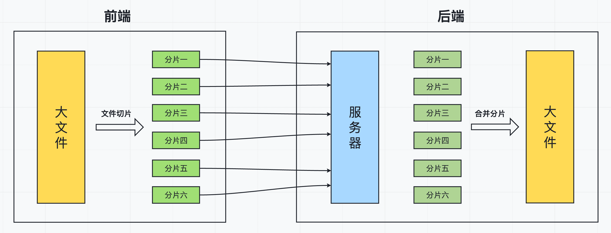
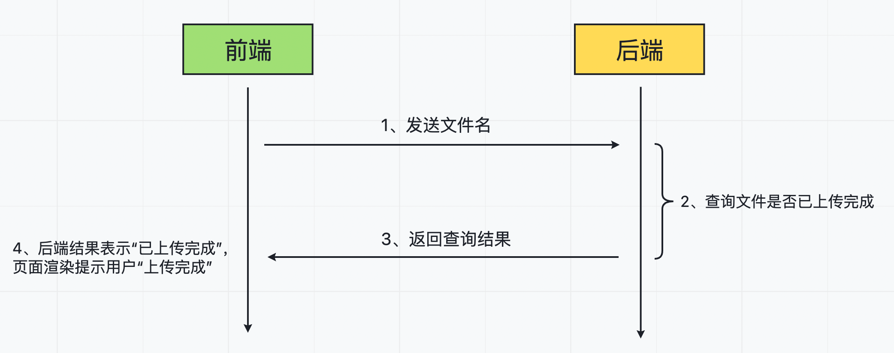
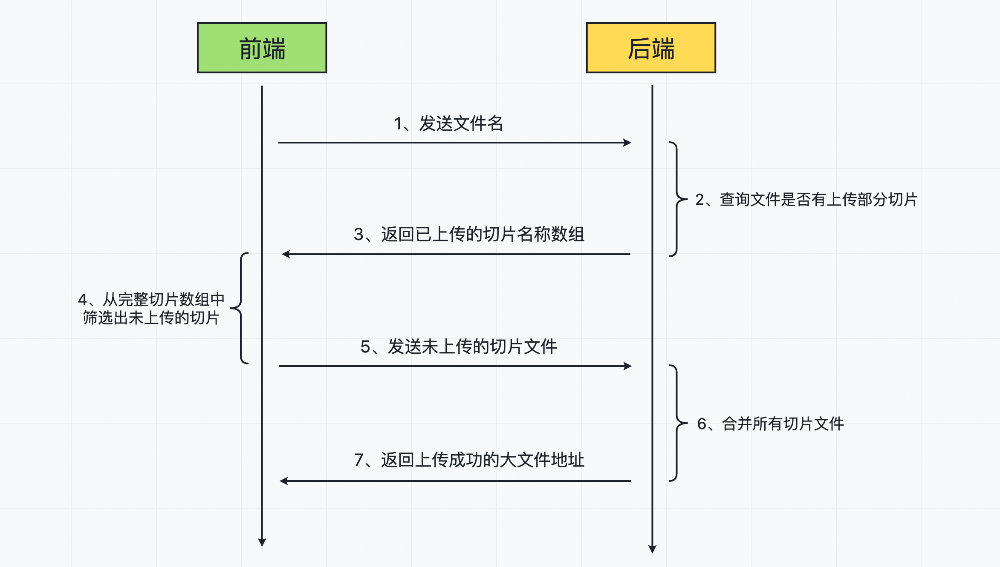

[(124条消息) 大文件上传\_光明顶的老张的博客-CSDN博客](https://blog.csdn.net/lan7798/article/details/127550233)

## [大文件上传](https://so.csdn.net/so/search?q=%E5%A4%A7%E6%96%87%E4%BB%B6%E4%B8%8A%E4%BC%A0&spm=1001.2101.3001.7020)原理

当我们在做文件上传的功能时，如果上传的文件过大，可能会导致长传时间特别长，且上传失败后需要整个文件全部重新上传。因此，我们需要前后端配合来解决这个问题。

最常用的解决方案就是 —— 切片上传。

这次我们主要从以下三个方面来学习关于“大文件上传”的操作：

1.  文件切片上传
2.  文件秒传
3.  文件断点续传

## 一、切片上传

切片上传，也叫[分片](https://so.csdn.net/so/search?q=%E5%88%86%E7%89%87&spm=1001.2101.3001.7020)上传。工作流程大致如下：

1.  前端将一个大文件，拆分成多个小文件（分片）；
    
2.  前端将拆分好的小文件依次发送给后端（每一个小文件对应一个请求）；
    
3.  后端每接收到一个小文件，就将小文件保存到服务器；
    
4.  当大文件的所有分片都上传完成后，前端再发送一个“合并分片”的请求到后端；
    
5.  后端对服务器中所有的小文件进行合并，还原完整的大文件；
    



## 二、文件秒传

文件秒传，其实指的是文件不用传。如果某一个文件，在之前已经上传成功过，再次上传时，就可以直接提示用户“上传成功”。

工作流程大致如下：

1.  上传文件前，将文件名发送到后端，来判断当前文件是否有上传完成过；
2.  后端接收到文件名，查询上传成功的文件中是否有该文件，并返回查询结果给前端；
3.  前端接收到查询结果，如果是已上传过的文件，则直接提示用户“上传成功”；



## 三、断点续传

断点续传可以分为两种场景：

-   用户点击“暂停”按钮时，终止文件的上传；再点击“续传”按钮时，继续上传剩下部分；
    
-   用户在上传文件切片的过程中，由于外部原因（网络等）导致上传失败；后续重新上传时，可以接着上次失败的进度继续上传；
    

两种场景的处理方式其实和“文件秒传”是一样的，工作流程大致如下：

1.  文件上传（续传）前，将文件名发送到后端，来判断当前文件是否有上传成功过的部分切片文件；
2.  如果有上传过部分切片，后端将上传成功的切片文件名返回给前端；
3.  前端从所有切片中，将已经上传成功的切片筛选出来，再将剩下未上传成功的切片重新发送给后端；
4.  后端将所有切片合并，完成整个文件的上传；



## 大文件上传

## 一、项目初始化

### 1、项目初始化

我们创建一个 `big-file-upload` 目录作为当前项目的根目录文件。

执行以下命令对当前项目进行初始化，生成 `package.json` 文件：

```
npm init -y
```

### 2、搭建项目结构

在项目根目录中创建 `public` 目录，作为前端静态资源目录。同时在 `public` 中创建 `index.html` 用于构建前端页面。

```
｜--- chunks  # 保存上传的文件切片
｜--- public  # 保存前端资源
    ｜--- files        # 存放上传成功的大文件
   ｜--- js            # 存放前端 JS 文件
     ｜    ｜--- axios.min.js   # 发送请求
     ｜--- index.html     # 前端页面   
｜--- server.js  # 后端服务器代码
```

### 3、下载服务端依赖包

下载项目所需依赖包：

```
npm i express fs-extra multiparty
```

插件说明：

-   express：搭建服务器
-   fs-extra：文件处理
-   multiparty：文件上传

## 二、前后端初始代码

### 1、前端页面

前端 `index.html` 页面初始代码如下：

```
<div>
    <input type="file" id="chooseFile">
    <button id="uploadFile">上传</button> 
</div>
<div style="margin: 20px 0;">
    <progress value="0" id="progress"></progress>
    <span id="message"></span>
</div>
<div>
    <button id="stopUpload">暂停</button>
    <button id="keepUpload">续传</button>
</div>

<script>
    const chooseFile = document.getElementById('chooseFile');
    const uploadFile = document.getElementById('uploadFile');
    const progress = document.getElementById('progress');
    const message = document.getElementById('message');
    const stopUpload = document.getElementById('stopUpload');
    const keepUpload = document.getElementById('keepUpload');
</script>
```

### 2、后端服务器

后端 `server.js` 初始代码如下：

```
const express = require('express');
const bodyParser = require('body-parser');
const path = require('path');
const fse = require('fs-extra');
const multiparty = require('multiparty');

const app = express();
// 设置静态文件目录
app.use(express.static(__dirname + '/public'));
app.use(bodyParser.urlencoded({ extended: true }));
app.use(bodyParser.json());

// 后续的接口配置代码

app.listen(3000, () => console.log('3000 端口启动成功'));
```

### 3、启动项目

在终端中执行以下命令启动后端 express 服务器：

```
node server.js
```

如果安装了 `nodemon` 插件，也可以用插件启动服务器（服务器可自动重启）：

```
nodemon server.js
```

服务器启动成功后，在浏览器中访问 `http://localhost:3000` 即可显示 `index.html` 页面。

## 三、分片上传（前端）

### 1、获取选中文件

```
let checkedFile = null; // 用户选中的文件
chooseFile.addEventListener('change', function (e) {
    const [file] = e.target.files;
    if(file) {
        checkedFile = file;
    }
})
```

### 2、文件切片

```
const chunkSize = 3 * 1024 * 1024; // 每一个分片的大小：3M
const chunksList = [];  // 用户选中文件的切片文件

// 上传文件
uploadFile.addEventListener('click', function () {
    // 如果没有选中的文件，直接结束
    if (!checkedFile) return;  
    // 文件切片
    createChunks();
})
// 创建文件切片
const createChunks = () => {
    let start = 0;   // 切片文件的起始位置
    while (start < checkedFile.size) {
        // 文件切片
        const chunkItem = checkedFile.slice(start, start + chunkSize);
        // 将切片保存到全局的切片数组中
        chunksList.push(chunkItem);
        start += chunkSize;
    }
}
```

### 3、上传切片

我们通过 axios 来发送请求，所以需要在 `index.html` 中引入 axios，并配置基础路径：

```
<script src="./js/axios.min.js"></script>
<script>
    axios.defaults.baseURL = 'http://localhost:3000';
    // ... 其他代码
</script>
```

将切片文件数据通过 formData 发送给后端：

```
// 上传文件
uploadFile.addEventListener('click', function () {
    // 如果没有选中的文件，直接结束
    if (!checkedFile) return;
    // 文件切片
    const chunksList = createChunks();
    // 上传切片
    uploadChunks(chunksList);
})

// 上传切片
const uploadChunks = async () => {
    // 处理切片数据格式
    const formDataList = chunksList.map((chunkItem, index) => {
        let formData = new FormData();
        formData.append('file', chunkItem);   // 切片文件信息
        formData.append('fileName', checkedFile.name); // 完整文件名
        formData.append('chunkName', index);  // 切片名(将 index 作为每一个切片的名字)
        return formData;
    });
    // 依次上传每一个切片文件
    const requestList = formDataList.map(formData => {
        return axios({
            url: '/upload',
            data: formData,
            method: 'POST'
        })
    });
    // 等待所有切片上传完成
    await Promise.all(requestList);
}
```

## 四、分片上传（后端）

配置上传的切片文件的存储路径：

```
// 上传的切片文件的存储路径
const ALL_CHUNKS_PATH = path.resolve(__dirname, 'chunks');
```

配置 `/upload` 接口：

```
app.post('/upload', (req, res) => {
    const multipartyForm = new multiparty.Form();
    multipartyForm.parse(req, async (err, fields, files) => {
        if (err) {
            console.log('文件切片上传失败:', err);
            res.send({
                code: 0,
                message: '文件切片上传失败'
            });
            return;
        }
        // 前端发送的切片文件信息
        const [file] = files.file;
        // 前端发送的完整文件名 fileName 和分片名 chunkName
        const { fileName: [fileName], chunkName: [chunkName] } = fields;
        // 当前文件的切片存储路径（将文件名作为切片的目录名）
        const chunksPath = path.resolve(ALL_CHUNKS_PATH, fileName);
        // 判断当前文件的切片目录是否存在
        if (!fse.existsSync(chunksPath)) {
            // 创建切片目录
            fse.mkdirSync(chunksPath);
        }
        // 将前端发送的切片文件移动到切片目录中
        await fse.move(file.path, `${chunksPath}/${chunkName}`);
        res.send({
            code: 1,
            message: '切片上传成功'
        })
    })
})
```

## 五、合并分片（前端）

等到所有的切片上传完成后，发送 `/merge` 请求合并切片：

```
// 合并切片
const mergeChunks = async () => {
    const { data } = await axios({
        url: '/merge',
        method: 'POST',
        data: {
            chunkSize,
            fileName: checkedFile.name
        }
    });
    if(data.code) {
        message.innerText = '文件上传成功';
    }
}

// 上传切片
const uploadChunks = async (chunksList) => {
    // ....
    // 等待所有切片上传完成
    await Promise.all(requestList);
    mergeChunks();
}
```

## 六、合并分片（后端）

配置切片合并完成后的完成文件存储路径：

```
// 切片合并完成后的文件存储路径
const UPLOAD_FILE_PATH = path.resolve(__dirname, 'public/files');
```

配置合并切片接口 `/merge` 代码：

```
app.post('/merge', async (req, res) => {
    // 获取前端发送的参数
    const { chunkSize, fileName } = req.body;
    // 当前文件切片合并成功后的文件存储路径
    const uploadedFile = path.resolve(UPLOAD_FILE_PATH, fileName);
    // 找到当前文件所有切片的存储目录路径
    const chunksPath = path.resolve(ALL_CHUNKS_PATH, fileName);
    // 读取所有的切片文件，获取到文件名
    const chunksName = await fse.readdir(chunksPath);
    // 对切片文件名按照数字大小排序
    chunksName.sort((a, b) => (a - 0) - (b - 0));
    // 合并切片
    const unlinkResult = chunksName.map((name, index) => {
        // 获取每一个切片路径
        const chunkPath = path.resolve(chunksPath, name);
        // 获取要读取切片文件内容
        const readChunk = fse.createReadStream(chunkPath);
        // 获取要写入切片文件配置
        const writeChunk = fse.createWriteStream(uploadedFile, {
            start: index * chunkSize,
            end: (index + 1) * chunkSize
        })
        // 将读取到的 readChunk 内容写入到 writeChunk 对应位置
        readChunk.pipe(writeChunk);

        return new Promise((resolve) => {
            // 文件读取结束后删除切片文件(必须要将文件全部删除后，才能才能外层文件夹)
            readChunk.on('end', () => {
                fse.unlinkSync(chunkPath);
                resolve();
            });
        })
    })
    // 等到所有切片文件合并完成，且每一个切片文件都删除成功
    await Promise.all(unlinkResult);
    // 删除切片文件所在目录
    fse.rmdirSync(chunksPath);
    res.send({
        code: 1,
        message: '文件上传成功'
    })
})
```

## 七、秒传（前端）

秒传，指的就是用户当前选择上传的文件，之前已经传递过，就可以直接提示上传成功。

前端发送 `/verify` 请求到后端，用于判断当前文件是否已经上传过：

```
// 上传文件
uploadFile.addEventListener('click', async function () {
    // 如果没有选中的文件，直接结束
    if (!checkedFile) return;

    // 验证文件之前是否上传成功过
    const res = await verifyFile();
    if(res.code) {
        message.innerText = "上传成功（秒传）";
        return;   // 终止后续代码的执行
    }

    // 文件切片
    const chunksList = createChunks();
    // 上传切片
    uploadChunks(chunksList);
})

// 验证文件是否上传过
const verifyFile = async () => {
    const { data } = await axios({
        url: '/verify',
        method: 'POST',
        data: {
            fileName: checkedFile.name
        }
    });
    return data;
}
```

## 八、秒传（后端）

```
app.post('/verify', (req, res) => {
    // 获取前端发送的文件名
    const { fileName } = req.body;
    // 获取当前文件路径（如果上传成功过的保存路径）
    const filePath = path.resolve(UPLOAD_FILE_PATH, fileName);
    // 判断文件是否存在
    if (fse.existsSync(filePath)) {
        res.send({
            code: 1,
            message: '文件已存在，不需要重新上传'
        });
        return;
    }
    res.send({
        code: 0,
        message: '文件未上传过'
    })
})
```

## 九、暂停上传（前端）

暂停上传，是通过取消 axios “切片上传”请求的发送，来实现文件暂停上传：

```
const CancelToken = axios.CancelToken;
let source = CancelToken.source();

// 暂停上传
stopUpload.addEventListener('click', function () {
    // 取消后续所有“切片上传”请求的发送
    source.cancel('终止上传！');
    // 重置 source
    source = CancelToken.source();
    message.innerText = "暂停上传";
})

// 上传切片
const uploadChunks = async (chunksList) => {
    // ...
    // 依次上传每一个切片文件
    const requestList = formDataList.map(formData => {
        return axios({
            url: '/upload',
            data: formData,
            method: 'POST',
            cancelToken: source.token,   // 添加 cancelToken，用于后续取消请求发送
        })
    });
    // ....
}
```

## 十、断点续传（后端）

断点续传，就是要判断当前文件是否上传完成，如果没有上传完成，就需要找到已上传的其中一部分。

因此，“断点续传”和“验证文件是否上传成功过”可以使用同一个后端接口：

```
app.post('/verify', async (req, res) => {
    // 获取前端发送的文件名
    const { fileName } = req.body;
    // 获取当前文件路径（如果上传成功过的保存路径）
    const filePath = path.resolve(UPLOAD_FILE_PATH, fileName);
    // 判断文件是否存在
    if (fse.existsSync(filePath)) {
        res.send({
            code: 1,
            message: '文件已存在，不需要重新上传'
        });
        return;
    }

    // 断点续传：判断文件是否有上传的一部分切片内容
    // 获取该文件的切片文件的存储目录
    const chunksPath = path.resolve(ALL_CHUNKS_PATH, fileName);
    // 判断该目录是否存在
    if (fse.existsSync(chunksPath)) {
        // 目录存在，则说明文件之前有上传过一部分，但是没有完整上传成功
        // 读取之前已上传的所有切片文件名
        const uploaded = await fse.readdir(chunksPath);
        res.send({
            code: 0,
            message: '该文件有部分上传数据',
            uploaded
        });
        return;
    }
    
    res.send({
        code: 0,
        message: '文件未上传过'
    })
})
```

## 十一、断点续传（前端）

```
// 上传文件
uploadFile.addEventListener('click', async function () {
    // ...
    // 上传所有切片
    uploadChunks(res.uploaded);  // 将已上传的部分数据传递过去
})
// 点击续传按钮
keepUpload.addEventListener('click', async function () {
    const res = await verifyFile();
    if (!res.code) {
        // 只要没有上传成功，不管是否有之前的上传记录，都需要继续上传
        uploadChunks(res.uploaded);  // 将已上传的部分数据传递过去
    }
})

// 上传切片
const uploadChunks = async (uploaded = []) => {
    // 处理切片数据格式
    // ...
    // 将处理好的文件切片 formData 数据中，还未上传的部分筛选出来
    formDataList = formDataList.filter((_, index) => uploaded.indexOf(index + '') < 0);

    // 依次上传每一个切片文件
    // ...
}
```

## 十二、进度条

```
// 上传文件
uploadFile.addEventListener('click', async function () {
    // ...

    // 验证文件之前是否上传成功过
    const res = await verifyFile();
    if (res.code) {
        message.innerText = "上传成功（秒传）";
        progress.value = progress.max;   // 将文件最大值设置为进度条的 value 值
        return;   // 终止后续代码的执行
    }
    // ...
})

// 上传切片
const uploadChunks = async (uploaded = []) => {
    // 将之前已上传的切片数量设置为当前进度条的进度
    progress.value = uploaded.length; 
    // ...
    // 依次上传每一个切片文件
    const requestList = formDataList.map(formData => {
        return axios({
            // ...
        }).then(() => {
            // 每一个切片上传成功后，进度条都 +1
            progress.value++;
        })
    });
    // 等待所有切片上传完成
    // ...
}

// 创建文件切片
const createChunks = () => {
    // ...

    // 将文件切片的总数作为进度条的最大值
    progress.max = chunksList.length;
}
```