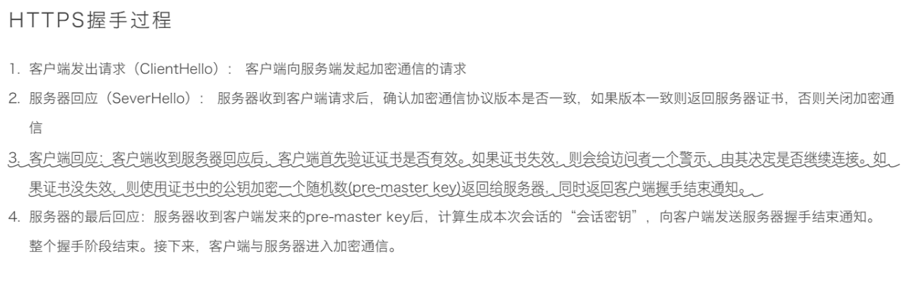
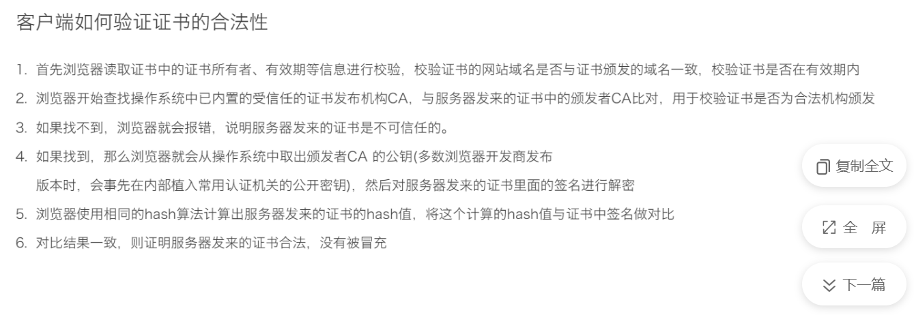

# 数字证书签名流程：
首先 **CA** 会把持有者的公钥、用途、颁发者、有效时间等信息打成一个包，然后对这些信息进行 Hash 计算，得到一个 Hash 值；

然后 **CA** 会使用**自己的私钥**将该 Hash 值加密，生成 Certificate Signature，也就是 CA 对证书做了签名；

最后将 Certificate Signature 添加在文件证书上，形成数字证书；

# 证书验证流程：

首先客户端会使用同样的 Hash 算法获取该证书的 Hash 值 H1；

通常浏览器和操作系统中集成了 CA 的公钥信息，浏览器收到证书后可以使用 CA 的公钥解密 Certificate Signature 内容，得到一个 Hash 值 H2 ；

最后比较 H1 和 H2，如果值相同，则为可信赖的证书，否则则认为证书不可信。
