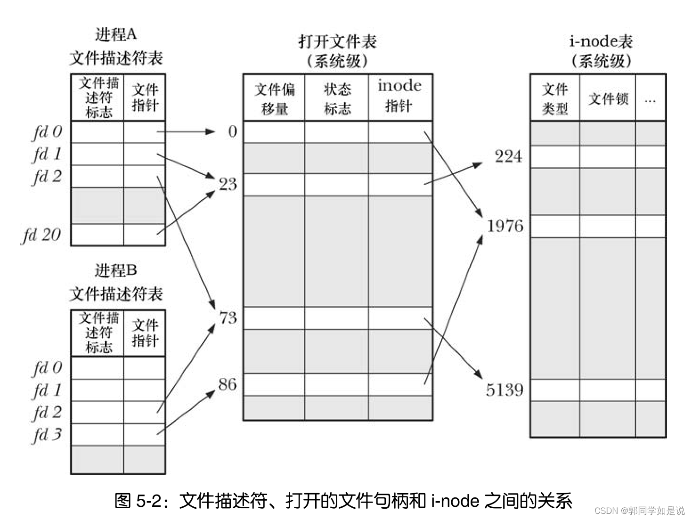
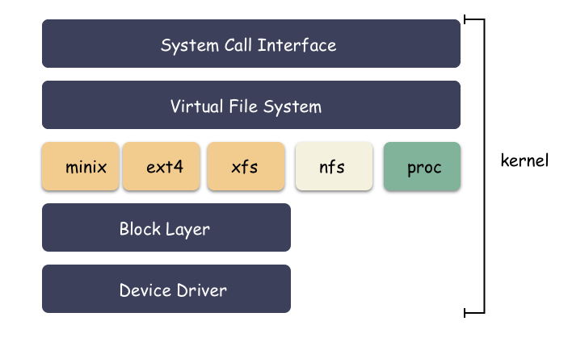
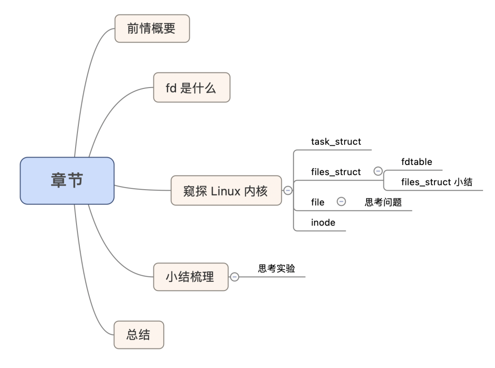
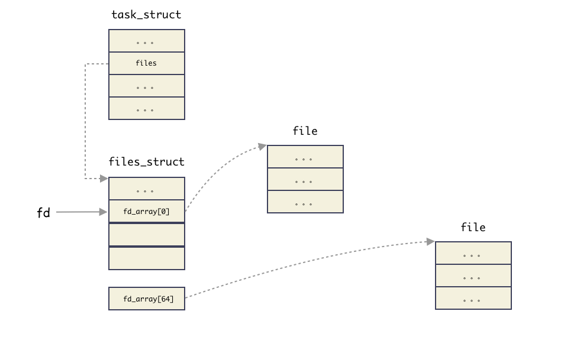
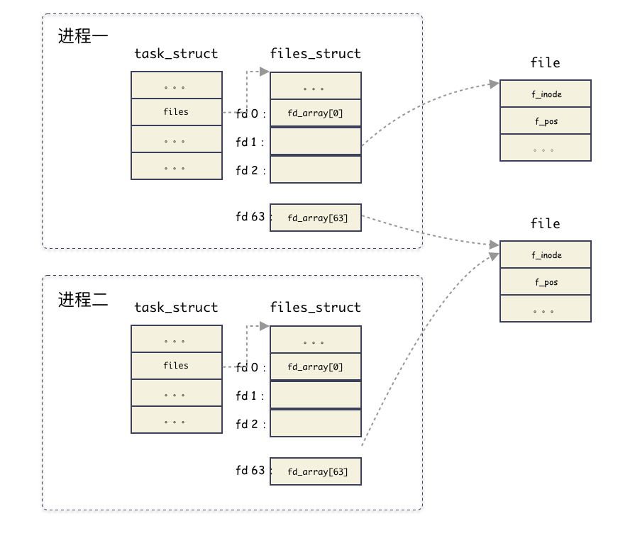
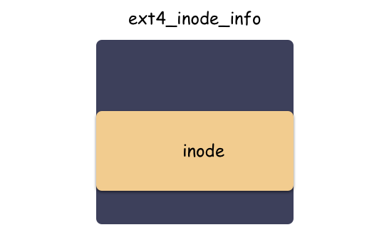
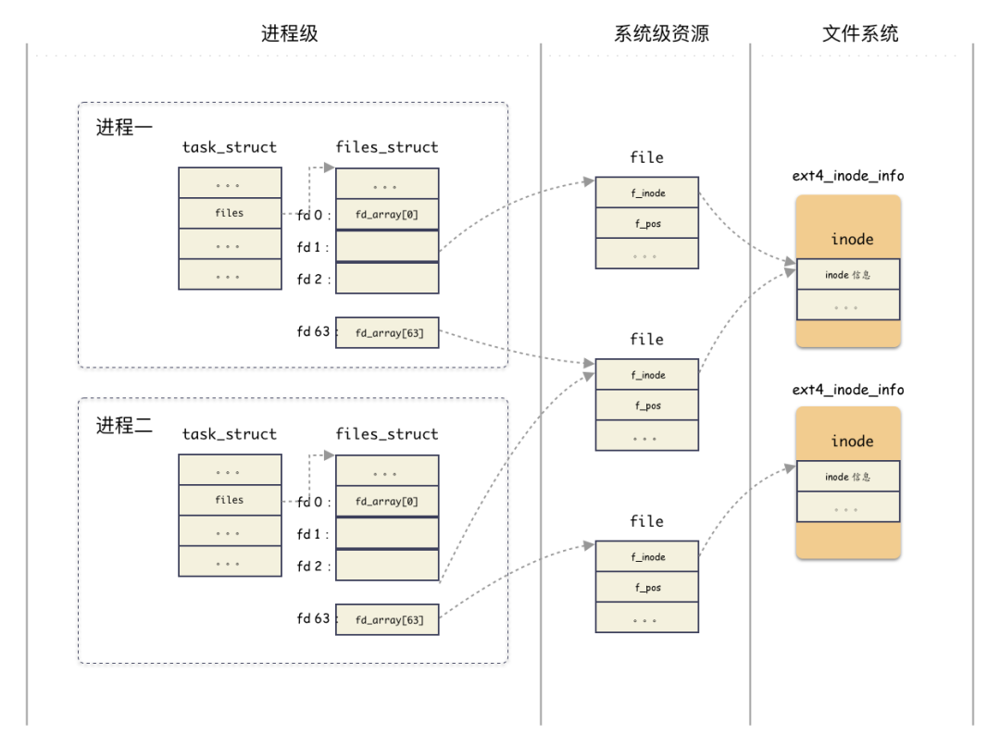

## 文件描述符

Linux中，文件描述符（File descriptor，fd），是表示指向文件的引用的抽象化概念，在形式上是一个非负整数，当进程打开现有文件或创建新文件时，内核向进程返回一个文件描述符

下面open系统调用返回一个文件描述符给fd

```
fd = open(pathname, flags, mode)
```

常见的几个文件描述符：

-   STDIN，文件描述符：0；标准输入，默认从键盘读取信息；
    
-   STDOUT，文件描述符：1；标准输出，默认将输出结果输出至终端；
    
-   STDERR，文件描述符：2；标准错误，默认将输出结果输出至终端
    

## 向标准输出中写入字符串

标准输出的文件描述符为1

```
#include <string.h>
#include <sys/syscall.h>
#include <unistd.h>

int main(int argc, char *argv[])
{
    char *msg = "Hello, world!\n";
    syscall(SYS_write, 1, msg, strlen(msg));

    return 0;
}
```

编译运行：

```
$  ./a.out
Hello, world!
```

## inode

inode是用来存储文件**元数据**的，`stat`命令可以输出一个文件的元信息

```
stat C
  File: C
  Size: 4096            Blocks: 8          IO Block: 4096   directory
Device: 801h/2049d      Inode: 786444      Links: 2
Access: (0775/drwxrwxr-x)  Uid: ( 1000/ zaralts)   Gid: ( 1000/ zaralts)
Access: 2022-04-09 16:44:06.279746438 +0800
Modify: 2022-04-07 22:51:11.594725534 +0800
Change: 2022-04-07 22:51:11.594725534 +0800
 Birth: -
```

`df -i` 命令查看每个[硬盘分区](https://so.csdn.net/so/search?q=%E7%A1%AC%E7%9B%98%E5%88%86%E5%8C%BA&spm=1001.2101.3001.7020)的inode总数和已经使用的数量

```
 df -i
Filesystem      Inodes  IUsed   IFree IUse% Mounted on
udev            493942    484  493458    1% /dev
tmpfs           500214   1088  499126    1% /run
/dev/sda1      2621440 227759 2393681    9% /
tmpfs           500214      1  500213    1% /dev/shm
tmpfs           500214      5  500209    1% /run/lock
tmpfs           500214     18  500196    1% /sys/fs/cgroup
tmpfs           500214     25  500189    1% /run/user/121
tmpfs           500214     49  500165    1% /run/user/1000
```

`ll -i`可以列出当前目录所有的包括inode号的文件信息

inode号是在第一列

```
ll -i
528761 drwxr-xr-x 22 zaralts zaralts  4096 4月   8 21:17 ./
524289 drwxr-xr-x  3 root    root     4096 4月   2 16:31 ../
524792 -rw-------  1 zaralts zaralts  5848 4月   8 15:36 .bash_history
528764 -rw-r--r--  1 zaralts zaralts   220 4月   2 16:31 .bash_logout
528762 -rw-r--r--  1 zaralts zaralts  3771 4月   2 16:31 .bashrc
```



-   每个进程都会有文件描述符表，该表的每一条都记录了单个文件描述符的相关信息
-   内核对所有打开的文件维护有一个系统级的描述表格（open file description table），表中各条目称为打开文件句柄（open file handle），一个打开文件句柄存储了与一个打开文件相关的全部信息，比如当前文件偏移量、对该文件 i-node 对象的引用等

## /proc/pid/fd

该文件夹包含了某一进程所占用的文件描述符  
下图中socket：后面显示的是对应的inode号

```
/proc/92044/fd$ ll
total 0
dr-x------ 2 zaralts zaralts  0 4月   9 21:54 ./
dr-xr-xr-x 9 zaralts zaralts  0 4月   9 21:17 ../
lr-x------ 1 zaralts zaralts 64 4月   9 21:54 0 -> /dev/null
lrwx------ 1 zaralts zaralts 64 4月   9 21:54 1 -> 'socket:[39859]'
lrwx------ 1 zaralts zaralts 64 4月   9 21:54 10 -> 'socket:[477522]'
```

## /proc/sys/fs/inode-state

-   第一列的值为已经分配的inode数量（nr\_inodes）
-   第二列的值为剩余可分配的inode数量（nr\_free\_inodes）
-   第三列当nr\_inodes > inode-max时为非 0（preshrink）
-   后面三个为dummy values（总是为0）

```
$ cat /proc/sys/fs/inode-state                             
139193  25844   0       0       0       0       0
```


------

总结：

- **`struct task_struct` 是进程的抽象封装**，标识一个进程。包含属性 files_struct。

- `struct files_struct` 这个结构体。**这个结构体管理某进程打开的所有文件的管理结构**。`file_struct` 本质上是用来管理所有打开的文件的，内部的核心是由一个**静态数组** fd_array 和**动态数组** fdtable 管理结构实现。

-  `fdtable` 结构体，这个结构体就是封装用来管理 `fd` 的结构体，`fd` 的秘密就在这个里面。

  - ```c++
    struct fdtable {
        unsigned int max_fds;
        struct file __rcu **fd;      /* current fd array */
    };
    ```

  - **文件描述符 `fd` 本质上就是索引吗？这里就把概念接上了，`fd` 就是这个数组的索引，也就是数组的槽位编号而已。** 通过非负数 `fd` 就能拿到对应的 `struct file` 结构体的地址。

  


-  `struct file` 这个结构体是用来表征进程打开的文件的。

  - ```c
    struct file {
        // ...
        struct path                     f_path;
        struct inode                    *f_inode;
        const struct file_operations    *f_op;
     
        atomic_long_t                    f_count;
        unsigned int                     f_flags;
        fmode_t                          f_mode;
        struct mutex                     f_pos_lock;
        loff_t                           f_pos;
        struct fown_struct               f_owner;
        // ...
    }
    
    ```

  - 这个结构体非常重要，它标识一个进程打开的文件，下面解释 IO 相关的几个最重要的字段：

    - `f_path` ：标识文件名
    - `f_inode` ：非常重要的一个字段，`inode` 这个是 vfs 的 `inode` 类型，是基于具体文件系统之上的抽象封装；
    - `f_pos` ：这个字段非常重要，偏移，对，**就是当前文件偏移**。还记得上一篇 IO 基础里也提过偏移对吧，指的就是这个，`f_pos` 在 `open` 的时候会设置成默认值，`seek` 的时候可以更改，从而影响到 `write/read` 的位置；

  - **`struct file` 是属于系统级别的结构，换句话说是可以共享与多个不同的进程。**

    - **什么时候会出现多个进程的  `fd` 指向同一个 `file` 结构体？**父进程打开了文件，后面 `fork` 出一个子进程。这种情况就会出现共享 `file` 的场景
    - **在同一个进程中，多个 `fd` 可能指向同一个 file 结构吗？**可以。`dup` 函数。

- `struct file` 结构体里面有一个 inode 的指针，也就自然引出了 inode 的概念。这个指向的 inode 并没有直接指向具体文件系统的 inode ，而是操作系统抽象出来的一层虚拟文件系统，叫做 **VFS （ Virtual File System ）**，然后在 VFS 之下才是真正的文件系统，比如 ext4 之类的。

  - 

  - ```c
    struct inode {
        // 文件相关的基本信息（权限，模式，uid，gid等）
        umode_t             i_mode;
        unsigned short      i_opflags;
        kuid_t              i_uid;
        kgid_t              i_gid;
        unsigned int        i_flags;
        // 回调函数
        const struct inode_operations   *i_op;
        struct super_block              *i_sb;
        struct address_space            *i_mapping;
        // 文件大小，atime，ctime，mtime等
        loff_t              i_size;
        struct timespec64   i_atime;
        struct timespec64   i_mtime;
        struct timespec64   i_ctime;
        // 回调函数
        const struct file_operations    *i_fop;
        struct address_space            i_data;
        // 指向后端具体文件系统的特殊数据
        void    *i_private;     /* fs or device private pointer */
    };
    ```

  - ```c
    struct ext4_inode_info {
        // ext4 inode 特色字段
        // ...
        
        // 重要！！！
        struct inode    vfs_inode;  
    };
    ```

  - 所有文件系统共性的东西抽象到 vfs `inode` ，不同文件系统差异的东西放在各自的 `inode` 结构体中。

- 当用户打开一个文件，用户只得到了一个 `fd` 句柄，但内核做了很多事情，梳理下来，我们得到几个关键的数据结构，这几个数据结构是有层次递进关系的，我们简单梳理下：

  1. 进程结构 `task_struct` ：表征进程实体，每一个进程都和一个 `task_struct` 结构体对应，其中 `task_struct.files` 指向一个管理打开文件的结构体 `fiels_struct` ；
  2. 文件表项管理结构 `files_struct` ：用于管理进程打开的 open 文件列表，内部以数组的方式实现（静态数组和动态数组结合）。返回给用户的 `fd` 就是这个数组的**编号索引**而已，索引元素为 `file` 结构；

  - `files_struct` 只从属于某进程；

  - 文件 `file` 结构：表征一个打开的文件，内部包含关键的字段有：**当前文件偏移，inode 结构地址**；
  - - 该结构虽然由进程触发创建，但是 `file` 结构可以在进程间共享；
  - vfs `inode` 结构体：文件 `file` 结构指向 的是 vfs 的 `inode` ，这个是操作系统抽象出来的一层，用于屏蔽后端各种各样的文件系统的 `inode` 差异；
  - - inode 这个具体进程无关，是文件系统级别的资源；
  - ext4 `inode` 结构体（指代具体文件系统 inode ）：后端文件系统的 `inode` 结构，不同文件系统自定义的结构体，ext2 有 `ext2_inode_info`，ext4 有`ext4_inode_info`，minix 有 `minix_inode_info`，这些结构里都是内嵌了一个 vfs `inode` 结构体，原理相同；
  - **完整的架构图：**

- **文件读写（ IO ）的时候会发生什么？**

  - 在完成 write 操作后，在文件 `file` 中的当前文件偏移量会增加所写入的字节数，如果这导致当前文件偏移量超处了当前文件长度，则会把 inode 的当前长度设置为当前文件偏移量（也就是文件变长）
  - `O_APPEND` 标志打开一个文件，则相应的标识会被设置到文件 `file` 状态的标识中，每次对这种具有追加写标识的文件执行 `write` 操作的时候，`file` 的当前文件偏移量首先会被设置成 `inode` 结构体中的文件长度，这就使得每次写入的数据都追加到文件的当前尾端处（该操作对用户态提供原子语义）；
  - 若一个文件 `seek` 定位到文件当前的尾端，则 `file` 中的当前文件偏移量设置成 `inode` 的当前文件长度；
  - `seek` 函数值修改 `file` 中的当前文件偏移量，不进行任何 `I/O` 操作；
  - 每个进程对有它自己的 `file`，其中包含了当前文件偏移，当多个进程写同一个文件的时候，由于一个文件 IO 最终只会是落到全局的一个 `inode` 上，这种并发场景则可能产生用户不可预期的结果；


> [(125条消息) 文件描述符 fd 究竟是什么？\_布道师Peter的博客-CSDN博客](https://blog.csdn.net/melody157398/article/details/116460459)

  


前情概要


通过上篇 **[Go 存储基础 — 文件 IO 的姿势](http://mp.weixin.qq.com/s?__biz=Mzg3NTU3OTgxOA%3D%3D&chksm=cf3e06f8f8498fee063670f21bd0a756ef821e359709ed62720b48927ad18eeb0757399036a8&idx=1&mid=2247489085&scene=21&sn=1eb51ea0a00a00a7a62f232221bafaf8#wechat_redirect)**， 我们看到有两种文件读写的方式，一种是系统调用的方式，操作的对象是一个整数 fd，另一种是 Go 标准库自己封装的标准库 IO ，操作对象是 Go 封装的 `file` 结构体，但其内部还是针对整数 fd 的操作。所以一切的本源是通过 fd 来操作的，那么，这个 fd 究竟是什么？就这个点我们深入剖析。


fd 是什么？


`fd` 是 `File descriptor` 的缩写，中文名叫做：**文件描述符**。**文件描述符**是一个非负整数，**本质上是一个索引值**（这句话非常重要）。  

**什么时候拿到的 `fd` ？**

当打开一个文件时，内核向进程返回一个文件描述符（ `open` 系统调用得到 ），后续 `read`、`write` 这个文件时，则只需要用这个**文件描述符**来标识该文件，将其作为参数传入 `read`、`write` 。

**fd 的值范围是什么？**

在 POSIX 语义中，0，1，2 这三个 fd 值已经被赋予特殊含义，分别是标准输入（ STDIN\_FILENO ），标准输出（ STDOUT\_FILENO ），标准错误（ STDERR\_FILENO ）。

文件描述符是有一个范围的：0 ～ OPEN\_MAX-1 ，最早期的 UNIX 系统中范围很小，现在的主流系统单就这个值来说，变化范围是几乎不受限制的，只受到系统硬件配置和系统管理员配置的约束。

你可以通过 `ulimit` 命令查看当前系统的配置：

```
➜  ulimit -n4864
```

如上，我系统上进程默认最多打开 4864 文件。


窥探 Linux 内核


`fd` 究竟是什么？必须去 Linux 内核看一眼。  

用户使用系统调用 `open` 或者 `creat` 来打开或创建一个文件，用户态得到的结果值就是 `fd` ，后续的 `IO` 操作全都是用 `fd` 来标识这个文件，可想而知内核做的操作并不简单，我们接下来就是要揭开这层面纱。

## 

task\_struct

首先，我们知道进程的抽象是基于 `struct task_struct` 结构体，这是 Linux 里面最复杂的结构体之一 ，成员字段非常多，我们今天不需要详解这个结构体，我稍微简化一下，只提取我们今天需要理解的字段如下：

```
struct task_struct {struct files_struct     *files;}
```

**`files;` 这个字段就是今天的主角之一**，`files` 是一个指针，指向一个为 `struct files_struct` 的结构体。这个结构体就是用来管理该进程**打开的所有文件**的管理结构。

**重点理解一个概念：**

**`struct task_struct` 是进程的抽象封装**，标识一个进程，在 Linux 里面的进程各种抽象视角，都是这个结构体给到你的。当创建一个进程，其实也就是 `new` 一个 `struct task_struct` 出来；

## 

files\_struct

好，上面通过进程结构体引出了 `struct files_struct` 这个结构体。**这个结构体管理某进程打开的所有文件的管理结构**，这个结构体本身是比较简单的：

```
struct files_struct {    atomic_t count;bool resize_in_progress;    wait_queue_head_t resize_wait;struct fdtable __rcu *fdt;struct fdtable fdtab;    unsigned int next_fd;    unsigned long close_on_exec_init[1];    unsigned long open_fds_init[1];    unsigned long full_fds_bits_init[1];struct file * fd_array[NR_OPEN_DEFAULT];};
```

`files_struct` 这个结构体我们说是用来管理所有打开的文件的。怎么管理？本质上就是数组管理的方式，所有打开的文件结构都在一个数组里。这可能会让你疑惑，数组在那里？有两个地方：

1.  `struct file * fd_array[NR_OPEN_DEFAULT]` 是一个静态数组，随着 `files_struct` 结构体分配出来的，在 64 位系统上，静态数组大小为 64；
    
2.  `struct fdtable` 也是个数组管理结构，只不过这个是一个动态数组，数组边界是用字段描述的；
    

**思考：为什么会有这种静态 + 动态的方式？**

性能和资源的权衡 ！大部分进程只会打开少量的文件，所以静态数组就够了，这样就不用另外分配内存。如果超过了静态数组的阈值，那么就动态扩展。

可以回忆下，这个是不是跟 `inode` 的直接索引，一级索引的优化思路类似。

#### `fdtable`

简单介绍下 `fdtable` 结构体，这个结构体就是封装用来管理 `fd` 的结构体，`fd` 的秘密就在这个里面。简化结构体如下：

```
struct fdtable {    unsigned int max_fds;struct file __rcu **fd;      };
```

注意到 `fdtable.fd` 这个字段是一个二级指针，什么意思？

就是指向 `fdtable.fd` 是一个指针字段，指向的内存地址还是存储指针的（元素指针类型为  `struct file *` ）。换句话说，`fdtable.fd` 指向一个数组，数组元素为指针（指针类型为 `struct file *`）。

其中 `max_fds` 指明数组边界。

#### `files_struct` 小结

`file_struct` 本质上是用来管理所有打开的文件的，内部的核心是由一个**静态数组**和**动态数组**管理结构实现。

**还记得上面我们说文件描述符 `fd` 本质上就是索引吗？这里就把概念接上了，`fd` 就是这个数组的索引，也就是数组的槽位编号而已。** 通过非负数 `fd` 就能拿到对应的 `struct file` 结构体的地址。

我们把概念串起来（注意，这里为了突出 `fd` 的本质,把 `fdtable` 管理简化掉）：

  

-   `fd` 真的就是 `files` 这个字段指向的指针数组的索引而已（仅此而已）。通过 `fd` 能够找到对应文件的 `struct file` 结构体；
    

## 

file

现在我们知道了 `fd` 本质是数组索引，数组元素是 `struct file` 结构体的指针。那么这里就引出了一个 `struct file` 的结构体。这个结构体又是用来干什么的呢？

这个结构体是用来表征进程打开的文件的。简化结构如下：

```
struct file {struct path                     f_path;struct inode                    *f_inode;const struct file_operations    *f_op;    atomic_long_t                    f_count;    unsigned int                     f_flags;    fmode_t                          f_mode;struct mutex                     f_pos_lock;    loff_t                           f_pos;struct fown_struct               f_owner;}
```

这个结构体非常重要，它标识一个进程打开的文件，下面解释 IO 相关的几个最重要的字段：

-   `f_path` ：标识文件名
    
-   `f_inode` ：非常重要的一个字段，`inode` 这个是 vfs 的 `inode` 类型，是基于具体文件系统之上的抽象封装；
    
-   `f_pos` ：这个字段非常重要，偏移，对，**就是当前文件偏移**。还记得上一篇 IO 基础里也提过偏移对吧，指的就是这个，`f_pos` 在 `open` 的时候会设置成默认值，`seek` 的时候可以更改，从而影响到 `write/read` 的位置；
    

#### 思考问题

**思考问题一：`files_struct` 结构体只会属于一个进程，那么`struct file` 这个结构体呢，是只会属于某一个进程？还是可能被多个进程共享？**

**划重点：`struct file` 是属于系统级别的结构，换句话说是可以共享与多个不同的进程。**

**思考问题二：什么时候会出现多个进程的  `fd`  指向同一个 `file`  结构体？**

比如 `fork`  的时候，父进程打开了文件，后面 `fork` 出一个子进程。这种情况就会出现共享 `file` 的场景。如图：

  

**思考问题三：在同一个进程中，多个 `fd` 可能指向同一个 file 结构吗？**

可以。`dup`  函数就是做这个的。

```
#include <unistd.h>int dup(int oldfd);int dup2(int oldfd, int newfd);
```

###   

## 

inode

我们看到 `struct file` 结构体里面有一个 inode 的指针，也就自然引出了 inode 的概念。这个指向的 inode 并没有直接指向具体文件系统的 inode ，而是操作系统抽象出来的一层虚拟文件系统，叫做 **VFS （ Virtual File System ）**，然后在 VFS 之下才是真正的文件系统，比如 ext4 之类的。

完整架构图如下：

  

**思考：为什么会有这一层封装呢？**

其实很容里理解，就是解耦。如果让 `struct file` 直接和 `struct ext4_inode` 这样的文件系统对接，那么会导致 `struct file` 的处理逻辑非常复杂，因为每对接一个具体的文件系统，就要考虑一种实现。所以操作系统必须把底下文件系统屏蔽掉，对外提供统一的 `inode` 概念，对下定义好接口进行**回调注册**。这样让 `inode` 的概念得以统一，Unix 一切皆文件的基础就来源于此。

再来看一样 VFS 的 `inode` 的结构：

```
struct inode {    umode_t             i_mode;    unsigned short      i_opflags;    kuid_t              i_uid;    kgid_t              i_gid;    unsigned int        i_flags;const struct inode_operations   *i_op;struct super_block              *i_sb;struct address_space            *i_mapping;    loff_t              i_size;struct timespec64   i_atime;struct timespec64   i_mtime;struct timespec64   i_ctime;const struct file_operations    *i_fop;struct address_space            i_data;    void    *i_private;     };
```

其中包括了一些基本的文件信息，包括 uid，gid，大小，模式，类型，时间等等。

一个 vfs 和 后端具体文件系统的纽带：`i_private` 字段。\*\*用来传递一些具体文件系统使用的数据结构。

至于 `i_op` 回调函数在构造 `inode` 的时候，就注册成了后端的文件系统函数，比如 ext4 等等。

**思考问题：通用的 VFS 层，定义了所有文件系统通用的 inode，叫做 vfs inode，而后端文件系统也有自身特殊的 inode 格式，该格式是在 vfs inode 之上进行扩展的，怎么通过 vfs inode 怎么得到具体文件系统的 inode 呢？**

下面以 ext4 文件系统举例（因为所有的文件系统套路一样），ext4 的 inode 类型是 `struct ext4_inode_info` 。

**划重点**：方法其实很简单，这个是属于 c 语言一种常见的（也是特有）编程手法：强转类型。**vfs inode 出生就和 `ext4_inode_info` 结构体分配在一起的，直接通过 vfs inode 结构体的地址强转类型就能得到 `ext4_inode_info` 结构体**。

```
struct ext4_inode_info {struct inode    vfs_inode;  };
```

举个例子，现已知 inode 地址和 vfs\_inode 字段的内偏移如下：

-   inode 的地址为 0xa89be0；
    
-   `ext4_inode_info` 里有个内嵌字段 vfs\_inode，类型为 `struct inode` ，该字段在结构体内偏移为 64 字节；
    

则可以得到：

`ext4_inode_info` 的地址为

```
(struct ext4_inode_info *)(0xa89be0 - 64)
```

强转方法使用了一个叫做 `container_of` 的宏，如下：

```
static inline struct ext4_inode_info *EXT4_I(struct inode *inode){return container_of(inode, struct ext4_inode_info, vfs_inode);}#define container_of(ptr, type, member) \    (type *)((char *)(ptr) - (char *) &((type *)0)->member)#endif
```

所以，你懂了吗？

分配 inode 的时候，其实分配的是 `ext4_inode_info` 结构体，包含了 vfs inode，然后对外给出去 vfs\_inode 字段的地址即可。VFS 层拿 inode 的地址使用，底下文件系统强转类型后，取外层的 inode 地址使用。

举个 ext4 文件系统的例子：

```
static struct inode *ext4_alloc_inode(struct super_block *sb){struct ext4_inode_info *ei;    ei = kmem_cache_alloc(ext4_inode_cachep, GFP_NOFS);return &ei->vfs_inode;}
```

vfs 拿到的就是这个 inode 地址。

  

**划重点：inode 的内存由后端文件系统分配，vfs inode 结构体内嵌在不同的文件系统的 inode 之中。不同的层次用不同的地址，ext4 文件系统用 `ext4_inode_info` 的结构体的地址，vfs 层用 `ext4_inode_info.vfs_inode` 字段的地址。**

这种用法在 C 语言编程中很常见，算是 C 的特色了（仔细想想，这种用法和**面向对象的多态**的实现异曲同工）。

**思考问题：怎么理解 vfs `inode` 和 `ext2_inode_info`，`ext4_inode_info` 等结构体的区别？**

所有文件系统共性的东西抽象到 vfs `inode` ，不同文件系统差异的东西放在各自的 `inode` 结构体中。


小结梳理


当用户打开一个文件，用户只得到了一个 `fd` 句柄，但内核做了很多事情，梳理下来，我们得到几个关键的数据结构，这几个数据结构是有层次递进关系的，我们简单梳理下：  

1.  进程结构 `task_struct` ：表征进程实体，每一个进程都和一个 `task_struct` 结构体对应，其中 `task_struct.files` 指向一个管理打开文件的结构体 `fiels_struct` ；
    
2.  文件表项管理结构 `files_struct` ：用于管理进程打开的 open 文件列表，内部以数组的方式实现（静态数组和动态数组结合）。返回给用户的 `fd` 就是这个数组的**编号索引**而已，索引元素为 `file` 结构；
    

-   `files_struct` 只从属于某进程；
    
-   文件 `file` 结构：表征一个打开的文件，内部包含关键的字段有：**当前文件偏移，inode 结构地址**；
    
-   -   该结构虽然由进程触发创建，但是 `file`  结构可以在进程间共享；
    
-   vfs `inode` 结构体：文件 `file` 结构指向 的是 vfs 的 `inode` ，这个是操作系统抽象出来的一层，用于屏蔽后端各种各样的文件系统的 `inode` 差异；
    
-   -   inode 这个具体进程无关，是文件系统级别的资源；
    
-   ext4 `inode` 结构体（指代具体文件系统 inode ）：后端文件系统的 `inode` 结构，不同文件系统自定义的结构体，ext2 有 `ext2_inode_info`，ext4 有`ext4_inode_info`，minix 有 `minix_inode_info`，这些结构里都是内嵌了一个 vfs `inode` 结构体，原理相同；
    
-   **完整的架构图：**
    
      
    
    ### 思考实验
    
    现在我们已经彻底了解 fd 这个所谓的非负整数代表的深层含义了，我们可以准备一些 IO 的思考举一反三。
    
    **文件读写（ IO ）的时候会发生什么？**
    
    -   在完成 write 操作后，在文件 `file`  中的当前文件偏移量会增加所写入的字节数，如果这导致当前文件偏移量超处了当前文件长度，则会把 inode 的当前长度设置为当前文件偏移量（也就是文件变长）
        
    -   `O_APPEND`  标志打开一个文件，则相应的标识会被设置到文件 `file`  状态的标识中，每次对这种具有追加写标识的文件执行 `write` 操作的时候，`file` 的当前文件偏移量首先会被设置成 `inode` 结构体中的文件长度，这就使得每次写入的数据都追加到文件的当前尾端处（该操作对用户态提供原子语义）；
        
    -   若一个文件 `seek` 定位到文件当前的尾端，则 `file` 中的当前文件偏移量设置成 `inode` 的当前文件长度；
        
    -   `seek` 函数值修改 `file` 中的当前文件偏移量，不进行任何 `I/O` 操作；
        
    -   每个进程对有它自己的 `file`，其中包含了当前文件偏移，当多个进程写同一个文件的时候，由于一个文件 IO 最终只会是落到全局的一个 `inode` 上，这种并发场景则可能产生用户不可预期的结果；
        
    
    
    
    总结
    
    
    
    **回到初心，理解 fd 的概念有什么用？**  
    
    一切 IO 的行为到系统层面都是以 `fd` 的形式进行。无论是 C/C++，Go，Python，JAVA 都是一样，任何语言都是一样，这才是最本源的东西，理解了 `fd` 关联的一系列结构，你才能对 IO 游刃有余。
    
    **简要的总结：**
    
    1.  从姿势上来讲，用户 `open` 文件得到一个非负数句柄 `fd`，之后针对该文件的 IO 操作都是基于这个 `fd` ；
        
    2.  文件描述符 `fd` 本质上来讲就是数组索引，`fd` 等于 5 ，那对应数组的第 5 个元素而已，该数组是进程打开的所有文件的数组，数组元素类型为 `struct file`；
        
    3.  结构体 `task_struct` 对应一个抽象的进程，`files_struct` 是这个进程管理**该进程打开的文件**数组管理器。`fd` 则对应了这个数组的编号，每一个打开的文件用 `file` 结构体表示，内含当前偏移等信息；
        
    4.  `file` 结构体可以为进程间共享，属于系统级资源，同一个文件可能对应多个 `file` 结构体，`file` 内部有个 `inode` 指针，指向文件系统的 `inode`；
        
    5.  `inode` 是文件系统级别的概念，只由文件系统管理维护，不因进程改变（ `file` 是进程出发创建的，进程 `open` 同一个文件会导致多个 `file` ，指向同一个 `inode` ）；
        
    
    **回顾一眼架构图：  
    **
    
    
    
    ~完～
    
    
    
    后记
    
    
    
    内核把最复杂的活干了，只暴露给您最简单的一个非负整数 `fd` 。所以，绝大部分场景会用`fd` 就行，倒不用想太多。当然如果能再深入看一眼**知其所以然**是最好不过。本文分享是基础准备篇，希望能给你带来不一样的 IO 视角。
    
    
    
    
    
    5T技术资源大放送！包括但不限于：C/C++，Arm, Linux，Android，人工智能，单片机，树莓派，等等。在公众号内回复「peter」，即可免费获取！！  
    
     **记得点击****分享****、****赞****和****在看****，给我**