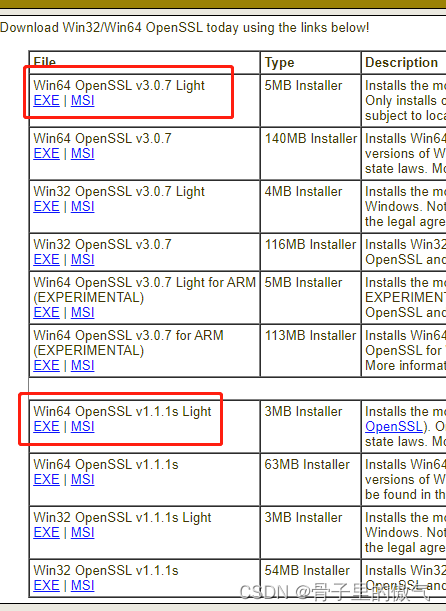
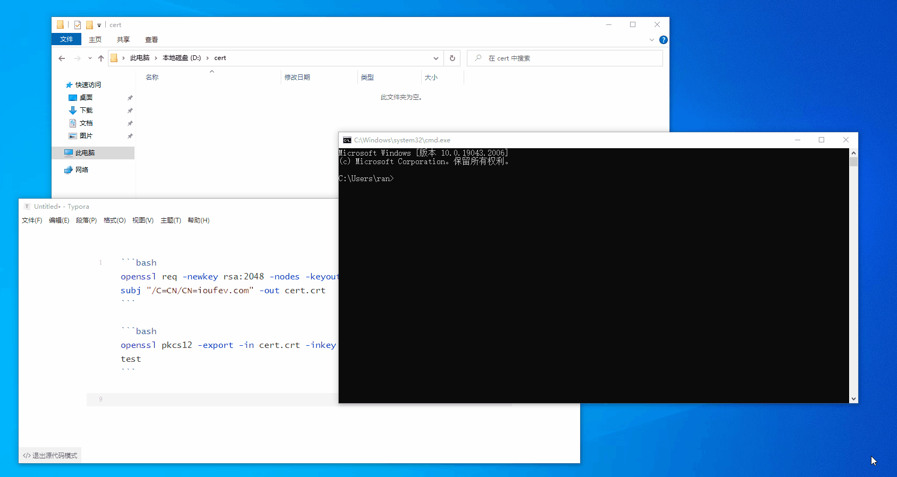

[(124条消息) 本地生成Https证书(Windows)\_骨子里的傲气的博客-CSDN博客](https://blog.csdn.net/huyaguang/article/details/128192978)


SL证书有一对密钥：公钥和私钥。这些密钥协同工作以建立加密连接。证书还包含所谓的“主题”，即证书/网站所有者的身份。

主要包括：域名、有效期、证书链、CA机构的一些信息。


**公钥只能用做数据加密。公钥加密的数据，只能用对应的私钥才能解密。这是非对称加密的核心概念**。

1、消息**接收方**准备好公钥和私钥

2、私钥**接收方**自己留存、公钥发布给消息**发送方**

3、消息**发送方**使用接收方公钥对消息进行加密

4、消息**接收方**用自己的私钥对消息解密


RSA 加解密算法其实很简单：

密文=明文^E公钥 mod N

明文=密文^D私钥 mod N


1、下载[OpenSSL](https://slproweb.com/products/Win32OpenSSL.html "OpenSSL")

如果证书需要用在IIS上面 建议安装1.1.1，不然导入证书会出现网络密码错误



 2、安装完毕后添加环境变量

```
C:\Program Files\OpenSSL-Win64\bin
```

3、查看[OpenSSL](https://so.csdn.net/so/search?q=OpenSSL&spm=1001.2101.3001.7020)版本号

```
D:\cert>openssl versionOpenSSL 1.1.1s  1 Nov 2022
```

4、比如想要生成的证书，放在 D 盘 cert 文件夹下，先 `CD` 到目录

```
C:\Users\ran>D:D:\>cd D:\certD:\cert>
```

5、生成密钥，生成自签名证书

```
openssl req -newkey rsa:2048 -nodes -keyout key.pem -x509 -days 3650 -subj "/C=CN/CN=ioufev.com" -out cert.crt
```

🍄 输出的密钥：key.pem  
🍄 输出的证书：cert.[crt](https://so.csdn.net/so/search?q=crt&spm=1001.2101.3001.7020)  
🍐 证明的信息：/C=CN/CN=ioufev.com

最简单的证明信息要有  
💎 C=CN，表示中国  
💎 CN=ioufev.com，证书绑定域名：ioufev.com

6、将密钥和证书合并成一个 pfx 文件，并输入文件保护密码：12345678

🍄 输入的密钥：key.pem  
🍄 输入的证书：cert.crt  
🍏 输出的 pfx 证书：test.pfx  
🍀 输出证书的名字：test，不加 `-name test` 的话，默认名字是 1

详细操作流程

```
C:\Users\ran>D:D:\>cd D:\certD:\cert>openssl req -newkey rsa:2048 -nodes -keyout key.pem -x509 -days 3650 -subj "/C=CN/CN=ioufev.com" -out cert.crt...................+...+...+++++++++++++++++++++++++++++++++++++++++++++++++++++++++++++++++*...+..+......+...+....+.....+.+.....+......+...+.+.....................+...+...+..+......+.+..............+......+.+.........+...+......+..+...+.........+++++++++++++++++++++++++++++++++++++++++++++++++++++++++++++++++*.......+++++++++++++++++++++++++++++++++++++++++++++++++++++++++++++++++..+++++++++++++++++++++++++++++++++++++++++++++++++++++++++++++++++*..+...+..+.+...+..+.......+......+......+........+.+..+............+.............+...+......+........+...+....+.....+.+..................+.....+......+++++++++++++++++++++++++++++++++++++++++++++++++++++++++++++++++*.....+...+......+..+++++++++++++++++++++++++++++++++++++++++++++++++++++++++++++++++-----D:\cert>openssl pkcs12 -export -in cert.crt -inkey key.pem -out test.pfx -name testEnter Export Password:Verifying - Enter Export Password:D:\cert>-----D:\cert>openssl pkcs12 -export -in cert.crt -inkey key.pem -out test.pfx -name testEnter Export Password:Verifying - Enter Export Password:D:\cert>
```

