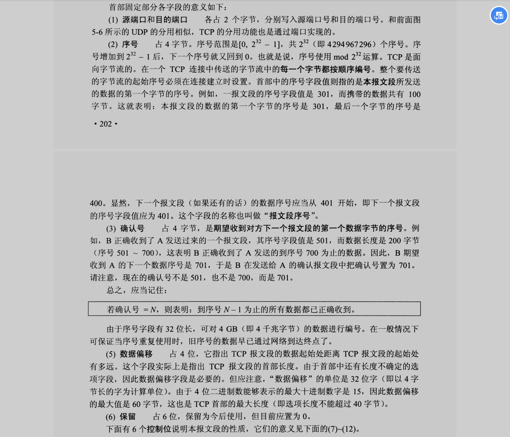
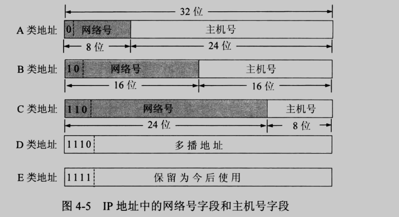
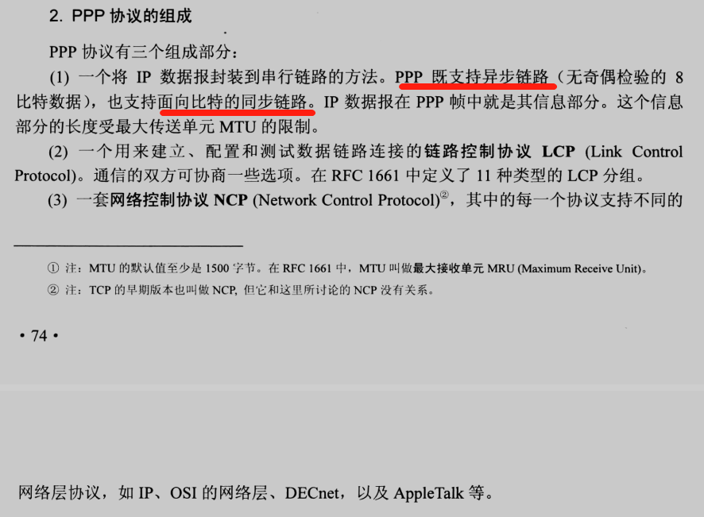

[数据链路层相关知识 - 懒惰的星期六 - 博客园](https://www.cnblogs.com/sunupo/p/16709120.html)


#  5. 应用层

## DNS

### 任播


## 文件传输协议


### FTP（基于TCP）

### TFTP（基于UDP）

# 4. 传输层 TCP UDP

## UDP


## TCP

> [TCP报文的最大负载和报文的最小长度 - zhuzhu2016 - 博客园](https://www.cnblogs.com/zhuzhu2016/p/5797534.html)
>
> 以太网数据部分 46-1500，整个帧64-1518




> 首部长度不超过 40字节，受限于4bit字段“数据偏移”，单位：4字节。所以不能超过40字节。


### 时间戳选项


## MSS


## GBN SR

**Go-Back-N**协议和**Selective-Repeat**协议是[计算机网络](https://so.csdn.net/so/search?q=计算机网络&spm=1001.2101.3001.7020)在传输层和链路层用于实现可靠数据传输的两个重要协议。Internet的TCP协议在设计时借鉴了上述两个协议的基本思想。

### GBN

Go-Back-N(GBN)协议

接收方是没有缓存的，所以接收方对于乱序到达的分组直接丢弃，并且重新发送目前为止接收到的分组中序列号最大的按序到达的分组。

> 简单的习题：  数据链路层采用后退N帧（GBN）协议，发送方已经发送了编号为 0～7的帧。当计时器超时时，**若发送方只收到0、2、3号帧的确认** ，则发送方需要重发的帧数是多少？分别是那几个帧？  解：根据GBN协议工作原理，GBN协议的确认是累积确认，所以 此时**发送端需要重发的帧数是4个，依次分别是4、5、6、7号帧**。
>
> [图解回退N帧协议（GBN）- 窗口为什么是2^N-1？](https://blog.csdn.net/jiangchufeng123/article/details/122278427)
>
> 

### SR

Selective Repeat协议

由于GBN接收方没有缓存，对于非按序的分组直接丢弃，就会造成很多到达的分组由于顺序乱了，却白发了，需要再次重新发送。

显然为了提高效率，我们可以在接收方设置缓存，对于未按序达到的分组，先存起来，而不是直接丢弃。 这就是选择重复协议的思想
接收方对每个分组单独进行确认
 设置缓存机制，缓存乱序到达的分组 
发送方只重传那些没收到ACK的分组
  为每个分组设置定时器 
发送方窗口 
 N个连续的序列号 
 限制已发送且未确认的分组

`接收方` **是动态移动滑动窗口的，只有当窗口部分前面的全部正确接受并确认了，才向前移动**。

> [关于SR协议中，为什么接收方的滑动窗口的大小必须小于等于序号空间大小的一半？ - 知乎](https://zhuanlan.zhihu.com/p/432949861?utm_id=0)
>
> 

### GBN 与 SR 区别：

- **重传** 对于丢失分组 n，在 GBN 中，发送方会重传 n 及 n 以后的数据包；在 SR 中，只会重传 n。

- **缓存** 对于乱序达到的分组，在 GBN 中，接受段端会直接丢弃；在SR中，会把它们缓存下来。

- **定时器** 在 GBN 中一个连接只会设置一个定时器，在 SR 中会为每个分组设置定时器。

  

### 与 TCP 区别

​    重传和缓存像SR，定时器像GBN。

​    TCP 协议中的 ack 指的是期望收到的分组。而GBN，SR中 ack 指的是已经确认的分组。

## 可靠传输工作原理

### 停止等待协议


A --> B

#### 无差错情况

A发一个分组等一个ack

#### 出现差错

A 超时重传

#### 确认丢失和确认迟到

A 重传的原因：1. 可能 B 没收到 A 发送的分组；2. 可能 A 没收到 B 回复的 ack。


自动重传请求 ARQ（automatic repeat request）


### 连续 ARQ 协议


#### 累计确认


## TCP 可靠传输实现

A-->B

### 以字节为单位的滑动窗口


### 超时重传

linux2.6+ 使用的HZ=1000， 最小RTO = 200ms，最大 RTO= 120*1000 = 120 s

### 选择确认ASCK

tcp 头部 SACK 选项（两字节），最多支持4个块（8个边界共 32 字节）

## TCP 流量控制

### 利用滑动窗口实现流量控制

A 收到 B发送的零窗口报文之后，A会开启一个定时器用于发送==探测报文段==。避免当 B 有新的可用接收窗口时向 A 发送的报文丢失， 导致 A 一直干等着。

### 考虑传输效率

为什么有粘包和拆包呢？这段话可以回答。


- 合并多个数据直到达到  MSS 字节。
- tcp 的 push 字段，立即推送。
- 计时器超时，立即发送。

## TCP 的拥塞控制


### 慢开始和拥塞避免

#### 拥塞窗口


新名词：传输轮次


慢开始或者拥塞避免阶段如果出现拥塞。判断依据：==没有按时收到确认==。


完整流程大致为：慢开始--> 拥塞避免--> 出现拥塞--> ==ssthresh 减半 --> cwnd=1--> 继续执行慢开始==-->拥塞避免。 

### 快重传和快恢复

快重传：收到一个失序的报文，就对先前接收到的最大的有序报文进行 ack 回复。（途中：M3 丢失。发送方发送 M4、M5、M6，接收方收到后仍然需要回复 M2 的 ACK。）


快恢复：网络拥塞之后，不执行慢开始，而是快恢复。

完整流程大致为：慢开始--> 拥塞避免--> 出现拥塞--> **ssthresh 减半 --> cwnd=减半之后的ssthresh --> 继续执行拥塞避免**。 


# 3. 网络层 IP

## 协议格式


IP数据报，分组、包


```##
这样算： 
以太网MTU =1500. 6++6+2 +(46-1500)+4
IP层

```

## IP层处理的问题


## ABC类地址



### A类地址

#### 回环地址127.x.x.x(01111111.x.x.x)

#### [本网络 0.0.0.0](IP地址0.0.0.0表示什么.md)


## 路由器

分组交换的核心。

**网络中的数据从一种类型的网络传输至另一种类型的网络，必须进行帧格式转换。路由器router就有这种能力，而交换机switch和集线器hub就没有**。

## 网关（网络层以上）


## 网络号

数据链路层使用网桥或者物理层使用转发器，连接起来的若干网络仍未一个局域网，因为他们具有相同的网络号


## ARP（一般分到数据链路层）


## RARP


## IP协议规定（576字节），

所有主机和路由必须嫩滑接受长度<=576 字节的IP数据报

## 默认路由


## 分组转发 - 算法如下：


## 划分子网-分组转发-算法：

子网划分后，路由表必须保存以下三项内容：==目的网络地址==、==子网掩码==和==下一跳地址==。


##  CIDR 

无分类域间路由选择 Classless Inte-Domain Routing

### CIDR地址块


### CIDR 子网掩码


### CIDR 不使用子网的意思

`CIDR 不使用子网`是指 CIDR 没有在32 位地址中明确指出若干位作为子网字段。


### 最长前缀匹配


## ICMP

### ICMP 协议格式


#### ICMP 类型字段


#### ICMP 数据字段


### 应用：


#### 应用一：Ping


#### 应用二：traceroute（unix）、tracert（win）


## 路由选择协议

### 自治系统


### 内部网关协议 IGP：RIP、OSPF。

### 外部网关协议 EGP：BGP。

### 域间路由选择、域内路由选择


### 早期：网关协议，现在：路由协议


### RIP 协议


### OSPF 协议 


### BGP 协议

## 组播（多播）

多播ip地址：IPV4中的D类地址，第一个8位为224-239
组播地址被称为扁平地址—无掩码 只能作为目标地址

## IGMP-----internet组管理协议

用于最后一跳路由器和PC间工作。

> [组播，多播](https://blog.csdn.net/qq_34816080/article/details/92806726)
>
> 组播部署：在第一跳和最后一条[路由器](https://so.csdn.net/so/search?q=路由器&spm=1001.2101.3001.7020)间使用组播路由协议；最后一跳路由器和组员间使用
> IGMP；

## VPN 与 NAT

### VPN


### NAT


# 2. 数据链路层

## MTU


## SOH、EOT帧定界符


## LLC 

*LLC 为上层提供了处理任何类型 MAC 的方法*


## 802.11 mac帧

> [无线局域网WLAN的入门概念](https://blog.csdn.net/m0_38059875/article/details/124656186)
>
> [802.11中的帧间间隔（SIFS/PIFS/DIFS](https://blog.csdn.net/yhdyy123/article/details/76252031)
>
> 

有三种类型，即控制帧、数据帧和管理帧。

## MAC

> 


1、目的地址/源地址：目的主机或源主机的MAC地址

2、类型：

0800：IP数据报

0806：ARP请求

3、数据：

**不足46字节的数据会被补足到46字节再发送。**

4、内核数据结构

```c
#define ETH_ALEN 6
struct ethhdr {
	unsigned char	h_dest[ETH_ALEN];	/* destination eth addr	*/
	unsigned char	h_source[ETH_ALEN];	/* source ether addr	*/
	__be16		h_proto;		/* packet type ID field	*/
} __attribute__((packed));
```


## 网桥


## 交换机：switch（多接口网桥）

工作在数据链路层，基于MAC（网卡的硬件地址）识别，能完成封装转发数据包功能的网络设备。交换机可以“学习”MAC地址，并把其存放在内部地址表（交换表）中，能过在数据帧的始发者和目标接收者之间建立临时的交换路径，使数据帧直接同源地址到达目的地址。

> 

## PPP

PPP具有错误检测能力,但不具备纠错能力,*所以ppp是不可靠传输协议*;




> 在*PPP*协议中,头部和*尾部都有*一个Flag字段,Flag字段标识着一个*PPP*帧的开始和结束。
> 连续两帧之间只需要一个Flag字段，若出现两个连续标志字段代表是空帧，需要丢弃。
>
> 注意：
>
> 1.**标志字段（F)**：首部和尾部各占1个字节，规定为Ox7E。到目前为止，所接触到的帧只有 MAC 帧是有帧间隙的，所以无须加入尾标志。而PPP帧和 HDLC 帧都是没有帧间隙的，所以前后都得加标志字段。    **定界符**  
> 2.**地址字段（A)**：占1个字节，**规定**为OxFF         无效（仅仅是一个选项）
>
> 没有为什么,就是王八的屁股----**规定**。    
> 3.**控制字段（C）**：占1个字节，**规定**为Ox03。  无效；未来可能的多种控制域  
> 4.**协议字段**：占2个字节。例如，当协议字段为0x0021时，PPP帧的信息字段就是IP数据报；若为OxC021，则信息字段是PPP链路控制数据；若为0x8021，则表示这是网络控制数据。
>
> 上层协议（如PPP-LCP，IP，IPCP等）  
> 5.**信息部分**：占0～1500个字节。为什么不是46~1500个字节？**因为PPP是点对点的，并不是总线型，所以无需采用CSMA/CD协议，自然就没有最短帧。**当数据部分出现和标志位一样的比特组合时，就需要采用一些措施来实现透明传输 。  上层协议分组数据  
> 6.**帧检验序列(FCS)**：占2个字节，即循环冗余码检验中的冗余码。检验区间包括地址字段、控制字段、协议字段和信息字段。   CRC检验，用于差错控制  
> 可能疑问点：每个PPP帧首部和尾部都有标志字段 F，为什么教材上说连续两个PPP帧之间只需一个标志字段？  
> 解析：当连续传输两个帧时，前一个帧的结束标志字段F可以同时作为后一个帧的起始标志字段。


### LCP NCP

### 字节填充、

转义 

### 零比特填充


## ALOHA

了解CSMA一定要先了解ALOHA协议

ALOHA协议可以分成两种：纯ALOHA协议和分槽ALOHA协议。

1. 纯ALOHA协议的思想是： 不按照时间槽发送，不监听信道，随机重发。

2. 分槽ALOHA协议：在每个时间槽开始的时候发送，发送的同时检测冲突，如果发生冲突，那么在下一个时间槽重新发送。

## CSMA/CA与CSMA/CD的主要差别

　　CSMA/CD：带有冲突检测的载波监听多路访问，可以检测冲突，但无法“避免”

　　CSMA/CA：带有冲突避免的载波监听多路访问，发送包的同时不能检测到信道上有无冲突，只能尽量“避免”；

　　1.两者的[传输介质](https://wiki.mbalib.com/wiki/%E4%BC%A0%E8%BE%93%E4%BB%8B%E8%B4%A8 "传输介质")不同,CSMA/CD用于总线式以太网,而CSMA/CA则用于[无线局域网](https://wiki.mbalib.com/wiki/%E6%97%A0%E7%BA%BF%E5%B1%80%E5%9F%9F%E7%BD%91 "无线局域网")802.11a/b/g/n等等；

　　2.检测方式不同,CSMA/CD通过电缆中电压的变化来检测，当数据发生碰撞时，[电缆](https://wiki.mbalib.com/wiki/%E7%94%B5%E7%BC%86 "电缆")中的[电压](https://wiki.mbalib.com/wiki/%E7%94%B5%E5%8E%8B "电压")就会随着发生变化；而CSMA/CA采用能量检测(ED)、载波检测(CS)和能量载波混合检测三种检测信道空闲的方式；

　　3.WLAN中，对某个节点来说，其刚刚发出的信号强度要远高于来自其他节点的信号强度，也就是说它自己的信号会把其他的信号给覆盖掉；

　　4.本节点处有冲突并不意味着在接收节点处就有冲突。

　　综上，在WLAN中实现CSMA/CD是比较困难的。


# 1. wu物理层

## 转发器

是工作在物理层的，现在使用的频率已经很少了。

## 集线器：hub

集线器最大的特点就是采用共享型模式，也工作在物理层，就是指在**有一个端口在向另一个端口发送数据时，其他端口就处于“等待”状态**。为什么会“等待”呢？举个例子来说，其实在单位时间内A向B发送数据包时，A是发送给B、C、D三个端口的（该现象即紧接下文介绍的IP广播），但是只有B接收，其他的端口在第一单位时间判断不是自己需要的数据后将不会再去接收A发送来的数据。直到A再次发送IP广播，在A再次发送IP广播之前的单位时间内，C，D是闲置的，或者CD之间可以传输数据。如图1，我们**可以理解为集线器内部只有一条通道（即公共通道），然后在公共通道下方就连接着所有端口。**

# 长度单位：

TCP 数据偏移字段4bit，单位4字节，最大为15×4 = 60。
IP头长字段4bit，单位4字节，最大为15×4 = 60。
IP 偏移量字段13bit，单位8字节，每个分片的字节长度是8的整数倍。
IP总长度字段16bit，单位1字节。最大 65535。

# 桢长度问题

> [TCP报文的最大负载和报文的最小长度 - zhuzhu2016 - 博客园](https://www.cnblogs.com/zhuzhu2016/p/5797534.html)

**MSS**<u>默认最小</u>为536B(可以自定义)，**最小的MTU**576B,MSS = MTU - IP头（20B）- TCP头（20B）。

> [TCP MSS机制详细分析 - 宜春启航网络科技有限公司](http://www.ycqihang.cn/archives/allzy/allbook/2021/12/15136.html)
>
> 以太网的MTU为1500字节,Internet的MTU为576字节

以太网帧中的数据长度规定最小46字节，最大1500字节。所以以太网数据部分 46-1500，整个帧 64-1518

TCP 数据部分最大值MSS：1500-20（ip头长20到60）-20（tcp头20到60）∈[1400, 1460]

UDP数据部分最大值MSS: 1500-20(ip头20到60)-8 ∈[1432 ,1472]

IP最大负载长度2^16-1。总长度字段16bit 决定了ip**首部和数据部分**不超过65535字节。

TCP最大负载数据部分 65535-40 = 65459B。因为 ip 数据部分最大 65535-20 。再出去 TCP最小的包头 20，则是 65535-40字节。

TCP 不含数据的最小长度: 64B

- > 以太网帧首部　　14B：MAC目的地址48bit（6B），MAC源地址48bit（6B），Type域2B，一共14B
  >
  > 　　以太网帧尾部　　4B
  >
  > 　　IP　　20B
  >
  > 　　TCP　　20B　　（UDP　　8B）
  >
  > 　　填充　　6B　　  （UDP填充　　18B）
  >
  > 　　一共58B，不够64B ，填充6B。
  >
  > 对于tcp：14 + 4 + 20 +20 =58B ， 则需要额外填充 6个字节
  >
  > 对于udp：14 + 4 + 20 + 8 = 46B ， 则至少需要额外填充 18个字节。
  >
  > 是谁帮我们填充 这个数据
  > 参考：https://www.cnblogs.com/larry-luo/p/11010813.html
  > 在用UDP局域网通信时，经常发生“Hello World”来进行测试，但是“Hello World”并不满足最小有效数据(64-46)的要求，为什么小于18个字节，对方仍然可用收到呢？因为在链路层的MAC子层中会进行数据补齐，不足18个字节的用0补齐。但当服务器在公网，客户端在内网，发生小于18个字节的数据，就会出现接收端收不到数据的情况。
  >
  > 以太网EthernetII规定，以太网帧数据域部分最小为46字节，也就是以太网帧最小是6＋6＋2＋46＋4＝64。除去4个字节的FCS，因此，抓包时就是60字节。**当数据字段的长度小于46字节时，MAC子层就会在数据字段的后面填充以满足数据帧长不小于64字节。**由于填充数据是由MAC子层负责，也就是设备驱动程序。不同的抓包程序和设备驱动程序所处的优先层次可能不同，抓包程序的优先级可能比设备驱动程序更高，也就是说，我们的抓包程序可能在设备驱动程序还没有填充不到64字节的帧的时候，抓包程序已经捕获了数据。因此不同的抓包工具抓到的数据帧的大小可能不同。下列是本人分别用wireshark和sniffer抓包的结果，对于TCP 的ACK确认帧的大小一个是54字节，一个是60字节，wireshark抓取时没有填充数据段，sniffer抓取时有填充数据段。
  > ————————————————
  > 版权声明：本文为CSDN博主「没有水杯和雨伞的工科男」的原创文章，遵循CC 4.0 BY-SA版权协议，转载请附上原文出处链接及本声明。
  > 原文链接：https://blog.csdn.net/weixin_42066185/article/details/108491556

ack字段大小为84B

- 前导码 8 + 目的MAC 6 + 源MAC 6 + 类型 2 + IP首部 20 + TCP首部 20 + 用户数据 0 + 填充字符 6 + CRC 4 + 分组间隙 12 = 84B

# data、segment、packet

数据的封装过程：
1.data
2.segment
3.packet
4.frame
5.bit

对应的协议：
1.application-session （Represen layer is in the middle) layer
2.transprot layer
3.network layer
4.data link layer
5.physical layer

# 数据交换


报文交换：传输层 TCP

分组交换：网络层 IP。**单个分组，整个报文的一部分。**

电路交换：物理层

# [网络基础之冲突域和广播域](https://blog.csdn.net/Gao068465/article/details/114686141)


**冲突域**是指同一时间只有一台设备发送信息的范围

**广播域**就是指网络中所有能接收到同样广播消息的设备的集合

- 通常来说一个局域网就是一个广播域。（用路由器连接的除外）。
- 以太网中，冲突域是由hub组织的。一个hub就是一个冲突域。交换机的每个端口都是一个冲突域。网段，又叫潜在冲突域。

- 冲突域是基于第一层（物理层 hub ），而广播域是基于第二层（数据链路层 网桥 交换机） 。

 **交换机分割冲突域，路由器分割广播域**（交换机第二层，解决第一层的hub；路由器第三层，解决第二层的交换机与网桥）


# IP头部协议标识码

因此IP必须在生成的IP首部中加入某种标识,以表明数据属于哪一层。为此,IP在首部中存入一个长度为8bit的数值,称作协议域，

1表示为ICMP协议
2表示为IGMP协议,
6表示为TCP协议,
17表示为UDP协议


# PPP 协议的协议字段标识码

## 0021 IP
## 0c21 LCP

# MAC协议的类型字段

## 0800：IP数据报

## 0806：ARP请求


# 校验和


## UDP

通过 伪首部、首部和数据 计算。

- 发送方。校验和置零，所有**(伪)首部和数据**16位拆分计算**反码求和**，【和】取反码写入校验和

- 接收方。所有**(伪)首部和数据**16位拆分计算**反码求和**，【和】为1则正确

  注意：发送方填充的0不发送，只是做校验和计算。接收方计算校验和也需要填充0


## TCP

通过 伪首部、首部和数据 计算。


## IP 

校验头部，并且不采用CRC

- 发送方。校验和置零，**所有首部**16位拆分计算**反码求和**，【和】取反码写入校验和
- 接收方。所有首部16位拆分计算**反码求和**，【和】求反码为0则正确

> 

## PPP

尾部 FCS 用的是 CRC

## MAC

尾部4字节 FCS 用的是CRC


# 填充

TCP 有可选头部，则头部可能会填充

IP 有可选头部，则头部可能会填充。

UDP 计算校验和可能会填充0.

# 同步链路与异步链路


## SONET/SDH

### PPP 使用同步链路 SONET/SDH 不需要前导同步码

## 前导同步码

### MAC 才需要