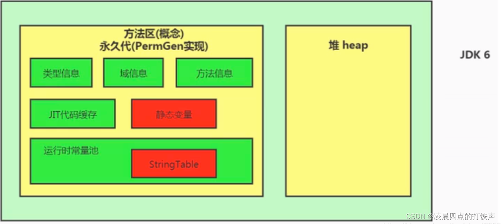

> 这一篇用反编译解释了[字符串常量池StringTable简介](https://blog.csdn.net/john2333/article/details/120762152)
- 字面量创建字符串
- 字符串变量拼接
- 字符串常量拼接
- intern方法

> 转自 [关于java的String一些问题（创建过程、intern()方法、字符串常量池），jdk6/jdk7/jdk8，详细到底层源码和jvm](https://blog.csdn.net/Xiaofeng_Lu__/article/details/123459899)
# 0. 先验知识
①要先对java虚拟机、String和StringBuilder源码有一定了解
②String的intern方法：这是一个native方法，调用的是本地底层c++的方法，作用为：

jdk<7：在常量池中查找，如果有，则返回常量池中该字符串字面量的引用地址，没有则在池中新建字符串字面量，然后返回该字面量的引用地址。
jdk>=7：则是将字符串字面量本身在池中查找，如果有，则返回池中的引用地址，这里没有变化，如果没有则会将堆中的引用传递给常量池，然后返回这个指向堆的引用。也就是说，jdk>=7堆中不会创建两个相同的字面量字符串，最多只会在常量池中增加一个引用地址的值，实质上没有产生新东西，这样可以减少字符串的创建。
③“引用”、“地址”、“引用地址”这三个词都是同一个意思。
④本文中“常量池”默认为字符串常量池


# 1. 先看图：jdk6，7，8的jvm结构图
- jdk6永久代使用的是虚拟机内存，字符串常量池(String Table)在方法区中:



- jdk7永久代使用的是虚拟机内存，不过字符串常量池(String Table)移到了堆中:


- jdk8方法区用元空间来实现，不使用虚拟机内存，使用的是本地内存，字符串常量池(String Table)仍然保留在堆中:

# 2 创建String对象的几种方式以及其底层过程
(由于jdk7和jdk8的字符串常量池都是在堆中，所以以下几种方式中jdk7等同jdk8)
耐心去理解领悟下面7个例子，就能明白所有关于String的底层问题！
## 2.1 以字面量的方式创建的字符串"abc"直接放到常量池中
### **示例**：
```
String s1 = "abc";
String s2 = "abc";
System.out.println(s1 == s2); //true
```
### **内存分析**

对于s1这行代码，jvm执行引擎会以字面量的方式创建的字符串"abc"直接放到常量池中（jdk6/7都是），s1作为变量存在栈中，然后把池中"abc"的引用地址赋值给变量s1。
对于s2这行代码，本该创建的字符串"abc"直接放到常量池中，发现池中已经有"abc",于是直接把"abc"的引用地址赋值给变量s2。
也就是，s1和s2保存的都是池中"abc"的地址，所以s1 == s2为true

### **图例**


## 2.2 以字面量的方式创建的字符串"abc"直接放到常量池中
### **示例**：
```
String s1 = "abc"+"def";
String s2 = "abcdef";
System.out.println(s1 == s2); //true（jdk7）
```
### **内存分析**

(jdk7中，在jdk6中也差不多，只是常量池在jvm中的位置不一样)

- 对于s1这行代码，“abc"和"def"不会放入常量池，编译器在编译时产生的字节码已经将 “abc” + “def” 优化成了 "abcdef"
放入常量池，然后返回池中"abcdef"的引用地址赋值给变量s1。具体可以看反编译字节码指令，不会出现"abc"和"def”:


- 对于s2这行代码，"abcdef"本应该放入常量池，可是由于已存在相同的字符串，于是返回原本存在的"abcdef"的引用赋值给变量s2

### **图例**


## 2.3 new String("abc");
### **示例**：
```
String s1 = new String("abc");
String s2 = s1.intern();
System.out.println(s1 == s2); //false

```
### **内存分析**
**① 创建过程 new String("abc")**（**jdk7同jdk6，只是jdk7的常量池在堆中。**）
- 先在常量池中创建了"abc"这个字面量，然后在堆中创建了一个String对象
- **s1 的属性 value** 指向的是***字符串常量池***中的 "abc"，**变量 s1** 指向的是***堆***中的这个String对象。

**why？为什么会<u>_先在_</u>常量池中创建了"abc"这个字面量**？
看new String(“abc”)这个构造器方法的源码:
"abc"字面量作为实参传给构造器的形参，这个形参可以看作为方法的变量，给形参赋值的过程相当于：String original = “abc”,于是就把"abc"当做字面量放进了常量池
```
    public String(String original) { //构造器源码
        this.value = original.value;
        this.hash = original.hash; 
    }

```

**② intern()**

s1.intern()返回的是常量池的"abc"的引用地址,所以s2的值为池中"abc"的引用地址，s1的值为堆中（非池中）对象的地址，所以s1 == s2 返回false
所以jdk6和7中过程一样，只是常量池位置不一样

### **图例**
- jdk 6↓ 
- jdk 7↓ 

**以下就不分析jdk6了，自行分析，都分析太多了，jdk6也过时了，主要是要能了解jdk7及以后**


## 2.4 String s1 = "abc" + new String("def");
### **示例1**：
```
String s1 = "abc" + new String("def");
s1.intern();
String s2 = "abcdef";
System.out.println(s1 == s2); //true

```
### **内存分析1**
- 先说说第一行String s1 = “abc” + new String(“def”)的过程：
常量池创建"abc"字面量 —>底层创建一个StringBuilder对象，append方法拼接"abc" —> 常量池创建"def"字面量
—> 堆中new String对象，对象的value保存常量池中"def"的引用（此对象没有被引用，发生full gc时会被回收）
—> 调用append方法拼接"def" —> 拼接完成，调用StringBuilder对象的toString()生成一个String对象在堆中，
字面量为"abcdef",并把对象的引用返回给s1，**<u>这个toString方法不会在常量池中生成字面量"abcdef"字符串</u>**
(至于为什么，自己看源码或者查资料，下面也有讲)
—> 执行第二行s1.intern()方法：由于在堆中发现有一个字面量为"abcdef"的String对象，于是把对象的引用添加到常量池中 —>
由于常量池中已经含有字面量为"abcdef"的引用（“不是字面量！是堆对象的引用”），所以s2变量的值也是堆对象的引用
—> s1和s2同为堆对象的引用，所以s1 == s2为true

### **图例1**


### **示例2**：
#### 交换一下位置：
仅仅交换了第二行和第三行的位置，s1 == s2 就变成false了，突然人傻了，不过看看底层是怎么操作就知道原因了
```
String s1 = "abc" + new String("def");
String s2 = "abcdef";
s1.intern();
System.out.println(s1 == s2); //false

```
### **内存分析2**
第一行String s1 = “abc” + new String(“def”)：和上面一样，s1保存的是堆中对象的引用地址，不重复说了 —>
第二行：常量池中没有字面量"abcdef"，于是创建字面量"abcdef"放入常量池，把字面量引用地址赋值给s2。—>
第三行：发现常量池中含有字面量"abcdef"，返回值为该字面量的引用
因此，此时s1为堆中对象的引用，s2为常量池中字面量"abcdef"的引用，所以s1 == s2返回false。

### **图例2**


## 2.5 以字面量的方式创建的字符串"abc"直接放到常量池中
### **示例**：
```
// 和④几乎一样
String s1 = new String("abc") + new String("def");
s1.intern();
String s2 = "abcdef";
System.out.println(s1 == s2); //true

```

```
// 交换第二行和第三行：
String s1 = new String("abc") + new String("def");
String s2 = "abcdef";
s1.intern();
System.out.println(s1 == s2); //false

```
### **内存分析**
略.

### **图例**

## 总结2.2、2.3、2.5
从例子② ④ ⑤ 可知：
只要字符串拼接，含有一个是变量，则编译期都是调用StringBuilder的append拼接
```
① String s1 = "a"+"b"；//编译期就被优化成"a+b"，未用到StringBuilder拼接

② String s1 = "a";
  String s2 = s1 + "b"; //s1是变量，使用到StringBuilder拼接
  
③ String s1 = "a";
  String s2 = "a" + new String("b");// new String("b")也算变量，使用到StringBuilder拼接

④ final String s1 = "a";
  final String s2 = "b";
  String s3 = "ab";
  String s4 = s1 + s2; //s1和s2都是常量，s1+s2编译期被优化成字面量"ab";
  System.out.println(s3 == s4); //true，

```

## 2.6 new String(new char[]{'a', 'b', 'c'});
### **示例**：
```
String s1 = new String(new char[]{'a', 'b', 'c'});  // new String(char value[])这个构造器，这个构造器只会把参数value[]数组复制到一个new char[newLength]中（源码可以看到），然后返回这个new char[newLength]数组的地址给String对象的value。
s1.intern();
System.out.println(s1 == s1.intern()); // true

String s2 = new String("def");
s2.intern();
System.out.println(s1 == s2.intern()); // false
```
### **内存分析**
第一行String s1 = new String(new char[]{‘a’, ‘b’, ‘c’})：
- s1这样构造String对象调用的是new String(char value[])这个构造器，这个构造器只会把参数value[]数组复制到一个new char[newLength]中（源码可以看到），然后返回这个new char[newLength]数组的地址给String对象的value。(注意：常量池**不会**存在"abc"")

第二行s1.intern()：
- 先在常量池中查找，没有找到s1的字面量"abc",然后去堆中发现s1指向的String对象的字面量为"abc"，然后把这个对象的引用值放入到常量池，并把常量池中的这个引用值返回。所以s1==s1.intern返回true。
假设再创建一个String s3 = “abc”,由于常量池中有字面量"abc"的对象引用，所以s3保存的也是s1指向的堆中String对象引用，所以s1 == s3 也会返回true。
因此，s1、s1.intern()、s3的值都相等。

### **图例**


## 2.7 new StringBuilder("ja").append("va").toString()
### **示例**：
```
String s1 = new StringBuilder("ja").append("va").toString();
s1.intern();
System.out.println(s1 == s1.intern()); //false

String s2 = new StringBuilder("s2").toString();
s2.intern();
System.out.println(s2 == s2.intern()); //false

String s3 = new StringBuilder("hello").append("world").toString();
s3.intern();
System.out.println(s3 == s3.intern()); //true
```
### **内存分析**
#### 先是对StringBuilder源码进行分析：
##### new StringBuilder(“xxx”)构造器：

##### StringBuilder的append方法：
这个append方法调用的是父类AbstractStringBuilder的append方法，把方法传入的参数String str看出方法内变量，
可看出完整语句为:String str = “xxx”,"xxx"为传进来的实参，如果实参是对象而不是字面量，可以看出：String str = new String(“xxx”)。
阅读方法内代码可以发现，是把str拆解成char数组，然后复制个StringBuilder的属性value

#### 有了上面的基础，于是对这三段代码进行分析：
##### 第一段：
- 第一行代码:

StringBuilder构造器把"ja"作为字面量放入常量池，append把"va"作为字面量放入常量池，toString创建了一个String对象放在堆中，String对象的value属性指向的是堆中new的一个char[]，字面量为"java"，而不会在常量池中生成这个"java"（看源码，toString返回的是return new String(value, 0, count)，这样创建String的对象不会在常量池中创建字面量），然后把这个堆对象的引用赋值给s1，因此，s1指向的是堆中String对象。
- 第二行代码：

jvm在常量池中找字面量为"java"的字符串，**注意！jvm编译时会预先自动加载字面量"_java_"放入常量池**，所以s1.intern会在常量池中找字面量为"java"的返回，跟s1指向的不是同一个东西，s1指向的是堆中的字符串对象，s1.intern返回的是常量池中本身存在的"java"字面量引用，所以s1 == s1.intern()返回false。

```
String s1 = new StringBuilder("ja").append("va").toString();
s1.intern();
System.out.println(s1 == s1.intern()); //false

```
##### 第二段：
- 第一行代码：

StringBuilder构造器把"s2"作为字面量放入常量池，toString创建了一个String对象放在堆中，String对象的value属性指向的是堆中new的一个char[]（第一段有解释），字面量为"s2"，注意此时，堆中有两个"s2"，一个以字面量存放在常量池中，一个以String对象存放在堆的非常量池中。

- 所以，对于第二行代码s2.intern()，

先在常量池中找字面量为"s2"的字符串，发现已经有了，就返回这个字面量引用
所以，变量s2指向的是堆中字符串对象，s1.intern返回的是常量池中的"s2"字符串，所以s1 == s1.intern()返回false。
```
String s2 = new StringBuilder("s2").toString();
s2.intern();
System.out.println(s2 == s2.intern()); //false

```
##### 第二段：
- 第一行代码：

StringBuilder构造器把"hello"作为字面量放入常量池，append把"world"作为字面量放入常量池，toString创建了一个String对象放在堆中，String对象的value属性指向的是堆中new的一个char[]（第一段有解释），字面量为"helloworld"，此时，堆中有一个String对象(“helloworld”)，常量池中有两个字面量"hello"和"world"，并没有"helloworld"。

- 第二行代码`s3.inter()`。
 
先以s3对象字面量"helloworld"在常量池中查找是否存在，发现不存在，然后堆中非常量池区域找是否有字面量为"helloworld"的对象，发现存在，于是把这个对象的引用放入到常量池中，intern返回常量池中保存的这个引用值，也就是堆中对象的引用。

所以：s3的值是堆中String对象的引用，s3.intern()返回的也是堆中String对象的引用，所以
  s3 == s3.intern()返回true。

```
String s3 = new StringBuilder("hello").append("world").toString();
s3.intern();
System.out.println(s3 == s3.intern()); //true
```

### **图例**


## 2.8 用final 修饰 String，编译期间会优化
### **示例**：
```
//s1 与 s2 加上 final 关键字 结果将会是true
//s1 与 s2 的final 关键字去掉， 结果将会是false

final String s1 = "a";
final String s2 = "b";
String s3 = "ab";
String s4 = s1 + s2;
System.out.println(s3 == s4);//true

```

```
String s1 = "javaEEhadoop";
String s2 = "javaEE";
String s3 = s2 + "hadoop";
System.out.println(s1 == s3);//false

final String s4 = "javaEE";//s4:常量
String s5 = s4 + "hadoop";
System.out.println(s1 == s5);//true

```

# 总结
字符串拼接操作不一定使用的是StringBuilder!
如果拼接符号左右两边都是字符串常量或常量引用，则仍然使用编译期优化，即非StringBuilder的方式。
针对于final修饰类、方法、基本数据类型、引用数据类型的量的结构时，能使用上final的时候建议使用上。
