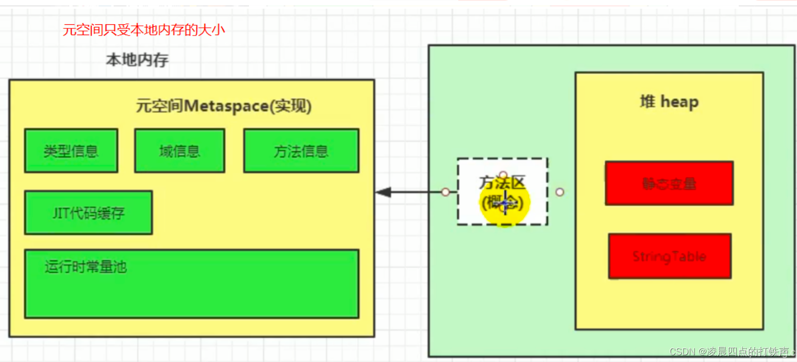

- Class实例对象的引用：方法区。
- Class实例对象：堆区。
- class 常量池：每个class文件对应一个。
- 运行时常量池：方法区。当类加载到内存中后，jvm就会将`class常量池`中的内容存放到`运行时常量池`中，由此可知，`运行时常量池`也是每个类都有一个。
- **静态变量**和**字符串常量池**：jdk7 移到了堆内存。**且static 成员变量位于 Class对象内**。
- 
- 成员变量名称：在方法区。
- 成员变量的值（任何类型的成员变量的值）：**堆**区。成员变量在new一个对象后，这个对象上包含的成员变量的**<u>值是放入堆中</u>**的。即使成员变量是基本类型也在堆区。
- 局部变量：基本类型值存储在栈；引用类型的对象的值存储在堆，这个对象的引用（指针）存储在栈。
- JVM 所有对象：都是在**堆**中分配内存。
- 
- java虚拟机规范：方法区描述为**堆**的一个逻辑部分，但它的别名叫做**Non-heap（非堆）**。（jdk1.8方法区是元空间）
- 栈只保存局部变量，临时变量，如果是对象只保存引用，实际内存还是在堆中。
- java 变量名保存在哪?
- java 成员变量引用类型的引用在哪？
- 符号引用如何替换为直接引用？
  - 在解析阶段，会把`符号引用`替换为`直接引用`。
  - 解析的过程会去查询`字符串常量池`，也就是`StringTable`，以保证`运行时常量池`所引用的字符串与`字符串常量池`中是一致的。
  - 在 HotSpot VM 里实现的`字符串string pool` 功能的是一个`StringTable`类，它是一个Hash表，默认值大小长度是1009

--------

java 8

