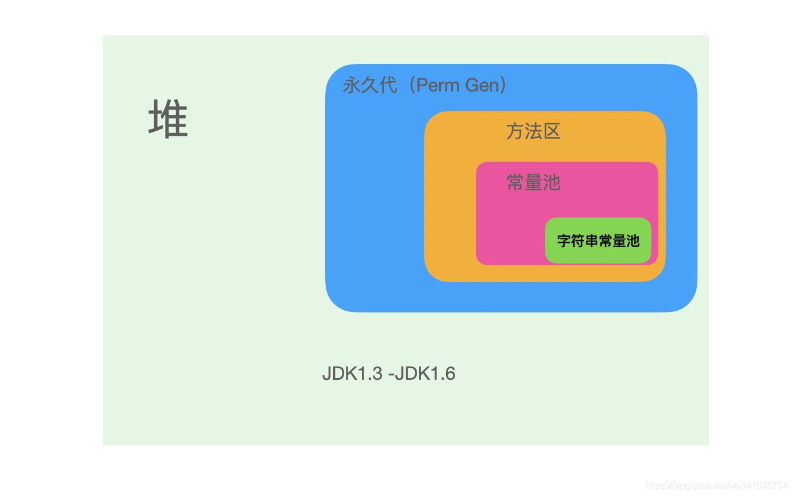

# 结论： JVM 8：字符串常量池与静态变量（类变量）在堆中，运行时常量池在方法区（元空间）。
## 运行时常量池也是方法区的一部分，在class文件中有一项信息就是常量池表(javap 输出的 constant pool)，这部分内容在class文件被加载入内存后，存储在运行时常量池中；除此之外，常量池表中的符号引用被翻译成直接引用后也会存储于此，因为每一个类都有常量池表，所以每一个类型被加载入内存后，都有自己对应的运行时常量池

[简单理解常量、常量池、运行时常量池和字符串常量池
](https://blog.csdn.net/u013541707/article/details/112389533)

1、常量
常量在java中就值的是一般的字面量，比如字符串，整数，浮点数等等数据。简单理解java中什么叫常量

2、常量池，也叫静态常量池或者class文件常量池，说常量池一定要指明是编译器产生的。它的组成为字面量和符号引用。

3、运行时常量池。**当类加载到内存中后**，jvm就会将class常量池中的内容存放到运行时常量池中，由此可知，运行时常量池也是每个类都有一个。运行时常量池在 **jdk1.8时，在方法区（即元空间）** 中。

4、字符串常量池。就是**String类型的字符串**，包括代码写的字符串，比如方法名，类名都是字面量，还有String定义的字符串。字符串常量池，**jdk1.8时在堆中，全局共享，独一份，之前在方法区中。**

————————————————
版权声明：本文为CSDN博主「可乐多点冰」的原创文章，遵循CC 4.0 BY-SA版权协议，转载请附上原文出处链接及本声明。
原文链接：https://blog.csdn.net/u013541707/article/details/112389533

# 自己的理解
新声代 老年代 在**堆**中， 永久代是 jdk及其以前的概念，属于方法区的实现。jdk 8 以后方法区的实现改为了元空间。

| JDK 版本 | 方法区的实现            | **运行时常量池**所在位置 | 字符串常量池所在位置    |
| -------- | ----------------------- | ------------------------ | ----------------------- |
| JDK6     | PermGen space（永久代） | PermGen space（永久代）  | PermGen space（永久代） |
| JDK7     | PermGen space（永久代） | PermGen space（永久代）  | Heap（堆）              |
| JDK8     | Metaspace（元空间）     | Metaspace（元空间）      | Heap（堆）              |

# [字符串常量池、class常量池和运行时常量池](https://blog.csdn.net/qq_26222859/article/details/73135660)
1. `全局常量池`在每个VM中只有一份，存放的是字符串常量的引用值。
2. `class常量池`是在编译的时候每个class都有的，在编译阶段，存放的是常量的**符号引用**。
3. `运行时常量池`是在类加载完成之后，将每个`class常量池`中的符号引用值转存到`运行时常量池`中，也就是说，每个class都有一个运行时常量池，类在解析之后，将**符号引用替换成直接引用**，与全局常量池中的引用值保持一致。

# [java8运行时常量池到底在哪？](https://www.zhihu.com/question/377418017)
- 在JDK1.6及之前运行时常量池逻辑包含字符串常量池存放在方法区, 此时hotspot虚拟机对方法区的实现为永久代（位于堆内存中） 
- 在JDK1.7 字符串常量池被从方法区拿到了堆中, 这里没有提到运行时常量池,也就是说字符串常量池被单独拿到堆,运行时常量池剩下的东西还在方法区, 也就是hotspot中的永久代
- 在JDK1.8 hotspot移除了永久代用元空间取而代之, 这时候字符串常量池还在堆, 运行时常量池还在方法区, 只不过方法区的实现从永久代变成了元空间(堆外内存)

作者：Himeros
链接：https://www.zhihu.com/question/377418017/answer/1062033254
来源：知乎
著作权归作者所有。商业转载请联系作者获得授权，非商业转载请注明出处。

# [面试题系列第5篇：JDK的运行时常量池、字符串常量池、静态常量池，还傻傻分不清？](https://cloud.tencent.com/developer/article/1690589#:~:text=%E5%9C%A8JDK8%E4%BB%A5%E5%90%8E%E5%AD%97,%E9%87%8F%E6%B1%A0%E4%BD%8D%E4%BA%8E%E6%96%B9%E6%B3%95%E5%8C%BA%E3%80%82)
在JDK8以后字符串常量池位于堆中，而运行时常量池位于方法区。

常量池内存位置演化
- 在JDK1.7之前运行时常量池逻辑包含字符串常量池存放在方法区, 此时hotspot虚拟机对方法区的实现为永久代。

- 在JDK1.7字符串常量池和静态变量(类变量)被从方法区拿到了堆中，运行时常量池剩下的还在方法区, 也就是hotspot中的永久代。

- 在JDK8 hotspot移除了永久代用元空间(Metaspace)取而代之, 这时候字符串常量池还在堆，运行时常量池还在方法区，只不过方法区的实现从永久代变成了元空间(Metaspace)

通过上面的图解，我们可以轻易得知在不同的版本中方法区及内部组成部分是在不断变化的
