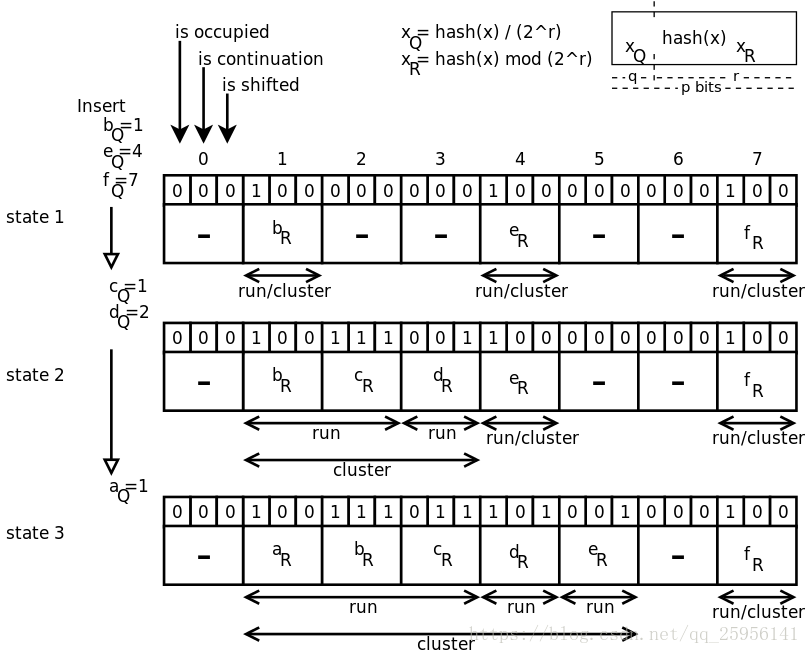

[(122条消息) quotient filter解读\_丶幻一的博客-CSDN博客](https://blog.csdn.net/qq_25956141/article/details/80987461)
> https://en.wikipedia.org/wiki/Quotient_filter

我们称quotient filter为商过滤器，与布鲁姆过滤器不同的是，商过滤器采用一个哈希函数，具有更高的查找效率，它将关键字key经过一次哈希运算后，得到q_hash，然后将q_hash/2^r作为商，r=q_hash%2^r作为余数。

我们构造一个记录器，它由3*2*r个bit组成，每3个bit对应给槽，那么总共就有2^r个槽，每个槽中存放r余数。

当插入一个元素的时候，先计算出商和余数，由商号确定槽号的位置，从而决定应该插入到哪一个槽中，但是这个槽完全有可能被其他元素占用，所以这个时候，应该比较余数的大小，如果占用的那个元素的余数比新加入进来的余数大，那么就将占用的余数向右移动一个槽位，同时把新加入的余数存放到该槽，如果新加入进来的余数比槽中的余数大，那么就加入到该槽后面合适的位置就可以了，简单的说，就是插入排序的思想。

这样，就使得一个元素从初始槽开始，连续占用了批量的槽，我们称它为一个集群，它们有一个共同的特点，其他元素都是由于自己本身的槽被占用，而被迫放到后面的槽中。

所以，这就意味着，当前槽有三种状态，与槽对应的三个bit相关联

- is_occupied**表示是否已经有商号对应该槽，如果是被迫转移过来的，那么不应该将其设置成1，只有在计算出某个商号对应该槽号后，才将其设置成1
- is_continuation**不是放在自己本身的槽中，被迫后移，与前面的元素形成连续集群
- is_shifed**是不是放在与自己商号对应的槽中，如果不是，被迫后移动的，那么将该状态设置成1

由上面的三种状态表明，状态的开始标志位is_coninuation如果是0，就表明一个集群的开始 当查询一个元素的时候，先将元素经过一次哈希运算得到q_hash，然后再得到商号和余数

由商号可以得到在记录器中的下标，由于在插入元素时的特性，这就意味着，该元素对应的余数只会存放到该元素对应的商号以及后面的槽号，该元素的查询范围，从一个集群的开始，到该集群的结束，结束的标志为：一次往后探测发现一个空槽了，或者后面的is_continuation设置成0了，或者槽中的余数大于当前余数了，经过对比余数相等后，就证明找到了该元素，当然，这种查询方法也存在一定的假阳性误判率，如果哈哈希函数设计得当，那么这种查询是时间复杂度为O(1)，当然，如果哈希函数设计不得当，这种查询的时间复杂度完全可能变成O(m),m为记录器的长度。

