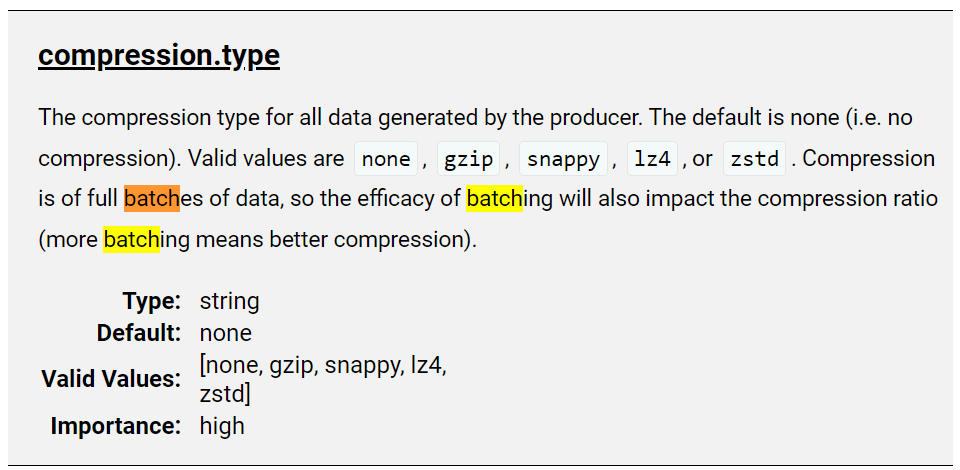

## kafka
[Kafka Producer 批量大小 - IT屋-程序员软件开发技术分享社区](https://www.it1352.com/2549053.html)

[Apache Kafka_producerconfigs](https://kafka.apache.org/documentation/#producerconfigs)

[producerconfigs_batch.size](https://kafka.apache.org/documentation/#producerconfigs_batch.size)

> #### [batch.size](https://kafka.apache.org/documentation/#producerconfigs_batch.size)
>
> The producer will attempt to batch records together into fewer requests whenever multiple records are being sent to the same partition. This helps performance on both the client and the server. This configuration controls the default batch size in bytes.
>
> No attempt will be made to batch records larger than this size.
>
> Requests sent to brokers will contain multiple batches, one for each partition with data available to be sent.
>
> A small batch size will make batching less common and may reduce throughput (a batch size of zero will disable batching entirely). A very large batch size may use memory a bit more wastefully as we will always allocate a buffer of the specified batch size in anticipation of additional records.
>
> Note: This setting gives the upper bound of the batch size to be sent. If we have fewer than this many bytes accumulated for this partition, we will 'linger' for the `linger.ms` time waiting for more records to show up. This `linger.ms` setting defaults to 0, which means we'll immediately send out a record even the accumulated batch size is under this `batch.size` setting.
>
> |         Type: | int     |
> | ------------: | ------- |
> |      Default: | 16384   |
> | Valid Values: | [0,...] |
> |   Importance: | medium  |


### 问题描述
- 当 `batch.size` 达到并且生产者应用线程发送更多数据时会发生什么?
- 线程是否会阻塞直到包含批处理的缓冲区中有可用空间?

### 推荐答案

- `batch.size` 以总字节数而不是消息数来衡量批大小.它控制在向 Kafka 代理发送消息之前要收集多少字节的数据.在不超过可用内存的情况下，将其设置得尽可能高.默认值为 16384.
- 当您使用 `Producer.send()` 时，您会填满生产者的缓冲区.当缓冲区已满时，生产者将缓冲区发送给 Kafka 代理并开始重新填充缓冲区.


## rocket

[批量消息发送 | RocketMQ](https://rocketmq.apache.org/zh/docs/4.x/producer/05message4)

这里调用非常简单，将消息打包成 Collection<Message> msgs 传入方法中即可，需要注意的是批量消息的大小不能超过 1MiB（否则需要自行分割），其次同一批 batch 中 topic 必须相同。（官方说一次批量消息不能大于1MB, 实际上实际使用的时候一次发送最大的消息是4MB左右.）

源码跟踪可以看见：

发送单条消息和批量消息最终是调用` private SendResult sendDefaultImpl()`，里面调用了`Validators.checkMessage(msg, this.defaultMQProducer);`

```java
// org/apache/rocketmq/client/impl/producer/DefaultMQProducerImpl.java 
private SendResult sendDefaultImpl(
        Message msg,
        final CommunicationMode communicationMode,
        final SendCallback sendCallback,
        final long 
    ) throws MQClientException, RemotingException, MQBrokerException, InterruptedException {
        this.makeSureStateOK();
        Validators.checkMessage(msg, this.defaultMQProducer);
     
     // …………
     
 }
```


```java
// org/apache/rocketmq/client/Validators.java
public static void checkMessage(Message msg, DefaultMQProducer defaultMQProducer)
        throws MQClientException {
        if (null == msg) {
            throw new MQClientException(ResponseCode.MESSAGE_ILLEGAL, "the message is null");
        }
        // topic
        Validators.checkTopic(msg.getTopic());

        // body
        if (null == msg.getBody()) {
            throw new MQClientException(ResponseCode.MESSAGE_ILLEGAL, "the message body is null");
        }

        if (0 == msg.getBody().length) {
            throw new MQClientException(ResponseCode.MESSAGE_ILLEGAL, "the message body length is zero");
        }

        if (msg.getBody().length > defaultMQProducer.getMaxMessageSize()) {
            throw new MQClientException(ResponseCode.MESSAGE_ILLEGAL,
                "the message body size over max value, MAX: " + defaultMQProducer.getMaxMessageSize());
        }
    }
```

msg.getBody() 是个 byte 数组

```java
// DefaultMQProducer.java
private int maxMessageSize = 1024 * 1024 * 4; // 4M
```


>  [(125条消息) RocketMQ批量发送消息4M限制解决方案-CSDN博客](https://blog.csdn.net/jy03133639/article/details/123608110)
>
> [(125条消息) RocketMQ批量消息介绍和入门demo以及消息超过了限制如何解决\_rocketmq topic tag 数量限制\_张俊杰1994的博客-CSDN博客](https://blog.csdn.net/qq_41489540/article/details/120921608)超出大小业务方需要分割消息。

## 为什么kafka比RocketMQ吞吐量更高
> [rocketMq和kafka对比 - minch - 博客园](https://www.cnblogs.com/minch/p/17110619.html)

kafka性吞吐量更高主要是由于Producer端将多个小消息合并，批量发向Broker。kafka采用异步发送的机制，当发送一条消息时，消息并没有发送到broker而是缓存起来，然后直接向业务返回成功，当缓存的消息达到一定数量时再批量发送。

此时减少了网络io，从而提高了消息发送的性能，但是如果消息发送者宕机，会导致消息丢失，业务出错，所以理论上kafka利用此机制提高了io性能却降低了可靠性。

# 总结：

- kafka 通过 Producer 和并多个小的消息（Batch record）到缓冲区，然后在一起发送到broker。默认2^16 字节。

- kafka 并没有一次send一个列表的record（rocket叫做message）的方法。并且生产着发送消息都是`异步提交`。

  - ```java
    public Future<RecordMetadata> send(ProducerRecord<K, V> record) {
            return send(record, null);
    }
    ```

- 但是 kafka 的 producer 有压缩算法。[producerconfigs_compression.type](https://kafka.apache.org/documentation/#producerconfigs_compression.type)

- kafka 异步刷盘、异步复制


- rocket  可以打包多个消息，通过 encode/decode 编码解码。最终调用 `DefaultMQProducerImpl`的 `sendDefaultImpl`方法，对发送的字节大小做了限制 `maxMessageSize = 1024 * 1024 * 4`。

  - ```java
    public SendResult send(
            Collection<Message> msgs) throws MQClientException, RemotingException, MQBrokerException, InterruptedException {
            return this.defaultMQProducerImpl.send(batch(msgs));
    }
    ```

- rocket 没有压缩。

- rocket 生产者可以同步或者异步发送消息。

- rocket 支持异步刷盘、同步刷盘、异步复制、同步复制


# 其它：kafka 压缩

