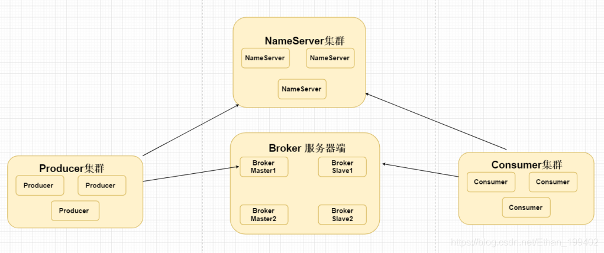

[(125条消息) rocketMQ 总结\_rocketmq是cp还是ap\_Ethan\_199402的博客-CSDN博客](https://blog.csdn.net/Ethan_199402/article/details/115005383)

版权声明：本文为博主原创文章，遵循 [CC 4.0 BY-SA](http://creativecommons.org/licenses/by-sa/4.0/) 版权协议，转载请附上原文出处链接和本声明。

## [RocketMQ](https://so.csdn.net/so/search?q=RocketMQ&spm=1001.2101.3001.7020)由哪些角色组成，每个角色作用和特点是什么？

1.  Nameserver 无状态，动态列表；这也是和zookeeper的重要区别之一。zookeeper是有状态的。前者保证AP,后者保证CP，NameServer 每个节点相互`之间没有数据过程、都是独立的` （ap模式）保证可用性、不保证每个NameServer 数据的一致性问题。存储Broker 的IP和端口号 主题信息、集群信息 过滤器等
2.  Producer 消息生产者，负责发消息到Broker。采用轮询算法连接nameserver 如果能够获取到BrokerIP和端口信息则发送请求存贮信息到Broker
3.  Broker 就是MQ本身，负责收发消息、持久化消息等。Broker配置文件中配置了多个不同的NameServer 集群地址，启动的时候，读取到这些NameServer 地址将自己的信息注册到每个NameServer 上存储起来，`Broker与每个NameServer 建立长连接之后，每隔30s的时间发送一个心跳续约包给Broker 延续存活状态`
4.  Consumer 消息消费者，负责从Broker上拉取消息进行消费，消费完进行ack。  
    

## RocketMQ中的Topic和JMS的queue有什么区别？

queue就是来源于数据结构的FIFO队列。而Topic是个抽象的概念，每个Topic底层对应N个queue，而数据也真实存在queue上的。类比kafka的分区模型

## RocketMQ Broker中的消息被消费后会立即删除吗？

同kafka一样是不会的，每条消息都会持久化到CommitLog中，每个Consumer连接到Broker后会维持消费进度信息，当有消息消费后只是当前Consumer的消费进度（CommitLog的offset）更新了。

**那么消息会堆积吗？什么时候清理过期消息那么消息会堆积吗？什么时候清理过期消息**

4.6版本默认48小时后会删除不再使用的CommitLog文件

1.  检查这个文件最后访问时间
2.  判断是否大于过期时间
3.  指定时间删除，默认凌晨4点

## Producer发送消息三种模式

1.  单向： 生产者投递消息到mq中，不需要返回结果。  
    优点：延迟概率比较低  
    缺点：肯能丢失消息数据
2.  异步 ：生产者投递消息到mq中，使用回调形式返回，不会阻塞吓一条消息的发送
3.  同步：生产者投递消息到mq中，采用同步的形式获取到返回消息是否成功，会阻塞下一条消息的发送，发生延迟概率比较大。

## 消费消息是push还是pull？

RocketMQ没有真正意义的push，都是pull，虽然有push类，但实际底层实现采用的是长轮询机制，即拉取方式

**为什么要主动拉取消息而不使用事件监听方式？**

如果broker主动推送消息的话有可能push速度快，消费速度慢的情况，那么就会造成消息在consumer端堆积过多，同时又不能被其他consumer消费的情况。而pull的方式可以根据当前自身情况来pull，不会造成过多的压力而造成瓶颈。所以采取了pull的方式

## 当消费负载均衡consumer和queue不对等的时候会发生什么

Consumer和queue会优先平均分配，如果Consumer少于queue的个数，则会存在部分Consumer消费多个queue的情况，如果Consumer等于queue的个数，那就是一个Consumer消费一个queue，如果Consumer个数大于queue的个数，那么会有部分Consumer空余出来，白白的浪费了。这一点和kafka是一样的思想

## 如何让RocketMQ保证消息的顺序消费

首先多个queue只能保证单个queue里的顺序，queue是典型的FIFO，天然顺序。多个queue同时消费是无法绝对保证消息的有序性的。所以总结如下：

`同一topic，同一个QUEUE，发消息的时候一个线程去发送消息，消费的时候 一个线程去消费一个queue里的消息`。

**那么怎么做到同一个QUEUE呢？**

重写接口MessageQueueSelector接口

## RocketMQ如何保证消息不丢失

1.  Producer端如何保证消息不丢失要采取send()同步发消息，发送结果是同步返回给Producer端的
2.  Broker端如何保证消息不丢失采取同步刷盘策略，默认是异步刷盘
3.  Consumer端如何保证消息不丢失这个没什么纠结的：完全消费正常后在进行手动ack确认
4.  Producer和Broker的同步发送和同步刷盘虽然保证消息不丢失，但是也会出现延迟高的问题，要根据业务场景采取折中的方案

## 消息是怎样存贮的？

1.  commitlog：存放消息主体
2.  consumequeue：不存放消息主体，只存放消息Commitlogoffset、msgsize、msgtag
3.  Commitlogoffset ：消息物理存放位置
4.  Queue offset:消息存放在ConsumeQueue 消费偏移量
5.  index中记录消息索引文件
6.  checkpoint：文件检测点。存储commitlog文件最后一次刷盘时间戳、consumequeue最后一次刷盘时间、index索引文件最后一次刷盘时间戳。
7.  commitlog日志文件没有满的情况下所有topic主题对应的消息都会存放在同一个commitlog日志文件中，默认最大1G(l零拷贝、分段)，commitlog命名就是上一个commitlog日志文件中最后一个commitlog-offset值），commitlog类似于在kafka中的 segment
8.  每次消费者读取消息的时候，先读取ConsumeQueue中获取到commitLogoffset，在根据该commitLogoffset查找commitLog日志文件获取到消息体返回给消费者客户端

## 为什么commitlog最大1G？

零拷贝使用到MappedByteBuffer 文件存储映射，MappedByteBuffer 只能映射用户态1.5GB-2GB 所以RocketMQ日志文件存储commitlog默认为1G大小。

## rocketMQ的消息堆积如何处理

可能是Consumer消费时间过长、或者Consumer的数量远少于Queue的数量

但是如果上线了多台Consumer也在短时间内无法消费完堆积的消息怎么办？

1.  上线一台Consumer做消息的搬运工，把原来Topic中的消息挪到新的Topic里，这里只做搬运，不处理任何逻辑
2.  上线N台Consumer同时消费临时Topic中的数据，此处是真正的逻辑
3.  修改造成消息堆积的bug
4.  恢复原Consumer

## 堆积的消息会不会进死信队列

不会，消息在消费失败后会进入重试队列，默认重试16次，之后才会进入死信队列

## RocketMQ在分布式事务支持这块机制的底层原理?

1.  Producer会向rocketmq服务器端投递一个半消息，该消息默认的状态是为预备状态----该消息暂时无法被消费者消费。
2.  Broker端将该消息刷盘成功之后，在这时候就会发送一个事件通知给我们Producer执行本地事务
3.  Producer执行本地事务成功，提交本地事务的时候会通知我们Broker修改该消息状态为提交状态。
4.  Consumer此时可以正常消费该条消息，如果消费该条消息失败会自动不断补偿重试，保证消费者消费成功

**Producer执行本地事务成功但是没有通知Broker怎么办？**  
实现RocketMQLocalTransactionListener 接口，rocketmq默认每隔60s的时间，检查本地事务是否有执行成功，可以实现这个接口根据业务逻辑判断Producer是否执行本地事务成功

1.  RocketMQLocalTransactionState.COMMIT 响应给rocketmq 该消息提交-----该消息是需要被消费者消费的
2.  RocketMQLocalTransactionState.ROLLBACK 响应给rocketmq 该消息回滚-------该消息是不需要被消费者消费的 该消息会从rocketmq 中删除
3.  RocketMQLocalTransactionState.UNKNOWN 不返回提交 不回滚

**若成功响应COMMIT ，若失败则返回UNKNOWN 状态，为什么不返回ROLLBACK 呢？**

上面提到这个方法是每60S调用一次，但是如果业务逻辑执行了70s成功了，就可以正常通知Broker事务成功，因为此时状态是unknown。是想如果当时返回的是rollback，则消费者将无法消费这条消息

## 高吞吐量下如何优化生产者和消费者的性能?

1.  同一group下，多机部署，并行消费
2.  单个Consumer提高消费线程个数（根据业务场景指定）
3.  批量消费
4.  jvm调优