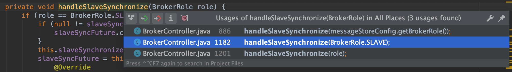
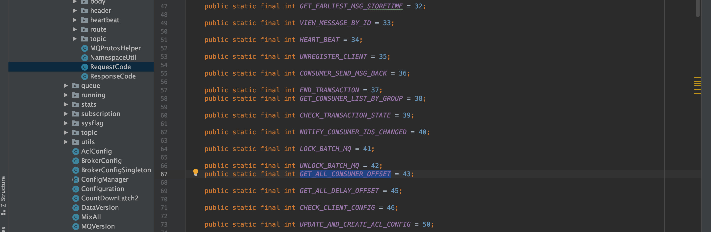
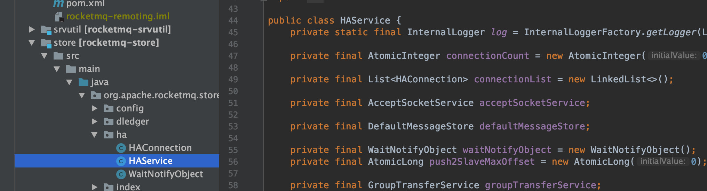
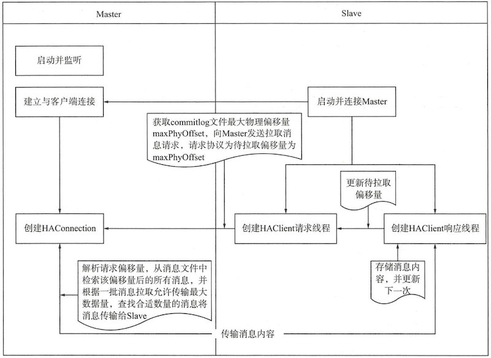

[(125条消息) 【RocketMQ】学习RocketMQ必须要知道的主从同步原理\_rocketmq 主从\_三月是你的微笑的博客-CSDN博客](https://blog.csdn.net/sinat_14840559/article/details/115970738)


> 本文主要参考《[RocketMQ](https://so.csdn.net/so/search?q=RocketMQ&spm=1001.2101.3001.7020)技术内幕》和《RocketMQ实战与原理分析》两本书，以及RocketMQ 4.8.0的源码，作为学习的记录

RocketMQ的Broker分为Master和Slave两个角色，为了保证高可用性(HA)， Master角色的机器接收到消息后，要把内容同步到Slave机器上，这样一旦Master宕机，Slave机器依然可以提供服务。 下面介绍Master和Slave角色机器间同步功能实现的源码。

## 同步[元数据](https://so.csdn.net/so/search?q=%E5%85%83%E6%95%B0%E6%8D%AE&spm=1001.2101.3001.7020)

 Slave需要和Master同步的不只是消息本身，一些元数据信息也需要同步，比如**TopicConfig**信息、**ConsumerOffset**信息、**DelayOffset**和**SubscriptionGroupConfig**信息。 元数据的同步操作是由Slave发起的，定时从Master获取，核心代码如下：

```
    private void handleSlaveSynchronize(BrokerRole role) {
        if (role == BrokerRole.SLAVE) {
            if (null != slaveSyncFuture) {
                slaveSyncFuture.cancel(false);
            }
            this.slaveSynchronize.setMasterAddr(null);
            slaveSyncFuture = this.scheduledExecutorService.scheduleAtFixedRate(new Runnable() {
                @Override
                public void run() {
                    try {
                        BrokerController.this.slaveSynchronize.syncAll();
                    }
                    catch (Throwable e) {
                        log.error("ScheduledTask SlaveSynchronize syncAll error.", e);
                    }
                }
            }, 1000 * 3, 1000 * 10, TimeUnit.MILLISECONDS);
        } else {
            //handle the slave synchronise
            if (null != slaveSyncFuture) {
                slaveSyncFuture.cancel(false);
            }
            this.slaveSynchronize.setMasterAddr(null);
        }
    }
```

该方法会在3个地方被调用，Broker启动时、Master和Slave角色发生变化时  
syncAll方法代码如下：

```
    public void syncAll() {
        this.syncTopicConfig();
        this.syncConsumerOffset();
        this.syncDelayOffset();
        this.syncSubscriptionGroupConfig();
    }
```

 在syncAll方法里，调用syncTopicConfig()、syncConsumerOffset()、syncDelayOffset()和 syncSubscriptionGroupConfig()进行元数据同步 。 以syncConsumerOffset为例，来看看底层的具体实现

```
        String masterAddrBak = this.masterAddr;
        if (masterAddrBak != null && !masterAddrBak.equals(brokerController.getBrokerAddr())) {
            try {
                ConsumerOffsetSerializeWrapper offsetWrapper =
                    this.brokerController.getBrokerOuterAPI().getAllConsumerOffset(masterAddrBak);
                this.brokerController.getConsumerOffsetManager().getOffsetTable()
                    .putAll(offsetWrapper.getOffsetTable());
                this.brokerController.getConsumerOffsetManager().persist();
                log.info("Update slave consumer offset from master, {}", masterAddrBak);
            } catch (Exception e) {
                log.error("SyncConsumerOffset Exception, {}", masterAddrBak, e);
            }
        }
    }
```

核心方法：getAllConsumerOffset()：

```
    public ConsumerOffsetSerializeWrapper getAllConsumerOffset(
        final String addr) throws InterruptedException, RemotingTimeoutException,
        RemotingSendRequestException, RemotingConnectException, MQBrokerException {
        RemotingCommand request = RemotingCommand.createRequestCommand(RequestCode.GET_ALL_CONSUMER_OFFSET, null);
        RemotingCommand response = this.remotingClient.invokeSync(addr, request, 3000);
        assert response != null;
        switch (response.getCode()) {
            case ResponseCode.SUCCESS: {
                return ConsumerOffsetSerializeWrapper.decode(response.getBody(), ConsumerOffsetSerializeWrapper.class);
            }
            default:
                break;
        }
        throw new MQBrokerException(response.getCode(), response.getRemark(), addr);
    }
```

invokeSync()方法：

```
    @Override
    public RemotingCommand invokeSync(String addr, final RemotingCommand request, long timeoutMillis)
        throws InterruptedException, RemotingConnectException, RemotingSendRequestException, RemotingTimeoutException {
        long beginStartTime = System.currentTimeMillis();
        final Channel channel = this.getAndCreateChannel(addr);
        if (channel != null && channel.isActive()) {
            try {
                doBeforeRpcHooks(addr, request);
                long costTime = System.currentTimeMillis() - beginStartTime;
                if (timeoutMillis < costTime) {
                    throw new RemotingTimeoutException("invokeSync call timeout");
                }
                RemotingCommand response = this.invokeSyncImpl(channel, request, timeoutMillis - costTime);
                doAfterRpcHooks(RemotingHelper.parseChannelRemoteAddr(channel), request, response);
                return response;
            } catch (RemotingSendRequestException e) {
                log.warn("invokeSync: send request exception, so close the channel[{}]", addr);
                this.closeChannel(addr, channel);
                throw e;
            } catch (RemotingTimeoutException e) {
                if (nettyClientConfig.isClientCloseSocketIfTimeout()) {
                    this.closeChannel(addr, channel);
                    log.warn("invokeSync: close socket because of timeout, {}ms, {}", timeoutMillis, addr);
                }
                log.warn("invokeSync: wait response timeout exception, the channel[{}]", addr);
                throw e;
            }
        } else {
            this.closeChannel(addr, channel);
            throw new RemotingConnectException(addr);
        }
    }
```

 基本逻辑就是是组装一个RemotingCommand，底层通过Netty将消息发送到Master角色的Broker，然后获取Offset信息，不同的RequestCode，代表不同的请求：  


## 同步消息体

 Master和Slave之间同步消息体，也就是同步**CommitLog**内容。

CommitLog和元数据信息不同：

- 首先，CommitLog的数据量比元数据要大；
- 其次，对实时性和可靠性要求也不一样。
  - 元数据信息是定时同步的，在两次同步的时间差里，如果出现异常可能会造成 Master上的元数据内容和Slave上的元数据内容不一致，不过这种情况还可以补救 (手动调整Offset，重启Consumer等)。 
  - CommitLog在高可靠性场景下如果没有及时同步，一旦Master机器出故障，消息就彻底丢失了。所以有专门的代码来实现Master和Slave之间消息体内容的同步。CommitLog的同步，不是经过netty command的方式，而是直接进行**TCP连接**，这样效率更高。

--------

 RocketMQ的主从同步方式分为同步和异步，通过Master中的配置项：brokerRole决定，有三种选项：**sync\_master**、**async\_master**和**slave**。

从字面意思理解， sync\_master是同步方式，也就是Master角色Broker中的消息要立刻同步过去；async\_master是异步方式，也就是Master角色Broker中的消息是通过异步处理的方式同步到Slave角色的机器上的。

 实现HA主要的代码在org.apache.rocketmq.store.ha包中，里面包括HAService、HAConnection和WaitNotifyObject这三个类。  


-   HAService: RocketMQ主从同步核心实现类；
-   HAService$AcceptSocketService: HA Master端监昕客户端连接实现类；
-   HAService$GroupTransferService: 主从同步通知实现类；
-   HAService$HAClient: HA Client端实现类，主从同步Slave端的核心实现类；
-   HAConnection: HAMaster服务端HA连接对象的封装，与Broker从服务器的网络读写实现类；
-   HAConnection$ReadSocketService: HA Master网络读实现类；
-   HAConnection$WriteSocketServicce: HA Master网络写实现类

## 异步(async\_master)

 如果是异步的方式，生产消息会调用方法：org.apache.rocketmq.store.CommitLog#asyncPutMessage

```
    public CompletableFuture<PutMessageResult> asyncPutMessage(final MessageExtBrokerInner msg) {
        // Set the storage time
        msg.setStoreTimestamp(System.currentTimeMillis());
        // Set the message body BODY CRC (consider the most appropriate setting
        // on the client)
        msg.setBodyCRC(UtilAll.crc32(msg.getBody()));
        // Back to Results
        AppendMessageResult result = null;
    ...
    ...
    ...
    CompletableFuture<PutMessageStatus> flushResultFuture = submitFlushRequest(result, msg);
        CompletableFuture<PutMessageStatus> replicaResultFuture = submitReplicaRequest(result, msg);
        ...
        ...
    }   
```

主从同步由异步的方法完成，大致步骤如下：

**Master端**：

-   监听端口  
    org.apache.rocketmq.store.ha.HAService.AcceptSocketService#beginAccept
    
-   建立连接  
    org.apache.rocketmq.store.ha.HAService.AcceptSocketService#run
    
-   读取slave上报的maxOffset  
    org.apache.rocketmq.store.ha.HAConnection.ReadSocketService#run
    
-   传输数据给slave  
    org.apache.rocketmq.store.ha.HAConnection.WriteSocketService#run
    

**Slave端**：

-   连接master  
    org.apache.rocketmq.store.ha.HAService.HAClient#connectMaster
    
-   定时报告maxOffset给master  
    org.apache.rocketmq.store.ha.HAService.HAClient#run
    
-   接收master传输来的数据  
    org.apache.rocketmq.store.ha.HAService.HAClient#processReadEvent
    

**交互图**：  
  
下面看看具体的代码：

**Master端**：

 Master服务器在收到从服务器的连接请求后，会将主从服务器的连接 SocketChannel封装成HAConnection对象，实现主服务器与从服务器的读写操作。

1、开启监听：org.apache.rocketmq.store.ha.HAService.AcceptSocketService#beginAccept

```
        /**
         * Starts listening to slave connections.
         *
         * @throws Exception If fails.
         */
        public void beginAccept() throws Exception {
            this.serverSocketChannel = ServerSocketChannel.open();
            this.selector = RemotingUtil.openSelector();
            this.serverSocketChannel.socket().setReuseAddress(true);
            this.serverSocketChannel.socket().bind(this.socketAddressListen);
            this.serverSocketChannel.configureBlocking(false);
            this.serverSocketChannel.register(this.selector, SelectionKey.OP_ACCEPT);
        }
```

 创建 ServerSocketChannel、创建 Selector、设置 TCP reuseAddress、 绑定监昕端口 、设置为非阻塞模式，并注册OP\_ACCEPT (连接事件)。

2、建立连接：org.apache.rocketmq.store.ha.HAService.AcceptSocketService#run

```
        @Override
        public void run() {
            log.info(this.getServiceName() + " service started");

            while (!this.isStopped()) {
                try {
                    this.selector.select(1000);
                    Set<SelectionKey> selected = this.selector.selectedKeys();

                    if (selected != null) {
                        for (SelectionKey k : selected) {
                            if ((k.readyOps() & SelectionKey.OP_ACCEPT) != 0) {
                                SocketChannel sc = ((ServerSocketChannel) k.channel()).accept();

                                if (sc != null) {
                                    HAService.log.info("HAService receive new connection, "
                                        + sc.socket().getRemoteSocketAddress());

                                    try {
                                        HAConnection conn = new HAConnection(HAService.this, sc);
                                        conn.start();
                                        HAService.this.addConnection(conn);
                                    } catch (Exception e) {
                                        log.error("new HAConnection exception", e);
                                        sc.close();
                                    }
                                }
                            } else {
                                log.warn("Unexpected ops in select " + k.readyOps());
                            }
                        }

                        selected.clear();
                    }
                } catch (Exception e) {
                    log.error(this.getServiceName() + " service has exception.", e);
                }
            }

            log.info(this.getServiceName() + " service end");
        }
```

 选择器每 1s 处理一次连接就绪事件。连接事件就绪后，调用ServerSocketChannel的accept()方法创建SocketChannel。然后为每一个连接创建一个HAConnection对象， 该HAConnection将负责主从数据同步逻辑。

3、读取slave上报的maxOffset：org.apache.rocketmq.store.ha.HAConnection.ReadSocketService#run

```
 @Override
        public void run() {
            HAConnection.log.info(this.getServiceName() + " service started");

            while (!this.isStopped()) {
                try {
                    this.selector.select(1000);
                    boolean ok = this.processReadEvent();
                    if (!ok) {
                        HAConnection.log.error("processReadEvent error");
                        break;
                    }

                    long interval = HAConnection.this.haService.getDefaultMessageStore().getSystemClock().now() - this.lastReadTimestamp;
                    if (interval > HAConnection.this.haService.getDefaultMessageStore().getMessageStoreConfig().getHaHousekeepingInterval()) {
                        log.warn("ha housekeeping, found this connection[" + HAConnection.this.clientAddr + "] expired, " + interval);
                        break;
                    }
                } catch (Exception e) {
                    HAConnection.log.error(this.getServiceName() + " service has exception.", e);
                    break;
                }
            }

            this.makeStop();

            writeSocketService.makeStop();

            haService.removeConnection(HAConnection.this);

            HAConnection.this.haService.getConnectionCount().decrementAndGet();

            SelectionKey sk = this.socketChannel.keyFor(this.selector);
            if (sk != null) {
                sk.cancel();
            }

            try {
                this.selector.close();
                this.socketChannel.close();
            } catch (IOException e) {
                HAConnection.log.error("", e);
            }

            HAConnection.log.info(this.getServiceName() + " service end");
        }
```

org.apache.rocketmq.store.ha.HAConnection.ReadSocketService#processReadEvent

```
private boolean processReadEvent() {
            int readSizeZeroTimes = 0;
  /*
             * 如果byteBufferRead没有剩余空间，说明该position==limit==capacity
             * 调用byteBufferRead.flip()方法，产生的效果为position=O,limit=capacity
             * 并设置processPostion为0，表示从头开始处理
             */
            if (!this.byteBufferRead.hasRemaining()) {
                this.byteBufferRead.flip();
                this.processPosition = 0;
            }

            while (this.byteBufferRead.hasRemaining()) {
                try {
                  //NIO网络读的常规方法，一般使用循环的方式进行读写，直到byteBuffer中没有剩余的空间
                    int readSize = this.socketChannel.read(this.byteBufferRead);
                    /*
                     * 如果读取的字节大于0，并且本次读取到的内容大于等于8，表明收到了从服务器一条拉取消息的请求。
                     * 由于有新的从服务器反馈拉取偏移量，服务端会通知由于同步等待HA复制结果而阻塞的消息发送者线程
                     */
                  if (readSize > 0) {
                        readSizeZeroTimes = 0;
                        this.lastReadTimestamp = HAConnection.this.haService.getDefaultMessageStore().getSystemClock().now();
                        if ((this.byteBufferRead.position() - this.processPosition) >= 8) {
                            int pos = this.byteBufferRead.position() - (this.byteBufferRead.position() % 8);
                            long readOffset = this.byteBufferRead.getLong(pos - 8);
                            this.processPosition = pos;

                            HAConnection.this.slaveAckOffset = readOffset;
                            if (HAConnection.this.slaveRequestOffset < 0) {
                                HAConnection.this.slaveRequestOffset = readOffset;
                                log.info("slave[" + HAConnection.this.clientAddr + "] request offset " + readOffset);
                            }

                            HAConnection.this.haService.notifyTransferSome(HAConnection.this.slaveAckOffset);
                        }
                    /*
                     * 如果读取到的字节数等于0，则重复三次，否则结束本次读请求处理；
                     * 如果读取到的字节数小于0，表示连接处于半关闭状态，返回false则意味着消息服务器将关闭该链接
                     */
                    } else if (readSize == 0) {
                        if (++readSizeZeroTimes >= 3) {
                            break;
                        }
                    } else {
                        log.error("read socket[" + HAConnection.this.clientAddr + "] < 0");
                        return false;
                    }
                } catch (IOException e) {
                    log.error("processReadEvent exception", e);
                    return false;
                }
            }

            return true;
        }
```

3、传输数据给slave：org.apache.rocketmq.store.ha.HAConnection.WriteSocketService#run

```
@Override
        public void run() {
            HAConnection.log.info(this.getServiceName() + " service started");

            while (!this.isStopped()) {
                try {
                    this.selector.select(1000);
/*
                     * 如果slaveRequestOffset等于-1，说明Master还未收到从服务器的拉取请求，放弃本次事件处理。 
                     * slaveRequestOffset在收到从服务器拉取请求时更新
                     */
                    if (-1 == HAConnection.this.slaveRequestOffset) {
                        Thread.sleep(10);
                        continue;
                    }
/*
                     * 如果nextTransferFromWhere为-1，表示初次进行数据传输，
                     * 计算待传输的物理偏移量，如果slaveRequestOffset为0，则从当前commitlog文件最大偏移量开始传输，
                     * 否则根据从服务器的拉取请求偏移量开始传输
                     */ 
                    if (-1 == this.nextTransferFromWhere) {
                        if (0 == HAConnection.this.slaveRequestOffset) {
                            long masterOffset = HAConnection.this.haService.getDefaultMessageStore().getCommitLog().getMaxOffset();
                            masterOffset =
                                masterOffset
                                    - (masterOffset % HAConnection.this.haService.getDefaultMessageStore().getMessageStoreConfig()
                                    .getMappedFileSizeCommitLog());

                            if (masterOffset < 0) {
                                masterOffset = 0;
                            }

                            this.nextTransferFromWhere = masterOffset;
                        } else {
                            this.nextTransferFromWhere = HAConnection.this.slaveRequestOffset;
                        }

                        log.info("master transfer data from " + this.nextTransferFromWhere + " to slave[" + HAConnection.this.clientAddr
                            + "], and slave request " + HAConnection.this.slaveRequestOffset);
                    }
/*
                     * 判断上次写事件是否已将信息全部写人客户端。
                     * 1、如果已全部写入，且当前系统时间与上次最后写人的时间间隔大于HA心跳检测时间，则发送一个心跳包，
                     *    心跳包的长度为12个字节(从服务器待拉取偏移量+size), 消息长度默认为0，避免长连接由于空闲被关闭。
                     *    HA心跳包发送间隔通过haSendHeartbeat-interval放置，默认值为5s
                     * 2、如果上次数据未写完，则先传输上一次的数据，如果消息还是未全部传输，则结束此次事件处理
                     */
                    if (this.lastWriteOver) {

                        long interval =
                            HAConnection.this.haService.getDefaultMessageStore().getSystemClock().now() - this.lastWriteTimestamp;

                        if (interval > HAConnection.this.haService.getDefaultMessageStore().getMessageStoreConfig()
                            .getHaSendHeartbeatInterval()) {

                            // Build Header
                            this.byteBufferHeader.position(0);
                            this.byteBufferHeader.limit(headerSize);
                            this.byteBufferHeader.putLong(this.nextTransferFromWhere);
                            this.byteBufferHeader.putInt(0);
                            this.byteBufferHeader.flip();

                            this.lastWriteOver = this.transferData();
                            if (!this.lastWriteOver)
                                continue;
                        }
                    } else {
                        this.lastWriteOver = this.transferData();
                        if (!this.lastWriteOver)
                            continue;
                    }
/*
                     * 传输消息到从服务器：
                     * 1)根据消息从服务器请求的待拉取偏移量查找该偏移量之后所有的可读消息，如果未查到匹配的消息，通知所有等待线程继续等待1OOms。
                     * 2)如果匹配到消息，且查找到的消息总长度大于配置HA传输一次同步任务最大传输的字节数，则通过设置ByteBuffer的limit来控制只传输指定长度的字节，
                     *   这就意味着HA客户端收到的消息会包含不完整的消息。 HA一批次传输消息最大字节通过haTransfer-BatchSize设置，默认值为32K。
                     *   HA服务端消息的传输一直以上述步骤循环运行，每次事件处理完成后等待1s
                     */
                    SelectMappedBufferResult selectResult =
                        HAConnection.this.haService.getDefaultMessageStore().getCommitLogData(this.nextTransferFromWhere);
                    if (selectResult != null) {
                        int size = selectResult.getSize();
                        if (size > HAConnection.this.haService.getDefaultMessageStore().getMessageStoreConfig().getHaTransferBatchSize()) {
                            size = HAConnection.this.haService.getDefaultMessageStore().getMessageStoreConfig().getHaTransferBatchSize();
                        }

                        long thisOffset = this.nextTransferFromWhere;
                        this.nextTransferFromWhere += size;

                        selectResult.getByteBuffer().limit(size);
                        this.selectMappedBufferResult = selectResult;

                        // Build Header
                        this.byteBufferHeader.position(0);
                        this.byteBufferHeader.limit(headerSize);
                        this.byteBufferHeader.putLong(thisOffset);
                        this.byteBufferHeader.putInt(size);
                        this.byteBufferHeader.flip();

                        this.lastWriteOver = this.transferData();
                    } else {

                        HAConnection.this.haService.getWaitNotifyObject().allWaitForRunning(100);
                    }
                } catch (Exception e) {

                    HAConnection.log.error(this.getServiceName() + " service has exception.", e);
                    break;
                }
            }

            HAConnection.this.haService.getWaitNotifyObject().removeFromWaitingThreadTable();

            if (this.selectMappedBufferResult != null) {
                this.selectMappedBufferResult.release();
            }

            this.makeStop();

            readSocketService.makeStop();

            haService.removeConnection(HAConnection.this);

            SelectionKey sk = this.socketChannel.keyFor(this.selector);
            if (sk != null) {
                sk.cancel();
            }

            try {
                this.selector.close();
                this.socketChannel.close();
            } catch (IOException e) {
                HAConnection.log.error("", e);
            }

            HAConnection.log.info(this.getServiceName() + " service end");
        }
```

**Slave端**：

主要执行步骤：org.apache.rocketmq.store.ha.HAService.HAClient#run

```
    @Override
        public void run() {
            log.info(this.getServiceName() + " service started");
            while (!this.isStopped()) {
                try {
                  //1.连接Master
                    if (this.connectMaster()) {
//2.判断是否需要发送报告
                        if (this.isTimeToReportOffset()) {
                          //3.报告maxOffset给master
                            boolean result = this.reportSlaveMaxOffset(this.currentReportedOffset);
                            if (!result) {
                                this.closeMaster();
                            }
                        }
                      //4.进行事件选择，其执行间隔为ls
                        this.selector.select(1000);
//5.接收Master传输的数据
                        boolean ok = this.processReadEvent();
                        if (!ok) {
                            this.closeMaster();
                        }
                      ...
                      ...
        }
```

1、连接Master：org.apache.rocketmq.store.ha.HAService.HAClient#connectMaster

```
        private boolean connectMaster() throws ClosedChannelException {
            if (null == socketChannel) {
                String addr = this.masterAddress.get();
                if (addr != null) {

                    SocketAddress socketAddress = RemotingUtil.string2SocketAddress(addr);
                    if (socketAddress != null) {
                        this.socketChannel = RemotingUtil.connect(socketAddress);
                        if (this.socketChannel != null) {
                            this.socketChannel.register(this.selector, SelectionKey.OP_READ);
                        }
                    }
                }

                this.currentReportedOffset = HAService.this.defaultMessageStore.getMaxPhyOffset();

                this.lastWriteTimestamp = System.currentTimeMillis();
            }

            return this.socketChannel != null;
        }
```

 Slave服务器连接Master服务器。 如果socketChannel为空， 则尝试连接Master。 如果Master地址为 空 ，返回false；如果Master 地址不为空，则建立到Master的TCP连接，然后注册OP\_READ (网络读事件)，初始化currentReportedOffset为commitlog文件的最大偏移量、lastWriteTimestamp上次写入时间戳为当前时间戳，并返回true。 该方法最终返回是否成功连接上Master。

2、判断是否需要发送报告：org.apache.rocketmq.store.ha.HAService.HAClient#isTimeToReportOffset

```
        private boolean isTimeToReportOffset() {
            long interval =
                HAService.this.defaultMessageStore.getSystemClock().now() - this.lastWriteTimestamp;
            boolean needHeart = interval > HAService.this.defaultMessageStore.getMessageStoreConfig()
                .getHaSendHeartbeatInterval();

            return needHeart;
        }
```

 判断是否需要向Master反馈当前待拉取偏移量，Master与Slave的HA心跳发送间隔默认为5s，可通过配置 haSendHeartbeatlnterval来改变心跳间隔。

3、发送报告：org.apache.rocketmq.store.ha.HAService.HAClient#reportSlaveMaxOffset

```
        private boolean reportSlaveMaxOffset(final long maxOffset) {
            this.reportOffset.position(0);
            this.reportOffset.limit(8);
            this.reportOffset.putLong(maxOffset);
            this.reportOffset.position(0);
            this.reportOffset.limit(8);

            for (int i = 0; i < 3 && this.reportOffset.hasRemaining(); i++) {
                try {
                    this.socketChannel.write(this.reportOffset);
                } catch (IOException e) {
                    log.error(this.getServiceName()
                        + "reportSlaveMaxOffset this.socketChannel.write exception", e);
                    return false;
                }
            }

            lastWriteTimestamp = HAService.this.defaultMessageStore.getSystemClock().now();
            return !this.reportOffset.hasRemaining();
        }
```

 向Master服务器反馈拉取偏移量。这里有两重意义，对于Slave端来说，是发送下次待拉取消息偏移量，而对于Master服务端来说，既可以认为是Slave本次请求拉取的消息偏移量，也可以理解为Slave的消息同步ACK确认消息。

4、进行事件选择:

```
this.selector.select(1000);
```

5、接收Master传输的数据：org.apache.rocketmq.store.ha.HAService.HAClient#processReadEvent

```
        private boolean processReadEvent() {
            int readSizeZeroTimes = 0;
            while (this.byteBufferRead.hasRemaining()) {
                try {
                    int readSize = this.socketChannel.read(this.byteBufferRead);
                    if (readSize > 0) {
                        readSizeZeroTimes = 0;
                        boolean result = this.dispatchReadRequest();
                        if (!result) {
                            log.error("HAClient, dispatchReadRequest error");
                            return false;
                        }
                    } else if (readSize == 0) {
                        if (++readSizeZeroTimes >= 3) {
                            break;
                        }
                    } else {
                        log.info("HAClient, processReadEvent read socket < 0");
                        return false;
                    }
                } catch (IOException e) {
                    log.info("HAClient, processReadEvent read socket exception", e);
                    return false;
                }
            }

            return true;
        }
```

 处理网络读请求，即处理从Master服务器传来的消息数据。循环判断readByteBuffer是否还有剩余空间，如果存在剩余空间，则调用SocketChannel#read( ByteBuff readByteBuffer)，将通道中的数据读入到读缓存区中。

-   如果读取到的字节数大于 0，重置读取到0字节的次数，并更新最后一次写入时间戳( lastWriteTimestamp)，然后调用 dispatchReadRequest方法将读取到的所有消息全部追加到消息内存映射文件中，然后再次反馈拉取进度给服务器。
    
-   如果连续3次从网络通道读取到0个字节，则结束本次读，返回true。
    
-   如果读取到的字节数小于0或发生IO异常，则返回false。HAClient线程反复执行上述5个步骤完成主从同步复制功能
    

## 同步(sync\_master)

 如果是异步的方式，生产消息会调用方法：org.apache.rocketmq.store.CommitLog#putMessage

```
    public PutMessageResult putMessage(final MessageExtBrokerInner msg) {
        // Set the storage time
        msg.setStoreTimestamp(System.currentTimeMillis());
        // Set the message body BODY CRC (consider the most appropriate setting
        // on the client)
        msg.setBodyCRC(UtilAll.crc32(msg.getBody()));
        // Back to Results
        AppendMessageResult result = null;
        ...
        ...
        ...
        
        handleDiskFlush(result, putMessageResult, msg);
        handleHA(result, putMessageResult, msg);
        return putMessageResult;
    }
```

 可以看到，如果是同步主从模式，消息发送者将消息刷写到磁盘后，需要继续等待新数据被传输到从服务器，从服务器数据的复制是在另外一个线程HAConnection中去拉取，所以消息发送者在这里需要等待数据传输的结果。该功能由GroupTransferService实现。

核心代码：org.apache.rocketmq.store.ha.HAService.GroupTransferService#doWaitTransfer

```
        private void doWaitTransfer() {
            synchronized (this.requestsRead) {
                if (!this.requestsRead.isEmpty()) {
                    for (CommitLog.GroupCommitRequest req : this.requestsRead) {
                        boolean transferOK = HAService.this.push2SlaveMaxOffset.get() >= req.getNextOffset();
                        long waitUntilWhen = HAService.this.defaultMessageStore.getSystemClock().now()
                            + HAService.this.defaultMessageStore.getMessageStoreConfig().getSyncFlushTimeout();
                        while (!transferOK && HAService.this.defaultMessageStore.getSystemClock().now() < waitUntilWhen) {
                            this.notifyTransferObject.waitForRunning(1000);
                            transferOK = HAService.this.push2SlaveMaxOffset.get() >= req.getNextOffset();
                        }

                        if (!transferOK) {
                            log.warn("transfer messsage to slave timeout, " + req.getNextOffset());
                        }

                        req.wakeupCustomer(transferOK ? PutMessageStatus.PUT_OK : PutMessageStatus.FLUSH_SLAVE_TIMEOUT);
                    }

                    this.requestsRead.clear();
                }
            }
        }
```

 GroupTransferService的职责是负责当主从同步复制结束后通知由于等待HA同步结果而阻塞的消息发送者线程。判断主从同步是否完成的依据是Slave中已成功复制的最大偏移量是否大于等于消息生产者发送消息后消息服务端返回下一条消息的起始偏移量，如果是则 表示主从同步复制已经完成，唤醒消息发送线程，否则等待 1s再次判断，每一个任务在一批任务中循环判断5次。消息发送者返回有两种情况: 等待超过5s或GroupTransferService通知主从复制完成，可以通过 syncFlushTimeout来设置发送线程等待超时时间。GroupTransferService通知主从复制的实现如下：org.apache.rocketmq.store.ha.HAService#notifyTransferSome

```
    public void notifyTransferSome(final long offset) {
        for (long value = this.push2SlaveMaxOffset.get(); offset > value; ) {
            boolean ok = this.push2SlaveMaxOffset.compareAndSet(value, offset);
            if (ok) {
                this.groupTransferService.notifyTransferSome();
                break;
            } else {
                value = this.push2SlaveMaxOffset.get();
            }
        }
    }
```

 该方法在Master收到从服务器的拉取请求后被调用，表示从服务器当前已同步的偏移量，既然收到从服务器的反馈信息，需要唤醒某些消息发送者线程。如果从服务器收到的确认偏移量大于push2SlaveMaxOffset，则更新 push2SlaveMaxOffset，然后唤醒 GroupTransferService线程，各消息发送者线程再次判断自己本次发送的消息是否已经成功复制到从服务器。

参考：

> 《RocketMQ技术内幕》  
> 《RocketMQ实战与原理解析》