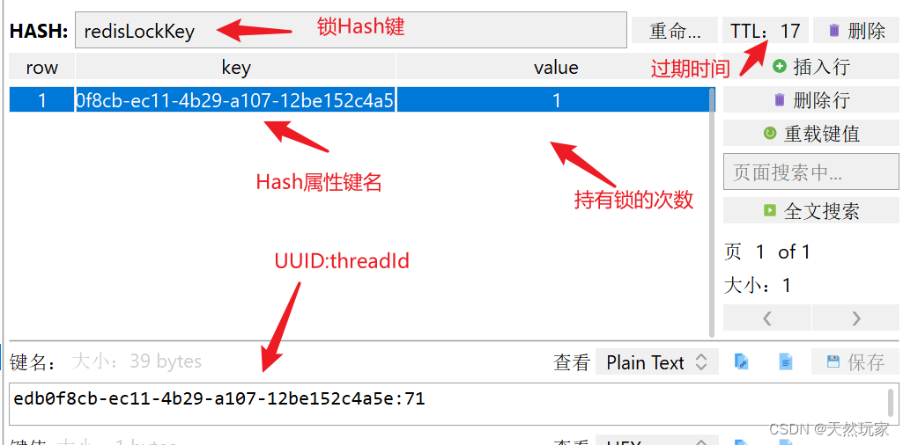
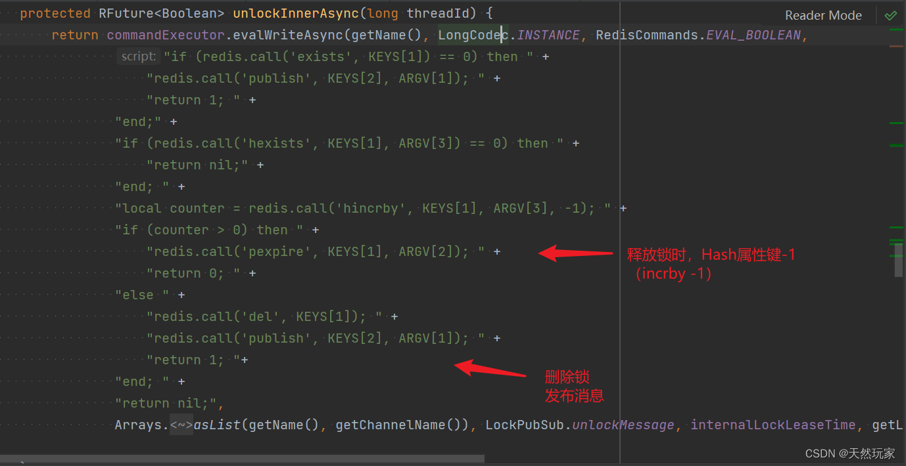

[(125条消息) 简洁易懂：源码+实战讲解Redisson并发锁及看门狗自动续期\_redisson看门狗源码\_天然玩家的博客-CSDN博客](https://blog.csdn.net/Xin_101/article/details/128950698)

## 1 缘起

有一次同事问[Redisson](https://so.csdn.net/so/search?q=Redisson&spm=1001.2101.3001.7020)存储的键是否为hash？  
我当时，没有看Redisson的相关源码，只知道应用，  
所以没有办法回答，于是开始看看Redisson实现的源码，  
顺便写了一个单机Redisson测试，  
发现Redisson有看门狗功能，但是，不是所有的方法都会触发，  
只有lock()方法才会触发看门狗，其他的方法不会触发看门狗功能，  
如lock(long, TimeUnit)，tryLock()，  
本文从结果触发，先理论分析，然后，代码实践验证。  
先从源码讲解Redisson相关的知识，包括如何新建锁、释放锁、看门狗功能，  
然后代码实战，验证这些功能，  
感兴趣的同学可以手动调试。  
帮助读者轻松应对知识交流与考核。

版本信息：  
SpringBoot：2.1.7  
Redisson：3.7.5

## 2 Redisson属性源码分析与验证

## 2.1 新建锁

位置：org.redisson.RedissonLock#tryLockInnerAsync  
新建锁和可重入源码如下图所示，由源码可知，  
Redisson使用[Lua脚本](https://so.csdn.net/so/search?q=Lua%E8%84%9A%E6%9C%AC&spm=1001.2101.3001.7020)新建锁。

-   为什么？  
    保证操作原子性。  
    因为新建数据和添加过期时间是两步操作，不能保证原子性，  
    因此使用Lua实现，保证新建锁时是原子操作。

Redisson实现的锁是可重入的。同一个线程获取锁，无需重新排队申请，只需增加锁的持有次数。

-   怎么做？  
    判断锁是的属性是否存在。  
    通过hexists判断锁的属性是否存在（UUID:threadId），如果存在，值+1，同时，更新锁过期时间，  
    使用Lua脚本，保证原子性。


Lua脚本中的参数KEYS\[1\]，ARGV\[1\], ARGV\[2\]，

-   分别对应哪些参数呢？  
    KEYS\[1\]：Collections.singletonList(getName())，即锁的键名；  
    ARGV\[1\]：internalLockLeaseTime，即锁过期时间；  
    ARGV\[2\]：getLockName(threadId)，即锁（Hash）属性的键，UUDI:threadId。  
    其中，getLockName源码如下图所示，由图可知，UUID拼接threadId作为锁属性的键。  
    顺便补充一下，Hash结构，键名，即获取该Hash的键，属性键名，即Hash内部数据的键。


下面看一下新建锁的调试过程，如下图所示，  
（单步调试，如果操作不及时或者有其他时延，会导致Redis数据过期，因此，选择单步调试）  
由图可知，新建的锁，键名称为redisLockKey，  
默认锁过期时间为30秒，UUID为edb0f8cb-ec11-4b29-a107-12be152c4a5e，  
threadId为71，锁属性的键为：`edb0f8cb-ec11-4b29-a107-12be152c4a5e:71`，属性键的值为1。  
  
新建锁之后，会在Redis生成对应的数据，  
如下图所示，由图可知，Redisson新建的锁键为redisLockKey，  
锁属性名称为：`edb0f8cb-ec11-4b29-a107-12be152c4a5e:71`，属性值为1。  
过期时间TTL已经开始倒计时了，实时的值为17秒。  


## 2.2 获取锁

Redisson获取锁有两种方式：lock获取和tryLock获取。  
lock()获取锁，如果得不到，会一直等，同时，lock()会开启看门狗功能，在看门狗巡查期间，锁不会过期；  
lock(long, java.util.concurrent.TimeUnit)获取锁，会一直等，当锁过期后，即可自动获取；  
tryLock()获取锁，得不到会一直等，当锁过期后，可自动获取到；  
tryLock(long, long, java.util.concurrent.TimeUnit)获取锁，有两个时间参数，可以同时指定等待锁的最大时间，以及锁过期时间，如果等待最大时间大于锁过期时间，则锁被提前释放，重新生成锁；

### 2.2.1 lock

位置：java.util.concurrent.locks.Lock#lock

无参的lock方法来自JUC接口，  
Redisson自身实现lock，并加入看门狗功能。  
无返回值。  
  
Redisson的实现源码如下图所示，这里给出路径，感兴趣可自行查看。  
位置：org.redisson.RedissonLock#lock()


有参的lock源码如下图所示，  
这个lock来自Redisson的RLock，添加了锁过期时间，  
可以自定义锁的过期时间，这个获取锁的方法不会触发看门狗。  
无返回值。

位置：org.redisson.api.RLock#lock  
  
Redisson实现源码如下，这里给出路径，感兴趣可自行查看。  
位置：org.redisson.RedissonLock#lock(long, java.util.concurrent.TimeUnit)  


### 2.2.2 tryLock

位置：java.util.concurrent.locks.Lock#tryLock()  
获取锁，无法获取时等待，当锁自动过期后，可自动获取。  
有返回值，可通过返回值判断是否获得锁。  
true：成功获取锁；  
false：未获取锁。  
  
Redisson实现tryLock源码如下图所示。  
位置：org.redisson.RedissonLock#tryLock()  


有参数的tryLock源码下图所示，有源码可知，  
可指定最大等待锁时间、锁过期时间，  
如果等待锁的最大时间小于锁过期时间，返回false，标识未得到锁。  
如果等待锁的最大时间大于锁过期时间，等锁释放后，可自动获取锁，返回true，标识得到锁。  
有返回值，可通过返回值判断是否获得锁。  
true：成功获取锁；  
false：未获取锁。  
位置：org.redisson.api.RLock#tryLock


获取锁的实现源码如下图所示，这里给出路径，感兴趣可自行查看。  
位置：org.redisson.RedissonLock#tryLock(long, long, java.util.concurrent.TimeUnit)  


## 2.3 释放锁

位置：org.redisson.RedissonLock#unlockInnerAsync  
释放锁源码如下图所示，由图可知，释放锁时会将锁属性的值-1，（加-1），  
当释放的锁存在时，会将锁属性的值减1，减后的值大于零，重置锁的过期时间，保证锁的过期时间周期，  
如果减1之后，锁属性值为0，即没有线程再持有锁，则删除该锁（del）。  


## 2.4 锁续期

看门狗  
位置：org.redisson.config.Config#lockWatchdogTimeout  
看门狗的默认超时时间为30秒，即锁过期时间的续期为30秒，  
看门狗的巡查周期为10秒，即每10秒更新一次锁的过期时间，设置为30秒。  
两个是独立的时间系统。  
30秒：锁的过期时间；  
10秒：看门狗巡查周期。  
这个10秒是如何得到的：30/3=10。


位置：org.redisson.RedissonLock#scheduleExpirationRenewal  
看门狗进行锁续期的源码如下图所示，由源码可知，  
当锁存在时，会延迟10秒执行更新锁过期时间，过期时间为30秒，  
看门狗的巡查周期就是这个延迟时间：10秒。  
  
当然，好奇的同学会问，锁的默认过期时间怎么就是30秒，  
这个30秒是从哪里来的呢？  
过期时间（internalLockLeaseTime）默认值取自看门狗的超时时间：30秒，上文有看门狗的默认值源码。  


## 3 实战

_**版本信息：  
SpringBoot：2.1.7  
Redisson：3.7.5**_

## 3.1 依赖

```
<!--Redisson-->
<dependency>
<groupId>org.redisson</groupId>
<artifactId>redisson</artifactId>
<version>3.7.5</version>
</dependency>
```

## 3.2 配置

### 3.2.1 Redis配置

application-dev.yml

```
spring:
  profiles: dev
  redis:
    host: localhost
    port: 6379
    # 连接超时时间：毫秒
    timeout: 60000
    database: 0
    lettuce:
      pool:
        # 连接池最大连接数量
        max-active: 8
        # 连接池最大阻塞等待时间：-1无限制
        max-wait: 60000
        # 连接池最大空闲连接数量
        max-idle: 8
        # 连接池最小空闲连接数量
        min-idle: 0
```

### 3.2.2 绑定Redis配置

```
package com.hardsoft.monkeyrun.common.lock;

import org.springframework.boot.context.properties.ConfigurationProperties;
import org.springframework.context.annotation.Configuration;

/**
 * Redis连接参数.
 *
 * @author xindaqi
 * @since 2021/4/2 11:41
 */
@Configuration
@ConfigurationProperties(prefix="spring.redis")
public class RedisConnectionParams {

    /**
     * 主机名
     */
    private String host;

    /**
     * 主机端口
     */
    private String port;

    /**
     * Redis连接超时时间：毫秒
     */
    private int timeout;

    /**
     * Redis数据库编号
     */
    private int database;

    public void setHost(String host) {
        this.host = host;
    }

    public String getHost() {
        return host;
    }

    public void setPort(String port) {
        this.port = port;
    }

    public String getPort() {
        return port;
    }

    public void setTimeout(int timeout) {
        this.timeout = timeout;
    }

    public int getTimeout() {
        return timeout;
    }

    public void setDatabase(int database) {
        this.database = database;
    }

    public int getDatabase() {
        return database;
    }

    @Override
    public String toString() {
        return "RedisConnectionParams{" +
                "host='" + host + '\'' +
                ", port='" + port + '\'' +
                ", timeout=" + timeout +
                ", database=" + database +
                '}';
    }
}
```

### 3.2.3 Redisson配置

```
package com.hardsoft.monkeyrun.common.config;

import com.hardsoft.monkeyrun.common.lock.RedisConnectionParams;
import com.hardsoft.monkeyrun.common.lock.RedissonLocker;
import org.redisson.Redisson;
import org.redisson.api.RedissonClient;
import org.redisson.config.Config;
import org.redisson.config.SingleServerConfig;
import org.springframework.context.annotation.Bean;
import org.springframework.context.annotation.Configuration;

import javax.annotation.Resource;

import static com.hardsoft.monkeyrun.common.constrant.StringConstant.COLON;
import static com.hardsoft.monkeyrun.common.constrant.StringConstant.REDISSON_SCHEMA;

/**
 * Redisson配置.
 *
 * @author xindaqi
 * @since 2021/4/2 11:34
 */
@Configuration
public class RedissonConfig {

    @Resource
    RedisConnectionParams redisConnectionParams;

    /**
     * 单机模式RedissonClient
     *
     * @return
     */
    @Bean(destroyMethod = "shutdown")
    public RedissonClient redissonClient() {
        Config config = new Config();
        SingleServerConfig singleServerConfig = config.useSingleServer();
        StringBuilder redisAddress = new StringBuilder();
        redisAddress.append(REDISSON_SCHEMA).append(redisConnectionParams.getHost()).append(COLON).append(redisConnectionParams.getPort());
        singleServerConfig.setAddress(redisAddress.toString());
        return Redisson.create(config);
    }

    @Bean
    public RedissonLocker redissonLocker(RedissonClient redissonClient) {
        return new RedissonLocker(redissonClient);
    }

}
```

### 3.2.4 Redisson获取锁封装

```
package com.hardsoft.monkeyrun.common.lock;

import com.hardsoft.monkeyrun.common.constrant.BooleanConstant;
import org.redisson.api.RLock;
import org.redisson.api.RedissonClient;
import org.springframework.stereotype.Component;

import javax.annotation.Resource;
import java.util.concurrent.TimeUnit;

/**
 * Redisson锁
 *
 * @author xindaqi
 * @since 2021/3/30 19:01
 */
@Component
public class RedissonLocker {

    RedissonClient redissonClient;

    public RedissonLocker(RedissonClient redissonClient) {
        this.redissonClient = redissonClient;
    }

    /**
     * 获取锁
     * 如果锁不可用，则当前线程处于休眠状态，直到获得锁为止
     *
     * @param lockKey 锁键
     */
    public void lock(String lockKey) {
        RLock lock = redissonClient.getLock(lockKey);
        lock.lock();
    }

    /**
     * 获取锁
     * 如果锁不可用，则当前线程处于休眠状态，直到获得锁为止，
     * 如果获取到锁后，执行结束后解锁或达到超时时间后自动释放锁
     *
     * @param lockKey 锁键
     * @param timeout 超时时间
     */
    public void lock(String lockKey, int timeout) {
        RLock lock = redissonClient.getLock(lockKey);
        lock.lock(timeout, TimeUnit.SECONDS);
    }

    /**
     * 获得锁
     * 如果锁不可用，则当前线程处于休眠状态，直到获得锁后，
     * 执行结束后解锁或达到超时时间后会自动释放锁
     *
     * @param lockKey 锁键
     * @param unit 时间单位
     * @param timeout 超时时间
     */
    public void lock(String lockKey, TimeUnit unit, int timeout) {
        RLock lock = redissonClient.getLock(lockKey);
        lock.lock(timeout, unit);
    }

    /**
     * 释放锁
     *
     * @param lockKey 锁键
     */
    public void unlock(String lockKey) {
        RLock lock = redissonClient.getLock(lockKey);
        lock.unlock();
    }

    /**
     * 尝试获取锁
     * 获取到立即返回True
     * 未获取到返回False
     *
     * @param lockKey 锁键
     * @return 获取锁标志位，True：成功获取锁，False：未获取锁
     */
    public boolean tryLock(String lockKey) {
        RLock lock = redissonClient.getLock(lockKey);
        return lock.tryLock();
    }

    /**
     * 尝试获取锁
     * 在等待时间内获取到锁则返回True，否则返回False
     * 获取到锁，两种执行逻辑：
     * 1.执行之后，释放锁
     * 2.达到释放时间leaseTime后，释放锁
     *
     * @param lockKey 锁键
     * @param waitTime 等待时间
     * @param leaseTime 释放时间
     * @param unit 时间单位
     * @return 获取锁标志位，True：成功获取锁，False：未获取锁
     * @throws InterruptedException
     */
    public boolean tryLock(String lockKey, long waitTime, long leaseTime, TimeUnit unit) throws InterruptedException {
        RLock lock = redissonClient.getLock(lockKey);
        return lock.tryLock(waitTime, leaseTime, unit);
    }

    /**
     * 判断锁是否被任意一个线程持有
     *
     * @param lockKey 锁键
     * @return 锁持有标志位，True：锁被线程持有，False：锁没有被线程持有
     */
    public boolean isLocked(String lockKey) {
        RLock lock = redissonClient.getLock(lockKey);
        return lock.isLocked();
    }

    public void setRedissonClient(RedissonClient redissonClient) {
        this.redissonClient = redissonClient;
    }
}
```

## 3.3 接口测试

```
package com.hardsoft.monkeyrun.api.facade.lock;

import com.hardsoft.monkeyrun.common.constrant.BooleanConstant;
import com.hardsoft.monkeyrun.common.constrant.DigitalConstant;
import com.hardsoft.monkeyrun.common.enums.BizExceptionCodeEnums;
import com.hardsoft.monkeyrun.common.exception.BizException;
import com.hardsoft.monkeyrun.common.lock.RedissonLocker;
import com.hardsoft.monkeyrun.common.response.Response;

import org.springframework.web.bind.annotation.GetMapping;
import org.springframework.web.bind.annotation.RequestMapping;
import org.springframework.web.bind.annotation.RestController;

import javax.annotation.Resource;

import org.slf4j.Logger;
import org.slf4j.LoggerFactory;

import java.util.concurrent.TimeUnit;

import static com.hardsoft.monkeyrun.common.constrant.StringConstant.REDIS_LOCK_KEY;

/**
 * 锁测试
 *
 * @author xindaqi
 * @since 2021-04-03 11:28:18
 */
@RestController
@RequestMapping("/v1/lock")
public class LockTest {

    private static final Logger logger = LoggerFactory.getLogger(LockTest.class);

    private final String STOCK_WITH_REDISSON = "stock_with_redisson";

    private final String STOCK_WITHOUT_REDISSON = "stock_without_redisson";

    @Resource
    RedissonLocker redissonLocker;

    /**
     * 测试Redisson锁tryLock，不会激活看门狗，锁过期后，直接被清除
     * 
     * @return 响应
     */
    @GetMapping("/redisson/try-lock/test")
    public Response<String> testRedissonTryLock() {
        try {
            boolean lock1 = redissonLocker.tryLock(REDIS_LOCK_KEY, 100, 10, TimeUnit.SECONDS);
            if (lock1) {
                logger.info(">>>>>>>>得到锁");
                Thread.sleep(70000);
                return Response.success();
            } else {
                logger.info(">>>>>>>>未得到锁");
                return Response.fail();
            }
        } catch(Exception ex) {
            logger.error(">>>>>>>>Redisson异常：", ex);
            throw new BizException(BizExceptionCodeEnums.FAIL);
        } finally {
            logger.info(">>>>>>>释放Redisson锁");
            redissonLocker.unlock(REDIS_LOCK_KEY);
        }
    }

    /**
     * 测试Redisson看门狗功能：使用lock()获取锁，激活看门狗功能，每10秒自动续期30秒过期时间。
     * 
     * @return 响应
     */
    @GetMapping("/redisson/lock/test")
    public Response<String> testRedissonLock() {
        try {
            redissonLocker.lock(REDIS_LOCK_KEY);
            Thread.sleep(70000);
            return Response.success();
        } catch(Exception ex) {
            logger.error(">>>>>>>>Redisson异常：", ex);
            throw new BizException(BizExceptionCodeEnums.FAIL);
        } finally {
            logger.info(">>>>>>>释放Redisson锁");
            redissonLocker.unlock(REDIS_LOCK_KEY);
        }
    }
}
```

Redis结果：


## 4 结论

（1）Redisson锁存储使用Hash，Hash键为锁的键名，属性的键为UUID拼接ThreadId，格式：UUID:ThreadID，如xxx-xxx:30，属性的值为同一个线程获取锁的次数，Redisson的锁是可重入的，同一个线程获取锁，锁的数量+1，释放锁，数量减1；  
（2）Redisson获取锁有两种方式，lock获取和tryLock获取，其中：  
（2.1）lock获取锁时，如果第一次尝试获取获取失败，会一直等待，直到获取锁。Redisson的lock获取锁时，会为锁配置过期时间，当锁超过过期时间后，会自动释放，避免死锁，可以重新获得锁；  
（2.2）lock()原始方法获取（不自定义超时（过期）时间）会激活看门狗。即通过lock()方法成功获取锁后，逻辑执行的时间超过看门狗超时时间：10秒，会自动为锁续期（增加）10秒的过期时间，使锁的过期时间保持在30秒（默认的锁过期时间）；  
（2.3）lock(long, TimeUnit)带参方法可以指定锁过期时间，但是，不会触发看门狗自动续期；锁过期后，自动释放锁；  
（2.4）tryLock方法返回标识位，获取成功，返回true，获取失败，返回false；tryLock尝试获取锁，无法获取锁时会等待，同时，tryLock有最大的等待时间，如果获取锁的等待时间超过最大等待时间，会放弃获取锁，并返回false；tryLock不会触发看门狗，无法自动为锁续期；  
（2.5）tryLock可以同时指定等待锁的最大时间，以及锁过期时间，如果等待最大时间大于锁过期时间，则锁被提前释放，重新生成锁；  
（3）Redisson看门狗默认巡查周期为10秒，锁续期时间（过期时间）30秒；  
（4）Redisson看门口生效的方法为：lock()，其他方法均不会触发看门狗。


——————————————————————————

# 如何不用 redisson实现看门狗功能

> [(130条消息) 阿里二面：redis分布式锁过期了但业务还没有执行完，怎么办\_架构师小秘圈的博客-CSDN博客](https://blog.csdn.net/g6U8W7p06dCO99fQ3/article/details/120170020?spm=1001.2101.3001.6661.1&utm_medium=distribute.pc_relevant_t0.none-task-blog-2%7Edefault%7ECTRLIST%7ERate-1-120170020-blog-128816902.pc_relevant_3mothn_strategy_recovery&depth_1-utm_source=distribute.pc_relevant_t0.none-task-blog-2%7Edefault%7ECTRLIST%7ERate-1-120170020-blog-128816902.pc_relevant_3mothn_strategy_recovery&utm_relevant_index=1)

**面试官**:你们系统是怎么实现[分布式锁](https://so.csdn.net/so/search?q=%E5%88%86%E5%B8%83%E5%BC%8F%E9%94%81&spm=1001.2101.3001.7020)的？  

**我**:我们使用了redis的分布式锁。具体做法是后端接收到请求后加入一个分布式锁，如果加锁成功，就执行业务，如果加锁失败就等待锁或者拒绝请求。业务执行完成后释放锁。

**面试官**:能说一下具体使用的命令吗？

**我**:我们使用的是SETNX命令，具体如下：

```
SETNX KEY_NAME VALUE
```

设置成功返回1，设置失败返回0。如下图，客户端1加锁成功，客户端2获取锁失败：


**面试官**:这样设置会不会有问题呢？如果加锁成功的客户端挂了怎么办？

**我**：比如上图中的客户端1挂了，这个锁就不能释放了。可以设置一个过期时间，命令如下：

```
SET key value [EX seconds] [PX milliseconds] NX
```

**面试官**:设置了过期时间，如果业务还没有执行完成，但是redis锁过期了，怎么办？

**我**：需要对锁进行续约。

**面试官**：能说一下具体怎么操作吗？

**我**：设置锁成功后，启动一个watchdog，每隔一段时间(比如10s)为当前分布式锁续约，也就是每隔10s重新设置当前key的超时时间。命令如下：

```
EXPIRE <key> <seconds>
```

整个流程如下：


**面试官**：watchdog怎么实现呢？

**我**：当客户端加锁成功后，可以启动一个定时任务，每隔10s(最好支持配置)来检测业务是否处理完成，检测的依据就是判断分布式锁的key是否还存在，如果存在，就进行续约。

**面试官**：如果当前线程已经处理完，这个key是被其他客户端写入的呢？

**我**：可以为每个客户端指定一个clientID，在VALUE中增加一个clientID的前缀，这样在续锁的时候，可以判断当前分布式锁的value前缀来确定是不是当前客户端的，如果是再续锁，否则不做处理。

**面试官**:你们的续锁功能是自己实现的吗？

**我**:我们用的redisson的分布式锁方案，使用redisson获取分布式锁非常简单，代码如下：

```
RLock lock = redisson.getLock("client-lock");lock.lock();try {} catch (Exception e) {} finally {    lock.unlock();}
```

具体原理是：如果客户端1加锁成功，这个分布式锁超时时间**默认是30秒**(可以通过Config.lockWatchdogTimeout来修改)。加锁成功后，就会启动一个watchdog，watchdog是一个后台线程，会**每隔10秒**检查一下客户端1是否还持有锁key，如果是，就延长锁key的生存时间，延长操作就是再次把锁key的超时时间设置成30s。

**面试官**：redisson里的定时器怎么实现的？

**我**：redisson定时器使用的是netty-common包中的HashedWheelTime来实现的。

**面试官**：如果client1宕机了，这时分布式锁还可以续期吗？

**我**：因为分布式锁的续期是在客户端执行的，所以如果client1宕机了，续期线程就不能工作了，也就不能续期了。这时应该把分布式锁删除，让其他客户端来获取。

**面试官**：那如果client1宕机了，其他客户端需要等待30s才能有机会获取到锁，有办法立刻删除锁吗？

**我**：因为client1宕机了，只能等到超时时间后锁被自动删除。如果要立刻删除，需要增加额外的工作，比如增加哨兵机制，让哨兵来维护所有redis客户端的列表。哨兵定时监控客户端是否宕机，如果检测到宕机，立刻删除这个客户端的锁。如下图：


> 这里的哨兵并不是redis的哨兵，而且为了检测客户端故障业务系统自己做的哨兵。

**面试官**：如果不用redisson，怎么实现分布式锁续锁呢？比如springboot2.0默认使用redis客户端是Lettuce。

**我**：Lettuce并没有提供像redisson这样的watchdog机制，所以续锁需要业务系统自己实现。可以分为以下几步来实现：

1.  加锁的命令，我们参照spring包里的分布式锁代码，如果锁存在并且是当前客户端加的锁，那就续锁，如果锁不存在，则加锁。代码如下：
    

```
private static final String OBTAIN_LOCK_SCRIPT ="local lockClientId = redis.call('GET', KEYS[1])\n" +"if lockClientId == ARGV[1] then\n" +"  redis.call('PEXPIRE', KEYS[1], ARGV[2])\n" +"  return true\n" +"elseif not lockClientId then\n" +"  redis.call('SET', KEYS[1], ARGV[1], 'PX', ARGV[2])\n" +"  return true\n" +"end\n" +"return false";
```

1.  把锁保存在一个数据结构里，比如HashMap，定时任务定时扫描这个map，对每个锁进行续锁操作。代码如下：
    

```
private final Map<String, RedisLock> locks = new ConcurrentHashMap<>();
```

1.  续锁命令
    

```
private static final String RENEW_LOCK_SCRIPT ="local lockClientId = redis.call('GET', KEYS[1])\n" +"if lockClientId == ARGV[1] then\n" +"  redis.call('PEXPIRE', KEYS[1], ARGV[2])\n" +"  return true\n" +"end\n" +"return false";
```

如果锁是当前客户端加的，那就续锁，否则失败。

1.  写一个定时任务，定时执行续锁代码：
    

```
redisTemplate.execute(renewLockScript,                        Collections.singletonList(lockKey), clientId,                        String.valueOf(expireAfter));
```

**面试官**：这个问题就聊到这里，咱们下一个问题...