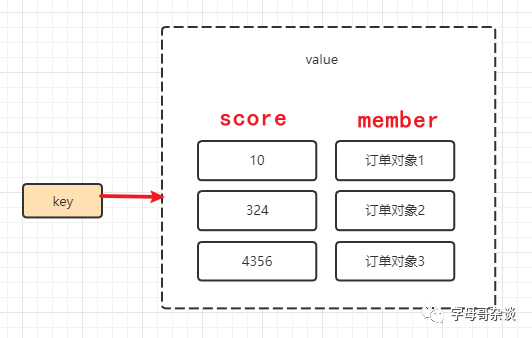

[延时任务(三)-基于redis zset的完整实现-云社区-华为云](https://bbs.huaweicloud.com/blogs/371753)

所谓的延时任务给大家举个例子：你买了一张火车票，必须在30分钟之内付款，否则该订单被自动取消。**「订单30分钟不付款自动取消，这个任务就是一个延时任务。」** 我之前已经写过2篇关于延时任务的文章：

-   [《完整实现-通过DelayQueue实现延时任务》](https://mp.weixin.qq.com/mp/appmsgalbum?__biz=MzU0NDU5MTk1MQ==&action=getalbum&album_id=2540840147119046657#wechat_redirect)
    
-   [《延时任务(二)-基于netty时间轮算法实战》](https://mp.weixin.qq.com/mp/appmsgalbum?__biz=MzU0NDU5MTk1MQ==&action=getalbum&album_id=2540840147119046657#wechat_redirect)
    

这两种方法都有一个缺点：都是基于单体应用的内存的方式运行延时任务的，一旦出现单点故障，可能出现延时任务数据的丢失。所以此篇文章给大家介绍实现延时任务的第三种方式，结合redis zset实现延时任务，可以解决单点故障的问题。给出实现原理、完整实现代码，以及这种实现方式的优缺点。

## 一、实现原理

首先来介绍一下实现原理，我们需要使用redis zset来实现延时任务的需求，所以我们需要知道zset的应用特性。zset作为redis的有序集合数据结构存在，排序的依据就是score。

所以我们可以利用zset score这个排序的这个特性，来实现延时任务

-   在用户下单的时候，同时生成延时任务放入redis，key是可以自定义的，比如：`delaytask:order`
    
-   value的值分成两个部分，一个部分是score用于排序，一个部分是member，member的值我们设置为订单对象（如：订单编号），因为后续延时任务时效达成的时候，我们需要有一些必要的订单信息（如：订单编号），才能完成订单自动取消关闭的动作。
    
-   **「延时任务实现的重点来了，score我们设置为：订单生成时间 + 延时时长」**。这样redis会对zset按照score延时时间进行排序。
    
-   开启redis扫描任务，获取"当前时间 > score"的延时任务并执行。即：当前时间 > 订单生成时间 + 延时时长的时候 ，执行延时任务。
    

## 二、准备工作

使用 redis zset 这个方案来完成延时任务的需求，首先肯定是需要redis，这一点毫无疑问。redis的搭建网上有很多的文章，我这里就不赘述了。

其次，笔者长期的java类应用系统开发都是使用SpringBoot来完成，所以也是习惯使用SpringBoot的redis集成方案。首先通过maven坐标引入spring-boot-starter-data-redis

```
<dependency>
    <groupId>org.springframework.boot</groupId>
    <artifactId>spring-boot-starter-data-redis</artifactId>
</dependency>
<dependency>
    <groupId>org.apache.commons</groupId>
    <artifactId>commons-pool2</artifactId>
</dependency>

```

其次需要在Spring Boot的`application.yml`配置文件中，配置redis数据库的链接信息。我这里配置的是redis的单例，如果大家的生产环境是哨兵模式、或者是集群模式的redis，这里的配置方式需要进行微调。其实这部分内容在我的个人博客里面都曾经系统的介绍过，感兴趣的朋友可以关注我的个人博客。

```
spring:
  redis:
    database: 0 # Redis 数据库索引（默认为 0）
    host: 192.168.161.3 # Redis 服务器地址
    port: 6379 # Redis 服务器连接端口
    password: 123456 # Redis 服务器连接密码（默认为空）
    timeout:  5000  # 连接超时，单位ms
    lettuce:
      pool:
        max-active: 8 # 连接池最大连接数（使用负值表示没有限制） 默认 8
        max-wait: -1 # 连接池最大阻塞等待时间（使用负值表示没有限制） 默认 -1
        max-idle: 8 # 连接池中的最大空闲连接 默认 8
        min-idle: 0 # 连接池中的最小空闲连接 默认 0

```

## 三、代码实现

下面的这个类就是延时任务的核心实现了，一共包含三个核心方法，我们来一一说明一下：

-   produce方法，用于生成订单-order为订单信息，可以是订单流水号，用于延时任务达到时效后关闭订单
    
-   afterPropertiesSet方法是InitializingBean接口的方法，之所以实现这个接口，是因为我们需要在应用启动的时候开启redis扫描任务。即：当OrderDelayService bean初始化的时候，开启redis扫描任务循环获取延时任务数据。
    
-   consuming函数，用于从redis获取延时任务数据，消费延时任务，执行超时订单关闭等操作。为了避免阻塞for循环，影响后面延时任务的执行，所以这个consuming函数一定要做成异步的，参考Spring Boot异步任务及`Async`注解的使用方法。我之前写过一个SpringBoot的\*\*「可观测、易配置」\*\*的异步任务线程池开源项目，源代码地址：https://gitee.com/hanxt/zimug-monitor-threadpool 。我的这个zimug-monitor-threadpool开源项目，可以做到对线程池使用情况的监控，我自己平时用的效果还不错，向大家推荐一下！
    

```
@Component
public class OrderDelayService  implements InitializingBean {
  //redis zset key
  public static final String ORDER_DELAY_TASK_KEY = "delaytask:order";

  @Resource
  private StringRedisTemplate stringRedisTemplate;

  //生成订单-order为订单信息，可以是订单流水号，用于延时任务达到时效后关闭订单
  public void produce(String orderSerialNo){
    stringRedisTemplate.opsForZSet().add(
            ORDER_DELAY_TASK_KEY,     // redis key
            orderSerialNo,    // zset  member
            //30分钟延时
            System.currentTimeMillis() + (30 * 60 * 1000)    //zset score
    );
  }

  //延时任务，也是异步任务，延时任务达到时效之后关闭订单，并将延时任务从redis zset删除
  @Async("test")
  public void consuming(){
       
      Set<ZSetOperations.TypedTuple<String>> orderSerialNos = stringRedisTemplate.opsForZSet().rangeByScoreWithScores(
              ORDER_DELAY_TASK_KEY,
              0,  //延时任务score最小值
              System.currentTimeMillis() //延时任务score最大值（当前时间）
      );
      if (!CollectionUtils.isEmpty(orderSerialNos)) {
        for (ZSetOperations.TypedTuple<String> orderSerialNo : orderSerialNos) {
          //这里根据orderSerialNo去检查用户是否完成了订单支付
          //如果用户没有支付订单，去执行订单关闭的操作
          System.out.println("订单" + orderSerialNo.getValue() + "超时被自动关闭");
          //订单关闭之后，将订单延时任务从队列中删除
          stringRedisTemplate.opsForZSet().remove(ORDER_DELAY_TASK_KEY, orderSerialNo.getValue());
        }
      }
  }

  //该类对象Bean实例化之后，就开启while扫描任务
  @Override
  public void afterPropertiesSet() throws Exception {
    new Thread(() -> {  //开启新的线程，否则SpringBoot应用初始化无法启动
      while(true){
        try {
          Thread.sleep(5 * 1000);   //每5秒扫描一次redis库获取延时数据，不用太频繁没必要
        } catch (InterruptedException e) {
          e.printStackTrace();  //本文只是示例，生产环境请做好相关的异常处理
        }
        consuming();
      }
    }).start();
  }
}

```

更多的内容参考代码中的注释，需要关注的点是：

-   上文中的rangeByScoreWithScores方法用于从redis中获取延时任务，score大于0小于当前时间的所有延时任务，都将被从redis里面取出来。每5秒执行一次，所以延时任务的误差不会超过5秒。
    
-   上文中的订单信息，我只保留了订单唯一流水号，用于关闭订单。如果你的业务需要传递更多的订单信息，请使用RedisTemplate操作订单类对象，而不是StringRedisTemplate操作订单流水号字符串。
    

订单下单的时候，使用如下的方法，将订单序列号放入redis zset中即可实现延时任务

```
orderDelayService.produce("这里填写订单编号");

```

## 四、优缺点

使用redis zset来实现延时任务的优点是：相对于本文开头介绍的两种方法，我们的延时任务是保存在redis里面的，redis具有数据持久化的机制，可以有效的避免延时任务数据的丢失。另外，redis还可以通过哨兵模式、集群模式有效的避免单点故障造成的服务中断。至于缺点嘛，我觉得没什么缺点。如果非要勉强的说一个缺点的话，那就是我们需要额外维护redis服务，增加了硬件资源的需求和运维成本。但是现在随着微服务的兴起，redis几乎已经成了应用系统的标配，redis复用即可，所以我感觉这也算不上什么缺点吧！

**「码文不易，如果您觉得有帮助，请帮忙点击在看或者分享，没有您的支持我可能无法坚持下去！」**

文章来源: zimug.blog.csdn.net，作者：字母哥哥，版权归原作者所有，如需转载，请联系作者。

原文链接：zimug.blog.csdn.net/article/details/126458726

【版权声明】本文为华为云社区用户转载文章，如果您发现本社区中有涉嫌抄袭的内容，欢迎发送邮件至：[cloudbbs@huaweicloud.com](mailto:cloudbbs@huaweicloud.com)进行举报，并提供相关证据，一经查实，本社区将立刻删除涉嫌侵权内容。

# ✅Redis如何实现延迟消息？


## Redis过期消息实现延迟消息  
很多用过Redis的人都知道，Redis有一个过期监听的功能，  

在 redis.conf 中，加入一条配置notify-keyspace-events Ex开启过期监听，然后再代码中实现一个KeyExpirationEventMessageListener，就可以监听key的过期消息了。  

这样就可以在接收到过期消息的时候，进行订单的关单操作。  

这个方案不建议大家使用，是因为Redis官网上明确的说过，Redis并不保证Key在过期的时候就能被立即删除，更不保证这个消息能被立即发出。所以，消息延迟是必然存在的，随着数据量越大延迟越长，延迟个几分钟都是常事儿。  

而且，在Redis 5.0之前，这个消息是通过PUB/SUB模式发出的，他不会做持久化，至于你有没有接到，有没有消费成功，他不管。也就是说，如果发消息的时候，你的客户端挂了，之后再恢复的话，这个消息你就彻底丢失了。  
## Redis的zset实现延迟消息  
虽然基于Redis过期监听的方案并不完美，但是并不是Redis实现关单功能就不完美了，还有其他的方案。  

我们可以借助Redis中的有序集合——zset来实现这个功能。  

zset是一个有序集合，每一个元素(member)都关联了一个 score，可以通过 score 排序来取集合中的值。  

我们将订单超时时间的时间戳（下单时间+超时时长）与订单号分别设置为 score 和 member。这样redis会对zset按照score延时时间进行排序。然后我们再开启redis扫描任务，获取”当前时间 > score”的延时任务，扫描到之后取出订单号，然后查询到订单进行关单操作即可。  

使用redis zset来实现订单关闭的功能的优点是可以借助redis的持久化、高可用机制。避免数据丢失。但是这个方案也有缺点，那就是在高并发场景中，有可能有多个消费者同时获取到同一个订单号，一般采用加分布式锁解决，但是这样做也会降低吞吐型。  

但是，在大多数业务场景下，如果幂等性做得好的，多个消费者取到同一个订单号也无妨。  
## Redission实现延迟消息  
上面这种方案看上去还不错，但是需要我们自己基于zset这种数据结构编写代码，那么有没有什么更加友好的方式？  

有的，那就是基于Redisson。  

Redisson是一个在Redis的基础上实现的框架，它不仅提供了一系列的分布式的Java常用对象，还提供了许多分布式服务。  

Redission中定义了分布式延迟队列RDelayedQueue，这是一种基于我们前面介绍过的zset结构实现的延时队列，它允许以指定的延迟时长将元素放到目标队列中。  

其实就是在zset的基础上增加了一个基于内存的延迟队列。当我们要添加一个数据到延迟队列的时候，redission会把数据+超时时间放到zset中，并且起一个延时任务，当任务到期的时候，再去zset中把数据取出来，返回给客户端使用。  

大致思路就是这样的，感兴趣的大家可以看一看RDelayedQueue的具体实现。  

基于Redisson的实现方式，是可以解决基于zset方案中的并发重复问题的，而且还能实现方式也比较简单，稳定性、性能都比较高。