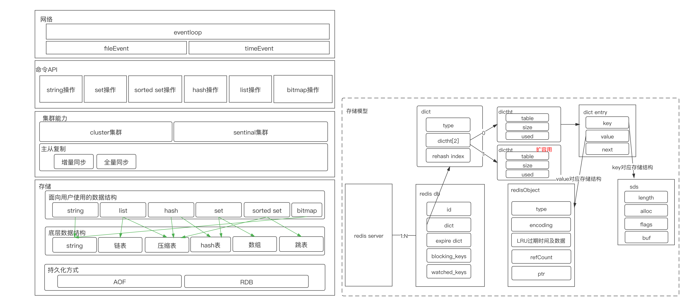
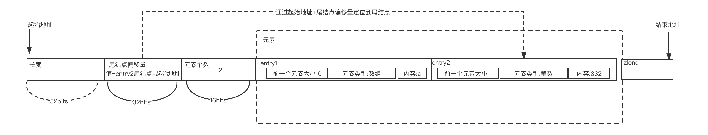
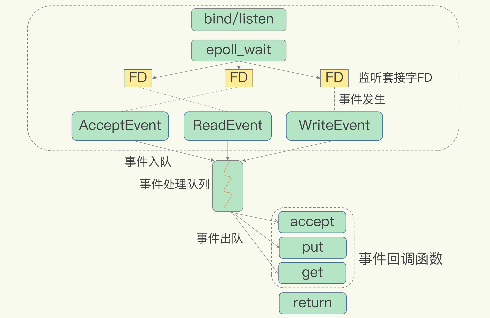
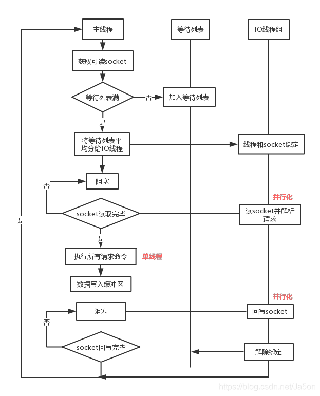
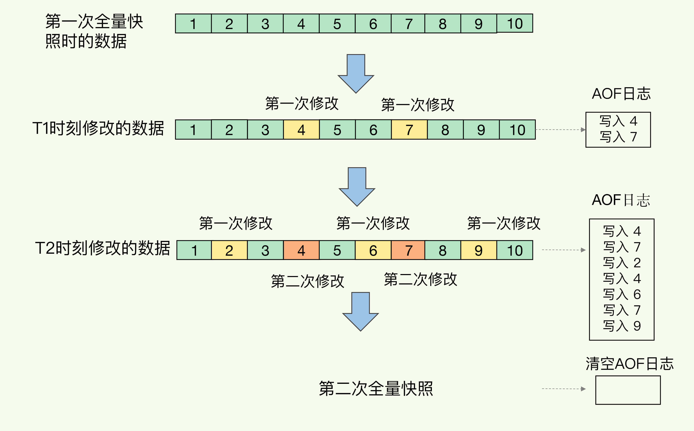
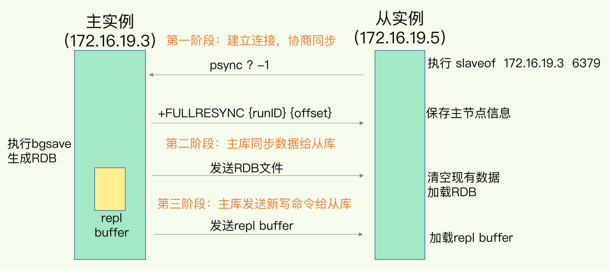
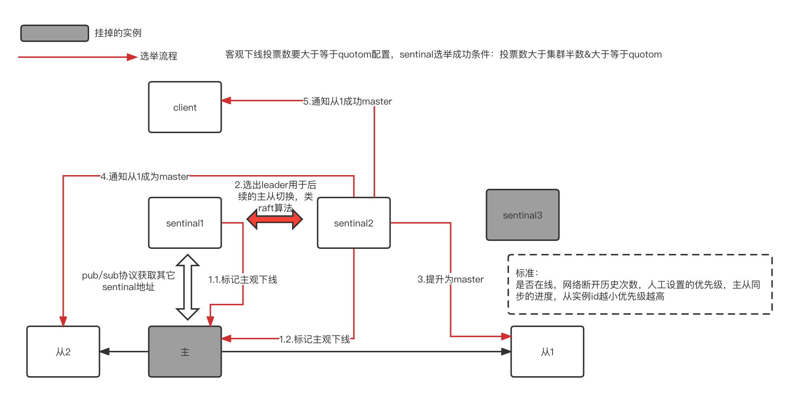
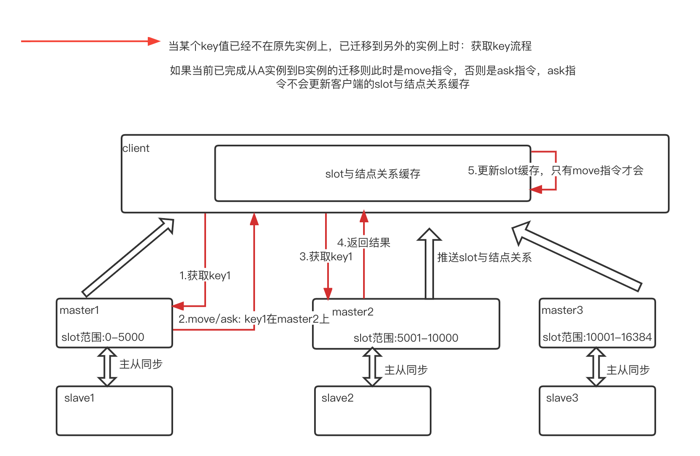
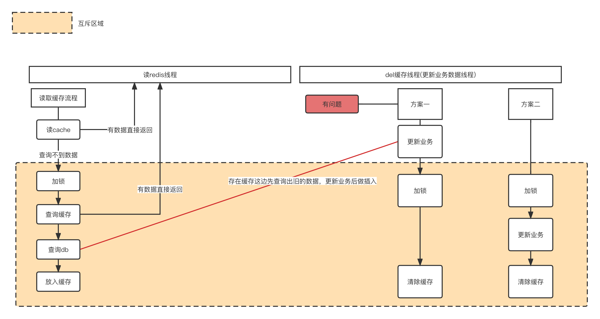
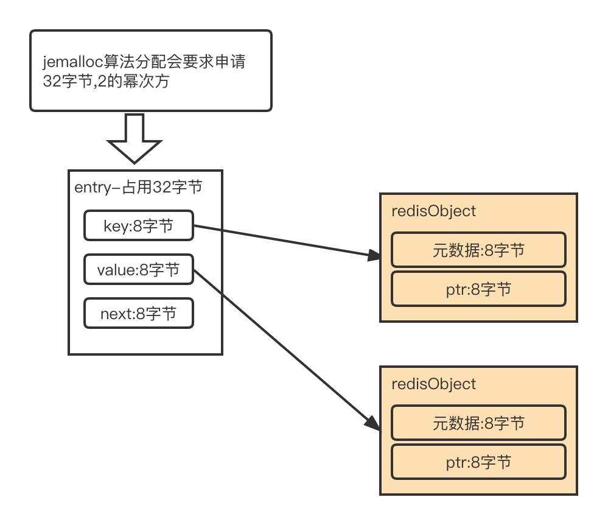

[(125条消息) redis架构\_redis架构图\_剑八-的博客-CSDN博客](https://blog.csdn.net/zhaozhenzuo/article/details/118324457)

## 一.redis竞品对比

<table><tbody><tr><td>存储</td><td>数据结构</td><td>持久化</td><td>集群可用性</td><td>网络模型</td><td>线程模型</td></tr><tr><td>redis</td><td>支持value是string,list,hash,set,zset</td><td>是</td><td>主从，redis cluster无中心分布式集群</td><td><p>非阻塞IO</p></td><td><p>单线程</p><p>无锁</p></td></tr><tr><td>memcache</td><td>只支持string</td><td>否</td><td><p>需要自行开发</p><p>基于twemproxy做</p><p>主从集群</p></td><td>非阻塞IO</td><td>多线程</td></tr></tbody></table>

## 二.架构图

## redis整体架构：



## 三.细分

## 1.redis数据结构

### **数据结构总览：**


### **1.1.全局hash表**


redis会采用dict来保存全局hash，会有2个dict，dict0和dict1.

其中dict1用于扩容用。

redis有扩容和缩容，缩容流程与扩容基本一致。除了什么时候扩会有差异：扩容是负载因子>=1或负载因子>=5；缩容是负载因子小于等于0.1.

 **redis扩容：**

什么时候扩容：当负载因子>=1并且此时没在做重写[aof](https://so.csdn.net/so/search?q=aof&spm=1001.2101.3001.7020)或进行快照，或者负载因子>=5则马上会做。

**怎么扩：**

采用的是渐进式hash。这种思路可以借鉴。

1.对于增删改查都会将一个元素从dict0放到dict1&[定时任务](https://so.csdn.net/so/search?q=%E5%AE%9A%E6%97%B6%E4%BB%BB%E5%8A%A1&spm=1001.2101.3001.7020)迁移

对于增加只会往dict1放

2.迁移完成后将dict0置为dict1，同时清空dict1

整体redis的渐近式hash细节步骤可以用到数据库扩容上。


### 1.2.简单动态字符串

应用场景：用于表示key,value是字符串的场景。

数据结构：长度，未使用长度，字符数组。

```
 sdshdr{//总字符长度en ;//记录buf数组中未使用字节的数量ree;//字节数组，用来保存字符串buf[];
```

### 1.3.数组

redis整数数组比较简单，就是等长的数组。

如果数组元素是8字节，而有10个元素，但每个元素实际存储内容为1字节。那此时空间整体会浪费70字节。

数组有个优势是内存比较紧贴，能够利用好局部性原理，从而使用cpu缓存行加速访问速度。

但如果数组是随机访问，则无法利用cpu缓存行了，会有一定的影响。

### 1.4.hash表

hash表结构也比较简单。和java的hash是差不多的，都会有一个entry数组，每个entry会有key，value。查询&put&删除操作时都先将key hash到具体的数组元素位置，然后如果存在冲突再遍历链表进行查询。

hash表当元素个数没有超过：hash-max-entries及单个元素大小没有超过hash-max-value时会采用压缩链表。

### 1.5.压缩链表

压缩链表就是为了避免不定长的元素造成的空间浪费。

整体从原理上就是有一个链表总长度，尾地址偏移量，元素个数，以及链表结束位zlen。

netty解法粘包问题时，也有这种元素长度的解决方案。

从结构上看，要查找尾结点时是O(1)的查询耗时。如果要查找数组中第4个元素，假设总共10个元素。那么需要从头0开始找，O(5)查询次数。

hash表当元素较小时会以zipList存储，可以用：hash-max-ziplist-entries来控制，小于hash-max-ziplist-entries则以zipList存储。

zipList当在元素前插入新的元素，会导致插入位置后面的n个元素内存的重分配。这个是因为每个元素保存了前一个元素的大小。所以当元素较多时，插入操作性能就会变得很差，而由于redis是单线程执行命令模型所以查询也会阻塞。

zipList数据结构：



###  1.5.跳跃表

利用多级索引加速元素查找。

和红黑树比： 跳跃表简单。

跳表的插入使用随机性决定是否需要在上n层加入该元素。


## 2.redis IO模型

redis网络IO及处理命令是单线程的，但后台会有相应的清理过期key线程，主从同步相关线程。



详细6.0处理流程：



## 3.redis存储

### 3.1.aof

redis存储持久化会采用aof来进行。

aof文件就是记录的当前执行的命令(对应mysql复制的语句级别)。

整体执行的顺序是先执行内存的更新，再执行aof日志写入。

这样做原因一方面是因为redis日志写入是不做命令检查，如果日志写入在前可能就会写入了一个错误的指令然后后面执行的时候挂了。

另外一方面先写内存再写日志能将整体redis的架构流程保持一致，因为持久化会有不同的策略：同步写磁盘，每秒写磁盘，以操作系统为准。内存在前整体策略流程上能保持一致。

当然先写内存无论哪种策略极端情况也会出现数据丢失，当然redis本身定位大多客户是不用于存储。而是性能优先。

aof过大会会由后台线程进行重写，重写的大致流程：

1.fork子线程，此时redis实例的内存数据与子线程共享。这个过程会阻塞redis服务客户操作

采用的是写时复制，在fork的时候拷贝了主线程的页表到子线程。数据还是共享的。

2.启动重写线程

3.期间新的命令双写：以前的aof日志，重写日志。

此时主线程会为要操作的key申请内存空间，所以这里也是阻塞的。

这里需要注意的是操作系统如果开启了：Huge Page，那么这个阻塞的风险会更大。

4.重写线程完成重写任务后，替换原先的aof日志。这步会阻塞主线程。


### aof刷盘3种机制：


### 

### 3.2.rdb

rdb主要是解决aof恢复慢，aof记录的是语句。

rdb相当于归档了。

缺：rdb整个流程中也涉及fork子进程，所以也会有阻塞。并且相应的rdb的快照不能太频繁（会导致频繁fork子进程及写磁盘文件从而引起阻塞）。

redis4.0采用混合的方式：rdb用于归档，aof用于记录变更日志。这个混合思路可

以用到其它场景。 



## 

## 4.redis集群

### 4.1.主从同步

如果涉及到多个从结点，那么就需要主->从->从，这种集群结构。

主从同步会在主建一个replication buffer。主从间全量的同步命令指令都是通过这个会buffer走。

replication buffer是每个从结点都会有一个，独享。

下面的repl-backlog-buffer是只有一个，用于增量同步。

当主从断开后，此时主会将后续的命令写到这个repl-backlog-buffer。repl-backlog-buffer是一个循环队列，分别有主的写指针，从的读指针。当从再次连接上来时会带上master实例id+当前relica-back-buffer的读指针，主会判断当前数据是否被覆盖（可以用从读指针>主写指针 或 主写和从读指针相等但不是指向空）。

主从同步的relica buffer如果超过out-buffer-size这个值，redis主会将这个从的连接断掉，然后后面从再启启来也会再次内存飙升再次断开。



### 4.2.集群模式

### a.哨兵模式



### b.cluster切片模式

切片模式是将原本的数据水平切片分配到多个实例上，3.0之前有基于proxy代理的，如twemProxy。基于代理proxy问题就是性能，还有twemProxy本身不支持在线扩容。

redis的cluster集群基本原理是redis服务端完成切片的关系，然后推送给客户端。客户端后续存取key时在客户端本地计算这个关系。



## 四.redis问题及解决方案

## 1.操作层面避免耗时指令

hash集合操作：

HMGET 和 HMSET。

范围操作：

 Hash 类型的 HGETALL 和 Set 类型的 SMEMBERS

替代：SCAN，底层采用渐近式操作。

redis的统计操作不耗时，如LLEN (list数组统计)和 SCARD（set集合统计），这是因为具体的数组，链表等结构上保存了元素个数。

## 2.持久化导致的风险

2.1.aof重写导致的阻塞

这个主要是在fork重写子进程时会产生阻塞，然后因为是写时复制，所以在后面有新的写入时主线程会申请一个内存用于存储这个写入key这时也会有阻塞，特别是开启了huge page阻塞的情况会更加严重。

2.2.rdb导致的阻塞

和aof重写一样都会有fork。写时复制机制下，涉及到1G的key在这个期间有变更，就意味着要额外分配1G的内存。此时如果这1G的内存大于redis总内存时，如果系统有开启swap则此时多出的redis数据会到磁盘，这时性能会很慢，这个可以看下swap的情况。如果没有开启swap就会oom。

2.3.cpu竞争风险

这个主要是由于redis是主线程需要有cpu资源，但是aof重写/rdb快照后台线程是同时运行的，这时如果cpu核数较小就会产生cpu争抢问题。

同时如果redis做了cpu绑定到某个cpu核，此时进程fork出的子进程是会继承这个绑定核的属性，所以fork子进程和主进程cpu争抢就成了必然的事情。

## 3.常见缓存问题

### 3.1.缓存击穿

热点key被击穿，解法：

热点key不设置过期时间。或者针对查询缓存线程，如果发现无数据要从db加载的时候可以加锁，从而使一个线程能进入。

在方案上右半部分方案一是有问题的，因为更新业务和读取缓存线程的查询db是会存在先后问题的，即：如果查询缓存得到一个旧的数据，然后瞬时右边的更新业务数据更新了并且完成了对于缓存的清除，此时最终查询缓存的线程会将旧值放入到db。

最终我们还是要看业务对于一致性是否很看重，因为redis与db要保证强一致是不可能的，一般都是保证最终一致性。



### 3.2.sentinal集群down-after-mill时间不一致，无法达成共识

比如，sentinal哨兵集群有5台，3台是2分钟超时下线的配置，2台是1分钟，那么这2台触发主观下线的时候，发起客观下线的判断就会始终不能达成一致。

这条可抽象的方法是：集群判定的标准要一致，否则就会出现不能达成一致的问题。

### 3.3.string占用空间过多问题

比如：存储key是Long，value是Long。那么理想情况是16字节。

但实际内存占用到了64字节，分析如下：

首先对于这个key来讲，会生成一个entry，entry会有三个指针，每个指针占用8字节，但是由于用了jemalloc内存分配算法，所以会分配2的幂次方32字节。

然后对于key来讲底层用sds存储，所以会占用16字节。

value部分用一个redisObject存储（redis由于有很多值类型，所以会用redisObject做抽象存储不同类型，然后有些像超时时间等通用性的直接在这个数据结构中存储就可以），所以这部分会占用16字节。

总的合计下来就是64字节。



解法：

减少entry的数量，采用压缩链表。

采用hash。但需要注意hash当元素个数及单元素大小超过指定配置时会退化成hash表存储。

所以一般思路是将对应key的前n位做为hash的key，剩余比如3位做为hash的field。这样能保证对应压缩链表的元素数量一定是小于1000的(因为hash的field只有3位)。

另外redis容量评估的网站：[Redis容量预估-极数云舟](http://www.redis.cn/redis_memory/ "Redis容量预估-极数云舟")

### 3.4.频繁删除key造成的阻塞

### 3.5.redis集群cluster扩容造成的阻塞

### 3.6.主库AOF重写&RDB文件生成造成的阻塞

涉及到fork子线程，同时重写过程中如果还有写操作进来这时主线程会申请内存，这部分也是阻塞的。然后过程中如果写操作比较多，这部分内存都是需要申请的，所以redis整体的内存使用量会增加。一般redis内存量：最好预估好业务使用量\*3.

### 3.7.从库加载rdb文件，清空从库自已数据库，命令flushdb

由于这个点会阻塞，所以建议从库内存大小为2-4G。

## 4.场景应用

聚合统计：比如10号新增用户数，这个每日单独做一个set，9号会保存一个集合，10号也会。然后10号与9号集合的差值就是10号的新增用户。

排序统计：

        例如典型的商品评论保存，实际上一般会对商品评论做领域存储，看业务。这种要用redis存储的话，直接使用zset。
    
        list存的话因为涉及到新增评论，所以在遍历完一页评论的时候后面新增一个评论就可能重复查询出上一页的部分数据。
    
        zset用分值来代表创建时间的权重，最新创建的分值越高。这样在程序遍历时分值取当前第一次读取时的分值，用它做迭代查询。如第一页，分值假设当前是10，则zrangebyscore 10-2,10；第二页就是：6,8等等。

二值统计：

        如打卡统计，可以用bitmap。如：setbit key:20220327 2 1，这个代表对应key:20220327第3位被设置成1.

基数统计：即统计集合中不重复个数

        可以用set做集合的基数统计。如统计uv。这时可以创建一个set，key为日期，value就是对应用户id。但这种如果是千万，亿级的统计场景就很容易导致redis在执行统计命令的时候阻塞。
    
        这时可以考虑使用：HyperLogLog。这个是基于概率统计的。

