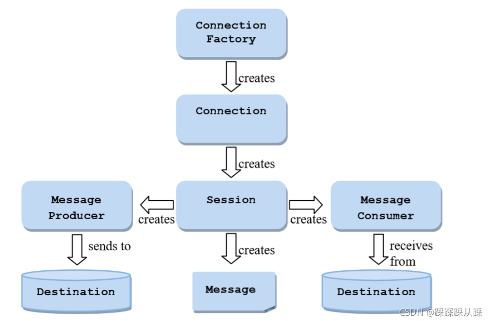
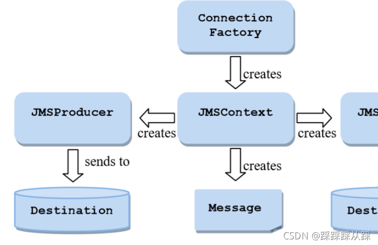
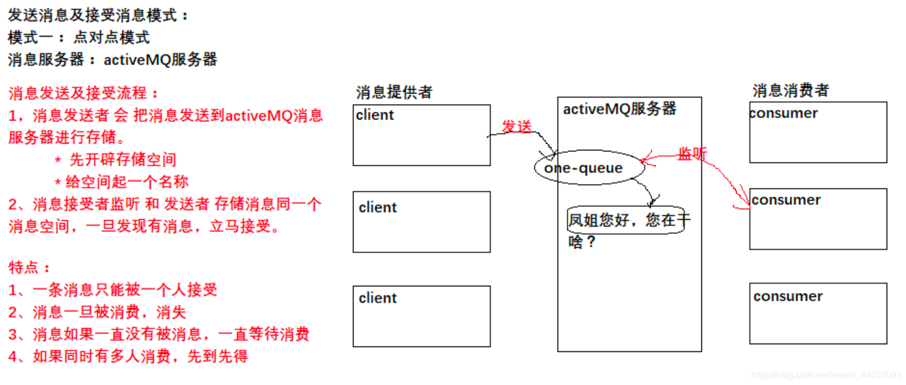
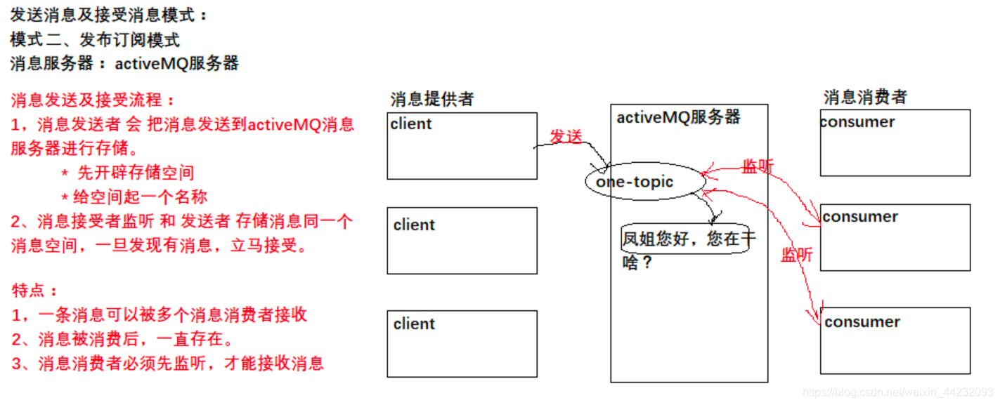

# 参考资料
## 1 [JMS解析（一）——JMS简介](https://blog.csdn.net/qq_33373609/article/details/120932224) 

出于历史原因，JMS为发送和接收提供了四组可选接口信息。
  - JMS 1.0定义了两个特定于域的API，一个用于点对点消息传递（队列）和一个用于发布/订阅（主题）。尽管由于向后的原因，这些仍然是JMS的一部分兼容性它们应该被认为是完全被后来的API所取代。
  - JMS 1.1引入了一个新的统一API，它提供了一组可以用于点对点和发布/订阅消息。这里称之为经典API
  - JMS 2.0引入了一个简化的API，它提供了经典API的所有特性，但需要更少的接口，使用更简单
每个API都提供了一组不同的接口，用于连接JMS提供程序和发送数据和接收消息。但是，它们都共享一组用于表示消息和消息目的地，并提供各种实用程序功能。

所有接口都在javax.jms包中。

ActiveMQ 5 实现的就是 JMS1.1  规范 

## 1.1 经典api构成

经典API提供的主要接口如下：

- ConnectionFactory—客户端用于创建连接的受管对象。这接口也被简化的API使用。
- Connection-到JMS提供程序的活动连接
- Session-用于发送和接收消息的单线程上下文
- MessageProducer—由会话创建的对象，用于向服务器发送消息队列或主题
- MessageConsumer—由用于接收消息的会话创建的对象发送到队列或主题
  
## 1.2 简化api构成

简化API提供与经典API相同的消息传递功能，但需要接口更少，使用更简单。简化API提供的主要接口如下：

- ConnectionFactory—客户端用于创建连接的受管对象。这接口也被经典API使用。
- JMSContext—到JMS提供程序的活动连接和的单线程上下文发送和接收消息
- JMSProducer—由JMSContext创建的对象，用于将消息发送到队列或主题
- JMSConsumer—由JMSContext创建的对象，用于接收发送的消息到队列或主题


[Maven使用ActiveMQ](https://blog.csdn.net/weixin_44232093/article/details/124849400)
### 1.2.1 ActiveMQ JMS入门案例
   - 1.1 环境准备
```xml
<dependency>
    <groupId>org.apache.activemq</groupId>
    <artifactId>activemq-all</artifactId>
    <version>5.14.0</version>
</dependency>
```
   - 1.2 JMS-点对点模式发送消息

   - 
   1.3 JMS-点对点模式接收消息
   1.4 JMS-发布订阅模式-发送消息

   1.5 JMS-发布订阅模式-接收消息
   
# 链接
[ActiveMQ 5 Download](https://activemq.apache.org/components/classic/download/)