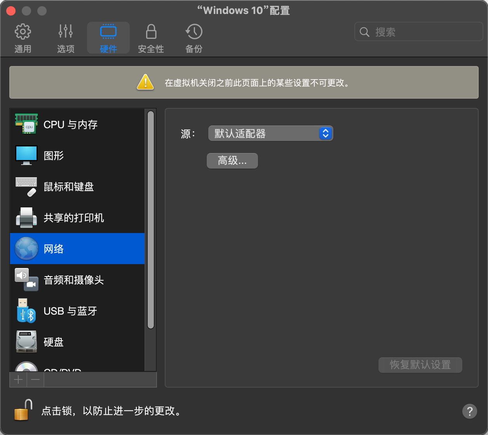
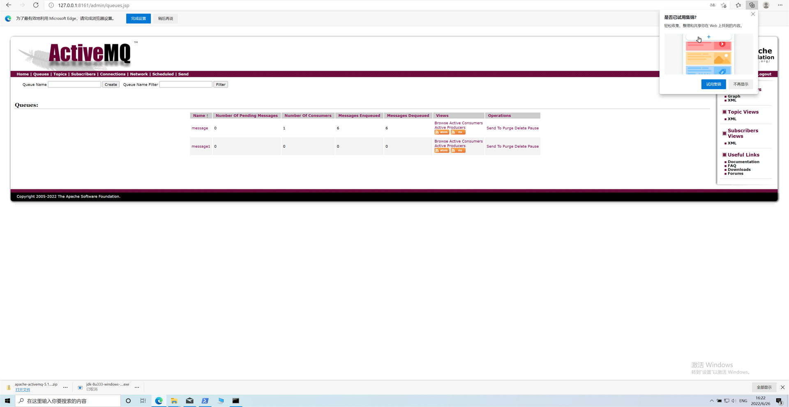

paralles desktop 安装 win10

paralles desktop 设置网络源为：默认适配器模式（如果是默认的模式，在win10通过ipconfig 查看到的地址 mac 访问不了）

win 10 安装 jdk8 编辑的 activemq

win 10 安装 jdk8

在 win10 运行 Z:\Downloads\jms\apache-activemq-5.16.5\bin\active start（通过拖拽文件到终端运行，因为 ls 不会显示文件，真坑）

在 win10 上打开浏览器，进入 localhost : Queues，配置一下 queue name（程序中需要指定为这个名字）

然后在 mac 上运行 jms 程序，发送消息或者接受消息。

查看
